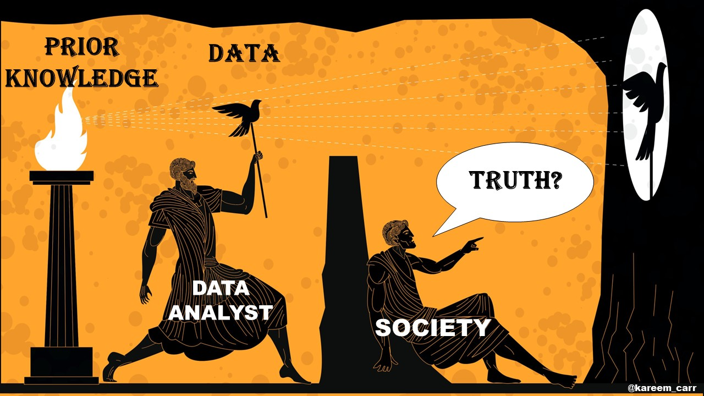
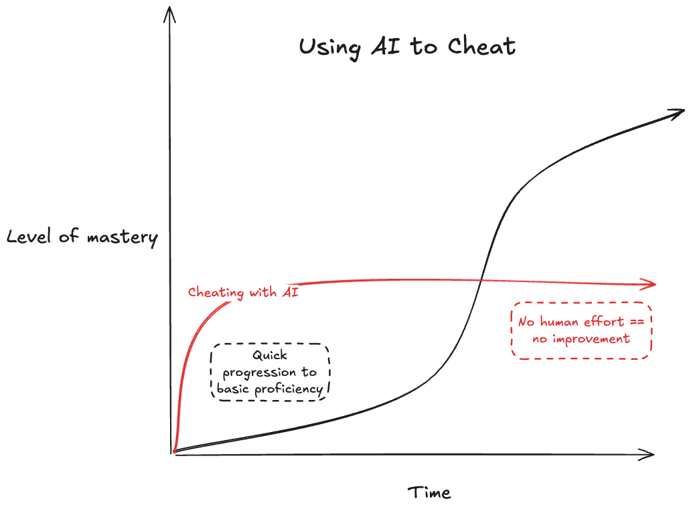
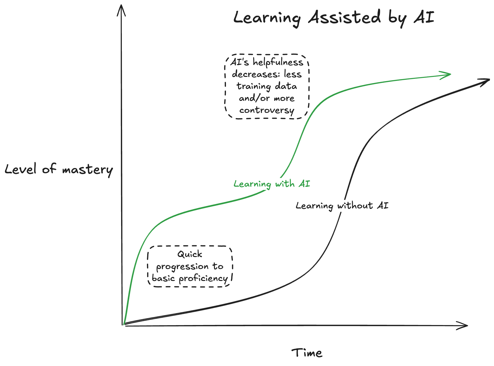
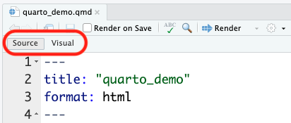
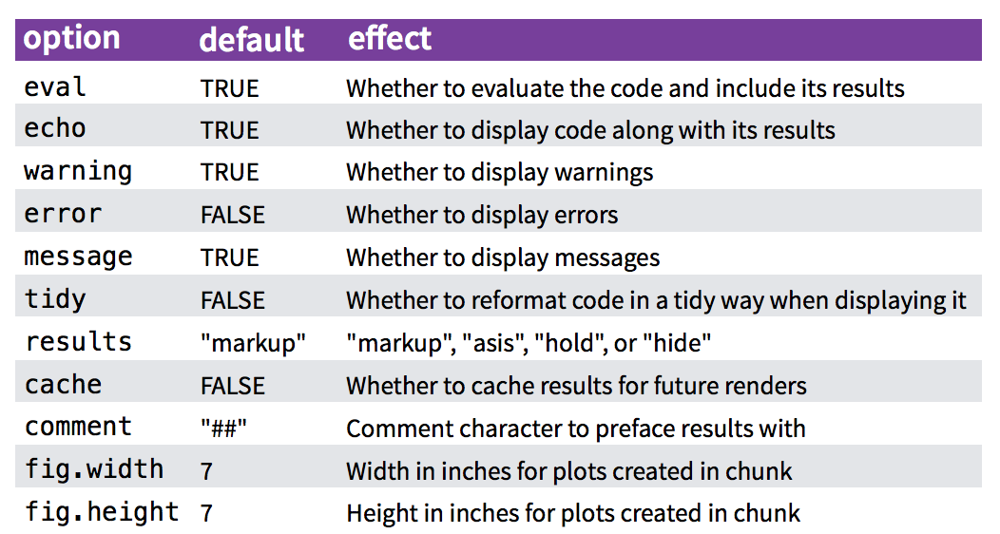
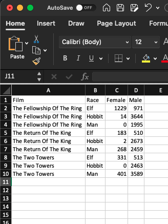
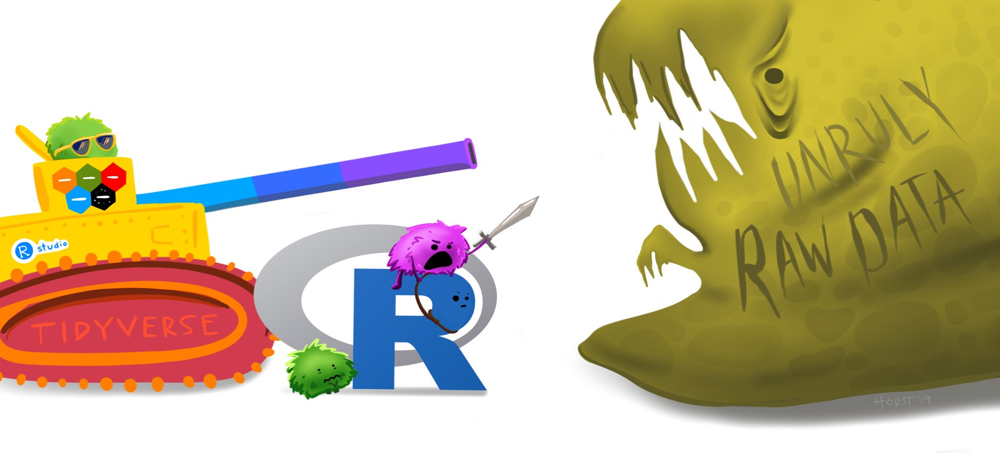
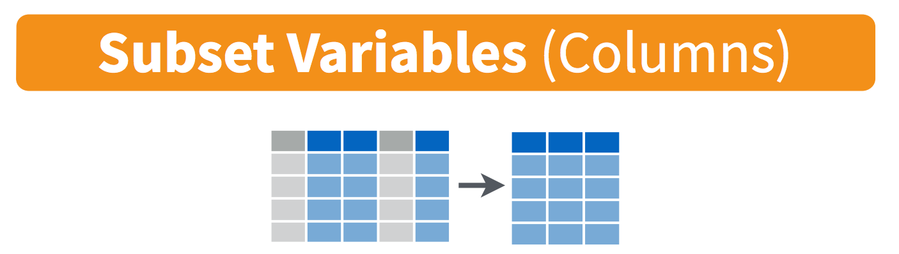
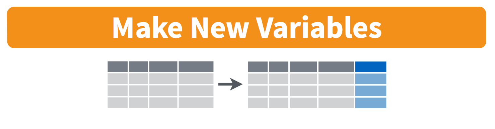
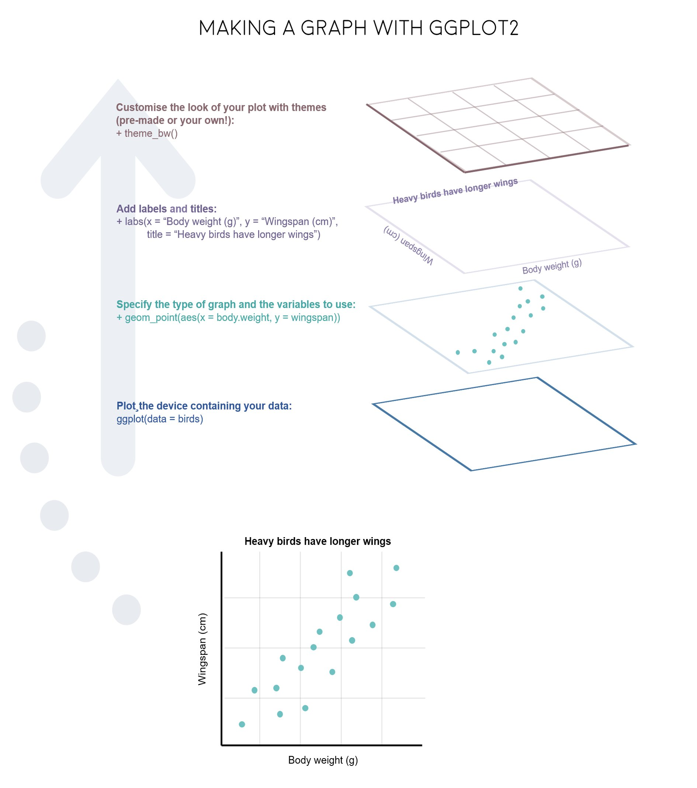

```{r}
#| label: setup
#| include: false

library(tidyverse)
library(here)
library(ggrepel)
library(cowplot)
library(fontawesome)
library(countdown)
library(readxl)
library(palmerpenguins)

# Data used throughout the deck
lotr <- read_csv(file.path("data", "lotr_words.csv"))

# The "student engagement" running example. Defined once here so the polished
# version can be reused on several slides without repeating the code.
engagement <- data.frame(
  City = c(643, 735, 590, 863),
  County = c(793, 928, 724, 662),
  School = c(
    "Special Ed., Charter",
    "Special Ed., Public",
    "General Ed., Charter",
    "General Ed., Public"
  ),
  Highlight = c(0, 0, 0, 1)
) %>%
  gather(Location, Engagement, City:County) %>%
  mutate(
    Location = fct_relevel(Location, c("City", "County")),
    Highlight = as.factor(Highlight),
    x = ifelse(Location == "County", 1, 0)
  )

engagement_plot <- engagement %>%
  ggplot(aes(x = x, y = Engagement, group = School, color = Highlight)) +
  geom_point() +
  geom_line() +
  scale_color_manual(values = c("#757575", "#ed573e")) +
  labs(
    x = "Sex",
    y = "Engagement",
    title = paste0(
      "Students in public, general education classes\n",
      "in county schools have surprisingly low engagement"
    )
  ) +
  scale_x_continuous(
    limits = c(-1.2, 1.2),
    labels = c("City", "County"),
    breaks = c(0, 1)
  ) +
  geom_text_repel(
    aes(label = Engagement),
    data = subset(engagement, Location == "County"),
    size = 5,
    nudge_x = 0.1,
    segment.color = NA
  ) +
  geom_text_repel(
    aes(label = Engagement),
    data = subset(engagement, Location == "City"),
    size = 5,
    nudge_x = -0.1,
    segment.color = NA
  ) +
  geom_text_repel(
    aes(label = School),
    data = subset(engagement, Location == "City"),
    size = 5,
    nudge_x = -0.25,
    hjust = 1,
    segment.color = NA
  ) +
  theme_cowplot() +
  background_grid(major = "x") +
  theme(
    axis.line = element_blank(),
    axis.title.x = element_blank(),
    axis.title.y = element_blank(),
    axis.text.y = element_blank(),
    axis.ticks = element_blank(),
    legend.position = "none"
  )
```

<!-- Title slide -->






# 

### []{.font80}

[]{.large}



---




# Week 1: [Getting Started]{.fancy}

### 1. Course Goal
### 2. Course Introduction
### 3. Break: Install Stuff
### 4. Quarto
### 5. Workflow & Reading In Data
### 6. Wrangling Data
### 7. Visualizing Data

---




# Week 1: [Getting Started]{.fancy}

### 1. [Course Goal]{.orange}
### 2. Course Introduction
### 3. Break: Install Stuff
### 4. Quarto
### 5. Workflow & Reading In Data
### 6. Wrangling Data
### 7. Visualizing Data

---

## Course 1: [Intro to Programming for Analytics](https://p4a.seas.gwu.edu/)

**"Computational Literacy"**

- Programming: Conditionals (if/else), loops, functions, testing, data types.
- Analytics: Data structures, import / export, basic data manipulation & visualization.

<br><br>

::: {.fragment}

## Course 2: [Exploratory Data Analysis](https://eda.seas.gwu.edu/)

**"Data Literacy"**

- Strategies for conducting an exploratory data analysis.
- Design principles for visualizing and communicating _information_ extracted from data.
- Reproducibility: Reports that contain code, equations, visualizations, and narrative text.

:::

---





# **Class goal**: translate _data_ into _information_

{width="80%"}

---



# **Class goal**: translate _data_ into _information_

::: {.col}
**Data**

Average student engagement scores

 Class       | Type    | City | County
 ------------|---------|------|-------
 Special Ed. | Charter | 643  | 793
 Special Ed. | Public  | 735  | 928
 General Ed. | Charter | 590  | 724
 General Ed. | Public  | 863  | 662
:::

::: {.col .fragment}
**Information**

```{r}
#| echo: false
#| fig-width: 6
#| fig-height: 5

engagement_plot
```
:::

---

# Data exploration: an iterative process

::: {.col}

Encode data:

```{r}
engagement_data <- data.frame(
  City = c(643, 735, 590, 863),
  County = c(793, 928, 724, 662),
  School = c(
    "Special Ed., Charter",
    "Special Ed., Public",
    "General Ed., Charter",
    "General Ed., Public"
  )
)
engagement_data
```

:::

::: {.col .fragment}
Re-format data for plotting:

::: {.code60}
```{r}
engagement_data <- engagement_data %>%
  gather(Location, Engagement, City:County) %>%
  mutate(Location = fct_relevel(Location, c("City", "County")))
engagement_data
```
:::
:::

---

# Data exploration: an iterative process

::: {.col}
Initial exploratory plotting:

::: {.code60}
```{r}
#| fig-width: 6
#| fig-height: 3

engagement_data %>%
  ggplot() +
  geom_col(
    aes(x = Engagement, y = School, fill = Location),
    position = "dodge"
  )
```
:::
:::

::: {.col .fragment}
More exploratory plotting:<br>highlight difference

```{r}
#| echo: false
#| fig-width: 6
#| fig-height: 5

engagement %>%
  ggplot(aes(x = x, y = Engagement, group = School, color = School)) +
  geom_point() +
  geom_line() +
  labs(x = "Sex", y = "Engagement")
```
:::

---

# Data exploration: an iterative process

::: {.col}
Directly label figure:

```{r}
#| echo: false
#| fig-width: 6
#| fig-height: 5

engagement %>%
  ggplot(aes(x = x, y = Engagement, group = School, color = School)) +
  geom_point() +
  geom_line() +
  labs(x = "Location", y = "Engagement") +
  theme_cowplot() +
  scale_x_continuous(
    limits = c(-0.2, 2),
    labels = c("City", "County"),
    breaks = c(0, 1)
  ) +
  theme(legend.position = "none") +
  geom_text_repel(
    aes(label = School),
    data = subset(engagement, Location == "County"),
    size = 5,
    nudge_x = 0.2,
    hjust = 0,
    segment.color = NA
  )
```
:::

::: {.col .fragment}
Remove unnecessary axes, change colors, fix labels:

```{r}
#| echo: false
#| fig-width: 6
#| fig-height: 5

engagement_plot
```
:::

---

# A fully reproducible analysis

::: {.panel-tabset}

### Code

::: {.col}
::: {.code40}
```r
data <- data.frame(
  City = c(643, 735, 590, 863),
  County = c(793, 928, 724, 662),
  School = c(
    "Special Ed., Charter", "Special Ed., Public",
    "General Ed., Charter", "General Ed., Public"
  ),
  Highlight = c(0, 0, 0, 1)
) %>%
  gather(Location, Engagement, City:County) %>%
  mutate(
    Location = fct_relevel(Location, c("City", "County")),
    Highlight = as.factor(Highlight),
    x = ifelse(Location == "County", 1, 0)
  )
```
:::
:::

::: {.col}
::: {.code40}
```r
plot <- ggplot(data, aes(
  x = x, y = Engagement, group = School, color = Highlight
)) +
  geom_point() +
  geom_line() +
  scale_color_manual(values = c("#757575", "#ed573e")) +
  labs(
    x = "Sex", y = "Engagement",
    title = "County general-ed classes have low engagement"
  ) +
  scale_x_continuous(
    limits = c(-1.2, 1.2),
    labels = c("City", "County"), breaks = c(0, 1)
  ) +
  geom_text_repel(aes(label = Engagement), size = 5) +
  theme_cowplot() +
  background_grid(major = "x") +
  theme(legend.position = "none")
```
:::
:::

### Plot

```{r}
#| echo: false
#| fig-width: 6
#| fig-height: 5

engagement_plot
```

:::

---




# Data exploration: an iterative process

{width="600"}

---




# Week 1: [Getting Started]{.fancy}

### 1. Course Goal
### 2. [Course Introduction]{.orange}
### 3. Break: Install Stuff
### 4. Quarto
### 5. Workflow & Reading In Data
### 6. Wrangling Data
### 7. Visualizing Data

---

# Meet your instructor!

::: {.col width="30%"}
::: {.circle}
{width="300"}
:::
:::

::: {.col width="70%"}
### John Helveston, Ph.D.

::: {.font80}
- 2025 - Present: Associate Professor, EMSE
- 2018 - 2025: Assistant Professor, EMSE
- 2016-2018: Postdoc at [Institute for Sustainable Energy](https://www.bu.edu/ise/), Boston University
- 2016: PhD in Engineering & Public Policy at Carnegie Mellon University
- 2015: MS in Engineering & Public Policy at Carnegie Mellon University
- 2010: BS in Engineering Science & Mechanics at Virginia Tech
- Website: [www.jhelvy.com](http://www.jhelvy.com/)
:::
:::

---

# Meet your tutors!

::: {.col width="30%"}
::: {.circle}
{width="300"}
:::
:::

::: {.col width="70%"}
### **Pingfan Hu**

- Graduate Teaching Assistant (GTA)
- PhD student in EMSE
- Website: [www.pingfanhu.com](https://www.pingfanhu.com/)
:::

---

# Meet your tutors!

::: {.col width="30%"}
::: {.circle}
{width="300"}
:::
:::

::: {.col width="70%"}
### **Bogdan Bunea**

- Learning Assistant (LA)
- EMSE Junior & P4A / EDA alumni
- Check out his team's [project](https://eda.seas.gwu.edu/showcase/2023-Fall/ukraine-war.html) from 2023
:::

---

# Prerequisites

## [EMSE 4574 / 6574: Intro to Programming for Analytics](https://p4a.seas.gwu.edu/)

You should be able to:

- Use Positron to write basic R commands.
- Know the distinctions between different R operators and data types, including numeric, string, and logical data.
- Use **tidyverse** functions to wrangle and manipulate data in R.
- Use the **ggplot2** library to create plots in R.

. . .

> [`r fa("building-columns")` Check out R for Analytics Primer](http://jhelvy.github.io/r4aPrimer/)

---

# Course website

## `r fa("globe")` Everything you need will be on the course website:<br>https://eda.seas.gwu.edu/2026-Fall/

::: {.fragment}
## `r fa("calendar")` The [schedule](https://emse-eda-gwu.github.io/2026-Fall/schedule.html) is the best starting point
:::

---

# **Quizzes** (10% of grade)

::: {.fragment}
## `r fa("calendar")` At the start of class every other week-ish. Make ups only for excused absences (i.e. don't be late).
:::

::: {.fragment}
## `r fa("calendar")` 5 total, lowest dropped
:::

::: {.fragment}
## `r fa("clock")` 10 minutes
:::

::: {.fragment}
> **Why quiz at all?** The "retrieval effect" - basically, you have to _practice_ remembering things, otherwise your brain won't remember them (see the book ["Make It Stick: The Science of Successful Learning"](https://www.hup.harvard.edu/catalog.php?isbn=9780674729018))
:::

---

# Assignments

::: {.fragment}
## 1) `r fa("book")` Weekly Reflections: [HW1](https://eda.seas.gwu.edu/2026-Fall/hw/1-tidy-data.html)
:::

::: {.fragment}
## 2) `r fa("pen-ruler")` 3 Mini Projects (due 2 weeks from date assigned)
:::

::: {.fragment}
## 3) `r fa("pen-ruler")` [Final Project](https://eda.seas.gwu.edu/2026-Fall/project/0-overview.html)

::: {.col}
**Undergrads**: Teams of 3 - 4 students

**Grads**: Teams of 2 students
:::

::: {.col}
Item            | Due Date
----------------|---------------
Proposal        | Sep 21
Progress Report | Oct 26
Final Report    | Dec 07
Presentation    | Dec 09
:::
:::

---

# [Grades]{.center}

Item                           | Weight | Notes
-------------------------------|--------|-------------------------------------
Participation / Attendance     | 5 %    | (Yes, I take attendance)
Reflections                    | 13 %   | Weekly assignment, lowest dropped
Quizzes                        | 10 %   | 5 quizzes, lowest dropped
Mini Project 1                 | 9 %    | Individual assignments
Mini Project 2                 | 9 %    |
Mini Project 3                 | 9 %    |
Final Project: Proposal        | 6 %    |
Final Project: Progress Report | 6 %    |
Final Project: Report          | 17 %   |
Final Project: Presentation    | 6 %    |
Final Interview                | 10 %   | Individual interview

---



# [Grades]{.center}

{width="90%"}

---

# Course policies

::: {.fragment}
::: {.col width="35%"}
## BE NICE
## BE HONEST
## DON'T CHEAT
:::
:::

::: {.col width="65%" .fragment}
## Copying is good, stealing is bad

> "Plagiarism is trying to pass someone else's work off as your own. Copying is about reverse-engineering."
>
> [-- Austin Kleon, from [Steal Like An Artist](https://austinkleon.com/steal/)&ensp;]{.right}
:::

---

# Use of chatGPT and other AI tools

<br>

::: {.incremental}
- Large language models (LLMs) are pretty good
- Sometimes they suck.
- I will grade whatever you submit. **It should not suck.**
:::

---

# Ways to not have your work suck:

::: {.incremental}
- Don't submit code that doesn't run (actually run it before submitting it).
- Actually read what the AI generates, and **don't submit something you don't understand**. (Ask the LLM how it works)
- There are dozens of ways to do things - **you should use the approach I teach**.
- Ask yourself **"what would I ask Prof. Helveston?"**
:::

. . .

### **Use AI as an assistant, not a solutions manual**

---




::: {.col width="75%"}
{width="100%"}
:::

::: {.col width="25%"}
## [The **wrong** ways to use LLMs]{.center}

Don't copy-paste past the basics - it'll rob you of mastery
:::

---




::: {.col width="75%"}
{width="100%"}
:::

::: {.col width="25%"}
## [The **right** way to use LLMs]{.center}

- Asking to explain error messages
- Asking to explain _why_ something works or doesn't work
:::

---

# Late submissions

## - **3** late days - use them anytime, no questions asked
## - No more than **2** late days on any one assignment
## - Contact me for special cases

---

# How to succeed in this class

::: {.fragment}
## `r fa("users")` Participate during class!
:::

::: {.fragment}
## `r fa("pen-ruler")` Start assignments early and **read carefully**!
:::

::: {.fragment}
## `r fa("book")` Actually read (before class)!
:::

::: {.fragment}
## `r fa("bed")` Get sleep and take breaks often!
:::

::: {.fragment}
## `r fa("people-carry-box")` Ask for help!
:::

---

# Getting Help

::: {.fragment}
## `r fa("slack")` Use [Slack](https://emse-eda-f26.slack.com/) to ask questions.
:::

::: {.fragment}
## `r fa("person-chalkboard")` Meet with your tutors
:::

::: {.fragment}
## `r fa("user-clock")` [Schedule a meeting](https://jhelvy.appointlet.com/b/professor-helveston) w/Prof. Helveston (Mon/Tue/Fri)
:::

::: {.fragment}
## `r fa("code")` [GW Coders](http://gwcoders.github.io/)
:::

---

# [Course Software](https://eda.seas.gwu.edu/2026-Fall/software.html)

::: {.fragment}
## `r fa("slack")` [Slack](https://emse-eda-f26.slack.com/): **turn notifications on**!
:::

::: {.fragment}
## `r fa("r-project")` [R](https://cloud.r-project.org/) & [Positron](https://positron.posit.co/) (Install both)
:::

::: {.fragment}
## `r fa("cloud")` [Posit Cloud](https://posit.cloud/) (Register for free!)
:::

---




# [Break]{.fancy}

1. If you haven't already, install everything on the [software page](https://eda.seas.gwu.edu/2026-Fall/software.html)

2. Stand up, meet each other, (maybe form teams?...use [this sheet](https://docs.google.com/spreadsheets/d/1pPfVs7bBcbA-L1Hp6sXcYg2ybTBsRmpfcXdF2oBf7xQ/edit?usp=sharing))

```{r}
#| echo: false

countdown(
  minutes = 5,
  warn_when = 30,
  update_every = 1,
  left = 0,
  right = 0,
  top = 1,
  bottom = 0,
  margin = "5%",
  font_size = "8em"
)
```

---




# Week 1: [Getting Started]{.fancy}

### 1. Course Goal
### 2. Course Introduction
### 3. Break: Install Stuff
### 4. [Quarto]{.orange}
### 5. Workflow & Reading In Data
### 6. Wrangling Data
### 7. Visualizing Data

---




# [Quick demo]{.center}

## 1. Open `quarto_demo.qmd`
## 2. Click "Render"

{width="100%"}

---

# [Anatomy of a .qmd file]{.center}

<br>

# [Header]{.red}
# Markdown text
# R code

---

# Define overall document options in header

::: {.col}
Basic html page

```yaml
---
title: Your title
author: Author name
format: html
---
```
:::

::: {.col}
Add table of contents, change theme

```yaml
---
title: Your title
author: Author name
toc: true
format:
  html:
    theme: united
---
```

More on themes at <https://quarto.org/docs/output-formats/html-themes.html>
:::

---

# Render to multiple outputs

::: {.col}
### PDF uses LaTeX

```yaml
---
title: Your title
author: Author name
format: pdf
---
```

If you don't have LaTeX on your computer, install tinytex in R:

```r
tinytex::install_tinytex()
```
:::

::: {.col}
### Microsoft Word

```yaml
---
title: Your title
author: Author name
format: docx
---
```
:::

---

# [Anatomy of a .qmd file]{.center}

<br>

# ~~Header~~
# [Markdown text]{.red}
# R code

---



# Right now, bookmark this! 👇

## <https://commonmark.org/help/>

<br><hr><br>

# (When you have 10 minutes, do this! 👇)

## <https://commonmark.org/help/tutorial/>

---

# [Headers]{.center}

. . .

::: {.col}
```markdown
# HEADER 1

## HEADER 2

### HEADER 3

#### HEADER 4

##### HEADER 5

###### HEADER 6
```
:::

::: {.col .fragment}
# HEADER 1

## HEADER 2

### HEADER 3

#### HEADER 4

##### HEADER 5

###### HEADER 6
:::

---

# [Basic Text Formatting]{.center}

::: {.col}
## Type this...

- `normal text`
- `_italic text_`
- `*italic text*`
- `**bold text**`
- `***bold italic text***`
- `~~strikethrough~~`
- `` `code text` ``
:::

::: {.col}
## ..to get this

- normal text
- _italic text_
- *italic text*
- **bold text**
- ***bold italic text***
- ~~strikethrough~~
- `code text`
:::

---

# [Lists]{.center}

::: {.col}
Bullet list:

```markdown
- first item
- second item
- third item
```

- first item
- second item
- third item
:::

::: {.col}
Numbered list:

```markdown
1. first item
2. second item
3. third item
```

1. first item
2. second item
3. third item
:::

---

# [Links]{.center}

Simple **url link** to another site:

```markdown
[Download R](http://www.r-project.org/)
```

[Download R](http://www.r-project.org/)

---





# Don't want to use Markdown?

# [Use Visual Mode!]{.red}

{width="700"}

---

# [Anatomy of a .qmd file]{.center}

<br>

# ~~Header (think of this as the "settings")~~
# ~~Markdown text~~
# [R code]{.red}

---



# R Code

. . .

::: {.col}
## Inline code

```markdown
`r knitr::inline_expr("insert code here")`
```
:::

::: {.col .fragment}
## Code chunks

````markdown
```{{r}}
insert code here
insert more code here
```
````
:::

---

# Inline R code

```markdown
The sum of 3 and 4 is `r knitr::inline_expr("3 + 4")`
```

. . .

Produces this:

The sum of 3 and 4 is `r 3 + 4`

---

# R Code chunks

::: {.col}
This code chunk...

````markdown
```{{r}}
library(palmerpenguins)

head(penguins)
```
````
:::

::: {.col .fragment}
...will produce this when compiled:

```{r}
library(palmerpenguins)

head(penguins)
```
:::

---

# Chunk options

Control what chunks output using options

All options [here](https://quarto.org/docs/reference/cells/cells-knitr.html)

```{r}
#| echo: false
#| out-width: 60%


```

---

# [Chunk output options]{.center}

[By default, code chunks print **code** + **output**]{.center}

. . .

::: {.col}
````markdown
```{{r}}
#| echo: false

cat('hello world!')
```
````

Prints only **output**<br>(doesn't show code)

```{r}
#| echo: false

cat("hello world!")
```
:::

::: {.col .fragment}
````markdown
```{{r}}
#| eval: false

cat('hello world!')
```
````

Prints only **code**<br>(doesn't run the code)

```{r}
#| eval: false

cat("hello world!")
```
:::

::: {.col .fragment}
````markdown
```{{r}}
#| include: false

cat('hello world!')
```
````

Runs, but doesn't print anything

```{r}
#| include: false

cat("hello world!")
```
:::

---

# A global `setup` chunk 🌍

::: {.col}
````markdown
```{{r}}
#| label: setup
#| include: false

knitr::opts_chunk$set(
  warning = FALSE,
  message = FALSE,
  fig.width = 7.252,
  fig.height = 4,
  comment = "#>"
)
```
````
:::

::: {.col}
- Typically the first chunk
- All following chunks will use these options (i.e., sets global chunk options)
- You can (and should) use individual chunk options too
- Often where I load libraries, etc.
:::

---




# Week 1: [Getting Started]{.fancy}

### 1. Course Goal
### 2. Course Introduction
### 3. Break: Install Stuff
### 4. Quarto
### 5. [Workflow & Reading In Data]{.orange}
### 6. Wrangling Data
### 7. Visualizing Data

---

# Workflow for reading in data

1) Open your project **folder** in Positron - **don't double-click .R files**!

. . .

2) Use the `here` package to create file paths

```r
path <- here::here("folder", "file.csv")
```

. . .

3) Import data with these functions:

File type  | Function       | Library
-----------|----------------|----------
`.csv`     | `read_csv()`   | **readr**
`.txt`     | `read.table()` | **utils**
`.xlsx`    | `read_excel()` | **readxl**

---

# Importing Comma Separated Values (.csv)

Read in `.csv` files with `read_csv()`:

```{r}
library(tidyverse)
library(here)

csvPath <- here("data", "milk_production.csv")
milk_production <- read_csv(csvPath)

head(milk_production)
```

---

# Importing Text Files (.txt)

Read in `.txt` files with `read.table()`:

```{r}
txtPath <- here("data", "nasa_global_temps.txt")
global_temps <- read.table(txtPath, skip = 5, header = FALSE)

head(global_temps)
```

---

# Importing Text Files (.txt)

Read in `.txt` files with `read.table()`:

```{r}
#| code-line-numbers: "3"

txtPath <- here("data", "nasa_global_temps.txt")
global_temps <- read.table(txtPath, skip = 5, header = FALSE)
names(global_temps) <- c("year", "no_smoothing", "loess") # Add header

head(global_temps)
```

---

# Importing Excel Files (.xlsx)

Read in `.xlsx` files with `read_excel()`:

```{r}
#| code-line-numbers: "4"

library(readxl)

xlsxPath <- here("data", "pv_cell_production.xlsx")
pv_cells <- read_excel(xlsxPath, sheet = "Cell Prod by Country", skip = 2)
```

::: {.code70}
```{r}
glimpse(pv_cells)
```
:::

---

# Importing Excel Files (.xlsx)

Read in `.xlsx` files with `read_excel()`:

```{r}
#| code-line-numbers: "5,6"

library(readxl)

xlsxPath <- here("data", "pv_cell_production.xlsx")
pv_cells <- read_excel(xlsxPath, sheet = "Cell Prod by Country", skip = 2) %>%
  mutate(Year = as.numeric(Year)) %>% # Convert "non-years" to NA
  filter(!is.na(Year)) # Drop NA rows in Year
```

::: {.code60}
```{r}
glimpse(pv_cells)
```
:::

---



```{r}
#| echo: false

countdown(
  minutes = 10,
  warn_when = 30,
  update_every = 1,
  top = 0,
  right = 0,
  font_size = "2em"
)
```

# Your turn

Open the `practice.qmd` file.

Write code to import the following data files from the "data" folder:

- For `lotr_words.csv`, call the data frame `lotr`
- For `north_america_bear_killings.txt`, call the data frame `bears`
- For `uspto_clean_energy_patents.xlsx`, call the data frame `patents`

---




# Week 1: [Getting Started]{.fancy}

### 1. Course Goal
### 2. Course Introduction
### 3. Break: Install Stuff
### 4. Quarto
### 5. Workflow & Reading In Data
### 6. [Wrangling Data]{.orange}
### 7. Visualizing Data

---

::: {.col}
# [The data frame...<br>in [Excel]{.darkgreen}]{.center}

{width="340"}
:::

::: {.col}
# [The data frame...<br>in `r fa("r-project", fill = "blue")`]{.center}

```{r}
lotr
```
:::

---

## **Columns**: _Vectors_ of values (must be same data type)

Extract a column using `$`

```{r}
lotr$race
```

---

## **Columns**: _Vectors_ of values (must be same data type)

Can also use brackets:

```{r}
lotr$race
lotr[, 2]
```

---

## **Rows**: Information about individual observations

Information about the first row:

```{r}
lotr[1, ]
```

. . .

Information about rows 1 & 2:

```{r}
lotr[1:2, ]
```

---



## Quick Practice

Read in the `data.csv` file in the "data" folder:

```r
data <- read_csv(here("data", "data.csv"))
```

Now answer these questions:

- How many rows and columns are in the data frame?
- What type of data is each column?
- Preview the different columns - what do you think this data is about? What might one row represent?
- How many unique airlines are in the data frame?
- What is the shortest and longest air time for any one flight in the data frame?

---



### The tidyverse: `stringr` + `dplyr` + `readr` + `ggplot2` + ...

{width="950"}

Art by [Allison Horst](https://www.allisonhorst.com/)

---

# [The main `dplyr` "verbs"]{.center}

<br>

"Verb"        | What it does
--------------|--------------------
`select()`    | Select columns by name
`filter()`    | Keep rows that match criteria
`arrange()`   | Sort rows based on column(s)
`mutate()`    | Create new columns
`summarize()` | Create summary values

---

# [Core `tidyverse` concept:<br>**Chain functions together with "pipes"**]{.center}

# [`%>%`]{.center}

. . .

## Think of the words "...and then..."

```r
data %>%
  do_something() %>%
  do_something_else()
```

---





# Select columns with `select()`

{width="900"}

---

# Select columns with `select()`

Select the columns `film` & `race`

```{r}
lotr %>%
  select(film, race)
```

---

# Select columns with `select()`

Use the `-` sign to drop columns

```{r}
lotr %>%
  select(-film)
```

---





# Filter for rows with `filter()`

{width="900"}

---

# Filter for rows with `filter()`

Keep only the rows with Elf characters

```{r}
lotr %>%
  filter(race == "Elf")
```

---

# Filter for rows with `filter()`

Keep only the rows with Elf or Hobbit characters

```{r}
lotr %>%
  filter((race == "Elf") | (race == "Hobbit"))
```

---

# Filter for rows with `filter()`

Keep only the rows with Elf or Hobbit characters

```{r}
lotr %>%
  filter(race %in% c("Elf", "Hobbit"))
```

---

# [Logic operators for `filter()`]{.center}

<br>

Description | Example
------------|------------
Values greater than 1 | `value > 1`
Values greater than or equal to 1 | `value >= 1`
Values less than 1 | `value < 1`
Values less than or equal to 1 | `value <= 1`
Values equal to 1 | `value == 1`
Values not equal to 1 | `value != 1`
Values in the set c(1, 4) | `value %in% c(1, 4)`

---

# Combine `filter()` and `select()`

Keep only the rows with Elf characters that spoke more than 1000 words, then select everything but the race column

```{r}
lotr %>%
  filter((race == "Elf") & (word_count > 1000)) %>%
  select(-race)
```

---





## Create new variables with `mutate()`

{width="900"}

---

# Create new variables with `mutate()`

Create a new variable, `word1000` which is `TRUE` if the character spoke 1,000 or more words

```{r}
lotr %>%
  mutate(word1000 = word_count >= 1000)
```

---

# [Handling if/else conditions]{.center}

### [`ifelse(<condition>, <if TRUE>, <else>)`]{.center}

. . .

```{r}
lotr %>%
  mutate(word1000 = ifelse(word_count >= 1000, TRUE, FALSE))
```

---

# Sort data frame with `arrange()`

Sort the `lotr` data frame by `word_count`

```{r}
lotr %>%
  arrange(word_count)
```

---

# Sort data frame with `arrange()`

Use the `desc()` function to sort in descending order

```{r}
lotr %>%
  arrange(desc(word_count))
```

---



```{r}
#| echo: false

countdown(
  minutes = 10,
  warn_when = 30,
  update_every = 1,
  top = 0,
  right = 0,
  font_size = "2em"
)
```

# Your turn

Read in the `data.csv` file in the "data" folder:

```r
data <- read_csv(here("data", "data.csv"))
```

::: {.font80}
- Create a new data frame, `flights_fall`, that contains only flights that departed in the fall semester.
- Create a new data frame, `flights_dc`, that contains only flights that flew to DC airports (Reagan or Dulles).
- Create a new data frame, `flights_dc_carrier`, that contains only flights that flew to DC airports (Reagan or Dulles) and only the columns about the month and airline.
- How many unique airlines were flying to DC airports in July?
- Create a new variable, `speed`, in miles per hour using the `time` (minutes) and `distance` (miles) variables.
- Which flight flew the fastest?
- Remove rows that have `NA` for `air_time` and re-arrange the resulting data frame based on the longest air time and longest flight distance.
:::

---




# Week 1: [Getting Started]{.fancy}

### 1. Course Goal
### 2. Course Introduction
### 3. Break: Install Stuff
### 4. Quarto
### 5. Workflow & Reading In Data
### 6. Wrangling Data
### 7. [Visualizing Data]{.orange}

---

::: {.col}
{width="600"}
:::

::: {.col}
# "Grammar of Graphics"

Concept developed by Leland Wilkinson (1999)

**ggplot2** package developed by Hadley Wickham (2005)
:::

---

# Making plot layers with ggplot2

<br>

### 1. The data
### 2. The aesthetic mapping (what goes on the axes?)
### 3. The geometries (points? bars? etc.)
### 4. The annotations / labels
### 5. The theme

---

# Layer 1: The data

```{r}
head(mpg)
```

---

# Layer 1: The data

The `ggplot()` function initializes the plot with whatever data you're using

::: {.col}
```r
mpg %>%
  ggplot()
```
:::

::: {.col}
::: {.blackborder}
```{r}
#| echo: false
#| fig-height: 5
#| fig-width: 7

mpg %>%
  ggplot()
```
:::
:::

---

# Layer 2: The aesthetic mapping

The `aes()` function determines which variables will be _mapped_ to the geometries<br>(e.g. the axes)

::: {.col}
```r
mpg %>%
  ggplot(aes(x = displ, y = hwy))
```
:::

::: {.col}
::: {.blackborder}
```{r}
#| echo: false
#| fig-height: 5
#| fig-width: 7

mpg %>%
  ggplot(aes(x = displ, y = hwy))
```
:::
:::

---

# Layer 3: The geometries

Use `+` to add geometries, e.g. `geom_points()` for points

::: {.col}
```r
mpg %>%
  ggplot(aes(x = displ, y = hwy)) +
  geom_point()
```
:::

::: {.col}
::: {.blackborder}
```{r}
#| echo: false
#| fig-height: 5
#| fig-width: 7

mpg %>%
  ggplot(aes(x = displ, y = hwy)) +
  geom_point()
```
:::
:::

---

# Layer 4: The annotations / labels

Use `labs()` to modify most labels

::: {.col}
```r
mpg %>%
  ggplot(aes(x = displ, y = hwy)) +
  geom_point() +
  labs(
    x = "Engine displacement (liters)",
    y = "Highway fuel economy (mpg)",
    title = "Most larger engine vehicles are less fuel efficient"
  )
```
:::

::: {.col}
::: {.blackborder}
```{r}
#| echo: false
#| fig-height: 5
#| fig-width: 7

mpg %>%
  ggplot(aes(x = displ, y = hwy)) +
  geom_point() +
  labs(
    x = "Engine displacement (liters)",
    y = "Highway fuel economy (mpg)",
    title = "Most larger engine vehicles are less fuel efficient"
  )
```
:::
:::

---

# Layer 5: The theme

::: {.col}
```r
mpg %>%
  ggplot(aes(x = displ, y = hwy)) +
  geom_point() +
  labs(
    x = "Engine displacement (liters)",
    y = "Highway fuel economy (mpg)",
    title = "Most larger engine vehicles are less fuel efficient"
  ) +
  theme_bw()
```
:::

::: {.col}
::: {.blackborder}
```{r}
#| echo: false
#| fig-height: 5
#| fig-width: 7

mpg %>%
  ggplot(aes(x = displ, y = hwy)) +
  geom_point() +
  labs(
    x = "Engine displacement (liters)",
    y = "Highway fuel economy (mpg)",
    title = "Most larger engine vehicles are less fuel efficient"
  ) +
  theme_bw()
```
:::
:::

---

# Common themes

::: {.col}
`theme_bw()`

```{r}
#| fig-height: 4
#| fig-width: 6

mpg %>%
  ggplot(aes(x = displ, y = hwy)) +
  geom_point() +
  theme_bw()
```
:::

::: {.col}
`theme_minimal()`

```{r}
#| fig-height: 4
#| fig-width: 6

mpg %>%
  ggplot(aes(x = displ, y = hwy)) +
  geom_point() +
  theme_minimal()
```
:::

---

# Common themes

::: {.col}
`theme_classic()`

```{r}
#| fig-height: 4
#| fig-width: 6

mpg %>%
  ggplot(aes(x = displ, y = hwy)) +
  geom_point() +
  theme_classic()
```
:::

::: {.col}
`theme_void()`

```{r}
#| fig-height: 4
#| fig-width: 6

mpg %>%
  ggplot(aes(x = displ, y = hwy)) +
  geom_point() +
  theme_void()
```
:::

---




::: {.col}
```{r}
#| echo: false

mpg %>%
  ggplot() +
  geom_smooth(aes(x = displ, y = hwy, color = drv))
```

```{r}
#| echo: false

mpg %>%
  count(class, drv) %>%
  ggplot() +
  geom_col(aes(x = drv, y = n, fill = class), width = 0.7)
```
:::

::: {.col}
```{r}
#| echo: false

countdown(
  minutes = 15,
  warn_when = 15,
  update_every = 1,
  top = 0,
  right = 0,
  font_size = "2em"
)
```

## Your turn

Open `practice.qmd`

Use the `mpg` data frame and ggplot to create these charts

```{r}
#| echo: false

mpg %>%
  ggplot(aes(x = displ, y = hwy)) +
  geom_point(aes(color = class)) +
  geom_smooth(se = FALSE)
```
:::

---



# Extra practice

::: {.col}
```{r}
#| echo: false
#| fig-height: 5
#| fig-width: 7

lotr %>%
  ggplot() +
  geom_col(aes(x = word_count, y = film, fill = gender)) +
  labs(
    x = "Number of words spoken by characters",
    y = "Film",
    fill = "Gender of character",
    title = "Male characters had far more speakings roles in the LOTR series films"
  ) +
  theme_bw()
```
:::

::: {.col}
```{r}
#| echo: false
#| fig-height: 4
#| fig-width: 6

mpg %>%
  mutate(manufacturer = str_to_title(manufacturer)) %>%
  group_by(manufacturer) %>%
  summarise(mean_hwy = mean(hwy)) %>%
  ggplot() +
  geom_col(
    aes(x = mean_hwy, y = reorder(manufacturer, mean_hwy)),
    width = 0.9
  ) +
  labs(
    x = "Highway fuel economy (mpg)",
    y = "Vehicle manufacturer",
    title = "Mean fuel economy by automaker"
  ) +
  theme_minimal()
```
:::
