

```{r}
#| include: false

agenda_items <- c(
  "Scales",
  "Annotations",
  "Colors",
  "Fonts",
  "qmd tricks"
)

source('setup.R')
```

---



# [Tip of the week]{.fancy .blue .center}

### [Ever wondered what colors look like _before_ you plot them?]{.center}

. . .

Use `scales::show_col()` to preview them

::: {.col width="60%"}
Example:

::: {.font60}
```{r}
#| eval: false

colors <- c('lightblue', 'sienna', 'forestgreen', '#eae9ea')
scales::show_col(colors)
```
:::
:::

::: {.col .fragment width="40%"}
```{r}
#| echo: false
#| fig-height: 4
#| fig-width: 5
#| fig-align: center

colors <- c('lightblue', 'sienna', 'forestgreen', '#eae9ea')
scales::show_col(colors)
```
:::

---

## Today's data

```{r}
#| eval: false

wildlife_impacts <- read_csv(here::here('data', 'wildlife_impacts.csv'))
federal_spending <- read_csv(here::here('data', 'federal_spending_long.csv'))
milk_production  <- read_csv(here::here('data', 'milk_production.csv'))
lotr_words       <- read_csv(here::here('data', 'lotr_words.csv'))
msleep           <- read_csv(here::here('data', 'msleep.csv'))
```

## New (?) package:

```{r}
#| eval: false

install.packages('hrbrthemes')
```

---

```{r}
#| echo: false
#| results: asis

agenda(0)
```

---

```{r}
#| echo: false
#| results: asis

agenda(1)
```

<!--
Much of the content on adjusting the y axis came from Andrew Heiss's
course slides: https://datavizf17.classes.andrewheiss.com/class/06-class/
-->

---

## When is it okay to to truncate an axis?

::: {.col}
- **When small movements matter**
:::

::: {.col .fragment}
```{r}
#| echo: false

us_gdp_plot <- ggplot(us_gdp %>% filter(year >= 2007, year <= 2010)) +
    geom_line(aes(x = year, y = gdp),
              size = 1) +
    scale_y_continuous(
        limits = c(0, 16),
        labels = scales::dollar,
        expand = expand_scale(mult = c(0, 0.05))) +
    theme_minimal_hgrid(font_family = 'Roboto Condensed') +
    labs(x = NULL, y = 'GDP ($ Trillion)',
         title = 'U.S. GDP During 2008 Financial Crisis')
```

```{r}
#| echo: false
#| fig-height: 3.3
#| fig-width: 5
#| fig-align: center

us_gdp_plot
```

```{r}
#| echo: false
#| fig-height: 3.3
#| fig-width: 5
#| fig-align: center

us_gdp_plot +
    scale_y_continuous(
        limits = c(14.5, 15.5),
        labels = scales::dollar,
        expand = expand_scale(mult = c(0, 0.05)))
```
:::

---

## When is it okay to to truncate an axis?

::: {.col}
- When small movements matter
- **When zero values are impossible**
:::

::: {.col .fragment}
```{r}
#| echo: false

mpg_plot <- ggplot(mtcars) +
    geom_point(aes(x = mpg, y = hp)) +
    theme_minimal_grid(font_family = 'Source Sans Pro',
                       font_size = 15) +
    theme(plot.title = element_text(family = "Roboto Condensed",
                                    size = 20)) +
    labs(x = "Fuel efficiency (mpg)",
         y = "Power (hp)",
         title = "Vehicle fuel efficiency vs. power",
         caption = "Source: 1974 Motor Trend U.S. magazine.")
```

```{r}
#| echo: false
#| fig-height: 3.3
#| fig-width: 5
#| fig-align: center

mpg_plot +
    scale_x_continuous(limits = c(0, 35)) +
    scale_y_continuous(limits = c(0, 325))
```

```{r}
#| echo: false
#| fig-height: 3.3
#| fig-width: 5
#| fig-align: center

mpg_plot
```
:::

---

## When is it okay to to truncate an axis?

::: {.col}
- When small movements matter
- When zero values are impossible
- **When it's normal / a convention**
:::

::: {.col .fragment}
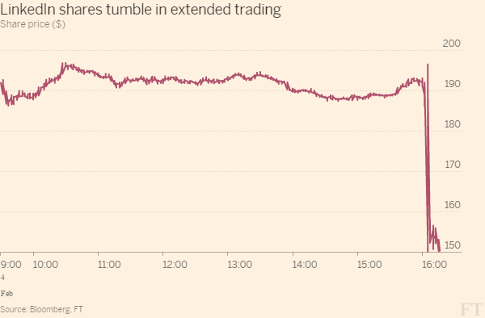
:::

---

## When is it okay to to truncate an axis?

::: {.col}
- When small movements matter
- When zero values are impossible
- When it's normal / a convention
- **[Never on a bar chart]{.red}**
:::

::: {.col}
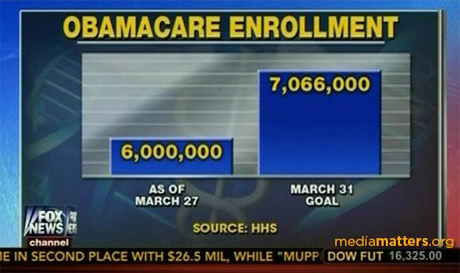
:::

---





# You are most sensitive to changes<br>in angles close to 45 degrees

---



## You are most sensitive to changes<br>in angles close to 45 degrees

::: {.col}
[Good scaling]{.center}

```{r}
#| echo: false
#| fig-height: 5
#| fig-width: 6
#| fig-align: center

df <- data.frame(
    ct = c(980, 1000, 1020),
    dt = as.Date(c("2016-06-01","2016-06-02", "2016-06-03")))

aspect45 <- ggplot(df, aes(dt, ct)) +
    geom_line(group = 1) +
    geom_point() +
    scale_x_date(date_labels = "%b-%d") +
    theme_minimal_grid(font_size = 20) +
    labs(y = NULL)

aspect45
```
:::

::: {.col}
[Y scale too large]{.center}

```{r}
#| echo: false
#| fig-height: 5
#| fig-width: 6
#| fig-align: center

aspect45 +
    expand_limits(y = c(800, 1200))
```
:::

::: {.col}
[X scale too large]{.center}

```{r}
#| echo: false
#| fig-height: 5
#| fig-width: 6
#| fig-align: center

aspect45 +
    expand_limits(x = as.Date(c("2016-05-01", "2016-07-01")))
```
:::

---

## You are most sensitive to changes<br>in angles close to 45 degrees

::: {.col width="30%"}
Bad

```{r}
#| echo: false
#| fig-height: 4
#| fig-width: 4

delta <- wildlife_impacts %>%
    filter(
        incident_year == 2016,
        operator == 'DELTA AIR LINES') %>%
    count(operator, incident_date) %>%
    mutate(incident_date = as.Date(incident_date)) %>%
    ggplot() +
    geom_line(aes(x = incident_date, y = n)) +
    scale_x_date(
        date_breaks = '1 month',
        date_labels = '%b') +
    scale_y_continuous(
        limits = c(0, 12),
        breaks = seq(0, 12, 4)) +
    theme_minimal_grid(font_size = 16) +
    panel_border() +
    theme(legend.position = 'none') +
    labs(x = 'Incident date',
         y = 'Number of incidents',
         title = 'Delta Airlines wildlife impacts, 2016')

delta
```
:::

::: {.col width="70%"}
Better

```{r}
#| echo: false
#| fig-height: 2.5
#| fig-width: 10.5

delta
```

Set image dimensions in R chunk header:

````markdown
`r ''````{r}
#| fig-width: 5
#| fig-height: 3.1

plot
```
````
:::

---




### [Consider setting dimensions to "Golden Ratio" (1 : 1.618)]{.center}

<br>

::: {.col}

:::

::: {.col .center .fragment}
Approx. to golden ratio:

width  |  height
-------|---------
5      | 3.1 or 3
6      | 3.7 or 4
7      | 4.3

<br>

[Also check out Donald Duck in Mathemagic Land](https://youtu.be/U_ZHsk0-eF0?t=512)
:::

---

## Adjust axes with `scale_*` functions

::: {.col width="35%"}
Continous variables

```{r}
#| eval: false

scale_x_continuous()
scale_y_continuous()
```

Discrete variables

```{r}
#| eval: false

scale_x_discrete()
scale_y_discrete()
```

Others

```{r}
#| eval: false

scale_x_log10()
scale_y_log10()
scale_x_date()
```
:::

::: {.col .fragment width="65%"}
Common arguments for **continuous** variables

```{r}
#| eval: false

scale_y_continuous(
  # Set the lower & upper boundaries
  limits = c(lower, upper),

  # Explicitly set the break points
  breaks = c(break1, break2, etc.)

  # Adjust the axis so bars start at 0
  expand = expand_scale(mult = c(0, 0.05))
)
```
:::

---

## Adjusting **continuous** scales

::: {.col .font70 width="55%"}
```{r}
#| eval: false

milk_bars <- milk_production %>%
  filter(year == 2017) %>%
  arrange(desc(milk_produced)) %>%
  slice(1:10) %>%
  mutate(
      milk_produced = milk_produced / 10^9,
      state = fct_reorder(state, milk_produced)) %>%
  ggplot() +
  geom_col(aes(x = milk_produced, y = state)) +
  theme_minimal_vgrid(font_size = 18) +
  labs(x = 'Milk produced (billions of lbs)',
       y = 'State')

milk_bars
```
:::

::: {.col width="45%"}
```{r}
#| echo: false
#| fig-height: 5
#| fig-width: 6
#| fig-align: center

milk_bars <- milk_production %>%
  filter(year == 2017) %>%
  arrange(desc(milk_produced)) %>%
  slice(1:10) %>%
  mutate(
      milk_produced = milk_produced / 10^9,
      state = fct_reorder(state, milk_produced)) %>%
  ggplot() +
  geom_col(aes(x = milk_produced, y = state)) +
  theme_minimal_vgrid(font_size = 18) +
  labs(x = 'Milk produced (billions of lbs)',
       y = 'State')

milk_bars
```
:::

---

## Adjusting **continuous** scales

::: {.col .font70 width="55%"}
```{r}
#| eval: false
#| code-line-numbers: "2,3,4,5"

milk_bars +
  scale_x_continuous(
    breaks = c(0, 15, 30, 45),
    limits = c(0 , 45),
    expand = expand_scale(mult = c(0, 0.05)))
```
:::

::: {.col width="45%"}
```{r}
#| echo: false
#| fig-height: 5
#| fig-width: 6
#| fig-align: center

milk_bars +
  scale_x_continuous(
    breaks = c(0, 15, 30, 45),
    limits = c(0 , 45),
    expand = expand_scale(mult = c(0, 0.05)))
```
:::

---

## Adjusting **discrete** scales

::: {.col .font70 width="55%"}
```{r}
#| eval: false
#| code-line-numbers: "2,3"

milk_bars +
  scale_y_discrete(
    breaks = c('California', 'Wisconsin', 'Idaho'))
```
:::

::: {.col width="45%"}
```{r}
#| echo: false
#| fig-height: 5
#| fig-width: 6
#| fig-align: center

milk_bars +
  scale_y_discrete(
    breaks = c('California', 'Wisconsin', 'Idaho'))
```
:::

---

::: {.col}
## Adjusting **log** scales

Regular scaling

::: {.font70}
```{r}
#| eval: false

plot <- ggplot(msleep) +
  geom_point(aes(x = brainwt, y = bodywt)) +
  theme_half_open(font_size = 20) +
  labs(x = 'Brain weight (kg)',
       y = 'Body weight (kg)')

plot
```
:::
:::

::: {.col}
```{r}
#| echo: false
#| fig-height: 4
#| fig-width: 5
#| fig-align: center

plot <- ggplot(msleep) +
  geom_point(aes(x = brainwt, y = bodywt)) +
  theme_half_open(font_size = 20) +
  labs(x = 'Brain weight (kg)',
       y = 'Body weight (kg)')

plot
```
:::

---

::: {.col}
## Adjusting **log** scales

Log scaling

::: {.font70}
```{r}
#| eval: false
#| code-line-numbers: "2,3"

plot +
  scale_x_log10() +
  scale_y_log10() +
  labs(x = 'Log brain weight (kg)',
       y = 'Log body weight (kg)')
```
:::

Log-log relationship:

$$y = x^n$$

$$\log(y) = n\log(x)$$
:::

::: {.col}
```{r}
#| echo: false
#| fig-height: 4
#| fig-width: 5
#| fig-align: center

plot
```

```{r}
#| echo: false
#| fig-height: 4
#| fig-width: 5
#| fig-align: center

plot +
  scale_x_log10() +
  scale_y_log10() +
  labs(x = 'Log brain weight (kg)',
       y = 'Log body weight (kg)')
```
:::

---

::: {.col}
## Example from Mini Project 2

Regular scaling

::: {.font70}
```{r}
#| eval: false
#| code-line-numbers: "5"

plot <- transit_cost %>%
  filter(!is.na(length)) %>%
  filter(length < 2500) %>%
  mutate(cost = as.numeric(real_cost)) %>%
  ggplot(aes(x = length, y = cost)) +
  geom_point() +
  geom_smooth(method = 'lm', se = FALSE) +
  theme_half_open(font_size = 20) +
  labs(x = "Length of Proposed Line",
       y = "Real Cost in Millions USD")

plot
```
:::
:::

::: {.col}
```{r}
#| echo: false
#| fig-height: 4
#| fig-width: 5
#| fig-align: center

plot <- transit_cost %>%
  filter(!is.na(length)) %>%
  filter(length < 2500) %>%
  mutate(cost = as.numeric(real_cost)) %>%
  ggplot(aes(x = length, y = cost)) +
  geom_point() +
  geom_smooth(method = 'lm', se = FALSE) +
  theme_half_open(font_size = 20) +
  labs(x = "Length of Proposed Line",
       y = "Real Cost in Millions USD")

plot
```
:::

---

::: {.col}
## Example from Mini Project 2

Log scaling

::: {.font70}
```{r}
#| eval: false
#| code-line-numbers: "2,3"

plot +
  scale_x_log10() +
  scale_y_log10() +
  labs(x = 'Log length of proposed line',
       y = 'Log cost')
```
:::

Log-log relationship:

$$y = x^n$$

$$\log(y) = n\log(x)$$
:::

::: {.col}
```{r}
#| echo: false
#| fig-height: 4
#| fig-width: 5
#| fig-align: center

plot
```

```{r}
#| echo: false
#| fig-height: 4
#| fig-width: 5
#| fig-align: center

plot +
  scale_x_log10() +
  scale_y_log10() +
  labs(x = 'Log length of proposed line',
       y = 'Log cost')
```
:::

---





# Date scales can be confusing

---



# What's wrong with this chart?

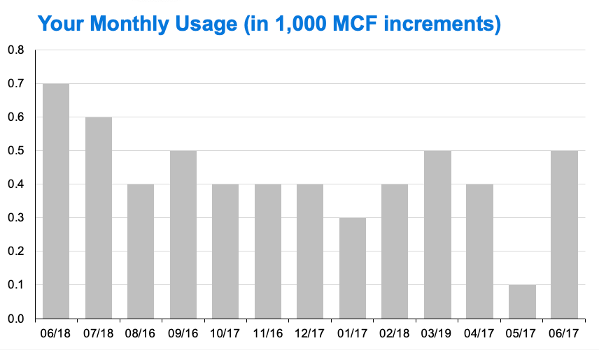{width="700"}

---



# What's wrong with this chart?

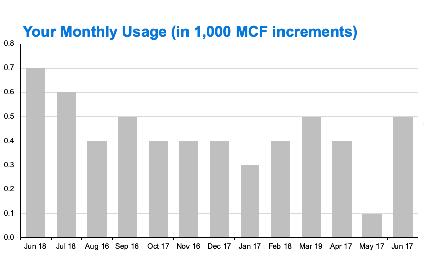{width="700"}

---



# What's wrong with this chart?

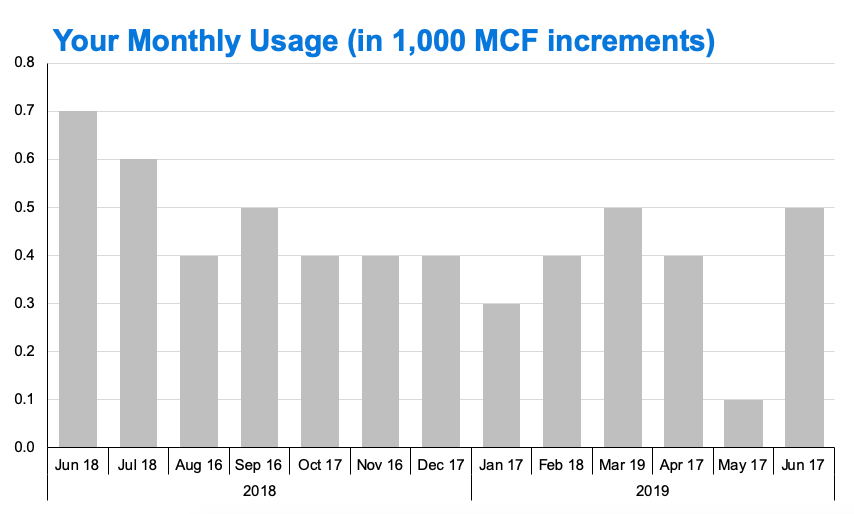{width="700"}

---



# What's wrong with this chart?

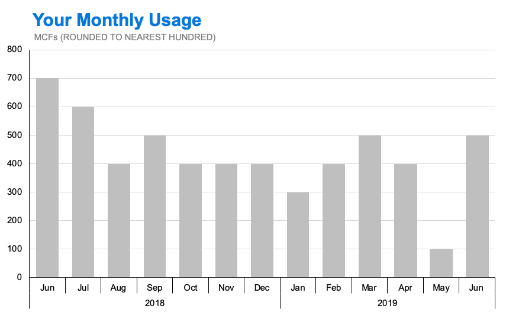{width="700"}

---

::: {.col}
## Adjusting **date** scales

Summarise the data

::: {.font70}
```{r}
#| eval: false
#| code-line-numbers: "1,6"

library(lubridate)

plot <- wildlife_impacts %>%
  filter(incident_year == 2016) %>%
  count(operator, incident_date) %>%
  mutate(incident_date = ymd(incident_date)) %>%
  ggplot() +
  geom_col(
    aes(x = incident_date, y = n,
        color = operator)) +
  facet_wrap(~operator, ncol = 1) +
  theme_minimal_grid(font_size = 16) +
  panel_border() +
  theme(legend.position = 'none') +
  labs(x = 'Incident date (2016)',
       y = 'Number of incidents')

plot
```
:::
:::

::: {.col}
<br>

```{r}
#| echo: false
#| fig-height: 8
#| fig-width: 7
#| fig-align: center

library(lubridate)

plot <- wildlife_impacts %>%
  filter(incident_year == 2016) %>%
  count(operator, incident_date) %>%
  mutate(incident_date = ymd(incident_date)) %>%
  ggplot() +
  geom_col(
    aes(x = incident_date, y = n,
        color = operator)) +
  facet_wrap(~operator, ncol = 1) +
  theme_minimal_grid(font_size = 16) +
  panel_border() +
  theme(legend.position = 'none') +
  labs(x = 'Incident date (2016)',
       y = 'Number of incidents')

plot
```
:::

---

::: {.col}
## Adjusting **date** scales

::: {.font70}
```{r}
#| eval: false
#| code-line-numbers: "2,3,4"

plot +
  scale_x_date(
    date_breaks = '1 month',
    date_labels = '%b')
```
:::
:::

::: {.col}
<br>

```{r}
#| echo: false
#| fig-height: 8
#| fig-width: 7
#| fig-align: center

plot +
  scale_x_date(
    date_breaks = '1 month',
    date_labels = '%b')
```
:::

---

## Adjusting **date** scales

```{r}
#| eval: false

scale_x_date(
  date_breaks = '1 month',
  date_labels = '%b')
```

::: {.col}
```{r}
#| eval: false

date_breaks = '1 month'
```

- '1 day'
- '10 days'
- '1 month'
- '3 months'
- '1 year'
- '3 years'
:::

::: {.col}
```{r}
#| eval: false

date_labels = '%b'
```

Example date: March 04, 2020

- `%Y` = 2020
- `%y` = 20
- `%B` = March
- `%b` = Mar
- `%D` = 03/04/2020
- `%d` = 03
:::

---





## Use **scales** library to modify scale **text**

---

## `scales` converts numbers to formatted characters

```{r}
scales::comma(200000)
scales::dollar(200000)
scales::percent(0.5)
```

---

## Use **scales** library to modify scale text

::: {.col .font70}
```{r}
#| eval: false

federal_spending %>%
  filter(year == 2017) %>%
  mutate(
    department = fct_reorder(
      department, rd_budget)) %>%
  ggplot() +
  geom_col(aes(x = rd_budget, y = department)) +
  scale_x_continuous(
    expand = expand_scale(mult = c(0, 0.05))) +
  theme_minimal_vgrid(font_size = 16) +
  labs(x = 'Department',
       y = 'R&D spending ($ Millions)')
```
:::

::: {.col}
```{r}
#| echo: false
#| fig-height: 5
#| fig-width: 6
#| fig-align: center

federal_spending %>%
  filter(year == 2017) %>%
  mutate(
    department = fct_reorder(
      department, rd_budget)) %>%
  ggplot() +
  geom_col(aes(x = rd_budget, y = department)) +
  scale_x_continuous(
    expand = expand_scale(mult = c(0, 0.05))) +
  theme_minimal_vgrid(font_size = 16) +
  labs(x = 'Department',
       y = 'R&D spending ($ Millions)')
```
:::

---

## Use **scales** library to modify scale text

::: {.col .font70}
```{r}
#| eval: false
#| code-line-numbers: "9"

federal_spending %>%
  filter(year == 2017) %>%
  mutate(
    department = fct_reorder(
      department, rd_budget)) %>%
  ggplot() +
  geom_col(aes(x = rd_budget, y = department)) +
  scale_x_continuous(
    labels = scales::comma,
    expand = expand_scale(mult = c(0, 0.05))) +
  theme_minimal_vgrid(font_size = 16) +
  labs(x = 'Department',
       y = 'R&D spending ($ Millions)')
```
:::

::: {.col}
```{r}
#| echo: false
#| fig-height: 5
#| fig-width: 6
#| fig-align: center

federal_spending %>%
  filter(year == 2017) %>%
  mutate(
    department = fct_reorder(
      department, rd_budget)) %>%
  ggplot() +
  geom_col(aes(x = rd_budget, y = department)) +
  scale_x_continuous(
    labels = scales::comma,
    expand = expand_scale(mult = c(0, 0.05))) +
  theme_minimal_vgrid(font_size = 16) +
  labs(x = 'Department',
       y = 'R&D spending ($ Millions)')
```
:::

---

## Use **scales** library to modify scale text

::: {.col .font70}
```{r}
#| eval: false
#| code-line-numbers: "9"

federal_spending %>%
  filter(year == 2017) %>%
  mutate(
    department = fct_reorder(
      department, rd_budget)) %>%
  ggplot() +
  geom_col(aes(x = rd_budget, y = department)) +
  scale_x_continuous(
    labels = scales::dollar,
    expand = expand_scale(mult = c(0, 0.05))) +
  theme_minimal_vgrid(font_size = 16) +
  labs(x = 'Department',
       y = 'R&D spending ($ Millions)')
```
:::

::: {.col}
```{r}
#| echo: false
#| fig-height: 5
#| fig-width: 6
#| fig-align: center

federal_spending %>%
  filter(year == 2017) %>%
  mutate(
    department = fct_reorder(
      department, rd_budget)) %>%
  ggplot() +
  geom_col(aes(x = rd_budget, y = department)) +
  scale_x_continuous(
    labels = scales::dollar,
    expand = expand_scale(mult = c(0, 0.05))) +
  theme_minimal_vgrid(font_size = 16) +
  labs(x = 'Department',
       y = 'R&D spending ($ Millions)')
```
:::

---




# Check out this guide to scales: https://ggplot2tor.com/scales

---



```{r}
#| echo: false

countdown(
    minutes = 15,
    warn_when = 30,
    update_every = 1,
    top = 0,
    right = 0,
    font_size = '2em'
)
```

## Your turn

::: {.col width="40%"}
Adjust the scales in the code chunk provided to match the chart on the slides.
:::

::: {.col width="60%"}
```{r}
#| echo: false
#| fig-height: 5
#| fig-width: 7
#| fig-align: center

wildlife_costs_plot <- ggplot(wildlife_costs) +
  geom_point(aes(x = incident_date, y = cost)) +
  scale_x_date(
    date_breaks = '3 years',
    date_labels = "'%y") +
  scale_y_continuous(
    breaks = seq(0, 16, 4),
    labels = scales::dollar) +
  theme_minimal_grid(font_size = 16) +
  labs(
    x = 'Year',
    y = 'Cost of incident repairs ($ millions)',
    title = 'Repair costs of aircraft impacts with wildlife',
    subtitle = 'Top 4 airlines',
    caption = 'Source: https://wildlife.faa.gov/home')

wildlife_costs_plot
```
:::

---

```{r}
#| echo: false
#| results: asis

agenda(2)
```

<!--
Most of this content came from this presentation:
https://designing-ggplots.netlify.com/#1
-->

---





# Text is usually the single most important component on your chart

---



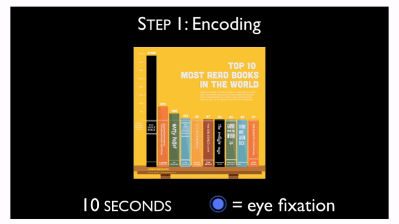{width="900"}

::: {.font80}
Michelle Borkin, et al. (2015) [Beyond Memorability: Visualization Recognition and Recall](https://ieeexplore.ieee.org/document/7192646)
:::

---



::: {.col width="60%"}
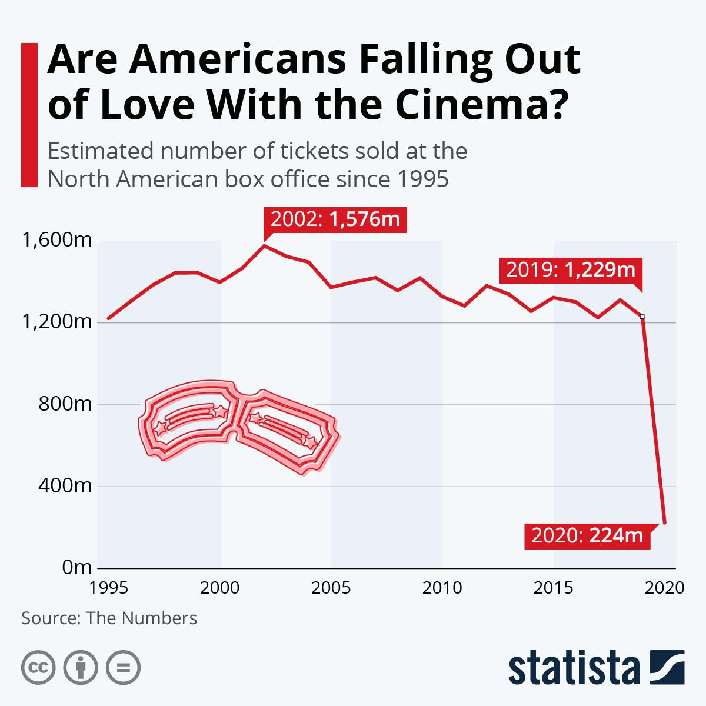{width="100%"}
:::

::: {.col width="40%"}
## Titles matter

<br><br><br><br><br><br><br><br><br><br><br>

Source: https://www.reddit.com/r/dataisugly/comments/odk65x/this_was_not_the_right_headline_to_go_along_with
:::

---

::: {.col width="60%"}
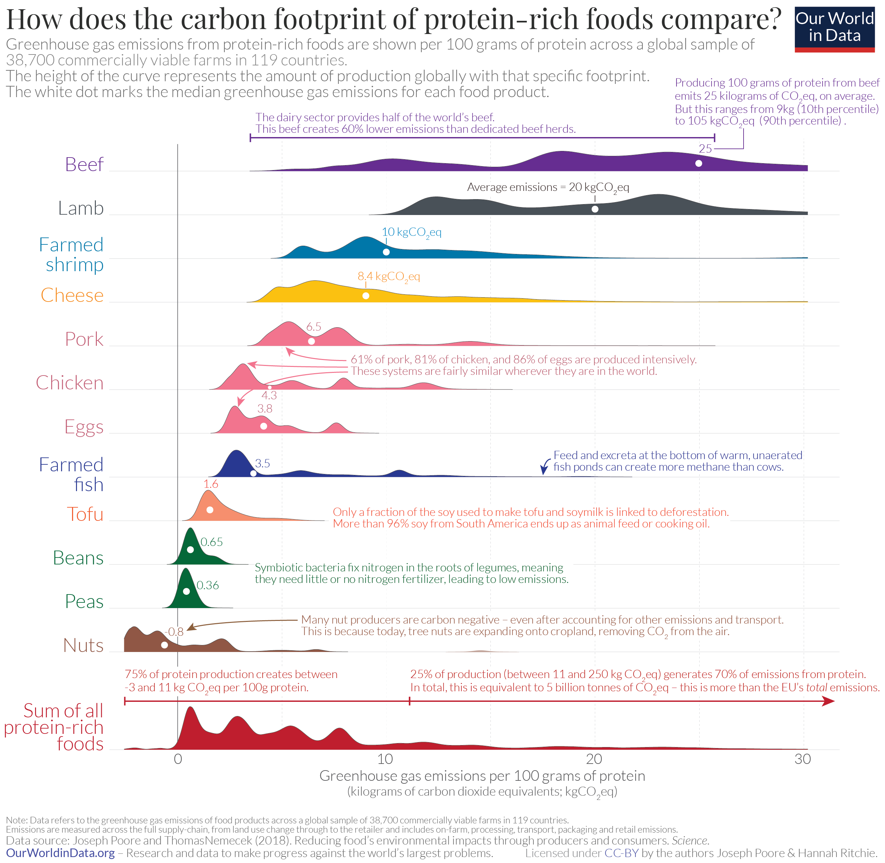{width="100%"}
:::

::: {.col width="40%"}
## Good annotations should tell a story

<br><br><br><br><br><br><br><br><br><br>

Source: https://ourworldindata.org/less-meat-or-sustainable-meat
:::

---

```{r}
#| eval: false

labs(
  x = 'Year',
  y = 'Cost of incident repairs ($ millions)',
  title = 'Repair costs of aircraft impacts with wildlife',
  subtitle = 'Top 4 airlines',
  caption = 'Source: https://wildlife.faa.gov/home')
```

```{r}
#| echo: false
#| fig-height: 5
#| fig-width: 7
#| fig-align: center

wildlife_costs_plot
```

---

Use mapped variables in `aes()` in `labs()`

::: {.col .font70 width="60%"}
```{r}
#| eval: false
#| code-line-numbers: "10,11,17,18"

milk_production %>%
  filter(year %in% c(1970, 2017)) %>%
  group_by(year, region) %>%
  summarise(milk_produced = sum(milk_produced) / 10^9) %>%
  ungroup() %>%
  mutate(
    region = fct_reorder2(region, year, desc(milk_produced))) %>%
  ggplot() +
  geom_col(
    aes(x = milk_produced,
        y = region,
        fill = as.factor(year)),
    position = "dodge") +
  scale_x_continuous(expand = expansion(mult = c(0, 0.05))) +
  theme_minimal_vgrid() +
  labs(
    x = 'Milk produced (billions lbs)',
    y = 'Region',
    title = 'Milk production by region',
    subtitle = '1970 & 2017')
```
:::

::: {.col width="40%"}
```{r}
#| echo: false
#| fig-height: 5
#| fig-width: 7
#| fig-align: center

milk_production %>%
  filter(year %in% c(1970, 2017)) %>%
  group_by(year, region) %>%
  summarise(milk_produced = sum(milk_produced) / 10^9) %>%
  ungroup() %>%
  mutate(
    region = fct_reorder2(region, year, desc(milk_produced))) %>%
  ggplot() +
  geom_col(
    aes(x = milk_produced,
        y = region,
        fill = as.factor(year)),
    position = "dodge") +
  scale_x_continuous(expand = expansion(mult = c(0, 0.05))) +
  theme_minimal_vgrid() +
  labs(
    x = 'Milk produced (billions lbs)',
    y = 'Region',
    title = 'Milk production by region',
    subtitle = '1970 & 2017')
```
:::

---

Use mapped variables in `aes()` in `labs()`

::: {.col .font70 width="60%"}
```{r}
#| eval: false
#| code-line-numbers: "12,21"

milk_production %>%
  filter(year %in% c(1970, 2017)) %>%
  group_by(year, region) %>%
  summarise(milk_produced = sum(milk_produced) / 10^9) %>%
  ungroup() %>%
  mutate(
    region = fct_reorder2(region, year, desc(milk_produced))) %>%
  ggplot() +
  geom_col(
    aes(x = milk_produced,
        y = region,
        fill = as.factor(year)),
    position = "dodge") +
  scale_x_continuous(expand = expansion(mult = c(0, 0.05))) +
  theme_minimal_vgrid() +
  labs(
    x = 'Milk produced (billions lbs)',
    y = 'Region',
    title = 'Milk production by region',
    subtitle = '1970 & 2017',
    fill = "Year")
```
:::

::: {.col width="40%"}
```{r}
#| echo: false
#| fig-height: 5
#| fig-width: 7
#| fig-align: center

milk_production %>%
  filter(year %in% c(1970, 2017)) %>%
  group_by(year, region) %>%
  summarise(milk_produced = sum(milk_produced) / 10^9) %>%
  ungroup() %>%
  mutate(
    region = fct_reorder2(region, year, desc(milk_produced))) %>%
  ggplot() +
  geom_col(
    aes(x = milk_produced,
        y = region,
        fill = as.factor(year)),
    position = "dodge") +
  scale_x_continuous(expand = expansion(mult = c(0, 0.05))) +
  theme_minimal_vgrid() +
  labs(
    x = 'Milk produced (billions lbs)',
    y = 'Region',
    title = 'Milk production by region',
    subtitle = '1970 & 2017',
    fill = "Year")
```
:::

---





# Legends suck

---



# Legends suck

::: {.col}
### Legends require look-up task

```{r}
#| echo: false
#| fig-height: 5
#| fig-width: 7.5
#| fig-align: center

ggplot(milk_region,
    aes(x = year, y = milk_produced,
        color = region)) +
    geom_line(size = 1) +
    scale_color_manual(values = c(
        'sienna', 'forestgreen', 'dodgerblue', 'orange')) +
    theme_half_open(font_size = 18) +
    labs(x = 'Year',
         y = 'Milk produced (lbs)',
         color = 'Region',
         title = 'Milk production in four US regions')
```
:::

::: {.col .fragment}
### Direct labeling is much better

```{r}
#| echo: false
#| fig-height: 5
#| fig-width: 7
#| fig-align: center

ggplot(milk_region,
    aes(x = year, y = milk_produced,
        color = region)) +
    geom_line(size = 1) +
    geom_text(aes(label = label),
              hjust = 0, nudge_x = 1,
              size = 6) +
    scale_color_manual(values = c(
        'sienna', 'forestgreen', 'dodgerblue', 'orange')) +
    coord_cartesian(clip = 'off') +
    theme_half_open(font_size = 18) +
    theme(legend.position = 'none',
          plot.margin = margin(0.1, 2.7, 0.1, 0.1, "cm")) +
    labs(x = 'Year',
         y = 'Milk produced (lbs)',
         title = 'Milk production in four US regions')
```
:::

---



# Legends suck

::: {.col}
### Legends require look-up task

```{r}
#| echo: false
#| fig-height: 5
#| fig-width: 7
#| fig-align: center

ggplot(federal_spending_summary) +
  geom_area(
    aes(x = year, y = rd_budget, fill = department)) +
  scale_y_continuous(
    expand = expand_scale(mult = c(0, 0.05))) +
  scale_fill_manual(values = c('grey', 'sienna')) +
  theme_minimal_hgrid() +
  labs(
    x = NULL,
    y = 'R&D Budget ($ Billions)',
    fill = 'Department',
    title = 'Federal R&D spending, 1976 - 2017',
    subtitle = 'Source: AAAS Historical Trends')
```
:::

::: {.col .fragment}
### Direct labeling is much better

```{r}
#| echo: false
#| fig-height: 5
#| fig-width: 7
#| fig-align: center

dod_spending <- ggplot(federal_spending_summary) +
    geom_area(aes(x = year, y = rd_budget,
                  fill = department)) +
    annotate(geom = 'text', x = 1995, y = 85,
             label = 'Other', size = 6, color = 'black') +
    annotate(geom = 'text', x = 1995, y = 25,
             label = 'DOD', size = 6, color = 'white') +
    scale_y_continuous(
        expand = expand_scale(mult = c(0, 0.05))) +
    scale_fill_manual(values = c('grey', 'sienna')) +
    theme_minimal_hgrid() +
    theme(legend.position = 'none') +
    labs(x = NULL,
         y = 'R&D Budget ($ Billions)',
         title = 'Federal R&D spending, 1976 - 2017',
         subtitle = 'Source: AAAS Historical Trends')

dod_spending
```
:::

---

## Use `annotate()` to add text to chart

::: {.col .font70 width="60%"}
```{r}
#| eval: false
#| code-line-numbers: "4,5,6,7,12"

dod_spending <- ggplot(federal_spending_summary) +
    geom_area(aes(x = year, y = rd_budget,
                  fill = department)) +
    annotate(geom = 'text', x = 1995, y = 85,
             label = 'Other', size = 6, color = 'black') +
    annotate(geom = 'text', x = 1995, y = 25,
             label = 'DOD', size = 6, color = 'white') +
    scale_y_continuous(
        expand = expand_scale(mult = c(0, 0.05))) +
    scale_fill_manual(values = c('grey', 'sienna')) +
    theme_minimal_hgrid() +
    theme(legend.position = 'none') +
    labs(x = NULL,
         y = 'R&D Budget ($ Billions)',
         title = 'Federal R&D spending, 1976 - 2017',
         subtitle = 'Source: AAAS Historical Trends')

dod_spending
```
:::

::: {.col width="40%"}
<br>

```{r}
#| echo: false
#| fig-height: 5
#| fig-width: 7
#| fig-align: center

dod_spending
```
:::

---

## Use `geom_text()` to add text to chart

::: {.col .font70 width="60%"}
```{r}
#| eval: false
#| code-line-numbers: "4-11"

dod_spending <- ggplot(federal_spending_summary) +
    geom_area(aes(x = year, y = rd_budget,
                  fill = department)) +
    geom_text(
      data = data.frame(x = 1995, y = 85, label = 'Other'),
      aes(x = x, y = y, label = label),
      size = 6, color = 'black') +
    geom_text(
      data = data.frame(x = 1995, y = 25, label = 'DOD'),
      aes(x = x, y = y, label = label),
      size = 6, color = 'white') +
    scale_y_continuous(
        expand = expand_scale(mult = c(0, 0.05))) +
    scale_fill_manual(values = c('grey', 'sienna')) +
    theme_minimal_hgrid() +
    theme(legend.position = 'none') +
    labs(x = NULL,
         y = 'R&D Budget ($ Billions)',
         title = 'Federal R&D spending, 1976 - 2017',
         subtitle = 'Source: AAAS Historical Trends')

dod_spending
```
:::

::: {.col width="40%"}
<br>

```{r}
#| echo: false
#| fig-height: 5
#| fig-width: 7
#| fig-align: center

dod_spending <- ggplot(federal_spending_summary) +
    geom_area(aes(x = year, y = rd_budget,
                  fill = department)) +
    geom_text(
      data = data.frame(x = 1995, y = 85, label = 'Other'),
      aes(x = x, y = y, label = label),
      size = 6, color = 'black') +
    geom_text(
      data = data.frame(x = 1995, y = 25, label = 'DOD'),
      aes(x = x, y = y, label = label),
      size = 6, color = 'white') +
    scale_y_continuous(
        expand = expand_scale(mult = c(0, 0.05))) +
    scale_fill_manual(values = c('grey', 'sienna')) +
    theme_minimal_hgrid() +
    theme(legend.position = 'none') +
    labs(x = NULL,
         y = 'R&D Budget ($ Billions)',
         title = 'Federal R&D spending, 1976 - 2017',
         subtitle = 'Source: AAAS Historical Trends')

dod_spending
```
:::

---

### Use `geom_label()` to add text to chart **with a background**

::: {.col .font70 width="60%"}
```{r}
#| eval: false
#| code-line-numbers: "4,8,11"

dod_spending <- ggplot(federal_spending_summary) +
    geom_area(aes(x = year, y = rd_budget,
                  fill = department)) +
    geom_label(
      data = data.frame(x = 1995, y = 85, label = 'Other'),
      aes(x = x, y = y, label = label),
      size = 6) +
    geom_label(
      data = data.frame(x = 1995, y = 25, label = 'DOD'),
      aes(x = x, y = y, label = label),
      size = 6, fill = "black", color = "white") +
    scale_y_continuous(
        expand = expand_scale(mult = c(0, 0.05))) +
    scale_fill_manual(values = c('grey', 'sienna')) +
    theme_minimal_hgrid() +
    theme(legend.position = 'none') +
    labs(x = NULL,
         y = 'R&D Budget ($ Billions)',
         title = 'Federal R&D spending, 1976 - 2017',
         subtitle = 'Source: AAAS Historical Trends')

dod_spending
```
:::

::: {.col width="40%"}
<br>

```{r}
#| echo: false
#| fig-height: 5
#| fig-width: 7
#| fig-align: center

dod_spending <- ggplot(federal_spending_summary) +
    geom_area(aes(x = year, y = rd_budget,
                  fill = department)) +
    geom_label(
      data = data.frame(x = 1995, y = 85, label = 'Other'),
      aes(x = x, y = y, label = label),
      size = 6) +
    geom_label(
      data = data.frame(x = 1995, y = 25, label = 'DOD'),
      aes(x = x, y = y, label = label),
      size = 6, fill = "black", color = "white") +
    scale_y_continuous(
        expand = expand_scale(mult = c(0, 0.05))) +
    scale_fill_manual(values = c('grey', 'sienna')) +
    theme_minimal_hgrid() +
    theme(legend.position = 'none') +
    labs(x = NULL,
         y = 'R&D Budget ($ Billions)',
         title = 'Federal R&D spending, 1976 - 2017',
         subtitle = 'Source: AAAS Historical Trends')

dod_spending
```
:::

---

### Use `geom_curve()` + `geom_label()` to direct attention

::: {.col .font70 width="60%"}
```{r}
#| eval: false
#| code-line-numbers: "6-12"

label <- "The Dept. of Defense R&D Budget
has made up nearly half of all
federal R&D spending"

dod_spending +
  geom_curve(
    data = data.frame(
      x = 1981, xend = 1987, y = 160, yend = 25),
    mapping = aes(x = x, xend = xend, y = y, yend = yend),
    color = 'grey75', size = 0.5, curvature = 0.1,
    arrow = arrow(length = unit(0.01, "npc"),
                  type = "closed")) +
  geom_label(
    data = data.frame(x = 1977, y = 160, label = label),
    mapping = aes(x = x, y = y, label = label),
    hjust = 0, lineheight = 0.8)
```
:::

::: {.col width="40%"}
```{r}
#| echo: false
#| fig-height: 5
#| fig-width: 7
#| fig-align: center

label <- "The Dept. of Defense R&D Budget
has made up nearly half of all
federal R&D spending"

dod_spending +
  geom_curve(
    data = data.frame(
      x = 1981, xend = 1987, y = 160, yend = 25),
    mapping = aes(x = x, xend = xend, y = y, yend = yend),
    color = 'grey75', size = 0.5, curvature = 0.1,
    arrow = arrow(length = unit(0.01, "npc"),
                  type = "closed")) +
  geom_label(
    data = data.frame(x = 1977, y = 160, label = label),
    mapping = aes(x = x, y = y, label = label),
    hjust = 0, lineheight = 0.8)
```
:::

---

## Use `annotate()` to direct attention

Use `geom = "rect"` for box, `geom = "text"` for label

::: {.col .font70 width="60%"}
```{r}
#| eval: false
#| code-line-numbers: "6,10"

ggplot(mpg, aes(x = displ, y = hwy)) +
  geom_point(
    aes(fill = as.factor(cyl)),
    color = 'white', alpha = 0.8,
    size = 3.5, shape = 21) +
  annotate(geom = "rect",
    xmin = 5, xmax = 7.5,
    ymin = 21, ymax = 28,
    fill = "grey55", alpha = 0.2) +
  annotate(geom = "text",
    x = 5, y = 29, label = "Hybrid vehicles",
    hjust = 0, size = 5) +
  theme_half_open(font_size = 15) +
  labs(x = "Engine displacement",
       y = "Fuel efficiency (mpg)",
       fill = '# cylinders',
       title = "Vehicle fuel efficiency vs. engine displacement",
       caption = "Source: U.S. EPA.")
```
:::

::: {.col width="40%"}
```{r}
#| echo: false
#| fig-height: 6
#| fig-width: 7
#| fig-align: center

ggplot(mpg, aes(x = displ, y = hwy)) +
  geom_point(
    aes(fill = as.factor(cyl)),
    color = 'white', alpha = 0.8,
    size = 3.5, shape = 21) +
  annotate(geom = "rect",
    xmin = 5, xmax = 7.5,
    ymin = 21, ymax = 28,
    fill = "grey55", alpha = 0.2) +
  annotate(geom = "text",
    x = 5, y = 29, label = "Hybrid vehicles",
    hjust = 0, size = 5) +
  theme_half_open(font_size = 15) +
  labs(x = "Engine displacement",
       y = "Fuel efficiency (mpg)",
       fill = '# cylinders',
       title = "Vehicle fuel efficiency vs. engine displacement",
       caption = "Source: U.S. EPA.")
```
:::

---

## Find where to put annotations with [`ggannotate`](https://github.com/MattCowgill/ggannotate)

::: {.col width="65%"}
Install:

```{r}
#| eval: false

remotes::install_github("mattcowgill/ggannotate")
```

Use:

```{r}
#| eval: false
#| code-line-numbers: "7"

library(ggannotate)

plot <- ggplot(mpg) +
  geom_point(aes(x = displ, y = hwy, color = as.factor(cyl))) +
  theme_half_open()

ggannotate(plot)
```
:::

::: {.col width="35%"}
:::

---



```{r}
#| echo: false

countdown(
    minutes = 20,
    warn_when = 30,
    update_every = 1,
    top = 0,
    right = 0,
    font_size = '2em'
)
```

## Your turn

::: {.col}
Use the `lotr_summary` data frame to create the following chart.

Hints:

- For the `geom_label()`, use these points:
    - `x = 0.6`
    - `y = 2100`
- For the `geom_curve()`, use these points:
    - `x = 1.2`
    - `xend = 1`
    - `y = 1300`
    - `yend = 200`
:::

::: {.col}
```{r}
#| echo: false
#| fig-height: 6
#| fig-width: 7.5
#| fig-align: center

label <- "Across 3 films,
only 16 words were
spoken by a
female hobbit."

ggplot(lotr_summary) +
  geom_col(
    aes(x = Race, y = wordCount, fill = gender),
    width = 0.7, color = 'white') +
  facet_wrap(~gender) +
  geom_curve(
    data = data.frame(
      x = 1.2, xend = 1, y = 1300, yend = 200, gender = 'Female'),
    mapping = aes(x = x, y = y, xend = xend, yend = yend),
    color = 'grey75', size = 0.5, curvature = 0.1,
    arrow = arrow(length = unit(0.01, 'npc'), type = 'closed')) +
  geom_label(
    data = data.frame(
      x = 0.6, y = 2100, label = label, gender = 'Female'),
    mapping = aes(x = x, y = y, label = label),
    hjust = 0, lineheight = .8) +
  scale_y_continuous(
    labels = scales::comma,
    expand = expand_scale(mult = c(0, 0.05))) +
  theme_minimal_hgrid(font_size = 18) +
  theme(legend.position = 'none') +
  panel_border() +
  labs(
    x = 'Race of character',
    y = 'Number of words spoken',
    title = 'Speaking roles in the LOTR film trilogy was\nheavily biased towards male characters')
```
:::

---




```{r}
#| echo: false

countdown(
    minutes = 5,
    warn_when = 30,
    update_every = 1,
    left = 0, right = 0, top = 1, bottom = 0,
    margin = "5%",
    font_size = "8em"
)
```

# Intermission

---

```{r}
#| echo: false
#| results: asis

agenda(3)
```

<!--
Source of a lot of the slide content:
https://resources.rstudio.com/rstudio-conf-2020/the-glamour-of-graphics-william-chase
-->

---





# Color is hard

---

## How do I know what colors look good together?

. . .

### [Use the color wheel]{.red}

::: {.col width="55%"}
:::

::: {.col width="45%"}
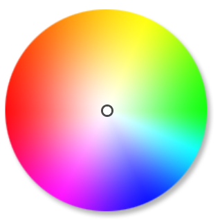

[Image from [this color wheel tool](https://www.sessions.edu/color-calculator/)]{.center}
:::

---

## How do I know what colors look good together?

### [Use the color wheel]{.red}

::: {.col width="55%"}
### 1. **Complementary**: High contrast
:::

::: {.col width="45%"}
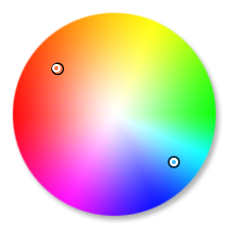

[Image from [this color wheel tool](https://www.sessions.edu/color-calculator/)]{.center}
:::

---

## How do I know what colors look good together?

### [Use the color wheel]{.red}

::: {.col width="55%"}
### 1. Complementary: High contrast
### 2. **Analogous**: Calm, harmonious
:::

::: {.col width="45%"}
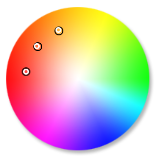

[Image from [this color wheel tool](https://www.sessions.edu/color-calculator/)]{.center}
:::

---

## How do I know what colors look good together?

### [Use the color wheel]{.red}

::: {.col width="55%"}
### 1. Complementary: High contrast
### 2. Analogous: Calm, harmonious
### 3. **Triadic**: Vibrant, contrast
:::

::: {.col width="45%"}
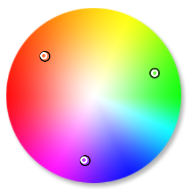

[Image from [this color wheel tool](https://www.sessions.edu/color-calculator/)]{.center}
:::

---




# [Artists use color theory too!](https://twitter.com/emeldraws/status/1151835561415495681?s=19)

---



# Steal colors with the [eye dropper tool](https://chrome.google.com/webstore/detail/eye-dropper/hmdcmlfkchdmnmnmheododdhjedfccka?hl=en)

::: {.noborder}
{width="242"}
:::

---

## Using your own colors

::: {.col .font70 width="60%"}
Map color to variable

```{r}
#| code-line-numbers: "3"

mpg_plot <- ggplot(mtcars, aes(x = mpg, y = hp)) +
  geom_point(
    aes(color = as.factor(cyl)),
    alpha = 0.8, size = 3) +
  theme_half_open(font_size = 16) +
  labs(x = "Fuel efficiency (mpg)",
       y = "Power (hp)",
       color = '# cylinders',
       title = "Vehicle fuel efficiency vs. power",
       caption = "Source: 1974 Motor Trend U.S. magazine.")
```
:::

::: {.col width="40%"}
<br>

```{r}
#| echo: false
#| fig-height: 5
#| fig-width: 6
#| fig-align: center

mpg_plot
```
:::

---

## Using your own colors

::: {.col .font70 width="60%"}
Map color to variable

```{r}
#| eval: false
#| code-line-numbers: "3"

mpg_plot <- ggplot(mtcars, aes(x = mpg, y = hp)) +
  geom_point(
    aes(color = as.factor(cyl)),
    alpha = 0.8, size = 3) +
  theme_half_open(font_size = 16) +
  labs(x = "Fuel efficiency (mpg)",
       y = "Power (hp)",
       color = '# cylinders',
       title = "Vehicle fuel efficiency vs. power",
       caption = "Source: 1974 Motor Trend U.S. magazine.")
```

Manually change colors

```{r}
#| eval: false
#| code-line-numbers: "2,3"

mpg_plot +
    scale_color_manual(values = c(
        '#a0522d', '#522da0', '#2da052'))
```
:::

::: {.col width="40%"}
<br>

```{r}
#| echo: false
#| fig-height: 5
#| fig-width: 6
#| fig-align: center

mpg_plot +
    scale_color_manual(values = c(
        '#a0522d', '#522da0', '#2da052'))
```
:::

---

## Consider color blind friendly colors

::: {.col .font70 width="45%"}
Manually change colors

```{r}
#| code-line-numbers: "3,4"

mpg_plot_mycolors <- mpg_plot +
    theme_half_open(font_size = 10) +
    scale_color_manual(values = c(
        '#a0522d', '#522da0', '#2da052'))
```

Simulate color blindness with [colorblindr](https://github.com/clauswilke/colorblindr)

```{r}
#| eval: false

# remotes::install_github("clauswilke/colorblindr")
library(colorblindr)

cvd_grid(mpg_plot_mycolors)
```
:::

::: {.col width="55%"}
```{r}
#| echo: false
#| fig-height: 7
#| fig-width: 8
#| fig-align: center

library(colorblindr)

cvd_grid(mpg_plot_mycolors)
```
:::

---



::: {.col}
# Use palettes

### [Viridis](https://cran.r-project.org/web/packages/viridis/vignettes/intro-to-viridis.html)

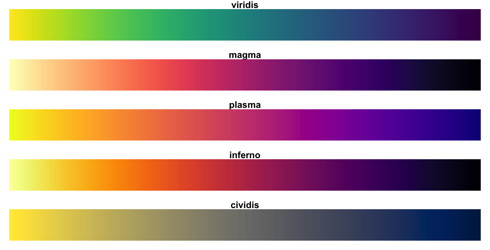
:::

::: {.col}
### [ColorBrewer](https://www.datanovia.com/en/blog/the-a-z-of-rcolorbrewer-palette/)

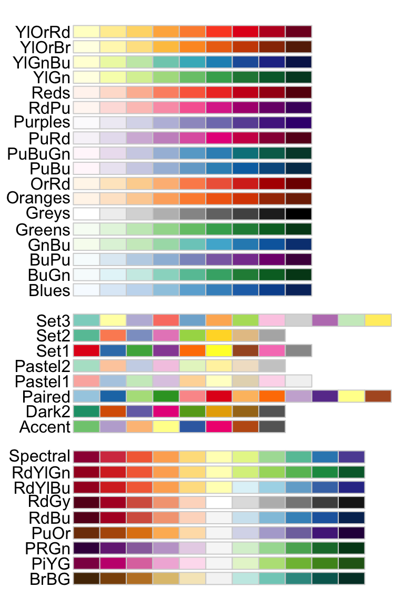{width="370"}
:::

---

::: {.col width="35%"}
### 3 types of palettes

### 1. Sequential
### 2. Diverging
### 3. Categorical
:::

::: {.col width="65%"}
:::

---

::: {.col width="35%"}
### 3 types of palettes

### 1. **Sequential**
### 2. Diverging
### 3. Categorical
:::

::: {.col width="65%"}
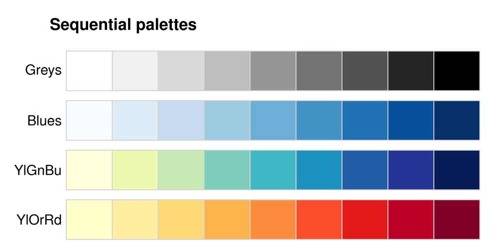{width="450"}
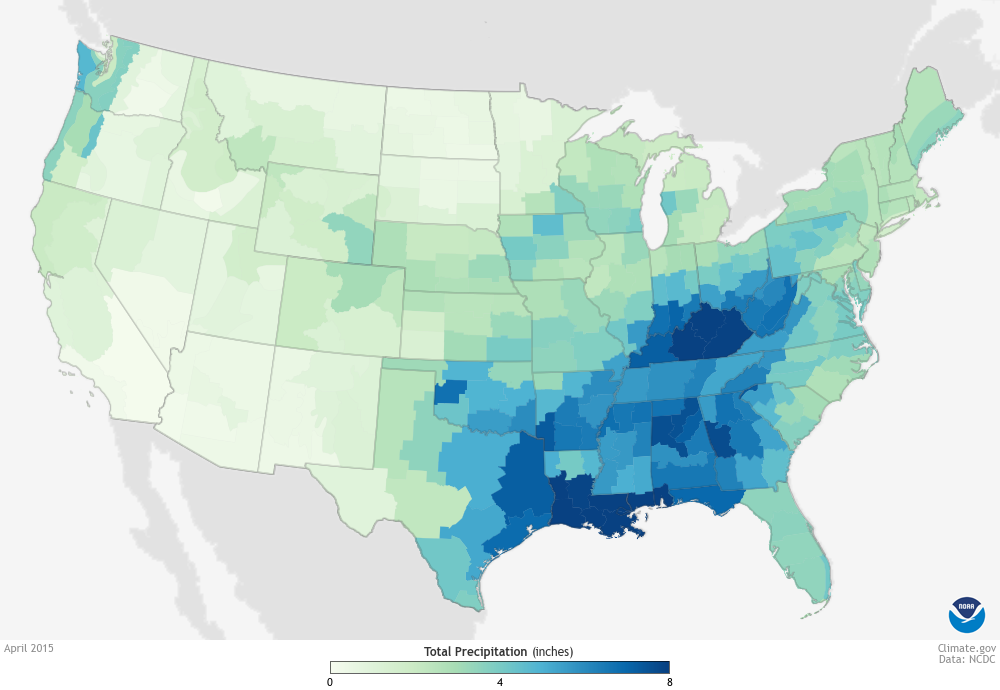{width="450"}

Image from [betterfigures.org](https://betterfigures.org/2015/06/23/picking-a-colour-scale-for-scientific-graphics/)
:::

---

::: {.col width="35%"}
### 3 types of palettes

### 1. Sequential
### 2. **Diverging**
### 3. Categorical
:::

::: {.col width="65%"}
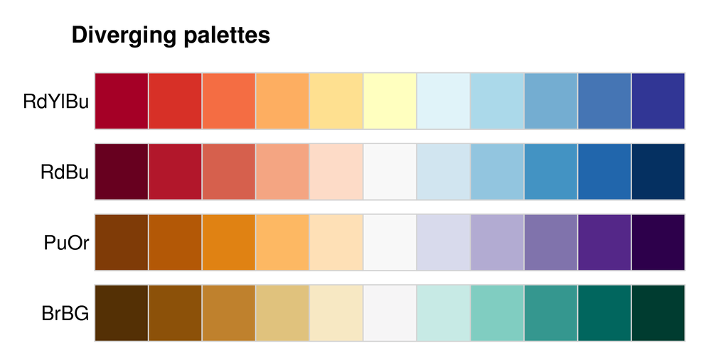{width="450"}
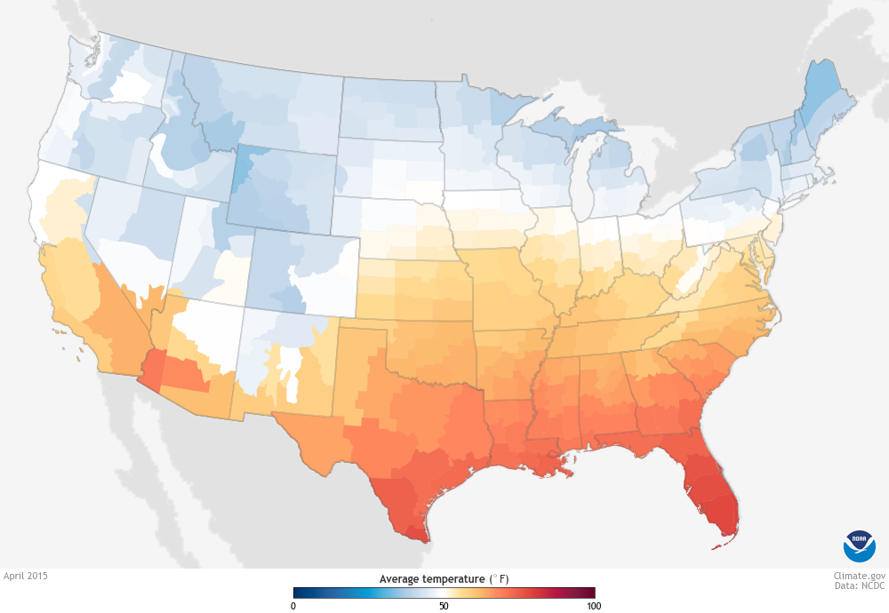{width="450"}

Image from [betterfigures.org](https://betterfigures.org/2015/06/23/picking-a-colour-scale-for-scientific-graphics/)
:::

---

::: {.col width="35%"}
### 3 types of palettes

### 1. Sequential
### 2. Diverging
### 3. **Categorical**
:::

::: {.col width="65%"}
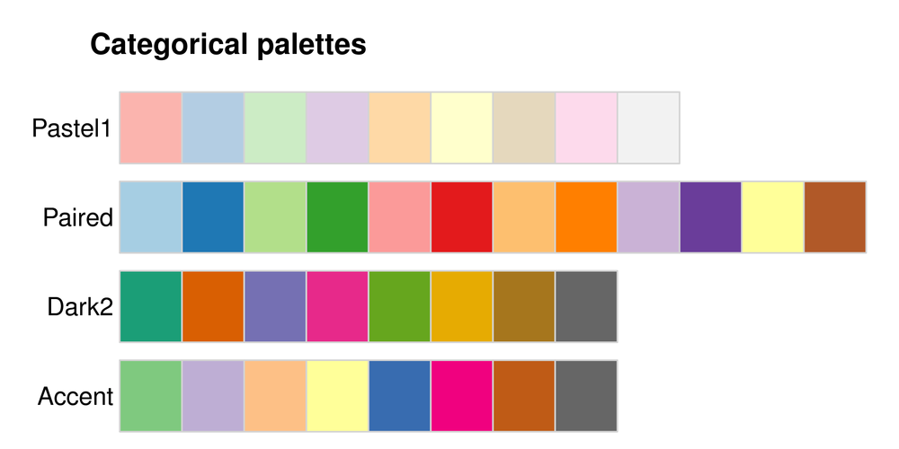{width="500"}
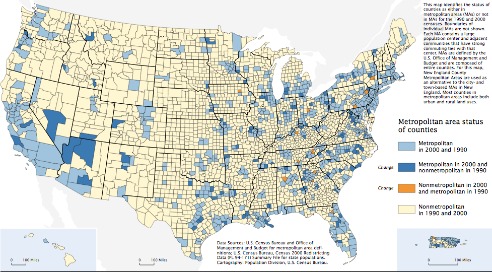{width="500"}

Image from [betterfigures.org](https://betterfigures.org/2015/06/23/picking-a-colour-scale-for-scientific-graphics/)
:::

---

## **ColorBrewer** palettes

::: {.col .font70 width="60%"}
Map color to variable

```{r}
#| eval: false
#| code-line-numbers: "2"

mpg_plot <- ggplot(mtcars, aes(x = mpg, y = hp)) +
    geom_point(aes(color = as.factor(cyl)),
               alpha = 0.8, size = 3) +
    theme_half_open(font_size = 16) +
    labs(x = "Fuel efficiency (mpg)",
         y = "Power (hp)",
         color = '# cylinders',
         title = "Vehicle fuel efficiency vs. power",
         caption = "Source: 1974 Motor Trend U.S. magazine.")
```

Use "Dark2" palette

```{r}
#| eval: false
#| code-line-numbers: "2"

mpg_plot +
    scale_color_brewer(palette = 'Dark2')
```
:::

::: {.col width="40%"}
<br>

```{r}
#| echo: false
#| fig-height: 5
#| fig-width: 6
#| fig-align: center

mpg_plot +
    scale_color_brewer(palette = 'Dark2')
```
:::

---

## **ColorBrewer** palettes

::: {.col .font70}
```{r}
#| fig-height: 5
#| fig-width: 6
#| fig-align: center
#| code-line-numbers: "3"

mpg_plot +
    scale_color_brewer(
        palette = 'Set1')
```
:::

::: {.col .font70}
```{r}
#| fig-height: 5
#| fig-width: 6
#| fig-align: center
#| code-line-numbers: "3"

mpg_plot +
    scale_color_brewer(
        palette = 'Set2')
```
:::

::: {.col .font70}
```{r}
#| fig-height: 5
#| fig-width: 6
#| fig-align: center
#| code-line-numbers: "3"

mpg_plot +
    scale_color_brewer(
        palette = 'Accent')
```
:::

---

## **viridis** palettes

::: {.col .font70 width="60%"}
Map color to variable

```{r}
#| eval: false
#| code-line-numbers: "2"

mpg_plot <- ggplot(mtcars, aes(x = mpg, y = hp)) +
    geom_point(aes(color = as.factor(cyl)),
               alpha = 0.8, size = 3) +
    theme_half_open(font_size = 16) +
    labs(x = "Fuel efficiency (mpg)",
         y = "Power (hp)",
         color = '# cylinders',
         title = "Vehicle fuel efficiency vs. power",
         caption = "Source: 1974 Motor Trend U.S. magazine.")
```

Use viridis colors

```{r}
#| eval: false
#| code-line-numbers: "2"

mpg_plot +
    scale_color_viridis(discrete = TRUE)
```
:::

::: {.col width="40%"}
<br>

```{r}
#| echo: false
#| fig-height: 5
#| fig-width: 6
#| fig-align: center

mpg_plot +
    scale_color_viridis(discrete = TRUE)
```
:::

---

## **viridis** palettes

::: {.col .font70}
```{r}
#| fig-height: 5
#| fig-width: 6
#| fig-align: center
#| code-line-numbers: "4"

mpg_plot +
    scale_color_viridis(
        discrete = TRUE,
        option = 'viridis')
```
:::

::: {.col .font70}
```{r}
#| fig-height: 5
#| fig-width: 6
#| fig-align: center
#| code-line-numbers: "4"

mpg_plot +
    scale_color_viridis(
        discrete = TRUE,
        option = 'inferno')
```
:::

::: {.col .font70}
```{r}
#| fig-height: 5
#| fig-width: 6
#| fig-align: center
#| code-line-numbers: "4"

mpg_plot +
    scale_color_viridis(
        discrete = TRUE,
        option = 'plasma')
```
:::

---



Fun custom palettes

::: {.col}
[Inauguration palette](https://github.com/ciannabp/inauguration)

{width="500"}
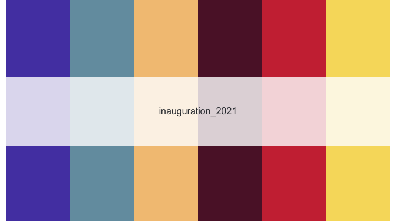{width="500"}
:::

::: {.col .fragment}
[PNWColors](https://github.com/jakelawlor/PNWColors)

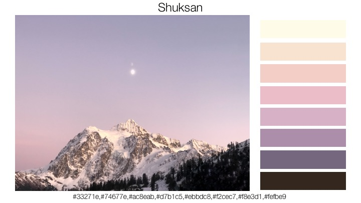{width="500"}
:::

---

## Consider using `color` + `fill` for points

::: {.col .font70 width="60%"}
```{r}
#| eval: false
#| code-line-numbers: "3,4,6"

ggplot(mtcars, aes(x = mpg, y = hp)) +
  geom_point(
    aes(fill = as.factor(cyl)),
    color = 'white', shape = 21,
    size = 3.5, alpha = 0.8) +
  scale_fill_brewer(palette = 'Dark2') +
  theme_half_open(font_size = 15) +
  labs(
    x = "Fuel efficiency (mpg)",
    y = "Power (hp)",
    fill = '# cylinders',
    title = "Vehicle fuel efficiency vs. power",
    caption = "Source: 1974 Motor Trend U.S. magazine.")
```
:::

::: {.col width="40%"}
```{r}
#| echo: false
#| fig-height: 5
#| fig-width: 6
#| fig-align: center

ggplot(mtcars, aes(x = mpg, y = hp)) +
  geom_point(
    aes(fill = as.factor(cyl)),
    color = 'white', shape = 21,
    size = 3.5, alpha = 0.8) +
  scale_fill_brewer(palette = 'Dark2') +
  theme_half_open(font_size = 15) +
  labs(
    x = "Fuel efficiency (mpg)",
    y = "Power (hp)",
    fill = '# cylinders',
    title = "Vehicle fuel efficiency vs. power",
    caption = "Source: 1974 Motor Trend U.S. magazine.")
```
:::

---

## [`grey` = "Other"]{.center}

::: {.col .font70}
```{r}
#| eval: false
#| code-line-numbers: "14,15"

dod_spending_plot <- federal_spending %>%
  mutate(department = fct_other(
    department, keep = 'DOD')) %>%
  group_by(department, year) %>%
  summarise(rd_budget = sum(rd_budget) / 10^3) %>%
  ungroup() %>%
  mutate(department = fct_relevel(
  department, c('Other', 'DOD'))) %>%
  ggplot() +
  geom_area(aes(x = year, y = rd_budget,
                fill = department)) +
  scale_y_continuous(
      expand = expand_scale(mult = c(0, 0.05))) +
  scale_fill_manual(
    values = c('grey', 'sienna')) +
  theme_minimal_hgrid() +
  labs(x = NULL,
       y = 'R&D Budget ($ Billions)',
       fill = 'Department',
       caption = 'Source: AAAS')

dod_spending_plot
```
:::

::: {.col}
```{r}
#| echo: false
#| fig-height: 4
#| fig-width: 6
#| fig-align: center

dod_spending_plot <- federal_spending %>%
  mutate(department = fct_other(
    department, keep = 'DOD')) %>%
  group_by(department, year) %>%
  summarise(rd_budget = sum(rd_budget) / 10^3) %>%
  ungroup() %>%
  mutate(department = fct_relevel(
  department, c('Other', 'DOD'))) %>%
  ggplot() +
  geom_area(aes(x = year, y = rd_budget,
                fill = department)) +
  scale_y_continuous(
      expand = expand_scale(mult = c(0, 0.05))) +
  scale_fill_manual(
    values = c('grey', 'sienna')) +
  theme_minimal_hgrid() +
  labs(x = NULL,
       y = 'R&D Budget ($ Billions)',
       fill = 'Department',
       caption = 'Source: AAAS')

dod_spending_plot
```
:::

---

# [`grey` = "Other"]{.center}

::: {.col .font60}
```{r}
#| fig-height: 5
#| fig-width: 6
#| fig-align: center
#| code-line-numbers: "3"

dod_spending_plot +
    scale_fill_manual(
        values = c('grey40', 'sienna'))
```
:::

::: {.col .font60}
```{r}
#| fig-height: 5
#| fig-width: 6
#| fig-align: center
#| code-line-numbers: "3"

dod_spending_plot +
    scale_fill_manual(
        values = c('grey60', 'sienna'))
```
:::

::: {.col .font60}
```{r}
#| fig-height: 5
#| fig-width: 6
#| fig-align: center
#| code-line-numbers: "3"

dod_spending_plot +
    scale_fill_manual(
        values = c('grey80', 'sienna'))
```
:::

---



```{r}
#| echo: false

countdown(
    minutes = 20,
    warn_when = 30,
    update_every = 1,
    top = 0,
    right = 0,
    font_size = '2em'
)
```

# Your turn

::: {.col}
Make 3 different versions of this chart:

1. Change the colors to the `"RdYlBu"` ColorBrewer palette.
2. Change the colors to the `"inferno"` palette from the **viridis** library.
3. Change the colors to your custom triadic palette:

    - Use the ["eye dropper"](https://chrome.google.com/webstore/detail/eye-dropper/hmdcmlfkchdmnmnmheododdhjedfccka?hl=en) tool in Google Chrome to select a color from a website, then
    - Use your color and the [color wheel tool](https://www.sessions.edu/color-calculator/) to find a triadic color palette.
:::

::: {.col}
```{r}
#| echo: false
#| fig-width: 7
#| fig-height: 5
#| fig-align: center

ggplot(wildlife_impacts_2016) +
  geom_point(
    aes(x = speed, y = height, color = phase_of_flt),
    alpha = 0.7, size = 2) +
  scale_y_continuous(labels = scales::comma) +
  theme_minimal_grid(font_size = 15) +
  labs(x = 'Speed (mph)',
       y = 'Height (ft)',
       color = 'Phase of flight',
       title = 'Wildlife impacts in 2016')
```
:::

---

```{r}
#| echo: false
#| results: asis

agenda(4)
```

<!--
Source of the content on how to change fonts in ggplot2:

https://www.andrewheiss.com/blog/2017/09/27/working-with-r-cairo-graphics-custom-fonts-and-ggplot/

Source of a lot of the slide content on choosing good fonts:
https://resources.rstudio.com/rstudio-conf-2020/the-glamour-of-graphics-william-chase
-->

---





# Fonts matter

::: {.col}
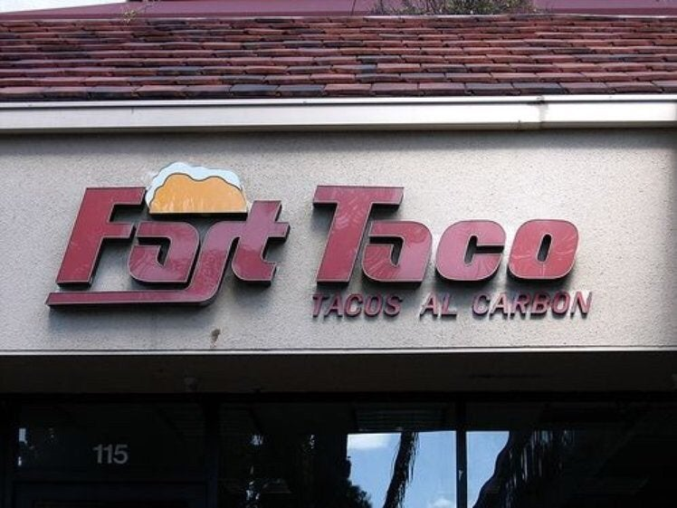{width="500"}

"Fast Taco"
:::

::: {.col}
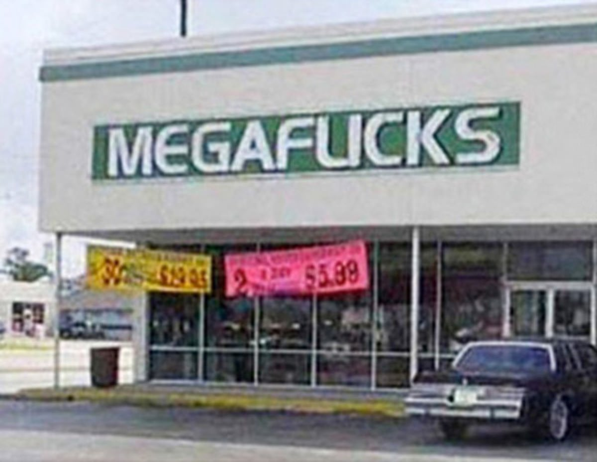{width="500"}

"Mega Flicks"
:::

---





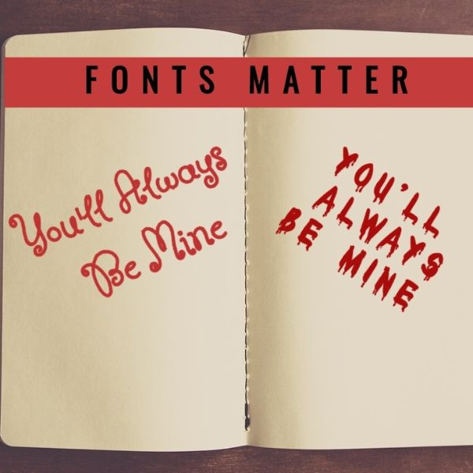{width="500"}

---




## Best resource on fonts:

## [practicaltypography.com](https://practicaltypography.com/)

---

## [Font families you should consider using]{.center}

::: {.col .font120 width="30%"}
<p style="font-family: Roboto;">Roboto</p>

<p style="font-family: Source Code Pro;">Source</p>

<p style="font-family: Fira Sans;">Fira</p>

<p style="font-family: Alegreya;">Alegreya</p>

<p style="font-family: Lato;">Lato</p>
:::

::: {.col width="70%"}
Download:

- Individually from https://fonts.google.com/
- All of these with [this zip file](https://github.com/emse-eda-gwu/2022-Fall/raw/main/content/fonts.zip)
:::

---

## Use fonts to create **hierarchy**

::: {.col}
```
# Hierarchy

## Hierarchy

### Hierarchy

#### Hierarchy
```
:::

::: {.col}
# Hierarchy

## Hierarchy

### Hierarchy

#### Hierarchy
:::

---

::: {.col}
Title<br>This is some text that goes into detail and explains a lot more about the topic described in the title. Here's some random Latin words: Lorem ipsum dolor sit amet, consectetur adipiscing elit, sed do eiusmod tempor incididunt ut labore et dolore magna aliqua.
:::

::: {.col}
:::

---

::: {.col}
# Size

This is some text that goes into detail and explains a lot more about the topic described in the title. Here's some random Latin words: Lorem ipsum dolor sit amet, consectetur adipiscing elit, sed do eiusmod tempor incididunt ut labore et dolore magna aliqua.
:::

::: {.col}
:::

---

::: {.col}
**Weight**

This is some text that goes into detail and explains a lot more about the topic described in the title. Here's some random Latin words: Lorem ipsum dolor sit amet, consectetur adipiscing elit, sed do eiusmod tempor incididunt ut labore et dolore magna aliqua.
:::

::: {.col}
:::

---

::: {.col}
[Color]{.red}

This is some text that goes into detail and explains a lot more about the topic described in the title. Here's some random Latin words: Lorem ipsum dolor sit amet, consectetur adipiscing elit, sed do eiusmod tempor incididunt ut labore et dolore magna aliqua.
:::

::: {.col}
:::

---

::: {.col}
Spacing

<br>

This is some text that goes into detail and explains a lot more about the topic described in the title. Here's some random Latin words: Lorem ipsum dolor sit amet, consectetur adipiscing elit, sed do eiusmod tempor incididunt ut labore et dolore magna aliqua.
:::

::: {.col}
:::

---

::: {.col}
Typeface

<p style="font-family: Alegreya;">
This is some text that goes into detail and explains a lot more about the topic described in the title. Here's some random Latin words: Lorem ipsum dolor sit amet, consectetur adipiscing elit, sed do eiusmod tempor incididunt ut labore et dolore magna aliqua.
</p>
:::

::: {.col}
:::

---

::: {.col}
<h2 style="font-family: Roboto Condensed; color: #a5442b;">Title</h2>
<h3 style="font-family: Alegreya;">Subtitle</h3>

<p style="font-family: Roboto;">
This is some text that goes into detail and explains a lot more about the topic described in the title. Here's some random Latin words: Lorem ipsum dolor sit amet, consectetur adipiscing elit, sed do eiusmod tempor incididunt ut labore et dolore magna aliqua.
</p>
:::

::: {.col}
:::

---

# [Use fonts with **same-height** numbers]{.center}

<br>

::: {.col .right width="35%"}
## "Oldstyle" (bad)

<br>

## Lining (good)
:::

::: {.col width="65%"}
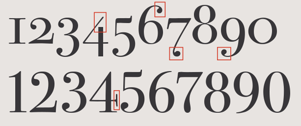{width="500"}
:::

---

# [Use fonts with **same-width** numbers]{.center}

<br>

::: {.col .right width="40%"}
## "Proportional" (bad)

<br>

## "Tabular" (good)
:::

::: {.col width="60%"}
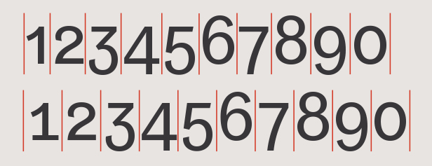{width="500"}
:::

---





# How to customize fonts in **ggplot**

---

## 1. Change the whole theme

For "Base R" themes, use `base_family`:

```{r}
#| eval: false

theme_minimal(base_family = "Roboto Condensed")
```

```{r}
#| eval: false

theme_bw(base_family = "Roboto Condensed")
```

<br>

For "cowplot" themes, use `font_family`:

```{r}
#| eval: false

theme_half_open(font_family = "Roboto Condensed")
```

```{r}
#| eval: false

theme_minimal_grid(font_family = "Roboto Condensed")
```

---

## 1. Change the whole theme font

Make the base plot

::: {.col .font70 width="60%"}
```{r}
#| code-line-numbers: "3"

mpg_plot <- ggplot(mtcars) +
  geom_point(aes(x = mpg, y = hp)) +
  theme_minimal(base_size = 15) +
  labs(
    x = "Fuel efficiency (mpg)",
    y = "Power (hp)",
    title = "Vehicle fuel efficiency vs. power",
    subtitle = "Select makes and models",
    caption = "Source: 1974 Motor Trend U.S. magazine.")
```
:::

::: {.col width="40%"}
```{r}
#| echo: false
#| fig-height: 5
#| fig-width: 6
#| fig-align: center

mpg_plot
```
:::

---

## 1. Change the whole theme font

Use `base_family` with base themes

::: {.col .font70 width="60%"}
```{r}
#| code-line-numbers: "3,4"

mpg_plot <- ggplot(mtcars) +
  geom_point(aes(x = mpg, y = hp)) +
  theme_minimal(
    base_family = 'Source Sans Pro',
    base_size = 15) +
  labs(
    x = "Fuel efficiency (mpg)",
    y = "Power (hp)",
    title = "Vehicle fuel efficiency vs. power",
    subtitle = "Select makes and models",
    caption = "Source: 1974 Motor Trend U.S. magazine.")
```
:::

::: {.col width="40%"}
```{r}
#| echo: false
#| fig-height: 5
#| fig-width: 6
#| fig-align: center

mpg_plot
```
:::

---

## 1. Change the whole theme font

Use `font_family` with cowplot themes

::: {.col .font70 width="60%"}
```{r}
#| code-line-numbers: "3,4"

mpg_plot <- ggplot(mtcars) +
  geom_point(aes(x = mpg, y = hp)) +
  theme_minimal_grid(
    font_family = 'Source Sans Pro',
    font_size = 15) +
  labs(
    x = "Fuel efficiency (mpg)",
    y = "Power (hp)",
    title = "Vehicle fuel efficiency vs. power",
    subtitle = "Select makes and models",
    caption = "Source: 1974 Motor Trend U.S. magazine.")
```
:::

::: {.col width="40%"}
```{r}
#| echo: false
#| fig-height: 5
#| fig-width: 6
#| fig-align: center

mpg_plot
```
:::

---

## 2. Adjust theme elements with `element_text()`

::: {.col width="60%"}
::: {.font70}
```{r}
#| code-line-numbers: "7,8,9"

mpg_plot <- ggplot(mtcars) +
  geom_point(aes(x = mpg, y = hp)) +
  theme_minimal_grid(
    font_family = 'Source Sans Pro',
    font_size = 15) +
  theme(
    plot.title = element_text(
      family = "Roboto Condensed",
      size = 20)) +
  labs(
    x = "Fuel efficiency (mpg)",
    y = "Power (hp)",
    title = "Vehicle fuel efficiency vs. power",
    subtitle = "Select makes and models",
    caption = "Source: 1974 Motor Trend U.S. magazine.")
```
:::

See theme components [here](https://ggplot2.tidyverse.org/reference/theme.html)
:::

::: {.col width="40%"}
```{r}
#| echo: false
#| fig-height: 5
#| fig-width: 6
#| fig-align: center

mpg_plot
```
:::

---

### 3. Adjust annotations:

### `geom_text()`, `geom_label()`, and `annotate()`

::: {.col .font70 width="60%"}
```{r}
#| eval: false
#| code-line-numbers: "11"

label <- "Higher power engines,
often come at the expense,
of fuel economy."

mpg_plot +
    geom_label(
      data = data.frame(
        x = 17, y = 270, label = label),
      aes(x = x, y = y, label = label),
      lineheight = .8, hjust = 0,
      family = 'Roboto Condensed')
```
:::

::: {.col width="40%"}
```{r}
#| echo: false
#| fig-height: 5
#| fig-width: 6
#| fig-align: center

label <- "Higher power engines,
often come at the expense,
of fuel economy."

mpg_plot +
    geom_label(
      data = data.frame(
        x = 17, y = 270, label = label),
      aes(x = x, y = y, label = label),
      lineheight = .8, hjust = 0,
      family = 'Roboto Condensed')
```
:::

---

## The [hrbrthemes](https://github.com/hrbrmstr/hrbrthemes) package:

### Great themes + great fonts

::: {.col width="60%"}
```{r}
#| eval: false
#| code-line-numbers: "1,13"

library(hrbrthemes)

mpg_plot <- ggplot(mtcars) +
  geom_point(aes(x = mpg, y = hp)) +
  labs(
    x = "Fuel efficiency (mpg)",
    y = "Power (hp)",
    title = "Vehicle fuel efficiency vs. power",
    subtitle = "Select makes and models",
    caption = "Source: 1974 Motor Trend U.S. magazine.")

mpg_plot +
  theme_ipsum()
```
:::

::: {.col width="40%"}
```{r}
#| echo: false
#| fig-height: 5
#| fig-width: 6
#| fig-align: center

library(hrbrthemes)

mpg_plot <- ggplot(mtcars) +
  geom_point(aes(x = mpg, y = hp)) +
  labs(
    x = "Fuel efficiency (mpg)",
    y = "Power (hp)",
    title = "Vehicle fuel efficiency vs. power",
    subtitle = "Select makes and models",
    caption = "Source: 1974 Motor Trend U.S. magazine.")

mpg_plot +
  theme_ipsum()
```
:::

---

## The [hrbrthemes](https://github.com/hrbrmstr/hrbrthemes) package:

### Great themes + great fonts

::: {.col}
```{r}
#| eval: false

mpg_plot +
  theme_ipsum()
```

```{r}
#| echo: false
#| fig-height: 5
#| fig-width: 6
#| fig-align: center

mpg_plot +
  theme_ipsum()
```
:::

::: {.col}
```{r}
#| eval: false

mpg_plot +
  theme_ipsum_rc()
```

```{r}
#| echo: false
#| fig-height: 5
#| fig-width: 6
#| fig-align: center

mpg_plot +
  theme_ipsum_rc()
```
:::

::: {.col}
```{r}
#| eval: false

mpg_plot +
  theme_ft_rc()
```

```{r}
#| echo: false
#| fig-height: 5
#| fig-width: 6
#| fig-align: center

mpg_plot +
  theme_ft_rc()
```
:::

---



```{r}
#| echo: false

countdown(
    minutes = 15,
    warn_when = 30,
    update_every = 15,
    top = 0,
    font_size = '2em'
)
```

## Your turn

::: {.col .font80}
Modify the fonts and annotations in the dumbbell chart to match the chart shown here. The main font is `'Roboto Condensed'`.

Once you've recreated the plot, try other fonts and themes, such as:

- The `'Source Sans Pro'` font.
- The `'Lato'` font.
- The `theme_ipsum()` theme from the `hrbrthemes` library.

Hint: Use `annotate()` to insert the year labels at the top:

  - 1970: `x = 9`, `y = 10.5`
  - 2017: `x = 40`, `y = 10.5`
:::

::: {.col}
```{r}
#| echo: false
#| fig-height: 6
#| fig-width: 7
#| fig-align: center

milk_summary_dumbbell %>%
  ggplot(aes(x = milk_produced, y = state)) +
  geom_line(
    aes(group = state),
    color = 'lightblue', size = 1) +
  geom_point(
    aes(color = year), size = 2.5) +
  annotate(geom = "text",
    x = 8, y = 10.5, label = '1970',
    color = 'lightblue', size = 5,
    family = 'Roboto Condensed') +
  annotate(geom = "text",
    x = 42, y = 10.5, label = '2017',
    color = 'steelblue', size = 5,
    family = 'Roboto Condensed') +
  scale_color_manual(values = c('lightblue', 'steelblue')) +
  coord_cartesian(clip = 'off') +
  theme_minimal_vgrid(font_family = 'Roboto Condensed') +
  theme(
    axis.line.y = element_blank(),
    axis.ticks = element_blank(),
    legend.position = 'none',
    plot.margin = margin(0.1, 1, 0.1, 0.1, "cm")) +
  labs(
    x = 'Milk produced (billion lbs)',
    y = 'State',
    color = 'Year',
    title = 'Top 10 milk producing states\n')
```
:::

---

```{r}
#| echo: false
#| results: asis

agenda(5)
```

---

## [Use themes to change global look]{.center}

::: {.col}
## Change theme in YAML header

```yaml
---
title: Your title
author: Author name
toc: true
format:
  html:
    theme: united
---
```
:::

::: {.col .fragment}
## List of themes

https://quarto.org/docs/output-formats/html-themes.html
:::

---

## Use Quarto extensions

https://quarto.org/docs/extensions/

Some personal favoriates:

- [lightbox](https://quarto-ext.github.io/lightbox/)
- [elevator](https://m.canouil.dev/quarto-elevator/)
- [webR](https://quarto-webr.thecoatlessprofessor.com/)

---

# Set a global chart theme

```{r}
#| eval: false

theme_set(theme_minimal_grid())
```

---




# Check out [these Quarto tricks](https://www.productive-r-workflow.com/quarto-tricks), by Yan Holtz

---




# Reminder: [Mini 3](https://eda.seas.gwu.edu/2026-Fall/mini/3-redesign.html) due 11/10

