

```{r}
#| include: false

agenda_items <- c(
  "Plotting maps",
  "Adding data to maps",
  "Projections"
)

source('setup.R')
```

---



# Quiz 4

```{r}
#| echo: false

countdown(
  minutes = 12,
  warn_when = 30,
  update_every = 1,
  top = 0,
  right = 0,
  font_size = "3em"
)
```

::: {.col}
## Write your name on the quiz!

## Rules:

- Work alone; no outside help of any kind is allowed.
- No calculators, no notes, no books, no computers, no phones.
:::

::: {.col}
<br>

{width="400"}
:::

---

## Today's data

```{r}
#| eval: false

milk_production <- read_csv(here::here('data', 'milk_production.csv'))
us_coffee_shops <- read_csv(here::here('data', 'us_coffee_shops.csv'))
```

## New packages:

```{r}
#| eval: false

install.packages('maps')
install.packages('mapproj')
install.packages('sf')
install.packages('rnaturalearth')
devtools::install_github("ropensci/rnaturalearthhires")
devtools::install_github("ropensci/rnaturalearthdata")
```

---

```{r}
#| echo: false
#| results: asis

agenda(0)
```

---

```{r}
#| echo: false
#| results: asis

agenda(1)
```

<!--
How to do it:
https://www.r-graph-gallery.com/map.html
-->

---

# How to make a map

#### Step 1: Load a shape file

a. Use a library

b. Read in a shape file

. . .

#### Step 2: Plot the shape file

a. Polygon data: `geom_polygon()`

b. Simple Features data: `geom_sf()`

---

## Polygon maps

::: {.col .font70 width="60%"}
Get the "World" shape file

```{r}
#| code-line-numbers: "3"

library(ggplot2)

world <- map_data("world")
head(world)
```
:::

::: {.col width="40%"}
:::

---

## Polygon maps

::: {.col .font70 width="60%"}
Get the "World" shape file

```{r}
#| code-line-numbers: "3"

library(ggplot2)

world <- map_data("world")
```

Make the plot with `geom_polygon()`

```{r}
#| eval: false
#| code-line-numbers: "2,3"

ggplot(world) +
  geom_polygon(
    aes(x = long, y = lat, group = group),
    fill = "grey90", color = "grey60"
  )
```
:::

::: {.col width="40%"}
<br>

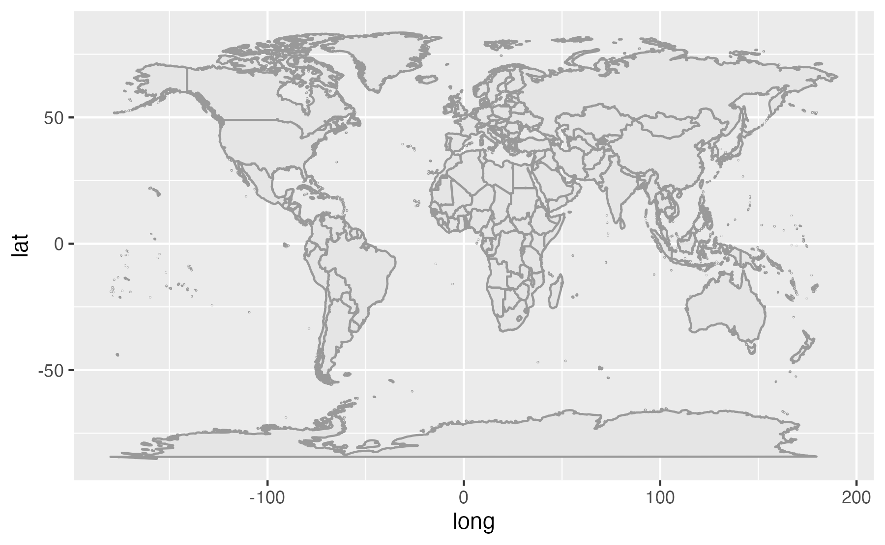
:::

---

## Polygon maps

::: {.col .font70 width="60%"}
Get the "US States" shape file

```{r}
#| code-line-numbers: "3"

library(ggplot2)

us_states <- map_data("state")
```

Make the plot with `geom_polygon()`

```{r}
#| eval: false
#| code-line-numbers: "2,3"

ggplot(us_states) +
  geom_polygon(
    aes(x = long, y = lat, group = group),
    fill = "grey90", color = "grey60"
  )
```
:::

::: {.col width="40%"}
<br>

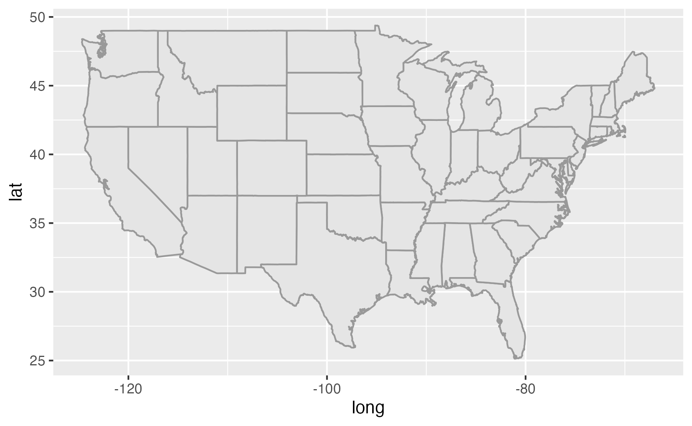
:::

---

::: {.col width="80%"}
{width="100%"}
:::

::: {.col width="20%"}
Simple Features package: {sf}

Art by<br>[Allison Horst](https://allisonhorst.com/)
:::

---

### Simple Features (sf) maps

::: {.col .font70 width="40%"}
Library data from [Natural Earth](http://www.naturalearthdata.com/downloads/50m-cultural-vectors/)

```{r}
#| eval: false
#| code-line-numbers: "4,5,6,7"

library(rnaturalearth)
library(rnaturalearthdata)

world <- ne_countries(
  scale = "medium",
  returnclass = "sf"
)

world %>%
    select(name, geometry) %>%
    head()
```
:::

::: {.col .font70 .fragment width="60%"}
```{r}
#| echo: false

library(rnaturalearth)
library(rnaturalearthdata)

world <- ne_countries(
  scale = "medium",
  returnclass = "sf"
)

world %>%
    select(name, geometry) %>%
    head()
```
:::

---

## Simple Features (sf) maps

::: {.col .font70 width="60%"}
Get the "World" shape file

```{r}
library(rnaturalearth)
library(rnaturalearthdata)

world <- ne_countries(
  scale = "medium",
  returnclass = "sf"
)
```

Make the plot with `geom_sf()`

```{r}
#| eval: false
#| code-line-numbers: "4"

library(sf)

ggplot(data = world) +
  geom_sf(fill = "grey90", color = "grey60")
```
:::

::: {.col width="40%"}
<br>

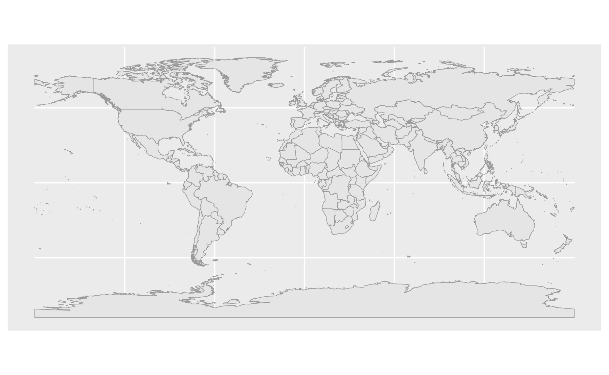
:::

---

## Simple Features (sf) maps

::: {.col .font70}
Get the "US States" shape file

```{r}
library(rnaturalearth)
library(rnaturalearthdata)

us_states <- ne_states(
  country = 'united states of america',
  returnclass = 'sf'
)
```
:::

::: {.col}
:::

---

## Simple Features (sf) maps

::: {.col .font70}
Get the "US States" shape file

```{r}
library(rnaturalearth)
library(rnaturalearthdata)

us_states <- ne_states(
  country = 'united states of america',
  returnclass = 'sf'
)
```

Make the plot with `geom_sf()`

```{r}
#| eval: false
#| code-line-numbers: "4"

library(sf)

ggplot(data = us_states) +
    geom_sf(fill = "grey90", color = "grey60")
```
:::

::: {.col}
<br>

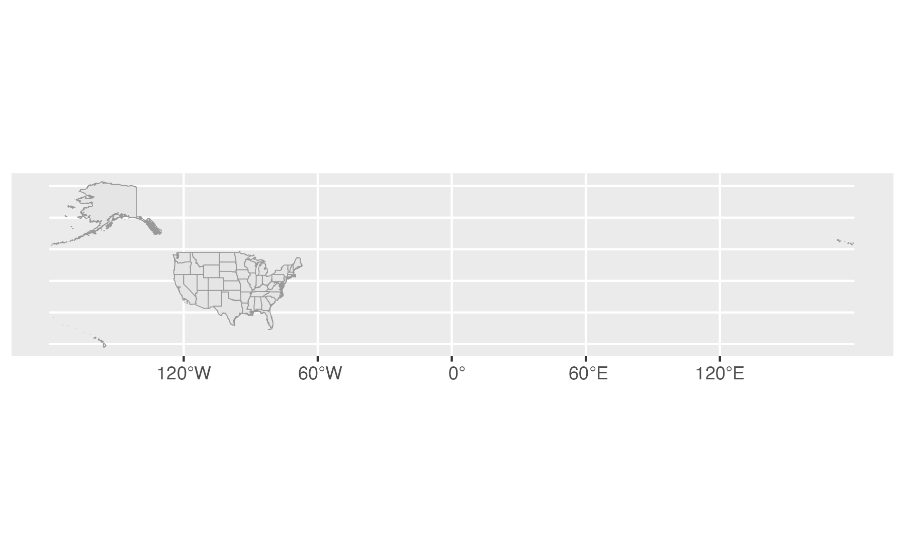
:::

---

## Simple Features (sf) maps

::: {.col .font70 width="60%"}
Get the **Continental** "US States" shape file

```{r}
#| code-line-numbers: "7"

library(rnaturalearth)
library(rnaturalearthdata)

us_states_cont <- ne_states(
      country = 'united states of america',
      returnclass = 'sf'
    ) %>%
    filter(! name %in% c('Alaska', 'Hawaii'))
```

Make the plot with `geom_sf()`

```{r}
#| eval: false
#| code-line-numbers: "4"

library(sf)

ggplot(data = us_states_cont) +
  geom_sf(fill = "grey90", color = "grey60")
```
:::

::: {.col width="40%"}
<br>

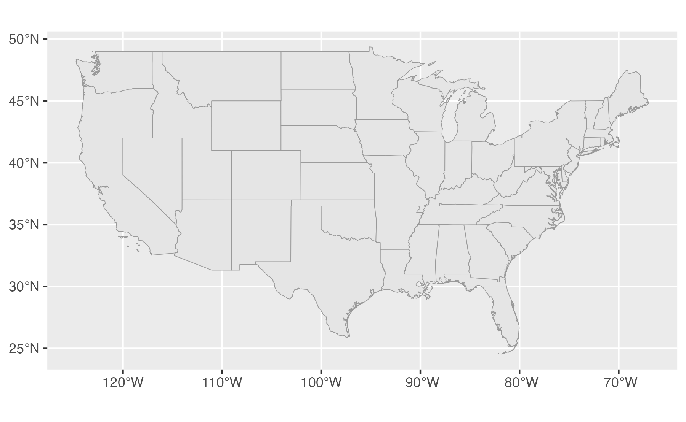
:::

---

## Inset Hawaii and Alaska

::: {.col .font70 width="60%"}
Get the shape file from {tigris} package

```{r}
library(tigris)

us_sf <- tigris::states(class = "sf", cb = TRUE) %>%
    shift_geometry() %>%
    filter(GEOID < 60)
```

Make the plot with `geom_sf()`

```{r}
#| eval: false

us_sf %>%
    ggplot() +
    geom_sf()
```
:::

::: {.col width="40%"}
<br>

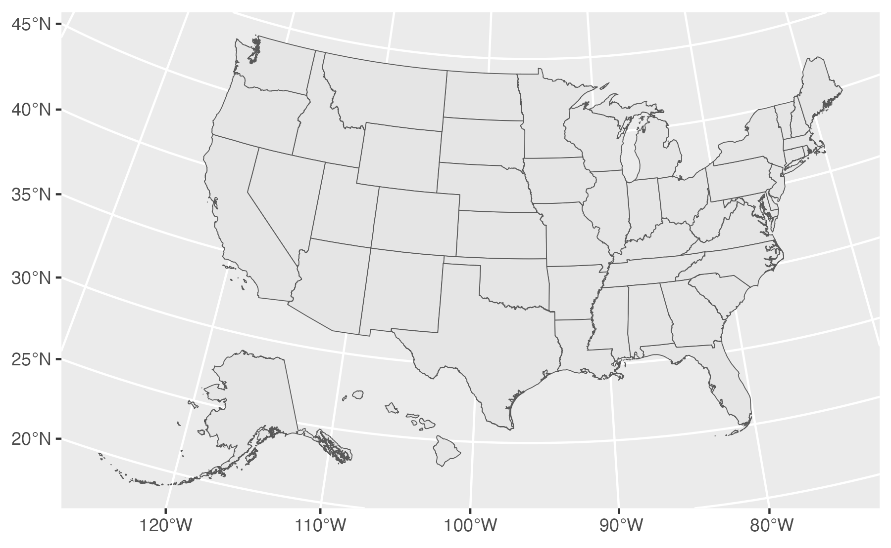
:::

---

## The `maps` package

::: {.col .font70 width="60%"}
Includes data on:

- World: world, world.cities, lakes
- US: states, county, state, usa
- France: france
- Italy: italy
- New zealand: nz

Example:

```{r}
#| eval: false
#| code-line-numbers: "3,4,7"

library(maps)

us_counties <- st_as_sf(
    map("county", plot = FALSE, fill = TRUE))

ggplot(data = us_counties) +
    geom_sf(fill = 'grey90', color = 'grey60')
```
:::

::: {.col width="40%"}
<br>

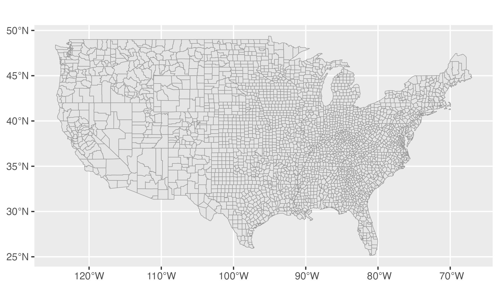
:::

---

## Simple Features (sf) maps: `st_read()`

::: {.col .font70 width="60%"}
Read in the "World" shape file from [Natural Earth](http://www.naturalearthdata.com/downloads/50m-cultural-vectors/)

```{r}
#| message: false
#| code-line-numbers: "3"

library(sf)

world <- st_read(here::here(
    'data', 'natural_earth_countries',
    'ne_50m_admin_0_countries.shp')) %>%
    clean_names()
```
:::

::: {.col width="40%"}
:::

---

## Simple Features (sf) maps: `st_read()`

::: {.col .font70 width="60%"}
Read in the "World" shape file

```{r}
#| message: false
#| code-line-numbers: "3"

library(sf)

world <- st_read(here::here(
  'data', 'natural_earth_countries',
  'ne_50m_admin_0_countries.shp')) %>%
  clean_names()
```

```{r}
#| eval: false
#| code-line-numbers: "2"

ggplot(data = world) +
  geom_sf(fill = "grey90", color = "grey60")
```
:::

::: {.col width="40%"}
<br>


:::

---

## Simple Features (sf) maps: `st_read()`

::: {.col .font70 width="60%"}
Read in the "Central Park" shape file [[source]](https://github.com/malcolmbarrett/designing_ggplots)

```{r}
#| message: false

library(sf)

central_park <- st_read(here::here(
  'data', 'central_park', 'CentralPark.shp'))
```

```{r}
#| eval: false

ggplot(data = central_park) +
  geom_sf(color = 'grey75')
```
:::

::: {.col width="40%"}
<br>

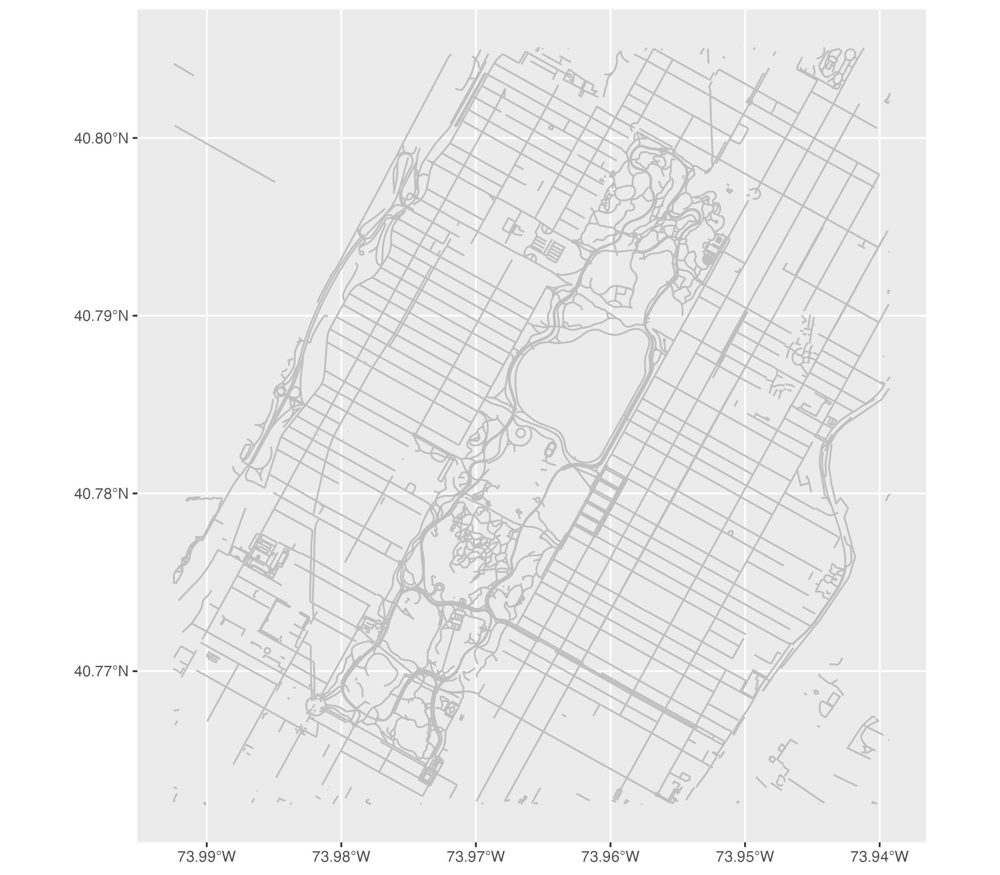
:::

---



```{r}
#| echo: false

countdown(
  minutes = 10,
  warn_when = 30,
  update_every = 15,
  top = 0,
  font_size = '2em'
)
```

## Your turn

Use the **rnaturalearth** library to extract and plot the shape files for China and Africa:

<br>

::: {.col}
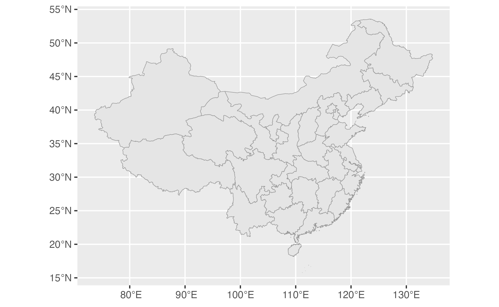
:::

::: {.col}
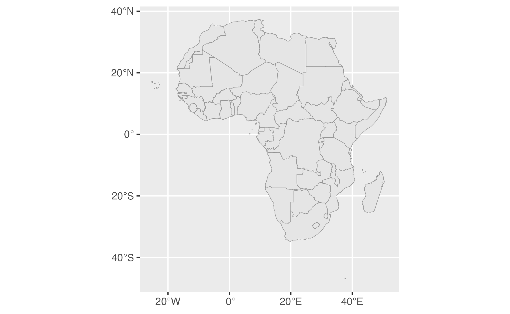
:::

---

```{r}
#| echo: false
#| results: asis

agenda(2)
```

<!--
Squirrels and dogs plots:
https://designing-ggplots.netlify.com/#71

Hexmaps:
- Use https://www.r-graph-gallery.com/hexbin-map.html
- https://www.r-graph-gallery.com/328-hexbin-map-of-the-usa.html
- Practice with wind data?
-->

---





# First rule of adding data to maps:

# [Do you need to make a map?]{.red}

---




::: {.col width="70%"}
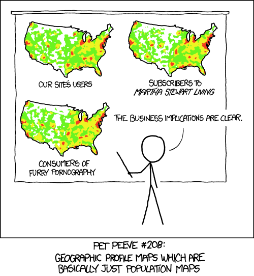{width="550"}

[https://xkcd.com/1138/]{.left}
:::

::: {.col width="30%"}
# Not all maps are useful...
:::

---

::: {.col width="70%"}
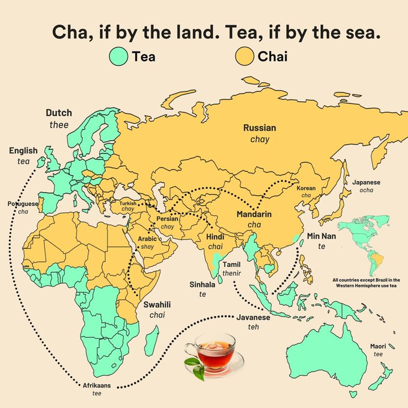{width="600"}

[https://twitter.com/pwang/status/1387228573896003585]{.left}
:::

::: {.col width="30%"}
# ...but some maps are
:::

---





# 1. [Choropleth maps]{.orange}
# 2. Point maps

---



[Choropleth](https://en.wikipedia.org/wiki/Choropleth_map) - from Greek:

- χῶρος "choros" (area/region)
- πλῆθος "plethos" (multitude)

::: {.center}
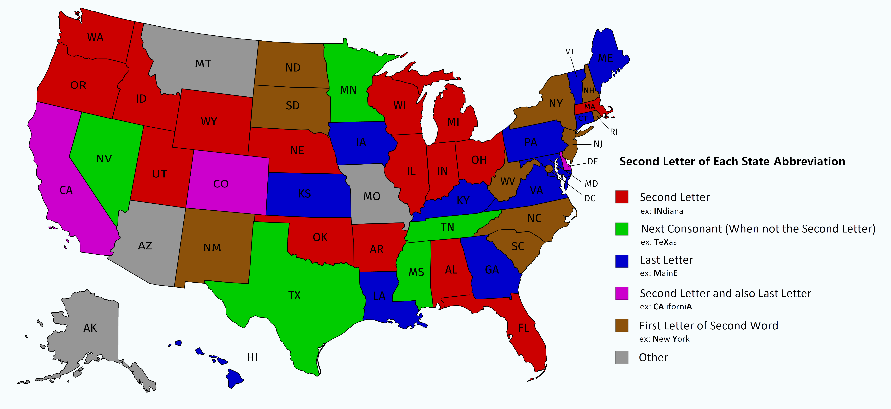{width="880"}
:::

[From reddit: [r/dataisbeautiful by u/GaudyAudi](https://www.reddit.com/r/dataisbeautiful/comments/fgq3d3/oc_us_state_abbreviation_conventions/)]{.font70}

---





# Choropleth maps are easily misleading

---





## Number of events != Number of events **per capita**

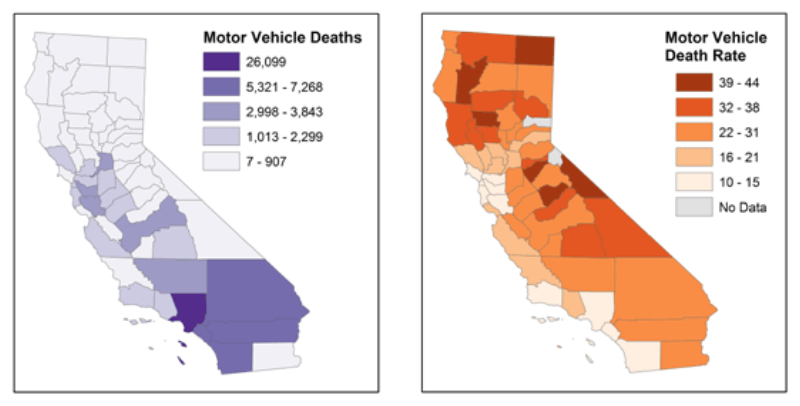{width="800"}

---




## Manipulating fill scale produces wildly different maps

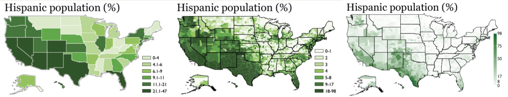

---




## Manipulating fill scale produces wildly different maps

<br>

::: {.col}
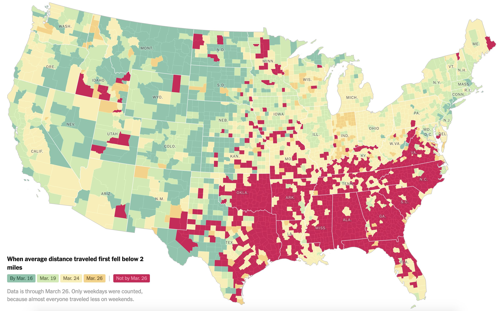{width="500"}

<br><br>

[[Source: [New York Times](https://www.nytimes.com/interactive/2020/04/02/us/coronavirus-social-distancing.html)]{.font70}]{.left}
:::

::: {.col}
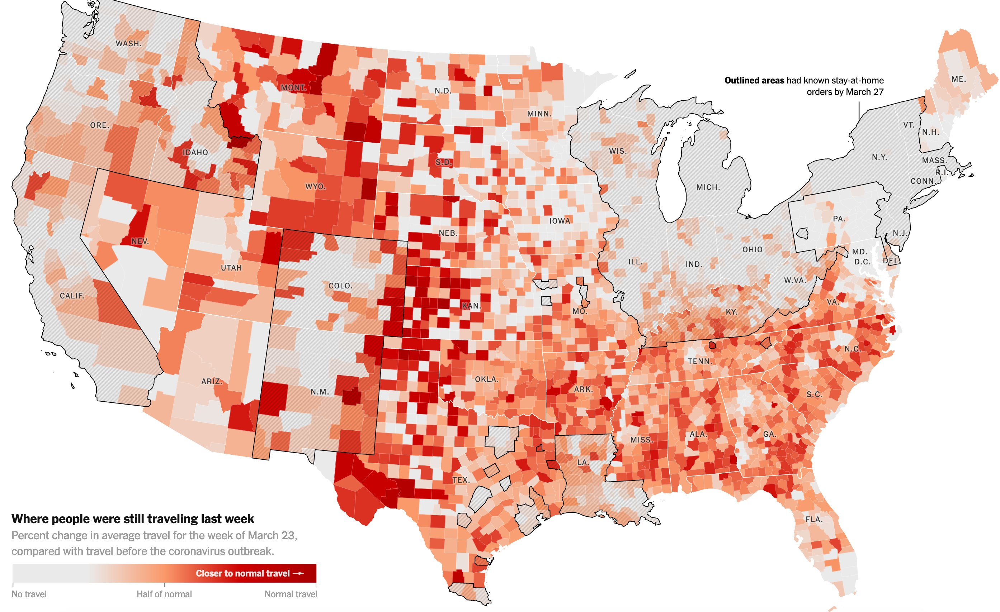{width="500"}
:::

---




### Land doesn't vote - people vote

{width="600"}

By [David Zumbach](https://twitter.com/DavidZumbach/status/1344547411985911808?s=19)

---




# Land doesn't vote - people vote

Election maps from: http://www-personal.umich.edu/~mejn/election/2016/

::: {.col}
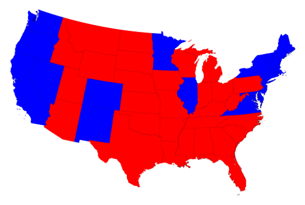
:::

::: {.col}
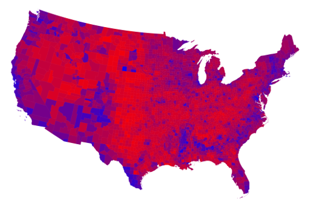
:::

::: {.col}
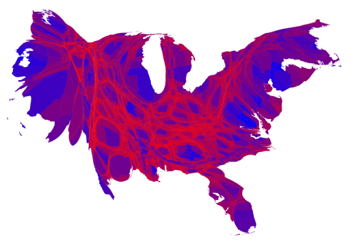
:::

---



::: {.center}
{width="700"}
:::

[[https://xkcd.com/2439/]{.font70}]{.left}

---




## Easy to lie with fake news

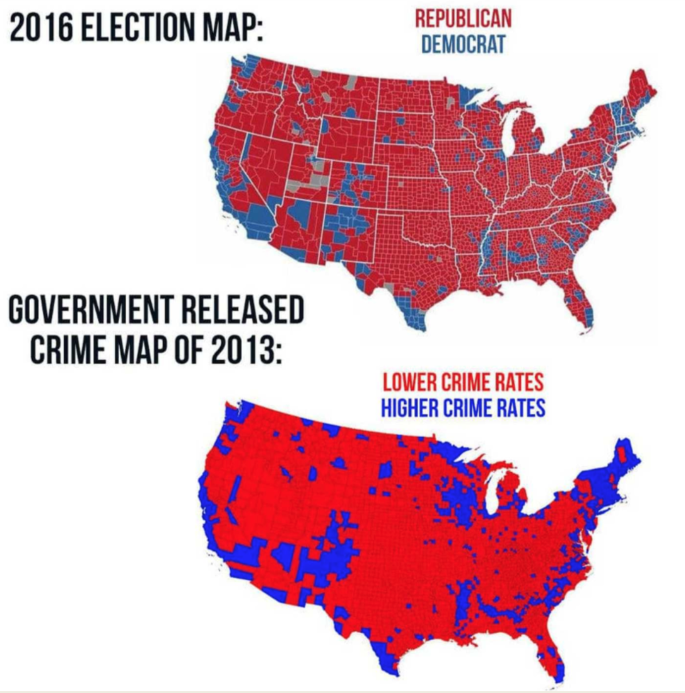{width="450"}

. . .

Bottom map is actually [this map](http://www-personal.umich.edu/~mejn/election/2012/countymaprb1024.png) of the 2012 election

---





## (here is what actual crime rates look like)

::: {.col}
2016 Election map [[source]](http://www-personal.umich.edu/~mejn/election/2016/)


:::

::: {.col}
2014 Crime map [[source]](https://www.washingtonpost.com/graphics/national/crime-rates-by-county/)

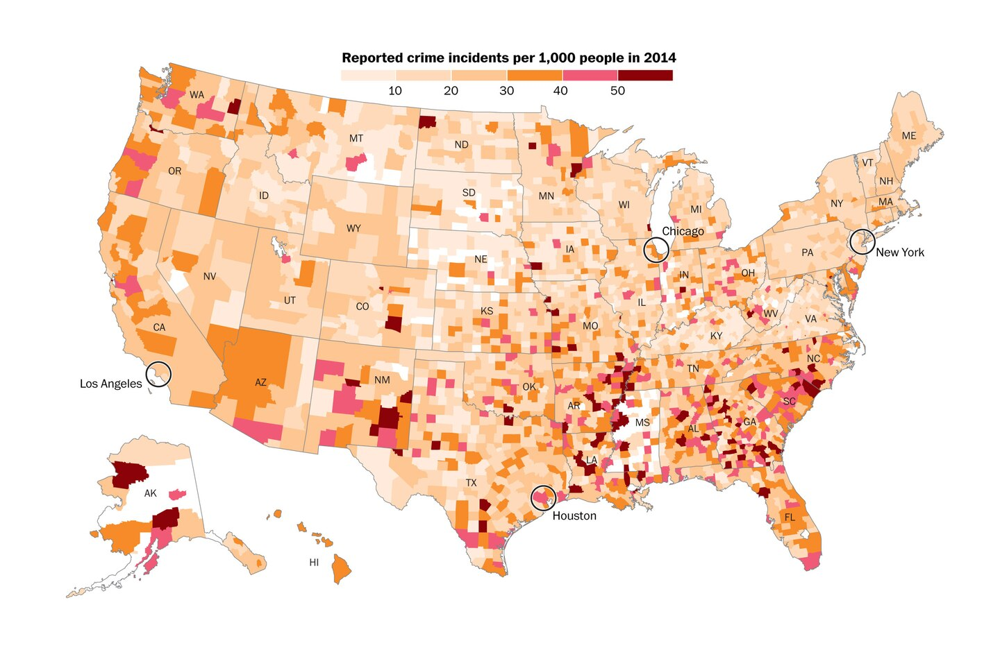
:::

---




# A choropleth alternative: hex maps

::: {.col}
1994 Simpson Diversity Index in US Schools

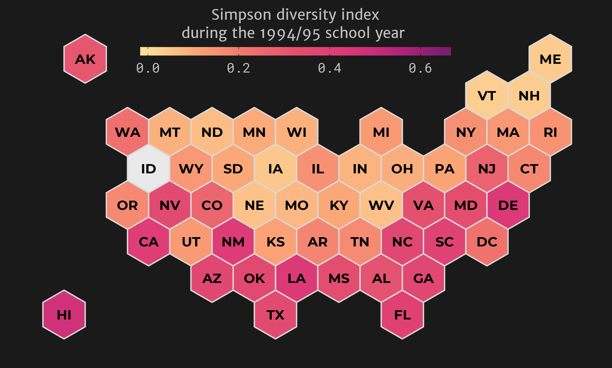

[https://github.com/malcolmbarrett/designing_ggplots]{.font80}
:::

::: {.col}
2016 Electoral College

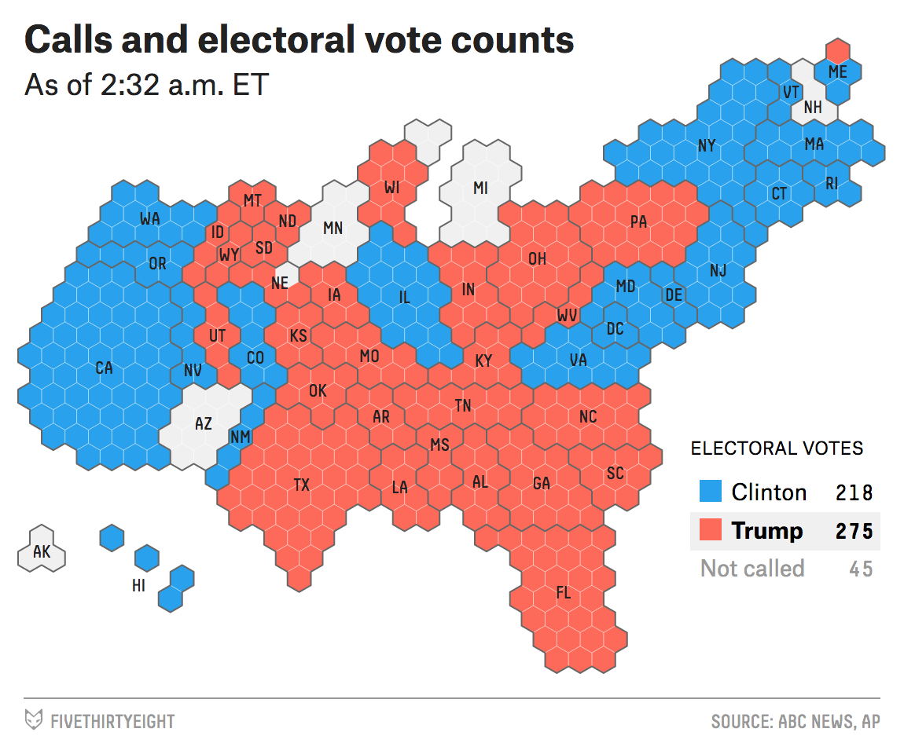{width="450"}

https://fivethirtyeight.com/
:::

---



## How to make a choropleth map

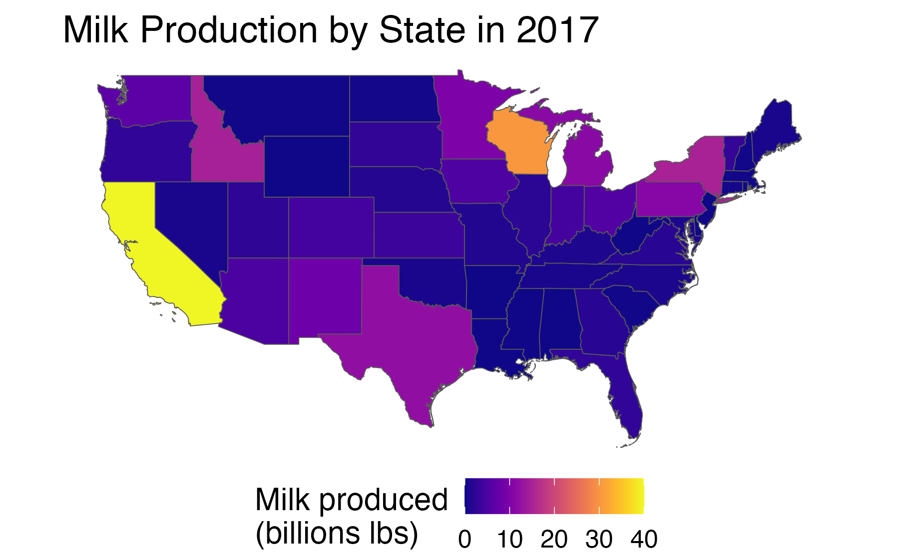{width="780"}

---

## How to make a choropleth map

::: {.col .font70 width="60%"}
Get the "fill" data

```{r}
milk_2017 <- milk_production %>%
    filter(year == 2017) %>%
    select(name = state, milk_produced) %>%
    mutate(milk_produced = milk_produced / 10^9)
```

Get the "map" data

```{r}
#| code-line-numbers: "5"

us_states <- ne_states(
    country = 'united states of america',
    returnclass = 'sf') %>%
    filter(! name %in% c('Alaska', 'Hawaii')) %>%
    left_join(milk_2017, by = 'name')
```
:::

::: {.col .fragment width="40%"}
```{r}
us_states %>%
    select(name, milk_produced) %>%
    head()
```
:::

---

## How to make a choropleth map

::: {.col .font70 width="60%"}
```{r}
#| eval: false
#| code-line-numbers: "2"

ggplot(us_states) +
  geom_sf(aes(fill = milk_produced)) +
  scale_fill_viridis(
    option = "plasma",
    limits = c(0, 40)) +
  theme_void(base_size = 15) +
  theme(legend.position = 'bottom') +
  labs(
    fill = 'Milk produced\n(billions lbs)',
    title = 'Milk Production by State in 2017'
  )
```
:::

::: {.col width="40%"}
<br>


:::

---

## How to make a choropleth map

::: {.col .font70 width="60%"}
```{r}
#| eval: false
#| code-line-numbers: "4"

ggplot(us_states) +
  geom_sf(aes(fill = milk_produced)) +
  scale_fill_viridis(
    trans = 'sqrt',
    option = "plasma",
    limits = c(0, 40)) +
  theme_void(base_size = 15) +
  theme(legend.position = 'bottom') +
  labs(
    fill = 'Milk produced\n(billions lbs)',
    title = 'Milk Production by State in 2017'
  )
```
:::

::: {.col width="40%"}
Non-linear scale:

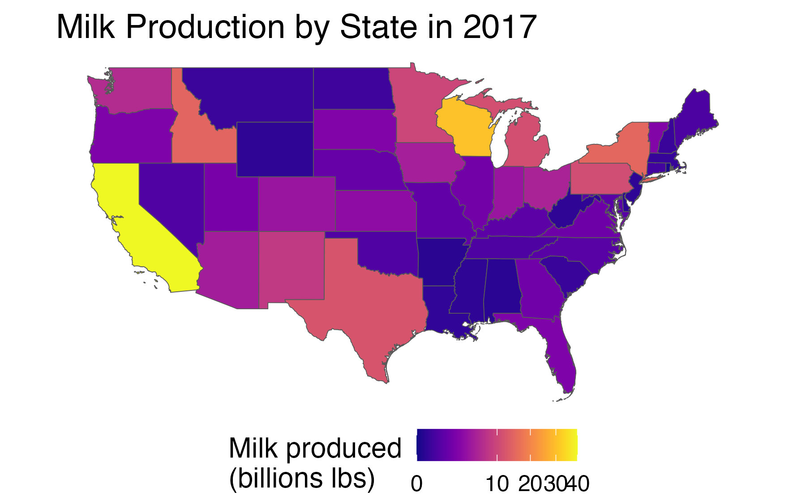
:::

---





# 1. Choropleth maps
# 2. [Point maps]{.orange}

---



# Points as locations

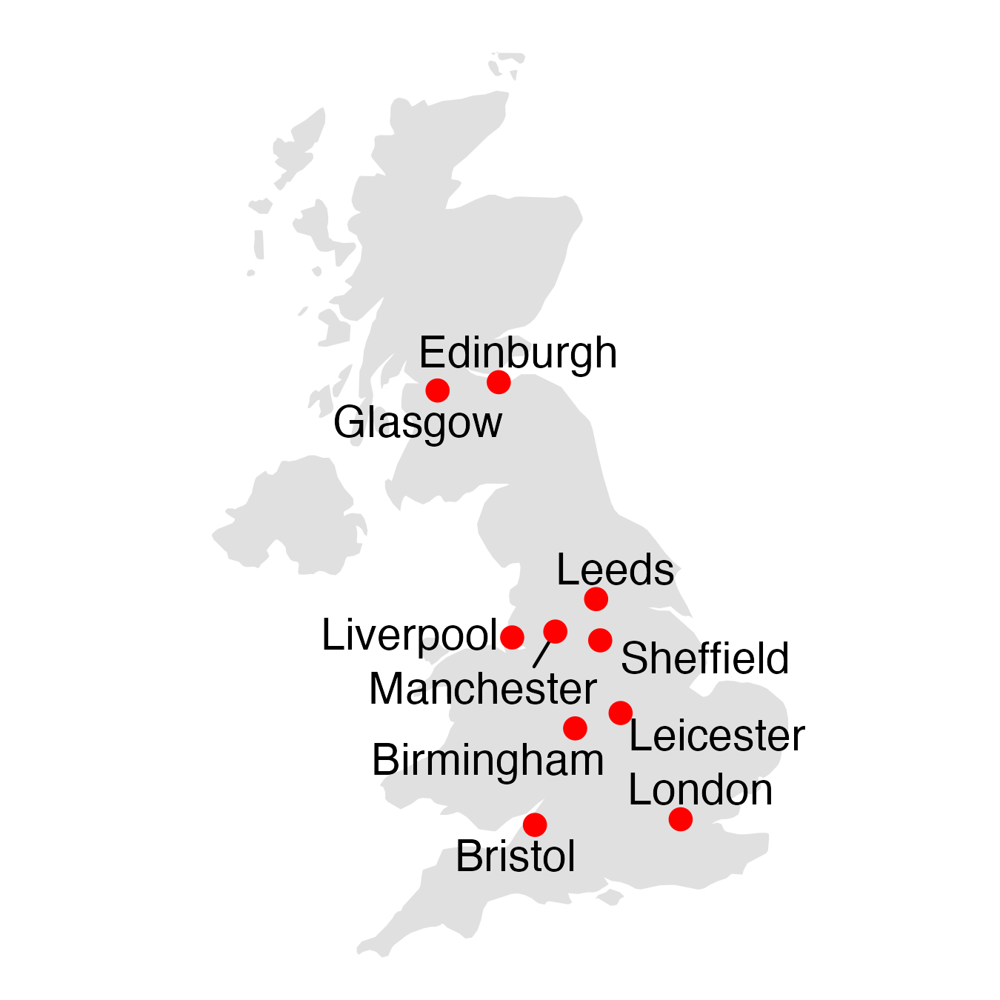{width="450"}

---



# Points encoding a variable

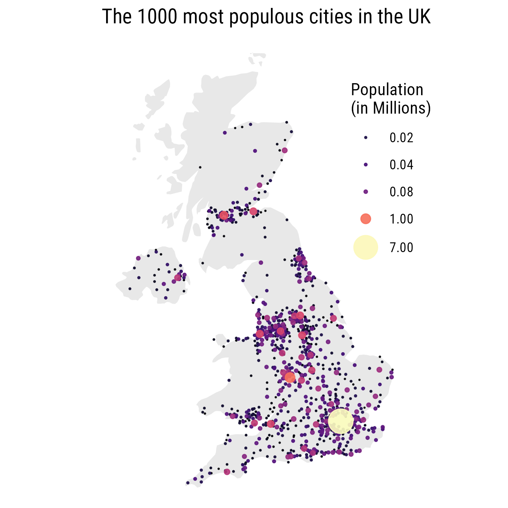{width="450"}

---



# For point size, use **area**, not radius

# $Area = \pi r^2$

::: {.col}
## Radius
:::

::: {.col}
## Area
:::

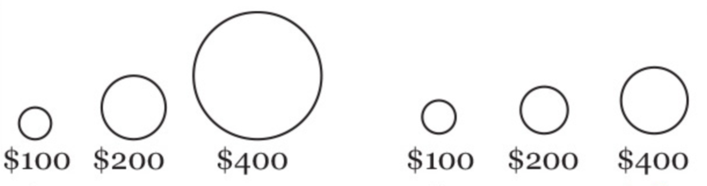{width="1000"}

---



::: {.col}
## Radius

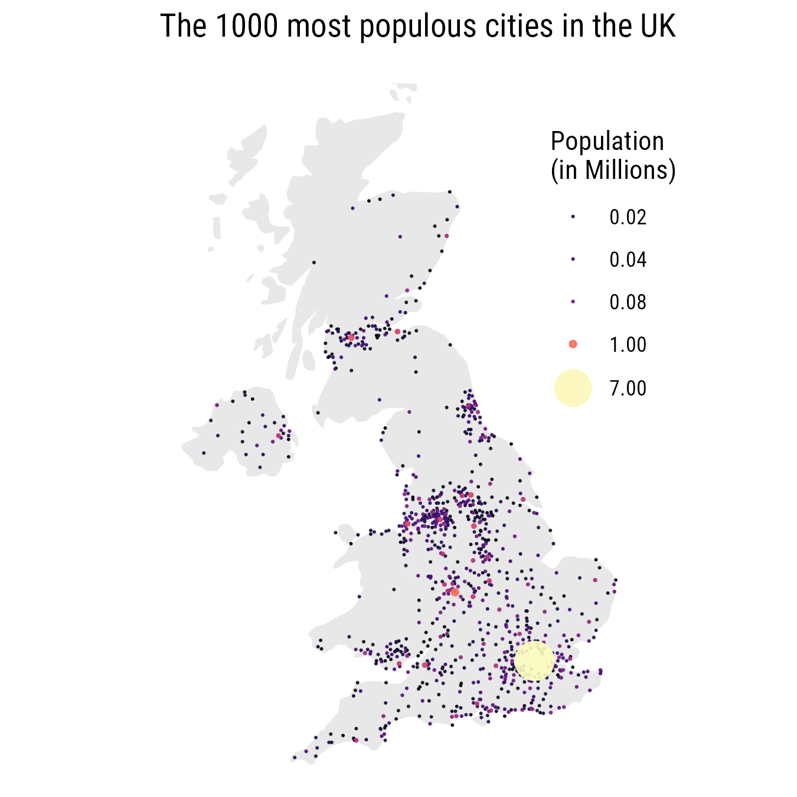{width="500"}
:::

::: {.col}
## Area

{width="500"}
:::

---



## How to add points to a map

{width="750"}

---

## How to add points to a map

::: {.col .font70}
Load the continental US shape file

```{r}
#| eval: false

us_states_cont <- ne_states(
    country = 'united states of america',
    returnclass = 'sf') %>%
    filter(! name %in% c('Alaska', 'Hawaii'))
```

Read in the coffee shop data

```{r}
us_coffee_shops  <- read_csv(here::here(
    'data', 'us_coffee_shops.csv'))

# Only keep data in continental US
us_coffee_shops <- us_coffee_shops %>%
    filter(
      lat > 22,    lat < 50,
      long > -150, long < -66
    )
```
:::

::: {.col .fragment}
```{r}
head(us_coffee_shops)
```
:::

---

## How to add points to a map

::: {.col .font70 width="60%"}
Plot coffee shop locations over map

```{r}
#| eval: false
#| code-line-numbers: "3,4,5,6,7"

ggplot() +
  geom_sf(data = us_states_cont) +
  geom_point(
    data = us_coffee_shops,
    aes(x = long, y = lat, color = name),
    size = 0.3
  ) +
  theme_void(base_size = 15) +
  theme(legend.position = 'bottom') +
  guides(color = guide_legend(
    # Move legend title to top
    title.position = "top",
    # Increase legend point size
    override.aes = list(size = 3))) +
  labs(
    color = 'Coffee shop',
    title = 'Coffee Shops in the US'
  )
```
:::

::: {.col width="40%"}
<br>


:::

---



```{r}
#| echo: false

countdown(
  minutes = 15,
  warn_when = 30,
  update_every = 15,
  top = 0,
  font_size = '2em'
)
```

## Your turn

::: {.font90}
Create this map of squirrels in NYC's Central Park using this data from the [Squirrel Census](https://www.thesquirrelcensus.com/):

- The `CentralPark.shp` file in the `data/central_park` folder.
- The `nyc_squirrels.csv` file in the `data` folder.

Hint: The color is mapped to the `primary_fur_color` variable

(More about the Squirrel Census [here](https://www.nytimes.com/interactive/2020/01/08/nyregion/central-park-squirrel-census.html))
:::

::: {.center}
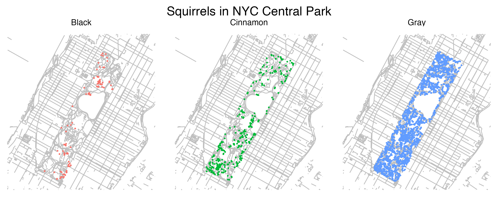{width="700"}
:::

---




```{r}
#| echo: false

countdown(
  minutes = 5,
  warn_when = 30,
  update_every = 1,
  top = 0,
  right = 0,
  font_size = '2em'
)
```

### Intermission

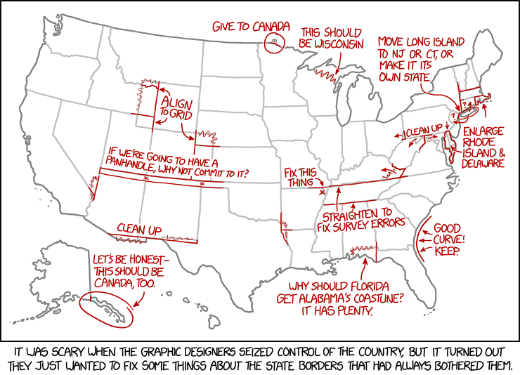{width="700"}

---

```{r}
#| echo: false
#| results: asis

agenda(3)
```

<!--
Content from Andrew's slides:
https://datavizf17.classes.andrewheiss.com/class/07-class/

Centroids with labels:
https://www.r-spatial.org/r/2018/10/25/ggplot2-sf-2.html
-->

---



## What's a map projection?

<iframe width="560" height="315" src="https://www.youtube.com/embed/kIID5FDi2JQ?si=VydsCWYDsk_33O1D" title="YouTube video player" frameborder="0" allow="accelerometer; autoplay; clipboard-write; encrypted-media; gyroscope; picture-in-picture; web-share" referrerpolicy="strict-origin-when-cross-origin" allowfullscreen></iframe>

---

# What is the best projection?...it depends

<br>

# [Compare country sizes](https://thetruesize.com/)

---

## Using projections

To modify the projection of a map, use `coord_sf(crs = st_crs(XXXX))`

```{r}
#| eval: false

world <- ne_countries(scale = "medium", returnclass = "sf")
```

::: {.col .font60 .fragment}
[Default (long-lat)]{.center}

```{r}
#| eval: false

ggplot(data = world) +
    geom_sf()
```


:::

::: {.col .font60 .fragment}
[Robinson projection]{.center}

```{r}
#| eval: false
#| code-line-numbers: "3"

ggplot(data = world) +
    geom_sf() +
    coord_sf(crs = "ESRI:54030")
```

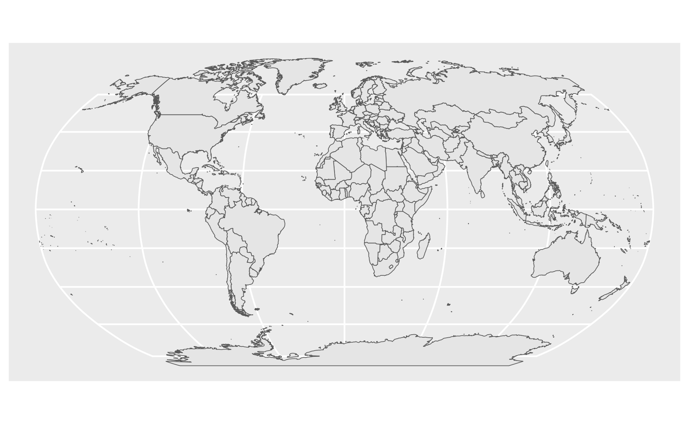
:::

::: {.col .font60 .fragment}
[Mollweide projection]{.center}

```{r}
#| eval: false
#| code-line-numbers: "3"

ggplot(data = world) +
    geom_sf() +
    coord_sf(crs = "ESRI:54009")
```

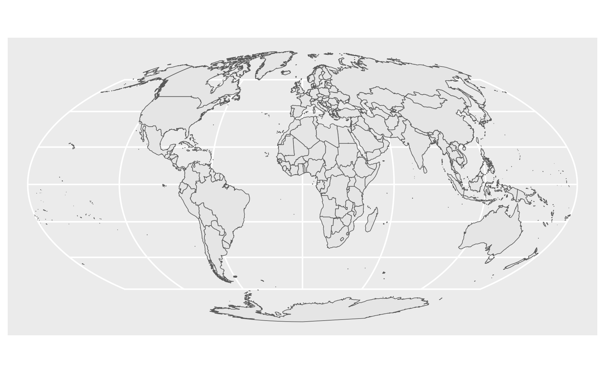
:::

---

## Common Projections

ggplot layer:

```{r}
#| eval: false

coord_sf(crs = "ESRI:XXXX")
```

::: {.col}
**World**

Code  | Projection
------|---------------------------------------------------
**`"ESRI:54030"`** | **Robinson**
`"ESRI:54002"` | Equidistant cylindrical
`"ESRI:54004"` | Mercator
`"ESRI:54008"` | Sinusoidal
`"ESRI:54009"` | Mollweide
:::

::: {.col}
**United States**

Code   | Projection
-------|---------------------------------------------------
**`"ESRI:102003"`** | **Albers**
`"ESRI:102004"` | Lambert Conformal Conic
`4269`          | NAD 83
:::

---

## US projections

```{r}
#| eval: false

us_states_cont <- ne_states(country = 'united states of america',
    returnclass = 'sf') %>%
    filter(! name %in% c('Alaska', 'Hawaii'))
```

::: {.col .font70}
NAD 83 projection

```{r}
#| eval: false
#| code-line-numbers: "3"

ggplot(data = world) +
    geom_sf() +
    coord_sf(crs = 4269)
```

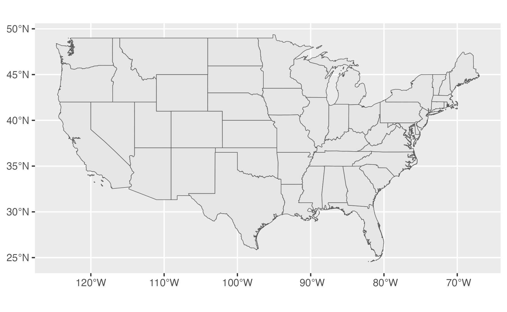
:::

::: {.col .font70}
Mercator

```{r}
#| eval: false
#| code-line-numbers: "3"

ggplot(data = world) +
    geom_sf() +
    coord_sf(crs = "ESRI:54004")
```

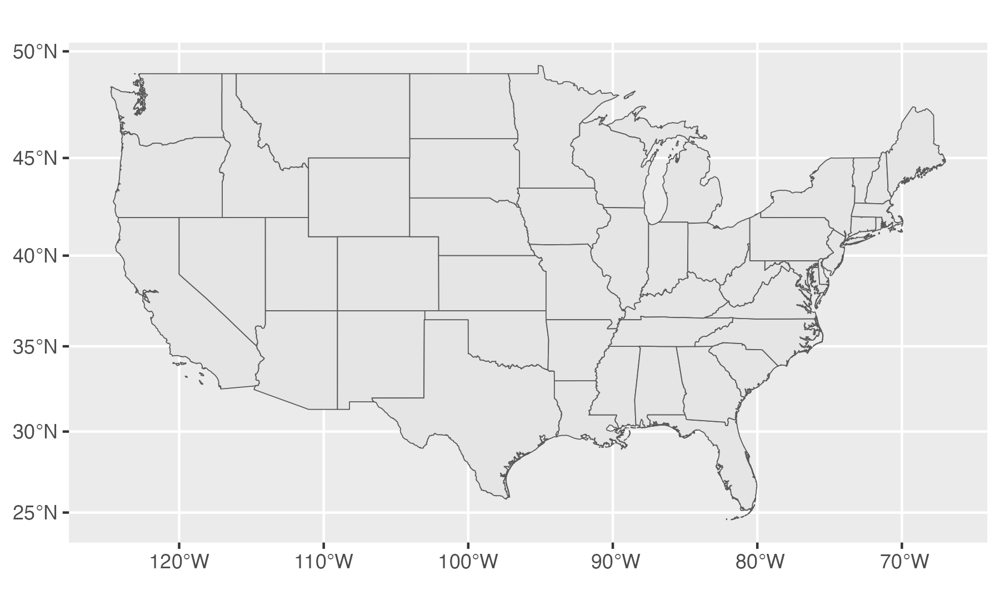
:::

::: {.col .font70}
Albers

```{r}
#| eval: false
#| code-line-numbers: "3"

ggplot(data = us_states_cont) +
    geom_sf() +
    coord_sf(crs = "ESRI:102003")
```

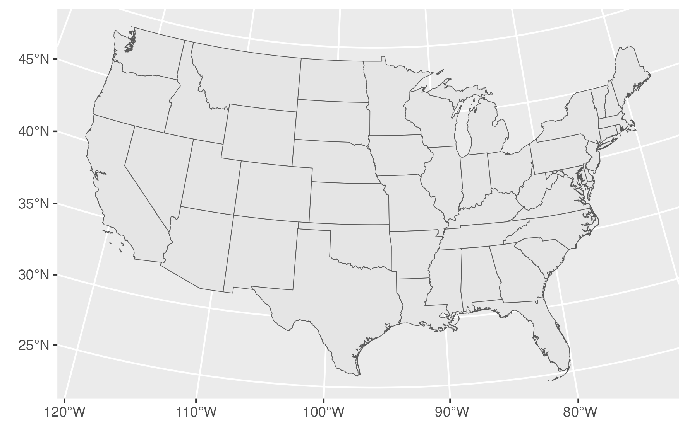
:::

---

## Mapping data to projections - choropleth map

::: {.col .font70 width="60%"}
```{r}
#| eval: false
#| code-line-numbers: "10,13"

milk_2017 <- milk_production %>%
  filter(year == 2017) %>%
  select(name = state, milk_produced) %>%
  mutate(milk_produced = milk_produced / 10^9)

us_states <- ne_states(
  country = 'united states of america',
  returnclass = 'sf') %>%
  filter(! name %in% c('Alaska', 'Hawaii')) %>%
  left_join(milk_2017, by = 'name')

ggplot(us_states) +
  geom_sf(aes(fill = milk_produced)) +
  scale_fill_viridis(
    option = "plasma",
    limits = c(0, 40)) +
  theme_void(base_size = 15) +
  theme(legend.position = 'bottom') +
  labs(
    fill = 'Milk produced\n(billions lbs)',
    title = 'Milk Production by State in 2017'
  )
```
:::

::: {.col width="40%"}
<br>


:::

---

## Mapping data to projections - choropleth map

::: {.col .font70 width="60%"}
```{r}
#| eval: false
#| code-line-numbers: "24"

milk_2017 <- milk_production %>%
  filter(year == 2017) %>%
  select(name = state, milk_produced) %>%
  mutate(milk_produced = milk_produced / 10^9)

us_states <- ne_states(
  country = 'united states of america',
  returnclass = 'sf') %>%
  filter(! name %in% c('Alaska', 'Hawaii')) %>%
  left_join(milk_2017, by = 'name')

ggplot(us_states) +
  geom_sf(aes(fill = milk_produced)) +
  scale_fill_viridis(
    option = "plasma",
    limits = c(0, 40)) +
  theme_void(base_size = 15) +
  theme(legend.position = 'bottom') +
  labs(
    fill = 'Milk produced\n(billions lbs)',
    title = 'Milk Production by State in 2017'
  ) +
  coord_sf(crs = "ESRI:102003")
```
:::

::: {.col width="40%"}
::: {.center}
Albers Projection

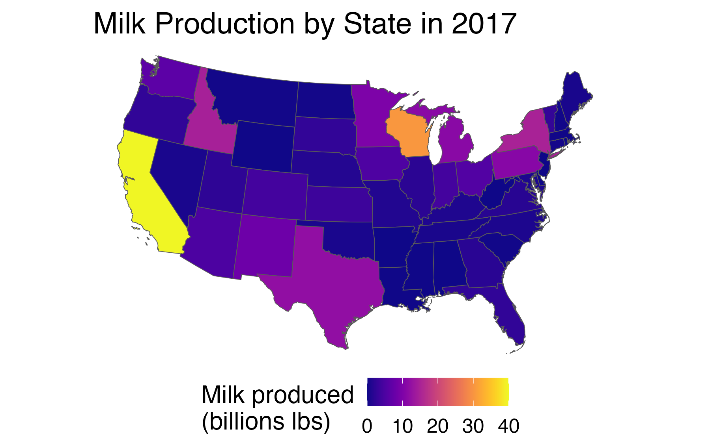
:::
:::

---

**Mapping data to projections - points**

::: {.col .font60 width="60%"}
```{r}
#| eval: false
#| code-line-numbers: "12,13,14,15"

us_states_cont <- ne_states(
  country = 'united states of america',
  returnclass = 'sf') %>%
  filter(! name %in% c('Alaska', 'Hawaii'))

us_coffee_shops <- us_coffee_shops %>%
  filter(lat > 22,    lat < 50,
         long > -150, long < -66)

ggplot() +
  geom_sf(data = us_states_cont) +
  geom_point(
    data = us_coffee_shops,
    aes(x = long, y = lat, color = name),
    size = 0.3) +
  theme_void(base_size = 15) +
  theme(legend.position = 'bottom') +
  guides(color = guide_legend(
    # Move legend title to top
    title.position = "top",
    # Increase legend point size
    override.aes = list(size = 3))) +
  labs(
    color = 'Coffee shop',
    title = 'Coffee Shops in the US'
  )
```
:::

::: {.col width="40%"}

:::

---

**Mapping data to projections - points**

::: {.col .font60 width="60%"}
```{r}
#| eval: false
#| code-line-numbers: "27"

us_states_cont <- ne_states(
  country = 'united states of america',
  returnclass = 'sf') %>%
  filter(! name %in% c('Alaska', 'Hawaii'))

us_coffee_shops <- us_coffee_shops %>%
  filter(lat > 22,    lat < 50,
         long > -150, long < -66)

ggplot() +
  geom_sf(data = us_states_cont) +
  geom_point(
    data = us_coffee_shops,
    aes(x = long, y = lat, color = name),
    size = 0.3) +
  theme_void(base_size = 15) +
  theme(legend.position = 'bottom') +
  guides(color = guide_legend(
    # Move legend title to top
    title.position = "top",
    # Increase legend point size
    override.aes = list(size = 3))) +
  labs(
    color = 'Coffee shop',
    title = 'Coffee Shops in the US'
  ) +
  coord_sf(crs = "ESRI:102003")
```
:::

::: {.col width="40%"}
### [Fail!]{.red .center}

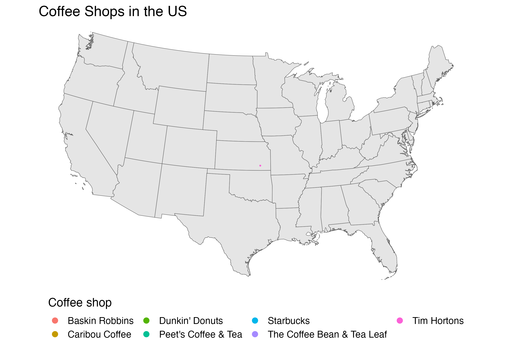
:::

---

## Mapping data to projections - points

First match `us_coffee_shops` crs to `us_states_cont`

::: {.col .font70 width="60%"}
```{r}
#| code-line-numbers: "10,11,12"

us_states_cont <- ne_states(
    country = 'united states of america',
    returnclass = 'sf') %>%
    filter(! name %in% c('Alaska', 'Hawaii'))

us_coffee_shops <- us_coffee_shops %>%
    filter(lat > 22,    lat < 50,
           long > -150, long < -66)

us_coffee_shops_sf <- st_as_sf(us_coffee_shops,
    coords = c("long", "lat"),
    crs = st_crs(us_states_cont))
```
:::

::: {.col width="40%"}
```{r}
head(us_coffee_shops_sf)
```
:::

---

## Mapping data to projections - points

Plot coffee shop locations over map with `geom_sf()`

::: {.col .font70 width="60%"}
```{r}
#| eval: false
#| code-line-numbers: "3,4,5,6"

ggplot() +
  geom_sf(data = us_states_cont) +
  geom_sf(
    data = us_coffee_shops_sf,
    aes(color = name),
    size = 0.3) +
  theme_void(base_size = 15) +
  theme(legend.position = 'bottom') +
  guides(color = guide_legend(
    # Move legend title to top
    title.position = "top",
    # Increase legend point size
    override.aes = list(size = 3))) +
  labs(
    fill = 'Coffee shop',
    title = 'Coffee Shops in the US'
  )
```
:::

::: {.col width="40%"}
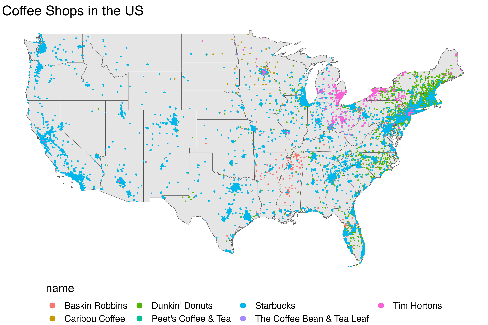
:::

---

## Mapping data to projections - points

Plot coffee shop locations over map with `geom_sf()`

::: {.col .font70 width="60%"}
```{r}
#| eval: false
#| code-line-numbers: "18"

ggplot() +
  geom_sf(data = us_states_cont) +
  geom_sf(
    data = us_coffee_shops_sf,
    aes(color = name),
    size = 0.3) +
  theme_void(base_size = 15) +
  theme(legend.position = 'bottom') +
  guides(color = guide_legend(
    # Move legend title to top
    title.position = "top",
    # Increase legend point size
    override.aes = list(size = 3))) +
  labs(
    fill = 'Coffee shop',
    title = 'Coffee Shops in the US'
  ) +
  coord_sf(crs = "ESRI:102003")
```
:::

::: {.col width="40%"}
::: {.center}
Albers Projection


:::
:::

---

## Mapping data to projections - points

Plot coffee shop locations over map with `geom_sf()`

::: {.col .font70 width="60%"}
```{r}
#| eval: false
#| code-line-numbers: "18"

ggplot() +
  geom_sf(data = us_states_cont) +
  geom_sf(
    data = us_coffee_shops_sf,
    aes(color = name),
    size = 0.3) +
  theme_void(base_size = 15) +
  theme(legend.position = 'bottom') +
  guides(color = guide_legend(
    # Move legend title to top
    title.position = "top",
    # Increase legend point size
    override.aes = list(size = 3))) +
  labs(
    fill = 'Coffee shop',
    title = 'Coffee Shops in the US'
  ) +
  coord_sf(crs = "ESRI:102004")
```
:::

::: {.col width="40%"}
::: {.center}
LCC Projection

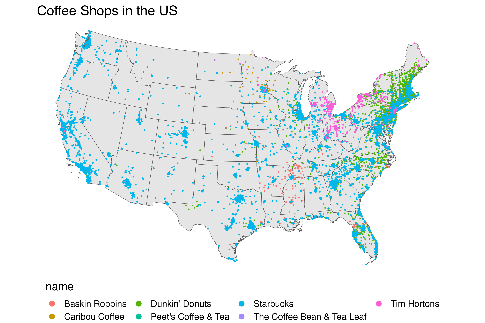
:::
:::

---



```{r}
#| echo: false

countdown(
  minutes = 20,
  warn_when = 30,
  update_every = 15,
  top = 0,
  left = 0,
  font_size = '2em'
)
```

::: {.col .font80 width="60%"}
## [Your turn]{.center}

Use the `internet_users_country.csv` data and the `world` data frame from the **rnaturalearth** library to create these two versions of internet access by country in 2015.

Hints:

- The `iso_a3` variable in the `worlds` data frame corresponds with the `code` variable in the `internet_users_country.csv` data frame (use this for joining).
- Use `scale_fill_gradient()` to fill the color:

```{r}
#| eval: false

scale_fill_gradient(
    low = "#e7e1ef",
    high = "#dd1c77",
    na.value = "grey70",
    limits = c(0, 100))
```
:::

::: {.col .center width="40%"}
Robinson Projection

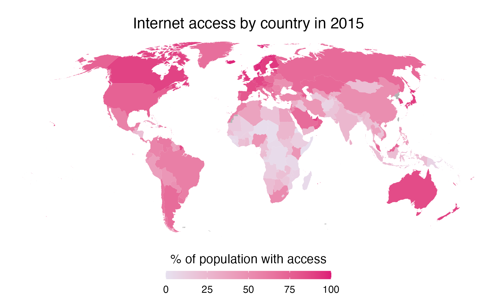

Mercator Projection

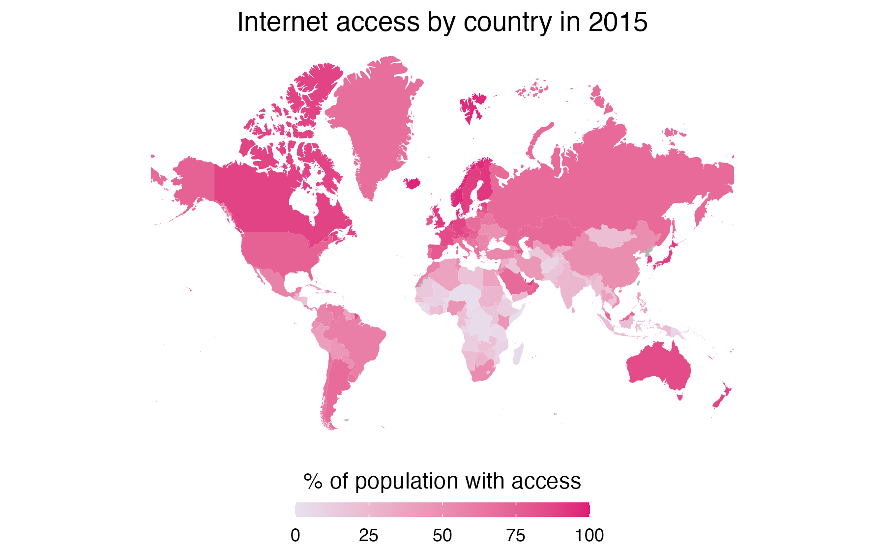
:::

---

# Remember: Mini Project 3 Due 11/10

## (That's <1 week!)

### https://eda.seas.gwu.edu/2026-Fall/mini/3-redesign.html

---





# Extra practice

---



## Your turn

```{r}
#| echo: false

countdown(
  minutes = 15,
  warn_when = 30,
  update_every = 15,
  top = 0,
  font_size = '2em'
)
```

Use the `us_states_cont` data frame and the `state_abbs` data frame to create a labeled map of the U.S.:

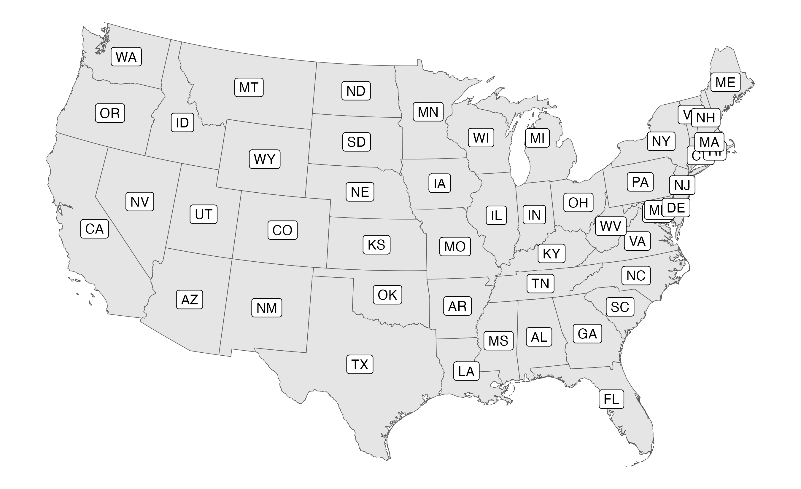{width="600"}
