

```{r}
#| include: false

agenda_items <- c(
  "Interactive charts with plotly",
  "Interactive tables",
  "Shiny apps",
  "Shiny extras"
)

source('setup.R')
```

---



# Quiz 5 - last one!

```{r}
#| echo: false

countdown(
  minutes = 12,
  warn_when = 30,
  update_every = 1,
  top = 0,
  right = 0,
  font_size = "3em"
)
```

::: {.col}
## Write your name on the quiz!

## Rules:

- Work alone; no outside help of any kind is allowed.
- No calculators, no notes, no books, no computers, no phones.
:::

::: {.col}
<br>

{width="400"}
:::

---

```{r}
#| echo: false
#| results: asis

agenda(0)
```

---

```{r}
#| echo: false
#| results: asis

agenda(1)
```

---

## [Plotly](https://plotly.com/graphing-libraries/) uses JavaScript to create interactive charts

. . .

### But you don't have to know JavaScript to use it! 🎉

---

### Turn any ggplot into an interactive chart with `ggplotly()`

::: {.col}
```{r}
#| eval: false

plot <- gapminder %>%
  filter(year == 2007) %>%
  ggplot(aes(x = gdpPercap, y = lifeExp,
             size = pop, color = continent,
             label = country)) +
  geom_point(alpha = 0.7) +
  scale_color_brewer(palette = 'Set2') +
  scale_size_area(
    guide = FALSE, max_size = 25) +
  scale_x_log10() +
  theme_bw(base_size = 16) +
  labs(x = 'GDP per capita',
       y = 'Life expectancy',
       color = 'Continent')

plot
```
:::

::: {.col}
```{r}
#| echo: false
#| fig-width: 7
#| fig-height: 5

plot <- gapminder %>%
  filter(year == 2007) %>%
  ggplot(aes(x = gdpPercap, y = lifeExp,
             size = pop, color = continent,
             label = country)) +
  geom_point(alpha = 0.7) +
  scale_color_brewer(palette = 'Set2') +
  scale_size_area(
    guide = FALSE, max_size = 25) +
  scale_x_log10() +
  theme_bw(base_size = 16) +
  labs(x = 'GDP per capita',
       y = 'Life expectancy',
       color = 'Continent')

plot
```
:::

---

### Turn any ggplot into an interactive chart with `ggplotly()`

::: {.col}
```{r}
#| eval: false

ggplotly(plot)
```
:::

::: {.col}
```{r}
#| echo: false

# Embedding as a iframe since direct rendering produces poor results, see
# https://github.com/rstudio/htmltools/issues/90
htmltools::tags$iframe(
  src         = file.path('figs', 'gapminder.html'),
  width       = "100%",
  height      = "400",
  scrolling   = "no",
  seamless    = "seamless",
  frameBorder = "0"
)
```
:::

---

### Modify the data shown with `tooltip` argument

::: {.col}
```{r}
#| eval: false
#| code-line-numbers: "3"

ggplotly(
  plot,
  tooltip = c("country", "pop")
)
```
:::

::: {.col}
```{r}
#| echo: false

htmltools::tags$iframe(
  src         = file.path('figs', 'gapminder_tooltip.html'),
  width       = "100%",
  height      = "400",
  scrolling   = "no",
  seamless    = "seamless",
  frameBorder = "0"
)
```
:::

---

### Modify other features by piping on `plotly` [functions](https://plotly.com/r/plotly-fundamentals/)

::: {.col}
```{r}
#| eval: false
#| code-line-numbers: "5,6"

ggplotly(
  plot,
  tooltip = c("country", "pop")
) %>%
  layout(legend = list(
    orientation = "h", x = 0, y = -0.3))
```
:::

::: {.col}
```{r}
#| echo: false

htmltools::tags$iframe(
  src         = file.path('figs', 'gapminder_legend.html'),
  width       = "100%",
  height      = "500",
  scrolling   = "no",
  seamless    = "seamless",
  frameBorder = "0"
)
```
:::

---




## Reference guide: https://plotly.com/ggplot2/

---

## Make interactive charts with `plot_ly()`

### (More examples here: https://plotly.com/r/)

::: {.col}
```{r}
#| eval: false
#| code-line-numbers: "1"

plot_ly(
  data = gapminder %>% filter(year == 2007),
  type = 'scatter',
  x = ~gdpPercap,
  y = ~lifeExp,
  size = ~pop,
  color = ~continent,
  text = ~country,
  mode = "markers",
  sizes = c(10, 1000),
  marker = list(opacity = 0.5),
  hoverinfo = "text"
  ) %>%
  layout(xaxis = list(type = "log"))
```
:::

::: {.col}
```{r}
#| echo: false

htmltools::tags$iframe(
  src         = file.path('figs', 'gapminder_plot_ly.html'),
  width       = "100%",
  height      = "400",
  scrolling   = "no",
  seamless    = "seamless",
  frameBorder = "0"
)
```
:::

---

## Animation is relatively easy with `plot_ly()`

::: {.col}
```{r}
#| eval: false
#| code-line-numbers: "2,9"

plot_ly(
  data = gapminder,
  type = 'scatter',
  x = ~gdpPercap,
  y = ~lifeExp,
  size = ~pop,
  color = ~continent,
  text = ~country,
  frame = ~year,
  mode = "markers",
  sizes = c(10, 1000),
  marker = list(opacity = 0.5),
  hoverinfo = "text"
  ) %>%
  layout(xaxis = list(type = "log"))
```
:::

::: {.col}
```{r}
#| echo: false

htmltools::tags$iframe(
  src         = file.path('figs', 'gapminder_plot_ly_anim.html'),
  width       = "100%",
  height      = "400",
  scrolling   = "no",
  seamless    = "seamless",
  frameBorder = "0"
)
```
:::

---

### Save as html page

```{r}
#| eval: false

htmlwidgets::saveWidget(
  ggplotly(plot),
  file = here::here('figs', 'gapminder.html')
)
```

. . .

### Insert using iframe

```{r}
#| eval: false

htmltools::tags$iframe(
  src         = here::here('figs', 'gapminder.html'),
  width       = "100%",
  height      = "400",
  scrolling   = "no",
  seamless    = "seamless",
  frameBorder = "0"
)
```

---



```{r}
#| echo: false

countdown(
  minutes = 10,
  warn_when = 30,
  update_every = 15,
  top = 0,
  font_size = '2em'
)
```

## Your Turn: Interactive Charts

1. Open your reflection from this past week (or a previous week)
2. With a classmate, take turns sharing your interactive chart, or go back to a chart we made in a previous class and make it interactive using either `ggplotly()` or `plot_ly()`
3. If you have an example you want to share, post your code in Slack

---

```{r}
#| echo: false
#| results: asis

agenda(2)
```

---

# Make pretty static tables with `kable()`

::: {.font70}
```{r}
#| code-line-numbers: "4"

library(knitr)

gapminder %>%
  kable()
```
:::

---

# Behind the scenes:

`kable()` generates the code to make a pretty table

```{r}
#| eval: false
#| code-line-numbers: "2"

gapminder %>%
  kable(format = "pipe")
```

```{r}
#| results: asis
#| echo: false

cat(knitr::kable(gapminder, format = "pipe"))
```

---

# Behind the scenes:

`kable()` generates the code to make a pretty table

```{r}
#| eval: false
#| code-line-numbers: "2"

gapminder %>%
  kable(format = "html")
```

```{r}
#| echo: false

cat(kable(gapminder, format = "html"))
```

---





# Make _interactive_ tables with:

## `DT::datatable()`

---

## Make _interactive_ tables with `datatable()`

::: {.col width="40%"}
```{r}
#| eval: false
#| code-line-numbers: "4"

library(DT)

gapminder %>%
  datatable()
```
:::

::: {.col width="60%"}
```{r}
#| echo: false

htmltools::tags$iframe(
  src         = file.path('figs', 'gapminder_dt.html'),
  width       = "100%",
  height      = "500",
  scrolling   = "yes",
  seamless    = "seamless",
  frameBorder = "0"
)
```
:::

---

## Make _interactive_ tables with `datatable()`

::: {.col width="40%"}
```{r}
#| eval: false
#| code-line-numbers: "3,4,5"

gapminder %>%
  datatable(
    options = list(
      pageLength = 5,
      lengthMenu = c(5, 10, 15, 20))
  )
```
:::

::: {.col width="60%"}
```{r}
#| echo: false

htmltools::tags$iframe(
  src         = file.path('figs', 'gapminder_dt_pages.html'),
  width       = "100%",
  height      = "500",
  scrolling   = "yes",
  seamless    = "seamless",
  frameBorder = "0"
)
```
:::

---

## Modify features by piping on [functions](https://rstudio.github.io/DT/functions.html)

::: {.col width="40%"}
```{r}
#| eval: false
#| code-line-numbers: "3,4,5,6,7,8"

gapminder %>%
  datatable() %>%
  formatCurrency('gdpPercap') %>%
  formatStyle(
    'country',
    color = 'red',
    backgroundColor = 'black',
    fontWeight = 'bold')
```
:::

::: {.col width="60%"}
```{r}
#| echo: false

htmltools::tags$iframe(
  src         = file.path('figs', 'gapminder_dt_style.html'),
  width       = "100%",
  height      = "500",
  scrolling   = "yes",
  seamless    = "seamless",
  frameBorder = "0"
)
```
:::

---

## Modify features by piping on [functions](https://rstudio.github.io/DT/functions.html)

::: {.col width="40%"}
```{r}
#| eval: false
#| code-line-numbers: "9,10,11,12,13,14,15"

gapminder %>%
  datatable() %>%
  formatCurrency('gdpPercap') %>%
  formatStyle(
    'country',
    color = 'red',
    backgroundColor = 'black',
    fontWeight = 'bold') %>%
  formatStyle(
    'lifeExp',
    background = styleColorBar(
      gapminder$lifeExp, 'dodgerblue'),
    backgroundSize = '100% 90%',
    backgroundRepeat = 'no-repeat',
    backgroundPosition = 'center')
```
:::

::: {.col width="60%"}
```{r}
#| echo: false

htmltools::tags$iframe(
  src         = file.path('figs', 'gapminder_dt_bars.html'),
  width       = "100%",
  height      = "500",
  scrolling   = "yes",
  seamless    = "seamless",
  frameBorder = "0"
)
```
:::

---





# Make _interactive_ tables with:

## `reactable::reactable()`

---

## Make _interactive_ tables with `reactable()`

::: {.col width="40%"}
```{r}
#| eval: false
#| code-line-numbers: "4"

library(reactable)

gapminder %>%
  reactable()
```
:::

::: {.col width="60%"}
```{r}
#| echo: false

htmltools::tags$iframe(
  src         = file.path('figs', 'gapminder_reactable.html'),
  width       = "100%",
  height      = "500",
  scrolling   = "yes",
  seamless    = "seamless",
  frameBorder = "0"
)
```
:::

---

## `reactable()` has some nice [options](https://glin.github.io/reactable/articles/examples.html)!

::: {.col width="40%"}
```{r}
#| eval: false
#| code-line-numbers: "5,6,7,8,9,10"

library(reactable)

gapminder %>%
  reactable(
    searchable = TRUE,
    highlight = TRUE,
    filterable = TRUE,
    defaultPageSize = 5,
    showPageSizeOptions = TRUE,
    pageSizeOptions = c(5, 10, 15)
  )
```
:::

::: {.col width="60%"}
```{r}
#| echo: false

htmltools::tags$iframe(
  src         = file.path('figs', 'gapminder_reactable_options.html'),
  width       = "100%",
  height      = "500",
  scrolling   = "yes",
  seamless    = "seamless",
  frameBorder = "0"
)
```
:::

---

## Add more features with  [reactablefmtr](https://kcuilla.github.io/reactablefmtr/index.html) library

::: {.col width="40%"}
```{r}
#| eval: false
#| code-line-numbers: "2,12,13,14,15,16,17"

library(reactable)
library(reactablefmtr)

gapminder %>%
  reactable(
    searchable = TRUE,
    highlight = TRUE,
    filterable = TRUE,
    defaultPageSize = 5,
    showPageSizeOptions = TRUE,
    pageSizeOptions = c(5, 10, 15)
    columns = list(
      lifeExp = colDef(cell = data_bars_pos_neg(
        gapminder,
        colors = c("#d7191c", "#ffffbf", "#1a9641")),
      align = "center")) ## align column header
  )
```
:::

::: {.col width="60%"}
```{r}
#| echo: false

htmltools::tags$iframe(
  src         = file.path('figs', 'gapminder_reactable_bars.html'),
  width       = "100%",
  height      = "500",
  scrolling   = "yes",
  seamless    = "seamless",
  frameBorder = "0"
)
```
:::

---

## Add more features with `sparkline` library [(example)](https://glin.github.io/reactable/articles/examples.html#embedding-html-widgets)

::: {.col .font60 width="40%"}
```{r}
#| eval: false
#| code-line-numbers: "2,16,17,18,19,20,21,22,23,24,25,26,27"

library(reactable)
library(sparkline)

gapminder_summary <- gapminder %>%
  group_by(country) %>%
  summarise(lifeExp = list(lifeExp)) %>%
  mutate(leftExpTrend = NA)

gapminder_reactable_sparkline <- gapminder_summary %>%
  reactable(
    searchable = TRUE,
    highlight = TRUE,
    filterable = TRUE,
    defaultPageSize = 5,
    showPageSizeOptions = TRUE,
    columns = list(
      lifeExp = colDef(
        cell = function(values) {
          sparkline(
            values, type = "bar", chartRangeMin = 0,
            chartRangeMax = max(gapminder$lifeExp))
        }),
      leftExpTrend = colDef(
        cell = function(value, index) {
          sparkline(gapminder_summary$lifeExp[[index]])
        })
  ))
```
:::

::: {.col width="60%"}
```{r}
#| echo: false

htmltools::tags$iframe(
  src         = file.path('figs', 'gapminder_reactable_sparkline.html'),
  width       = "100%",
  height      = "500",
  scrolling   = "yes",
  seamless    = "seamless",
  frameBorder = "0"
)
```
:::

---

# References:

## - https://rstudio.github.io/DT/
## - https://glin.github.io/reactable/
## - https://kcuilla.github.io/reactablefmtr/

---



```{r}
#| echo: false

countdown(
  minutes = 20,
  warn_when = 30,
  update_every = 15,
  top = 0,
  font_size = '2em'
)
```

## Your Turn: Interactive Tables

::: {.col width="40%"}
Use `reactable()` to make the following interactive table

Read [this example](https://kcuilla.github.io/reactablefmtr/articles/reactablefmtr_cookbook.html#embed-images) on how to embed images in table cells, then use the `gapminder_flags` data frame to make the interactive table.
:::

::: {.col width="60%"}
```{r}
#| echo: false

htmltools::tags$iframe(
  src         = file.path('figs', 'gapminder_reactable_flags.html'),
  width       = "100%",
  height      = "500",
  scrolling   = "yes",
  seamless    = "seamless",
  frameBorder = "0"
)
```
:::

---




```{r}
#| echo: false

countdown(
  minutes = 5,
  warn_when = 30,
  update_every = 1,
  left = 0, right = 0, top = 1, bottom = 0,
  margin = "5%",
  font_size = "8em"
)
```

# Intermission

---

```{r}
#| echo: false
#| results: asis

agenda(3)
```

---




# License

## These slides were modified from [Florencia D'Andrea](https://florencia.netlify.app/)'s [RLadies Shiny Meetup Slides](https://github.com/flor14/rladies_shiny_meetup_2020)

This work is licensed under a</br>[Creative Commons Attribution-ShareAlike 4.0](http://creativecommons.org/licenses/by-sa/4.0/) International License

---

# New libraries to install

```{r}
#| eval: false

install.packages('shiny')
install.packages('shinyWidgets')
install.packages('rsconnect')
```

---




::: {.col width="40%"}
{width="300"}
:::

::: {.col width="60%"}
</br>

# Interactive Webapps in R

## Check out the [Shiny Gallery](https://shiny.rstudio.com/gallery/)
:::

---

# Anatomy of a Shiny App

A Shiny app is a web page (UI) connected to a computer running a live R session (Server)

```{r}
#| echo: false
#| fig-align: center
#| out-width: '60%'

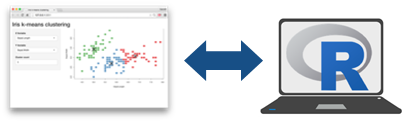
```

---

# `app.R`

::: {.col width="45%"}
You can insert all the code at once with the shinyapp snippet!

Just start typing `shiny`...

```{r}
#| echo: false
#| fig-align: center
#| out-width: '80%'

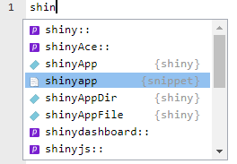
```
:::

::: {.col width="55%"}
```{r}
#| eval: false

library(shiny)

ui <- fluidPage(

)

server <- function(input, output, session) {

}

shinyApp(ui, server)
```
:::

---

# Building a shiny app

```{r}
#| echo: false
#| fig-align: center
#| out-width: '50%'


```

::: {.col}
**`ui`**

1. Pick a layout function

2. Add inputs widgets

3. Add `*Output()` functions
:::

::: {.col}
**`server`**

1. Use `render*()` functions to make outputs

2. Link outputs with `output$<id>`

3. Link inputs with `input$<id>`
:::

---

# Run the app 🎬

- **Option 1**: Click the "Run App" button in the toolbar:

```{r}
#| echo: false
#| fig-align: center
#| out-width: '25%'

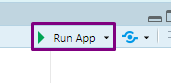
```

- **Option 2**: Use a keyboard shortcut: Cmd/Ctrl + Shift + Enter.

- **Option 3**: `shiny::runApp()` with the path to the **app.R** file.

---



::: {.col width="40%"}
## Your Turn

### `hello_shiny.app`

Create a new file called `app.R` in Positron, then copy in this code
:::

::: {.col .font50 width="60%"}
```{r}
#| eval: false
#| code-line-numbers: "1,4,27,40"

library(shiny)

# Define UI for application that draws a histogram
ui <- fluidPage(

    # Application title
    titlePanel("Old Faithful Geyser Data"),

    # Sidebar with a slider input for number of bins
    sidebarLayout(
        sidebarPanel(
            sliderInput("bins",
                        "Number of bins:",
                        min = 1,
                        max = 50,
                        value = 30)
        ),

        # Show a plot of the generated distribution
        mainPanel(
           plotOutput("distPlot")
        )
    )
)

# Define server logic required to draw a histogram
server <- function(input, output) {

    output$distPlot <- renderPlot({
        # generate bins based on input$bins from ui.R
        x    <- faithful[, 2]
        bins <- seq(min(x), max(x), length.out = input$bins + 1)

        # draw the histogram with the specified number of bins
        hist(x, breaks = bins, col = 'darkgray', border = 'white')
    })
}

# Run the application
shinyApp(ui = ui, server = server)
```
:::

---




## User Interface (UI)

```{r}
#| echo: false
#| fig-align: center
#| out-width: '70%'


```

[Matryoshka Dolls](https://en.wikipedia.org/wiki/Matryoshka_doll)

---



### Organize panels and elements into a layout with a **layout function**

### Top level is usually `fluidPage()`

```{r}
#| echo: false
#| fig-align: center
#| out-width: '80%'

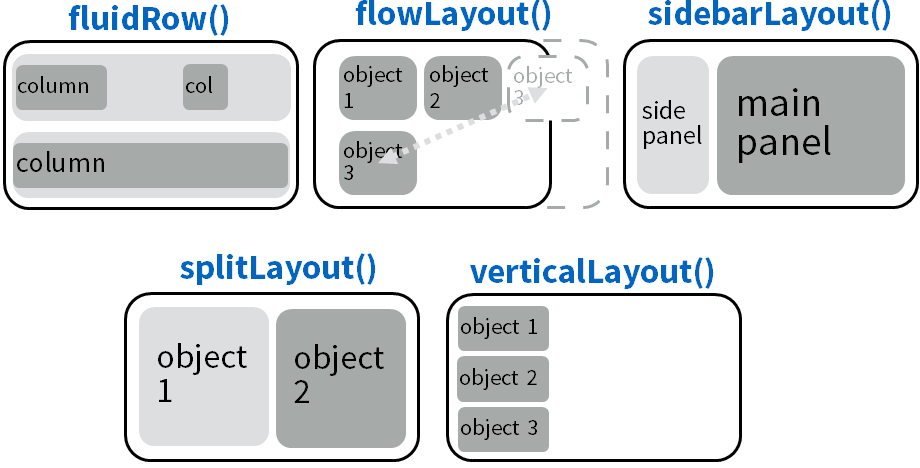
```

---



```{r}
#| echo: false
#| fig-align: center
#| out-width: '100%'

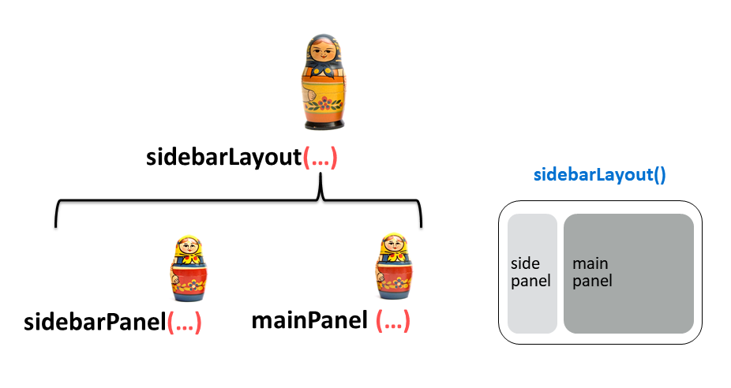
```

---

### `sidebarLayout()`

::: {.col width="40%"}
```{r}
#| eval: false
#| code-line-numbers: "5,7,14"

ui <- fluidPage(

  titlePanel("Hello Shiny!"),

  sidebarLayout(

    sidebarPanel(
      sliderInput(
        "bins", label = "Number of bins:",
        min = 1, value = 30, max = 50
      )
    ),

    mainPanel(
      plotOutput("distPlot")
    )
  )
)
```
:::

::: {.col width="60%"}
```{r}
#| echo: false
#| fig-align: center
#| out-width: '100%'

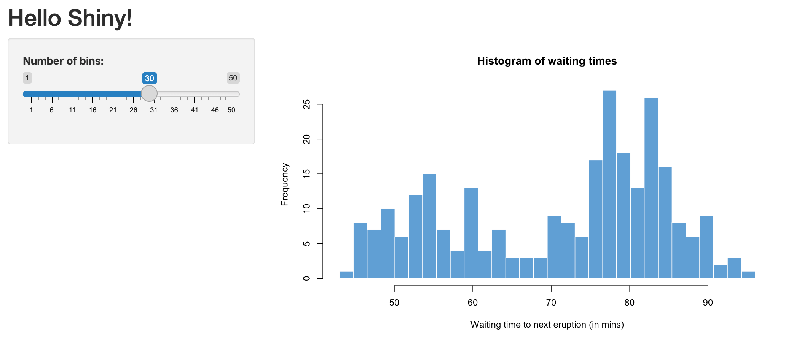
```
:::

---

### `navbarPage()`: An alternative to `fluidPage()`

Think of each `tabPanel()` as it's own `fluidPage()`

::: {.col width="40%"}
```{r}
#| eval: false
#| code-line-numbers: "1"

ui <- navbarPage("My Application",
  tabPanel("Component 1"),
  tabPanel("Component 2"),
  tabPanel("Component 3")
)
```
:::

::: {.col width="60%"}
```{r}
#| echo: false
#| fig-align: center
#| out-width: '100%'

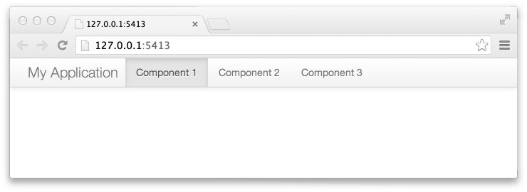
```
:::

---

### `navbarPage()`: An alternative to `fluidPage()`

Use `navbarMenu()` to create a nested menu item

::: {.col width="40%"}
```{r}
#| eval: false
#| code-line-numbers: "4,5,6"

ui <- navbarPage("My Application",
  tabPanel("Component 1"),
  tabPanel("Component 2"),
  navbarMenu("More",
    tabPanel("Sub-Component A"),
    tabPanel("Sub-Component B"))
)
```
:::

::: {.col width="60%"}
```{r}
#| echo: false
#| fig-align: center
#| out-width: '100%'

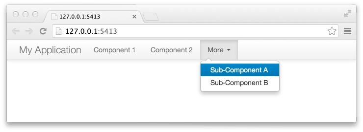
```
:::

---




# The UI defines the "what" and "where" for:

## 1. **[Inputs]{.orange}**: collect values from the user
## 2. **Output**: display something to the user

---



# **Inputs**: collect values from the user

```{r}
#| echo: false
#| fig-align: center
#| out-width: '100%'

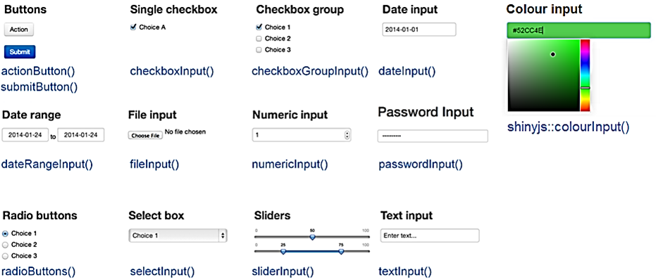
```

---

## Example Input: Radio buttons in the sidebar

::: {.col width="30%"}
```{r}
#| eval: false
#| code-line-numbers: "4"

ui <- fluidPage(
  sidebarLayout(
    sidebarPanel(
      radioButtons(…)
    ),
    mainPanel(…)
  )
)
```
:::

::: {.col width="70%"}
```{r}
#| echo: false
#| fig-align: center
#| out-width: '100%'

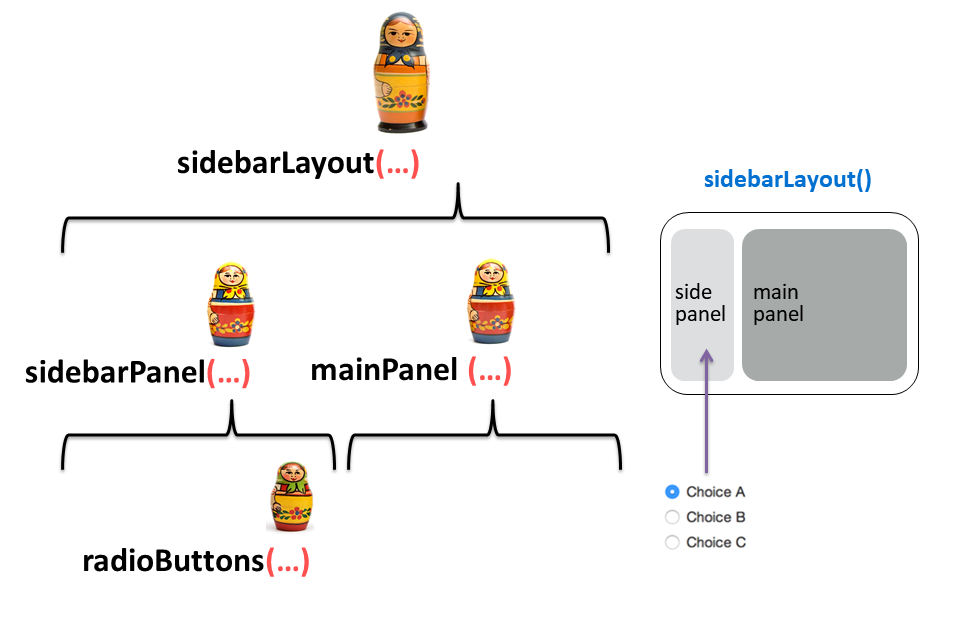
```
:::

---





```{r}
#| echo: false
#| fig-align: center
#| out-width: '70%'


```

---





```{r}
#| echo: false
#| fig-align: center
#| out-width: '90%'

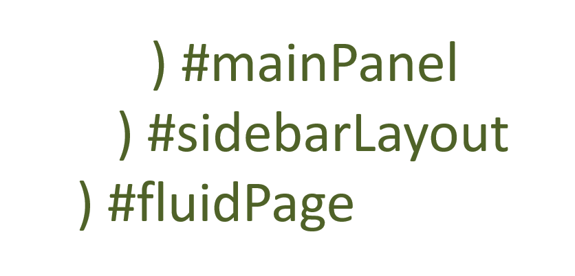
```

---



## Quick practice

1. Open the `widgets.R` file.
2. Run the app (Click "run app" button).
3. Go to the [Shiny Widgets Gallery](https://shiny.rstudio.com/gallery/widget-gallery.html) to see other input widgets.

---




# The UI defines the "what" and "where" for:

## 1. **Inputs**: collect values from the user
## 2. **[Output]{.orange}**: display something to the user

---

## Example Output: Put a plot in the main panel

::: {.col width="30%"}
```{r}
#| eval: false
#| code-line-numbers: "7"

ui <- fluidPage(
  sidebarLayout(
    sidebarPanel(
      radioButtons(…)
    ),
    mainPanel(
      plotOutput(…)
    )
  )
)
```
:::

::: {.col width="70%"}
```{r}
#| echo: false
#| fig-align: center
#| out-width: '100%'

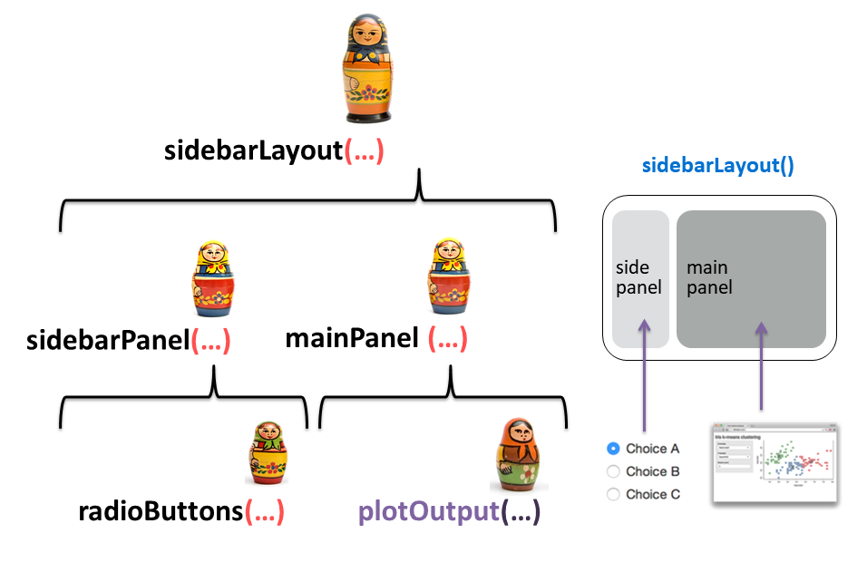
```
:::

---

# **Output**: display something to the user

Output function  | Description
-----------------| ---------------
`plotOutput()`   | Display a reactive _plot_
`dataTableOutput()` | Display a `DT::datatable()`
`textOutput()`   | Display reactive _text_
`imageOutput()`  | Display an image

---

# Building a shiny app

```{r}
#| echo: false
#| fig-align: center
#| out-width: '50%'


```

::: {.col}
**`ui`**

1. Pick a layout function, e.g. `sidebarLayout()`

2. Add inputs widgets

3. Add `*Output()` functions
:::

::: {.col}
**`server`**

1. Use `render*()` functions to make outputs

2. Link outputs with `output$<id>`

3. Link inputs with `input$<id>`
:::

---



```{r}
#| echo: false
#| fig-align: center
#| out-width: '90%'

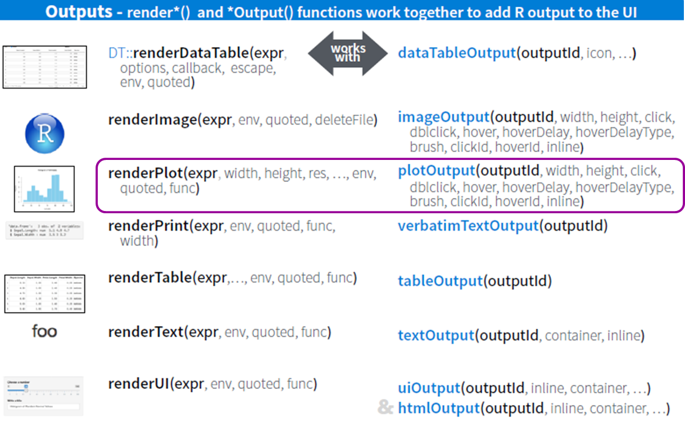
```

---

# Using `renderPlot()`: make a plot

::: {.col}
```{r}
#| eval: false

library(ggplot2)

ggplot(mpg) +
  geom_point(
    aes(x = displ, y = hwy, color = class))
```
:::

::: {.col}
```{r}
#| echo: false
#| fig-width: 7
#| fig-height: 5
#| fig-align: center

library(ggplot2)

ggplot(mpg) +
  geom_point(
    aes(x = displ, y = hwy, color = class))
```
:::

---

## Link plot to output with `output$<id>`

::: {.col width="45%"}
`ui`

```{r}
#| eval: false
#| code-line-numbers: "7,8,9"

ui <- fluidPage(
  sidebarLayout(
    sidebarPanel(
      radioButtons(…)
    ),
    mainPanel(
      plotOutput(
        outputId = "mpg_plot"
      )
    )
  )
)
```
:::

::: {.col width="55%"}
`server`

```{r}
#| eval: false
#| code-line-numbers: "2"

server <- function(input, output, session) {
  output$mpg_plot <- renderPlot({
    ggplot(mpg) +
      geom_point(
        aes(x = displ, y = hwy, color = class))
  })
}
```
:::

---

## Link user inputs to plot with `input$<id>`

::: {.col .font60}
`ui`

```{r}
#| eval: false
#| code-line-numbers: "5,9,10,11"

ui <- fluidPage(
  sidebarLayout(
    sidebarPanel(
      radioButtons(
        inputId = "xvar",
        label = "Select the x-axis variable:",
        selected = "displ",
        choices = c(
          "Highway miles per gallon" = "hwy",
          "City miles per gallon" = "cty",
          "Engine displacement, in litres" = "displ")
      ),
    ),
    mainPanel(
      plotOutput(
        outputId = "mpg_plot"
      )
    )
  )
)
```
:::

::: {.col .font60}
`server`

```{r}
#| eval: false
#| code-line-numbers: "5,6"

server <- function(input, output, session) {
  output$mpg_plot <- renderPlot({
    ggplot(mpg) +
      geom_point(
        aes_string(
          x = input$xvar,
          y = "hwy",
          color = "class"))
  })
}
```

**Note**: I switched the ggplot code from</br>`aes()` to `aes_string()`
:::

---



## Quick practice

Open the `mpg.R` app and click the "Run App" button

---



```{r}
#| echo: false

countdown(
  minutes = 10,
  warn_when = 30,
  update_every = 15,
  top = 0,
  font_size = '2em'
)
```

## Your Turn

::: {.col}
1. Open the `caseConverter.R` file.
2. In the `server`: Write code in the provided `renderText()` to convert the input text to lower case.
3. Run the app and test that it's working.
4. In the `ui` main panel: Add two more `textOutput()` functions for also displaying the input text in "upper" case and "title" case.
3. In the `server`: Define two more outputs to convert the input text to "upper" case and "title" case.
:::

::: {.col}
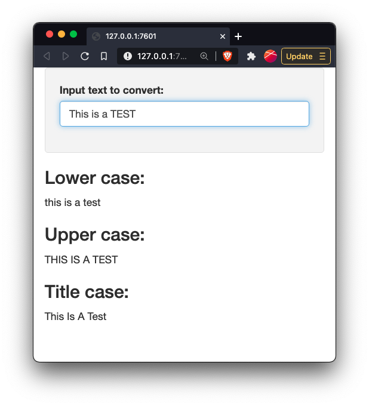{width="500"}
:::

---

```{r}
#| echo: false
#| results: asis

agenda(4)
```

---




## Add a theme with ["shinythemes"](https://rstudio.github.io/shinythemes/) package

```{r}
#| echo: false
#| fig-align: center
#| out-width: '60%'

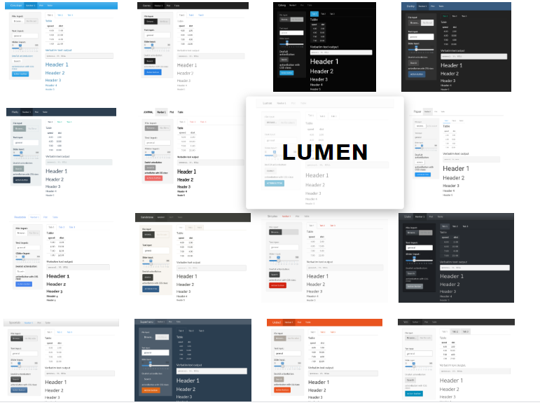
```

---

### [Insert theme at top of main `ui` layout function]{.center}

::: {.col width="40%"}
```{r}
#| eval: false
#| code-line-numbers: "4"

library(shinythemes)

ui <- fluidPage(
  theme = shinytheme("sandstone"),
  sidebarLayout(
    sidebarPanel(
      <insert widgets>
    ),
    mainPanel(
      <insert outputs>
    )
  )
)
```
:::

::: {.col width="60%"}
```{r}
#| echo: false
#| fig-align: center
#| out-width: '100%'

knitr::include_graphics("https://rstudio.github.io/shinythemes/images/sandstone.png")
```
:::

---




## Fancier widgets with ["shinyWidgets"](http://shinyapps.dreamrs.fr/shinyWidgets/) package

### Open the `shinyWidgets.R` app and click the "Run App" button

---

# If you really want to get good at this:

## 1. Print out this [Cheatsheet](https://shiny.posit.co/r/articles/start/cheatsheet/)

## 2. Watch this [2.5 Hour Comprehensive RStudio Tutorial](https://shiny.rstudio.com/tutorial)

## 3. Use this reference manual: [Mastering Shiny](https://mastering-shiny.org/)

---

# You can deploy an app for free on [shinyapps.io](https://www.shinyapps.io/)

### Follow [this guide](https://shiny.posit.co/r/articles/share/shinyapps/)

1. Create a shinyapps.io account
2. Open your tokens, click "Show", copy the code
3. Run the code in R
4. Deploy your app:

```{r}
#| eval: false

library(rsconnect)
deployApp()
```

---



```{r}
#| echo: false

countdown(
  minutes = 15,
  warn_when = 30,
  update_every = 15,
  top = 0,
  font_size = '2em'
)
```

## Your Turn

::: {.col width="80%"}
1. Open the `internetUsers.R` file.
2. Modify the server code so that the inputs control the plot.
3. Deploy your app to shinyapps.io
:::

::: {.col width="20%"}
:::
