

```{r}
#| include: false

agenda_items <- c(
  "Telling a story",
  "Designing slides",
  "Giving a talk",
  '"Final" thoughts'
)
```

---

```{r}
#| echo: false
#| results: asis

agenda(0)
```

---




# Download [this cheetsheet](https://github.com/emse-eda-gwu/2026-Fall/raw/main/content/cheatsheet-storytelling.pdf) for today's content

---

```{r}
#| echo: false
#| results: asis

agenda(1)
```

---





# What is a story?

---



> ### A story is a set of observations, facts, or events...that are presented in a specific order such that they create an</br>**emotional reaction** in the audience.</br></br>- Clause O. Wilke (2019), Chp. 29

---





</br>

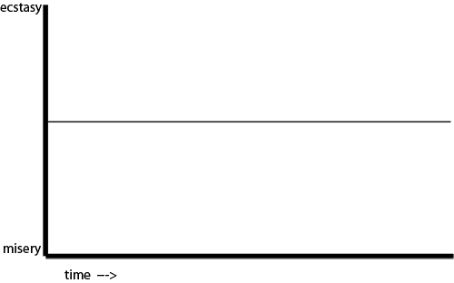{width="800"}

[source](https://sivers.org/drama)

---





</br>

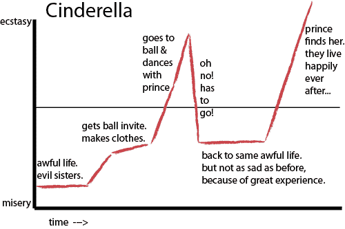{width="750"}

[source](https://sivers.org/drama)

---





</br>

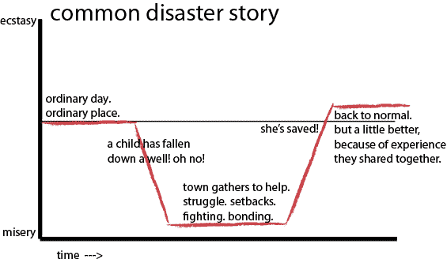{width="800"}

[source](https://sivers.org/drama)

---






## [Freytag's Pyramid](https://en.wikipedia.org/wiki/Gustav_Freytag)

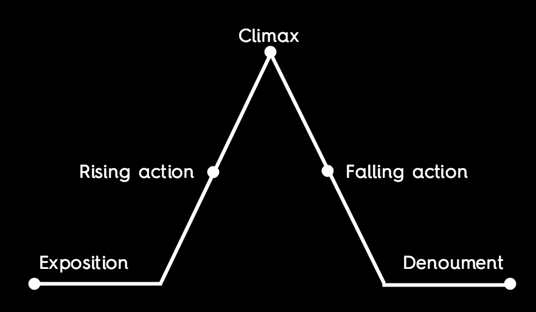{width="800"}

---




## Freytag's Pyramid: **[King Kong](https://en.wikipedia.org/wiki/King_Kong)**

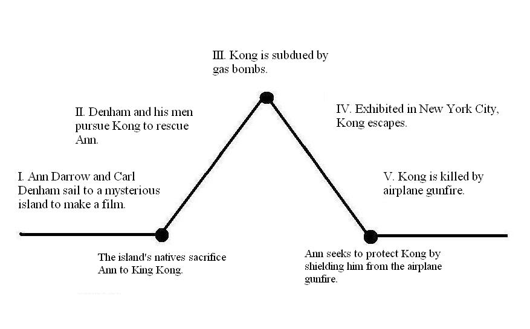{width="900"}

[source](http://writinghorrorfiction.blogspot.com/2011/03/putting-freytags-pyramid-to-use-in.html)

---




## Freytag's Pyramid: **Research Project**

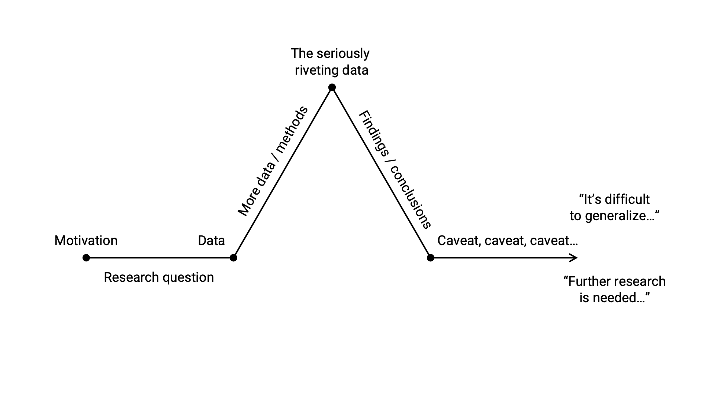{width="1000"}

---




## Freytag's Pyramid: **Research Project**

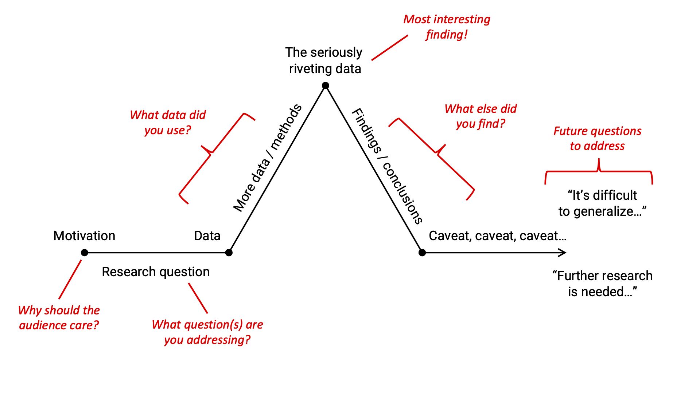{width="1000"}

---



> ### "A single (static) visualization will rarely tell an entire story"</br></br>- Clause O. Wilke (2019), Chp. 29

---




## Freytag's Pyramid: **Research Project**

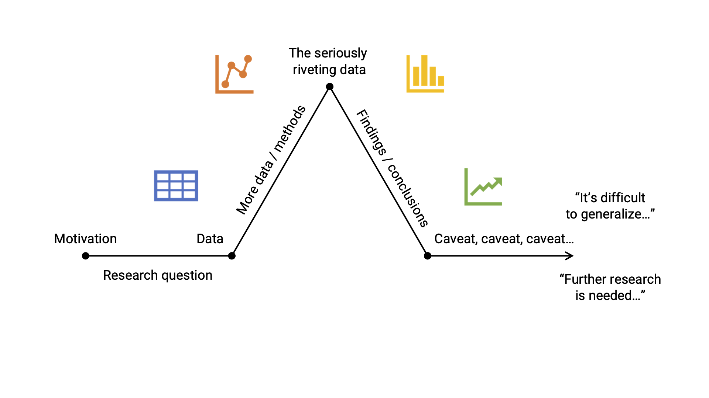{width="1000"}

---



## Use **layers** to build tension / provide context

. . .

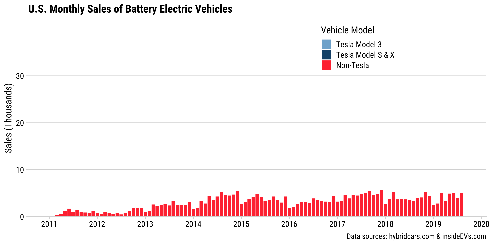{width="900"}

---



## Use **layers** to build tension / provide context

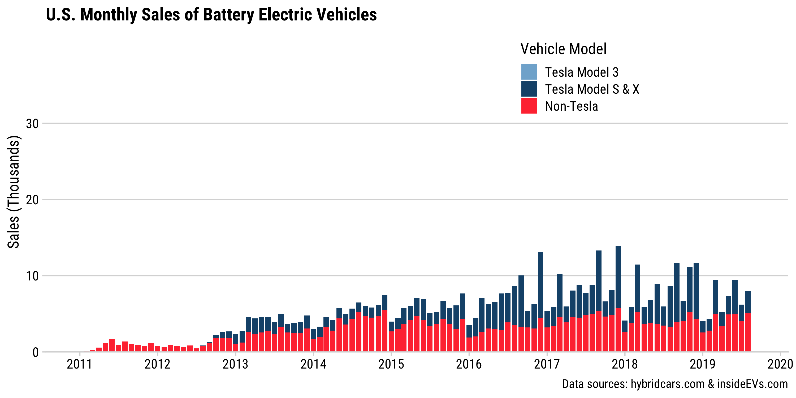{width="900"}

---



## Use **layers** to build tension / provide context

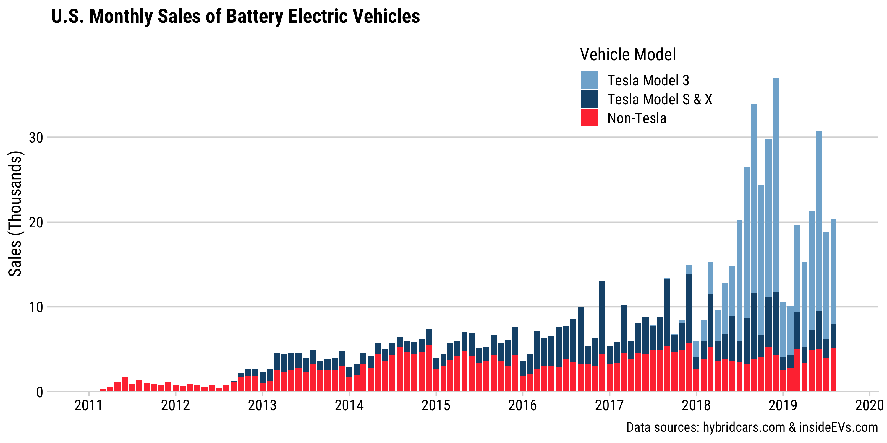{width="900"}

---



## Use **animation** to build tension / provide context

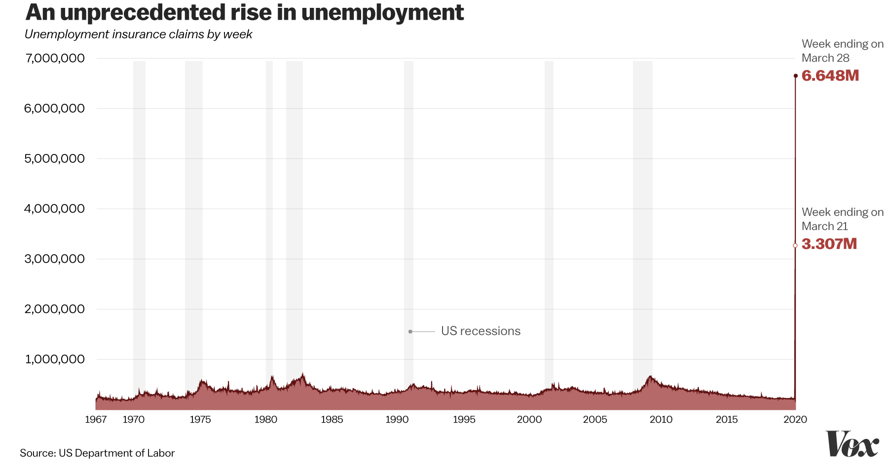{width="900"}

[source](https://www.vox.com/2020/4/2/21203850/unemployment-initial-claims-march-28)

---



## Use **animation** to build tension / provide context


[source](https://twitter.com/maoam_guy/status/1245887052027232256)

---



## Make charts for the generals
### (i.e. keep it simple)

. . .

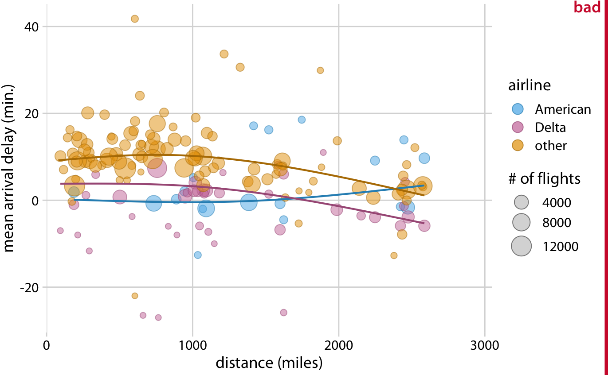{width="700"}

[source](https://serialmentor.com/dataviz/telling-a-story.html#make-a-figure-for-the-generals)

---



## Make charts for the generals
### (i.e. keep it simple)

::: {.col}


[source](https://serialmentor.com/dataviz/telling-a-story.html#make-a-figure-for-the-generals)
:::

::: {.col .fragment}
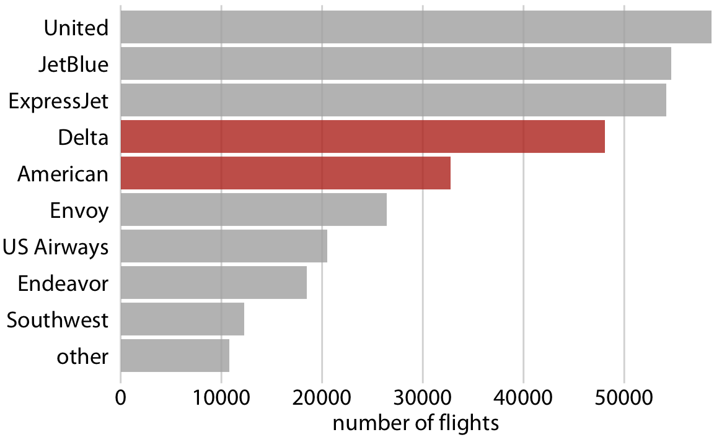

[source](https://serialmentor.com/dataviz/telling-a-story.html#make-a-figure-for-the-generals)
:::

---



# Build up towards complex figures

. . .

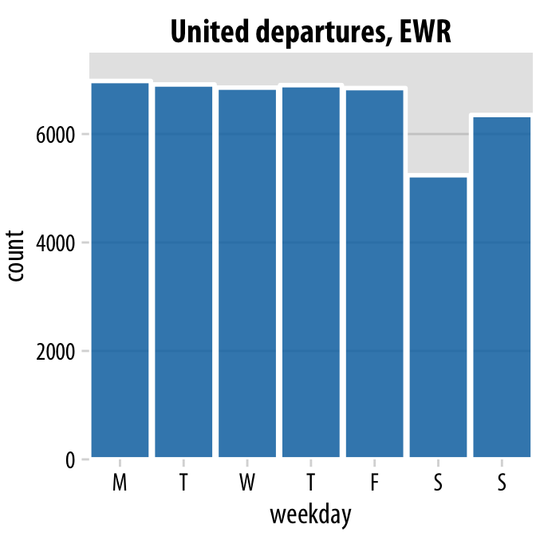{width="400"}

[source](https://serialmentor.com/dataviz/telling-a-story.html#build-up-towards-complex-figures)

---



# Build up towards complex figures

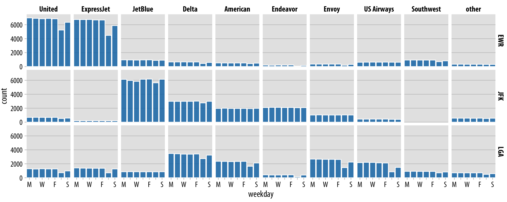{width="1100"}

[source](https://serialmentor.com/dataviz/telling-a-story.html#build-up-towards-complex-figures)

---



## Be consistent, but don't be repetitive

::: {.col .fragment}
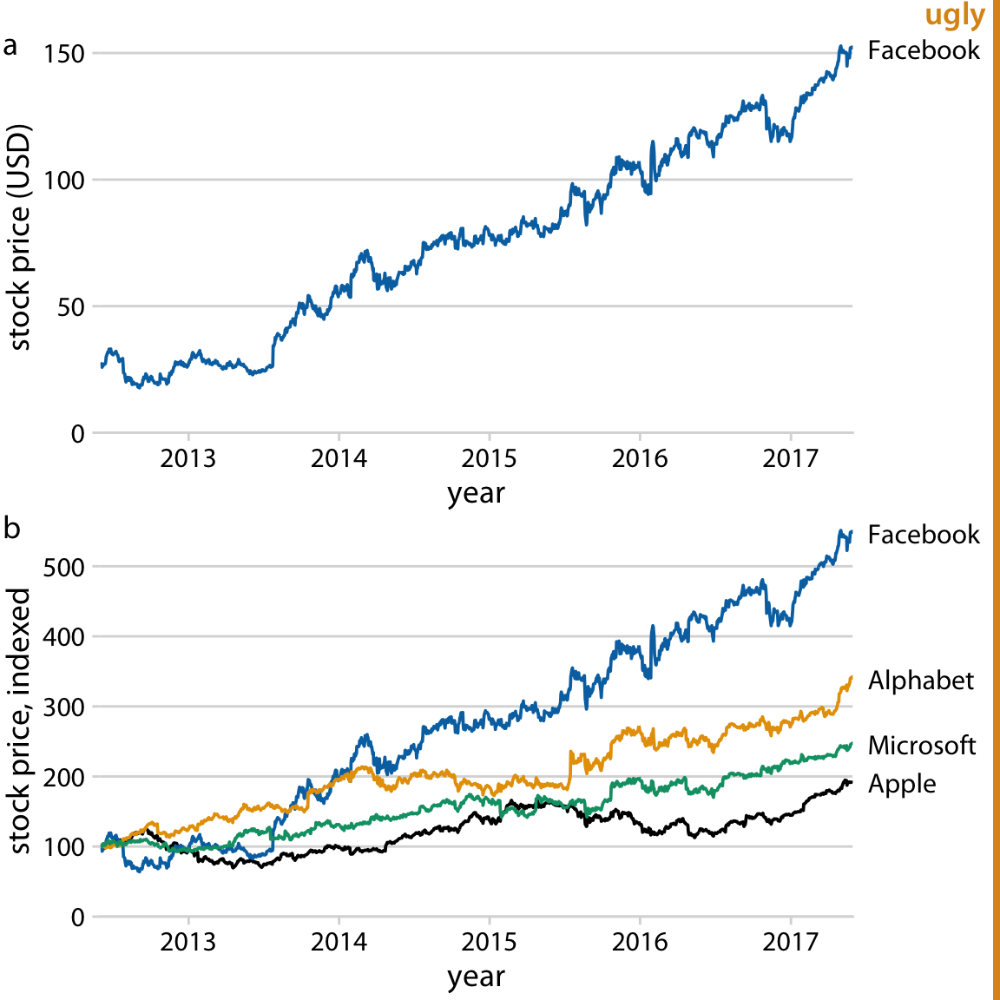{width="500"}

[source](https://serialmentor.com/dataviz/telling-a-story.html#be-consistent-but-dont-be-repetitive)
:::

::: {.col .fragment}
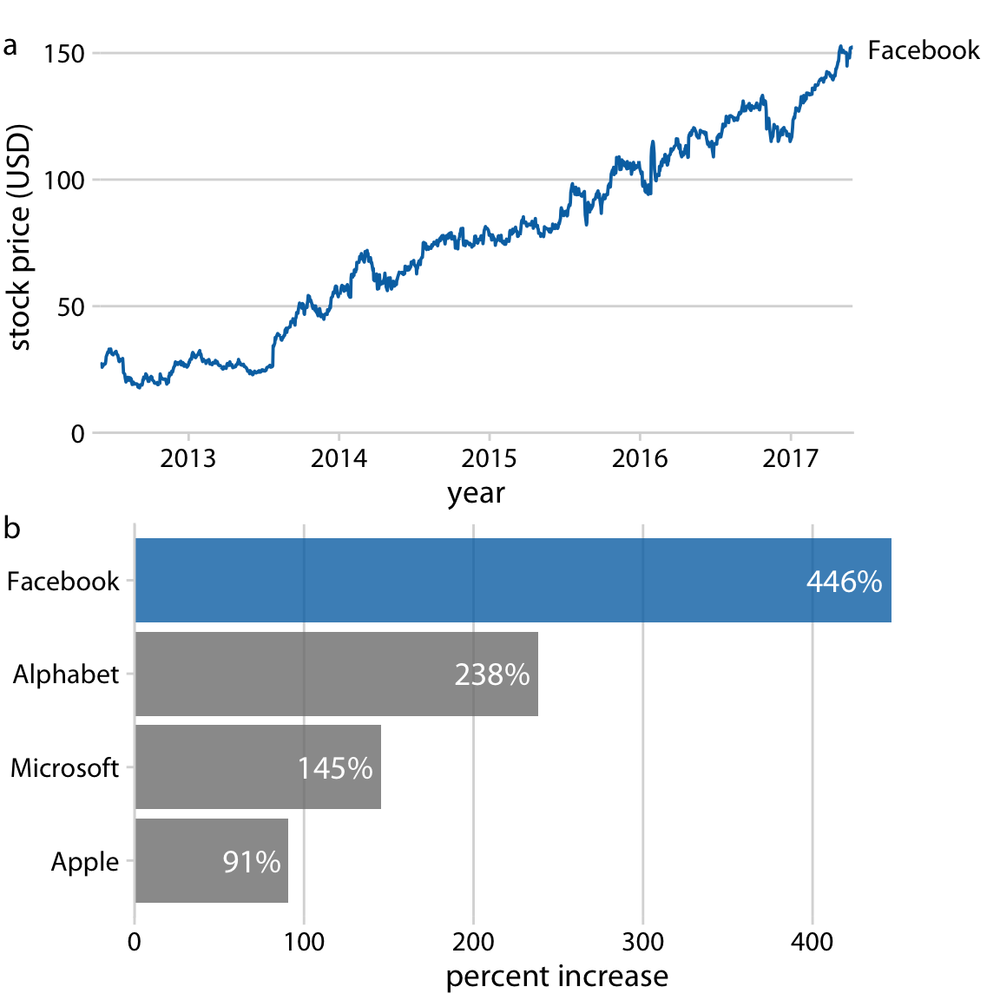{width="500"}

[source](https://serialmentor.com/dataviz/telling-a-story.html#be-consistent-but-dont-be-repetitive)
:::

---

```{r}
#| echo: false
#| results: asis

agenda(2)
```

---





# Hitchcock's rule

{width="900"}

---



## [Hitchcock's rule]{.center}

> # The size of any object in your frame should be proportional to its importance to the story at that moment

## [[Watch this example](https://youtu.be/E1LzhiCcOY0?t=174)]{.center}

---



## [Hitchcock's rule]{.center}

> # The size of any object in your ~~frame~~ **slide** should be proportional to its importance to the story at that moment

---

...and finally you will read this

<br><br>
<div style='font-size: 70pt; text-align: center;'>You will read this first</div>

<br><br>
<div style='font-size: 40pt; text-align: center;'>and then you will read this</div>

---



# Put main point at top and use big font size!

</br>
</br>

(see Stephanie Evergreen's blog post ["So What?"](https://stephanieevergreen.com/so-what/))

---



# Except for Tesla, EV adoption in the U.S. is **flat**

{width="900"}

---



# Tesla's Model 3 is a Game Changer for EVs

{width="900"}

---



<p style="font-size:40pt;">> 40pt font for titles</p>
<p style="font-size:24pt;">> 24pt font for all other text</p>

(Exception: footer text can be small)

<div class="footer-small"><span>Footer text</span></div>

---

# [_Think of fonts as pre-attentive attributes_]{.red .center}

</br></br>

. . .

::: {.col .center}
<div style="font-size: 24pt;">
San-serif fonts for most text
</div>
:::

::: {.col}
<div style="font-size:24pt; font-style:italic; font-family: serif;">
"Italic, serif fonts for quotes"
</div>
</br>- Prof. Helveston
:::

---




# Consider using a light-colored background<br>(tan / gray)

---



# Use high contrast between font and background color

</br>

::: {.col .center}
<div style="background-color: #FFF; padding: 50px; margin: 0px; width: 300px; font-size: 28pt;">
Dark text on a light background works well
</div>
:::

::: {.col .center}
<div style="background-color: #000; color: #FFF; padding: 50px; margin: 0px; width: 300px; font-size: 28pt;">
Light text on a dark background also works well
</div>
:::

---



# Use high contrast between font and background color

</br>

::: {.col .center}
<div style="background-color: #FFF; color: #ffef01; padding: 50px; margin: 0px; width: 350px; font-size: 28pt;">
Yellow text on a white background is horrible
</div>
:::

::: {.col .center}
<div style="background-color: #000; color: #0000ff; padding: 50px; margin: 0px; width: 350px; font-size: 28pt;">
Blue text on a black background is horrible
</div>
:::

---




# Use high contrast between font and background color

::: {.col}
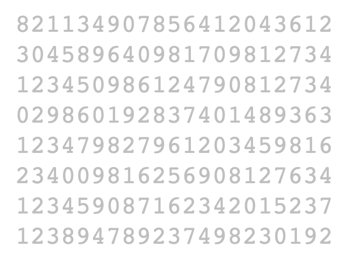{width="500"}
:::

::: {.col}
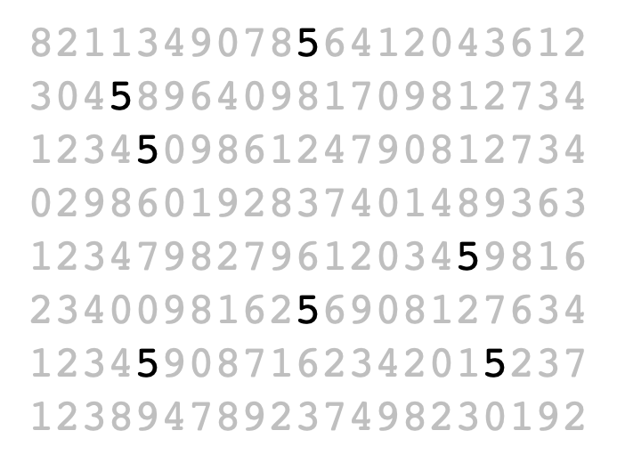{width="500"}
:::

---




# Avoid fonts like

</br>
<div style='font-family: "Comic Sans MS"; font-size: 40pt'>Comic Sans</div>
</br>
<div style='font-family: "Papyrus"; font-size: 40pt'>Papyrus</div>
</br>
</br>

# They make your work look amateurish

---




# 1 slide, 1 idea

## Break up main points into multiple slides

---




# Number your slides!

---




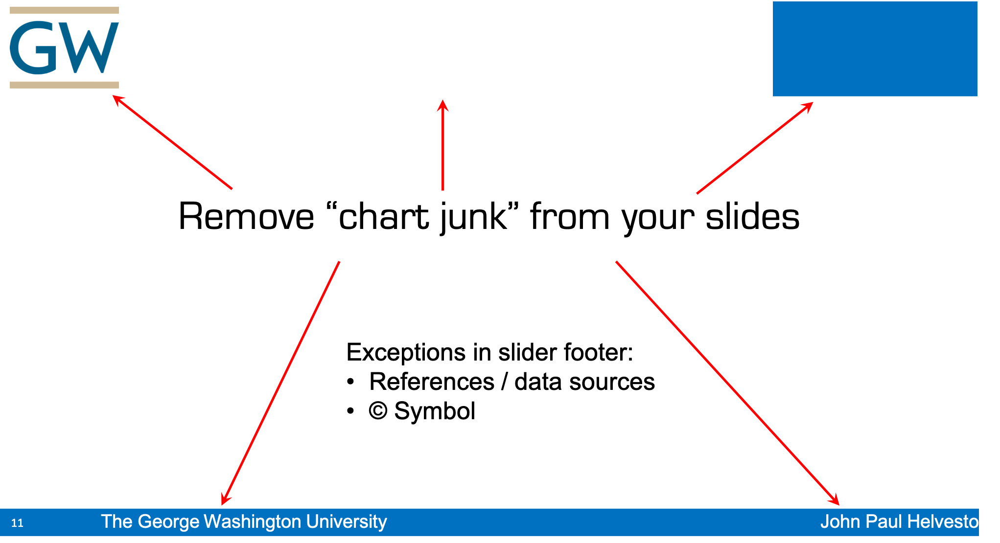

---



</br></br></br></br></br></br>

# Example of an acceptable slide footer

# </br></br></br>&darr;

<div class="footer-small"><span>Data source: http://somesourceofdata.com &emsp;&emsp; © John Paul Helveston, GWU, Apr. 2021</span></div>

---




# If you are in person, consider using handouts<br>(1-2 pages)

::: {.notes}
1. They can preview your results
2. They're more likely to remember your main points
:::

---

```{r}
#| echo: false
#| results: asis

agenda(3)
```

---





# What are the first words<br>you should say in a speech?

. . .

## Watch [this video](https://youtu.be/w82a1FT5o88) to find out

---

# How to start a speech

. . .

### 3. With a question that matters to the audience ("Have you ever...?")

. . .

### 2. With a shocking factoid ("There are more people alive today than have ever lived...").

. . .

### 1. Tell a story, talk about **people** ("Imagine...")

---







---



::: {.center}
{width="300"}
:::

. . .

3) With a question that matters to the audience:

**"What's the current federal subsidy for buying an electric car in the US?"**

. . .

2) With a shocking factoid

**"50% of the world's EVs are made by Chinese automakers"**

. . .

1) Tell a story, talk about **people**

**"Whenever I talk with people about electric cars, they usually ask about Tesla..."**

---



## Your turn

```{r}
#| echo: false

countdown(
  minutes = 5,
  warn_when = 30,
  update_every = 15,
  top = 0,
  font_size = '2em'
)
```

Brainstorm different strategies for how to start your presentation for your projects:

1. Tell a story, talk about **people** ("Imagine...").
2. With a shocking factoid ("There are more people alive today than have ever lived...").
3. With a question that matters to the audience ("Have you...?").

Afterwards, we will go around the room and one person from each team will practice giving their start to their presentation.

---

```{r}
#| echo: false
#| results: asis

agenda(4)
```

---

# [[Final Reports](https://eda.seas.gwu.edu/2026-Fall/project/3-final-report.html) due 12/06<br>(You have 4 days left!)]{.center}

. . .

- ### Read prompt carefully

. . .

- ### Be sure to include a copy of the data you're using

. . .

- ### Use a theme ✨

. . .

- ### Check for spelling errors:

```{r}
#| eval: false

spelling::spell_check_files("report.qmd")
```

---

# [[Final Presentations](https://eda.seas.gwu.edu/2026-Fall/project/4-presentation.html) (Slides Due 12/08)]{.center}

</br>

- ### We'll watch these during class period on Dec 11
- ### 10 mins each
- ### At the end, we'll announce awards:

  - ### 🗑️ **Janitor Award**: For most intense wrangling of messy data
  - ### ✨ **Shiny Award**: For single most impressive visualization

---

# [[Final Interviews](https://eda.seas.gwu.edu/2026-Fall/class/interviews) (12/07 - 12/08)]{.center}

- ### Schedule for a 10-minute interview using [this link](https://calendar.app.google/JirZBvZbX76T9heY6)

. . .

- ### Suggestions (from Prof. Mazzuchi):

1. Bring water to drink - it will calm you when you are nervous and your mouth dries up. You can also pause and think while you drink.
2. Don't answer right away - think a bit.
3. Answer the question asked. Don't try to impress or I will ask more questions.
4. Don't say "I don't know." Try and I will help you.
