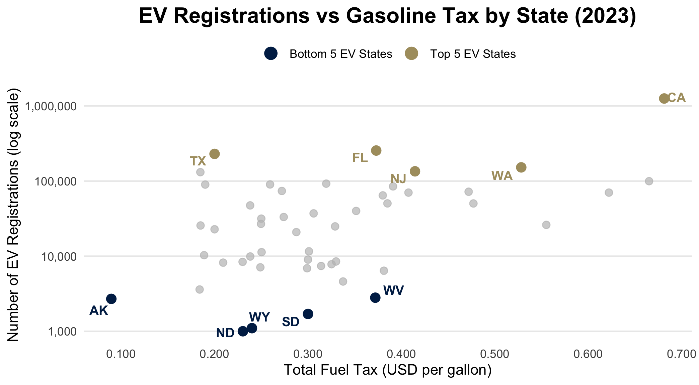
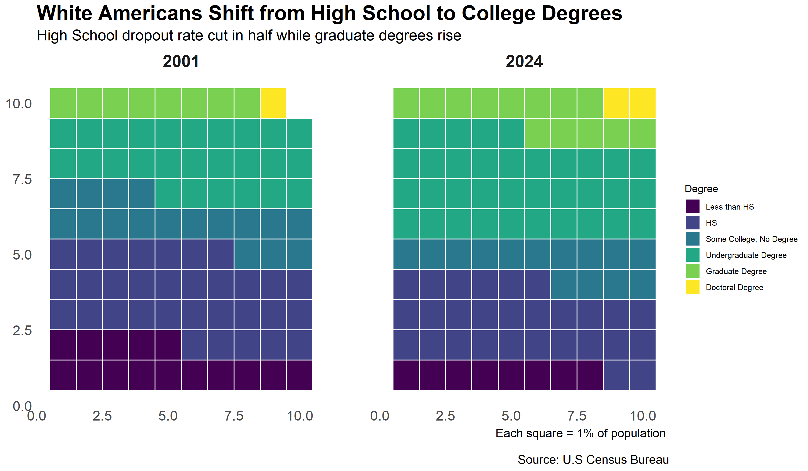

```{r setup, child="../setup.Rmd"}
```

---

class: center, middle

# Analysis of Global Insulin Supply

## by Nick Pennino, Shannon Zhang,<br>Taegeon Bae, and Sung Jung

---

class: center, middle

# [Following the Funding:<br>DEI Trends in NSF Grants, 2018–2025](https://www.youtube.com/watch?v=ENYGzhK1u9E)

## by Aisha Tarar, Chenxi Zhou, and Yousra Elzamzami

---

class: center, middle

# Fakes on the Rise

## by Eunice, Donia, Elena, and Andrea

---

class: center, middle

# [Degrees of Inequality:<br>The Story of Education in America](https://vimeo.com/1144711990?fl=pl&fe=sh)

## by Leshauna Hartman and Maya Schmidt

---

class: center, middle

# US Vehicle Market Trends Analysis:<br>Exploring Mileage, Depreciation, and Market Concentration Across Powertrains

## by Nithin Sarva, Jake Springer,<br>and Jagannath Narayanaswamy

---

class: center, middle

# Electric Vehicles and the<br>Future of Highway Funding

## by Eric Lehman, Lydia Ko, Sam Evans, and Hailey Kopp

---

class: center, middle

# [Basketball Teams with Most Loyal Fans](https://www.youtube.com/watch?v=0iZg_I8PKQw)

## by Evelina Naumovich and Katya Balin

---

class: center, middle

# [The Study of Home Advantage<br>in the English Premier League](https://www.youtube.com/watch?v=Mi-ABg7Z93Q)

## by Badr Ismail, Sammy Sorayanejad,<br>Sergio Ley, and Tomas Haché Caro

---

class: center, middle

# Trustworthiness of the<br>New York City Subway System

## by Ernest Giahyue, Lawrenz Pacayo,<br>Sean Smolyanskiy, and Yusuf Ozaydin

---

class: center, middle, inverse 

# 🎉 Awards Ceremony 🎉

---

class: center, middle, inverse

# ✨ The Nominees for the **Shiny** Award 

---

class: center, middle 

# **Shiny Nominee**: Trustworthiness of the<br>New York City Subway System

```{r}
#| echo: false

htmltools::tags$iframe(
  src = 'shooting-map.html',
  width = "100%",
  height = "400",
  scrolling = "no",
  seamless = "seamless",
  frameBorder = "0"
)
```

---

class: center, middle 

# **Shiny Nominee**: Electric Vehicles and the<br>Future of Highway Funding

.leftcol70[

<center>

</center>

]

.rightcol30[

(And also [this chart](https://eda.seas.gwu.edu/showcase/2026-Fall/ev-taxes.html#results))

]

---

class: center, middle 

# **Shiny Nominee**: Degrees of Inequality:<br>The Story of Education in America

<center>

</center>

---

class: center, middle, inverse

# ✨ The **Shiny** Award goes to...🥁

---

class: center, middle, inverse

# 🎉🎉🎉

.leftcol[

## [Electric Vehicles and the<br>Future of Highway Funding](https://eda.seas.gwu.edu/showcase/2026-Fall/name.html)

#### by Eric Lehman, Lydia Ko, Sam Evans, and Hailey Kopp

]

.rightcol[

<center>

</center>

]

---

# 🗑️ The Nominees for the **Janitor** award are:

--

.cols3[

### Electric Vehicles and the Future of Highway Funding

#### by Eric Lehman, Lydia Ko, Sam Evans, and Hailey Kopp

(for combining lots of different data files)

]

--

.cols3[

### Degrees of Inequality: The Story of Education in America

#### by Leshauna Hartman and Maya Schmidt

(Dealt with 52 different government Excel sheet)

]

--

.cols3[

### Trustworthiness of the New York City Subway System

#### by Ernest Giahyue, Lawrenz Pacayo,<br>Sean Smolyanskiy, and Yusuf Ozaydin

(Lots of data in PDFs)

]

---

class: center, middle, inverse

# 🗑️ The **Janitor** award goes to...🥁

---

class: center, middle, inverse

# 🎉🎉🎉

## Degrees of Inequality: The Story of Education in America

### by Leshauna Hartman and Maya Schmidt

<br>

(Final report.qmd was over 7,000 lines!)

---

class: center, middle, inverse

## Fill out course evals: https://gwu.smartevals.com/

### (please be specific!)

<center>

</center>
