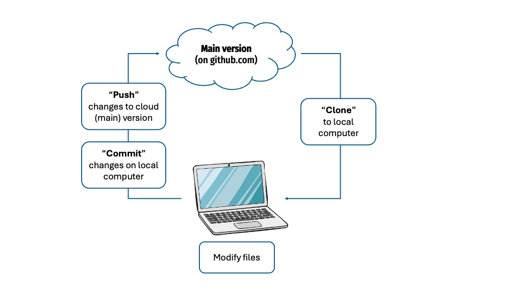
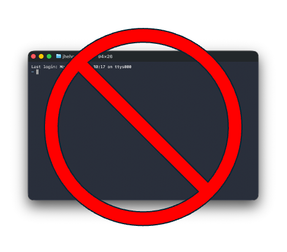
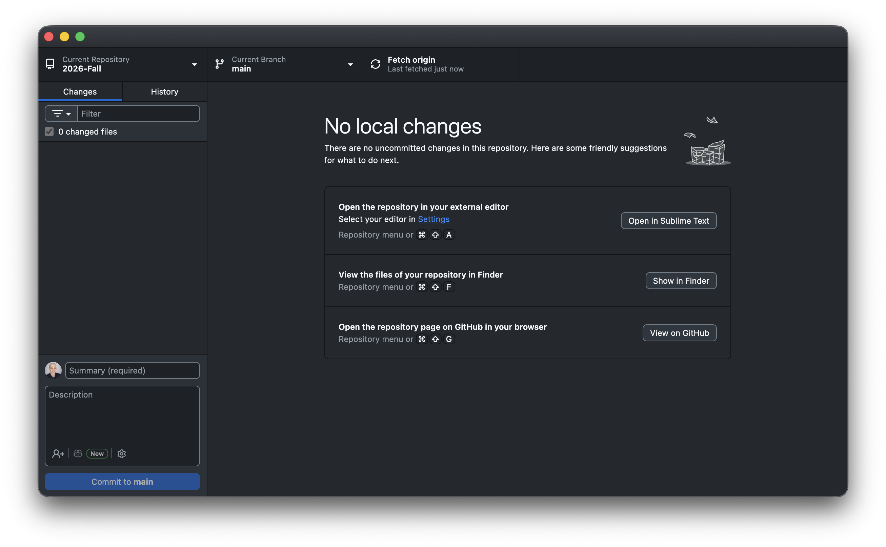



```{r}
#| include: false

agenda_items <- c(
  "Version Control with GitHub",
  "Setting Up & Using Claude Code",
  "Slash Commands & Skills",
  "Working Safely"
)
```

---

```{r}
#| echo: false
#| results: asis

agenda(0)
```

---

```{r}
#| echo: false
#| results: asis

agenda(1)
```

---




# The github workflow

{fig-align="center" width=100%}

---

# [Git vocabulary you should know]{.center}

<br>

::: {.col .fragment}
### ["repo"]{.center}
A project folder that **tracks its own history**
:::

::: {.col .fragment}
### ["commit"]{.center}
A **labeled save point** — "this is a state worth remembering"
:::

::: {.col .fragment}
### ["push"]{.center}
Send your commits **up to GitHub** (the cloud copy)
:::

---




::: {.col}
We won't use `git` in a terminal
{fig-align="center" width=100%}
:::

::: {.col}
Everything is a **button in GitHub Desktop**
{fig-align="center" width=100%}
:::

---



# The GitHub Desktop loop

<br>

Term            | What it is                        | Button
----------------|-----------------------------------|------------------
**Changes**     | Files you've edited since the last save | *(the left panel)*
**Commit**      | Bundle those changes with a message | **Commit to main**
**Push**        | Send commits to GitHub's copy      | **Push origin**
**History**     | Every commit, in order — your undo | *(the History tab)*

<br>

::: {.font110 .darkgreen}
Edit → **Commit** (with a message) → **Push**
:::

---



# Write commit messages you'd thank yourself for

<br>

::: {.col}
###  [Useless]{.red}

- `stuff`
- `update`
- `asdf`
- `fixed it`
:::

::: {.col}
###  [Useful]{.darkgreen}

- `Add flights bar chart`
- `Fix airline join dropping NAs`
- `Clean column names in import`
:::

<br>

::: {.font110 .center}
A message is a note to **future you** — the one scrolling History<br>trying to find where it broke.
:::

---



::: {.font200 .fancy .center}
Practice 1
:::

::: {.font120}
**Make a repo and push to it.**

1. GitHub Desktop → **File › New Repository** → name it `eda-w2-practice`
2. **Publish** it to GitHub (make it private)
3. Add a line to `README.md`, then **Commit** (write a message!)
4. **Push** — then open it on github.com and confirm it's there
5. Change the README again → **Commit** → **Push** → look at **History**
:::

```{r}
#| echo: false
countdown(minutes = 15, warn_when = 60, top = 0, right = 0, font_size = "2em")
```

---

# What just happened

::: {.font110}
- Your work now exists in **two places** (your laptop + GitHub)
- Every commit is a point you can **come back to**
- That History tab is your **undo button** for the whole project
:::

. . .

<br>

::: {.font120 .darkgreen .center}
Now let's give ourselves something worth undoing.
:::

---

```{r}
#| echo: false
#| results: asis

agenda(2)
```

---

# Assistants vs. Agents

::: {.col}
### [Assistants]{.blue}

**One-off tasks.**

- ChatGPT · Claude · Gemini
- Daily questions, small tasks
- A smarter search engine
:::

::: {.col}
### [Agents]{.orange}

**Full project workflows.**

- Claude Code · Codex · Gemini CLI
- **Edit your files**, run commands
- Carry a project forward over time
:::

. . .

<br>

::: {.font120 .center}
This class lives on the [**agent**]{.orange} side.
:::

---

# [An agent = model + skills + files]{.center}

<br>

::: {.col .center}
### [Model]{.purple}
The reasoning<br>*(Claude)*
:::

::: {.col .center}
### [Skills]{.darkgreen}
Reusable know-how<br>*(slash commands)*
:::

::: {.col .center}
### [Files]{.orange}
Your project<br>*(the folder it works in)*
:::

. . .

<br>

::: {.font110 .center}
Claude Code is the agent. **You** supply the project and the direction.
:::

---

# Where you launch it matters

::: {.col}
###  Home directory `~`

- Global `~/.claude/` settings
- A top-level `CLAUDE.md` of *generic* rules
- Applies to **every** project
:::

::: {.col}
###  A project folder

- Your actual work lives here
- Its **own** `CLAUDE.md` + history
- Where you'll launch Claude **99% of the time**
:::

. . .

<br>

::: {.font110 .red .center}
Open the **project folder** — not a stray file, not your whole home directory.
:::

---

# Open your workspace, then launch

<br>

## 1.  Make a folder (no spaces in the name)

::: {.fragment}
## 2.  In Positron: **File › Open Folder…** and pick it
:::

::: {.fragment}
## 3.  In the terminal pane, type `claude` and press Enter
:::

<br>

::: {.fragment .font110 .darkgreen}
You **describe** what you want; it **reads your files** and **proposes edits**.<br>
You **read the diff** and decide: accept, or push back.
:::

---

# An agent can do almost anything with files

::: {.col}
-  Write code
-  Debug & refactor
-  Analyze data
-  Generate images
:::

::: {.col}
-  Summarize documents
-  Write & edit prose
-  Automate tasks
-  Build a website
:::

. . .

<br>

::: {.font120 .center}
Let's start with the last one — a **website** — because you can *see* it work.
:::

---

# Your first real prompt

<br>

Talk it, or type it — the agent takes it from here:

::: {.font110}
> Create a single-page HTML introduction for **someone you admire**
> (a scientist, athlete, artist — anyone), and put all the styling in a
> separate `styles.css` file.
:::

. . .

<br>

::: {.font110 .darkgreen}
Then **open `index.html`** in your browser and look. Don't like it? Just say so.
:::

---

# One more prompt turns a page into a site

<br>

::: {.font110}
> For each thing on the page, create its own HTML page. **Link them
> together** so I can click between them, and add a "Back" button at the
> top of each. **Reuse the same `styles.css`** so everything matches.
:::

. . .

<br>

::: {.font110 .center}
You never wrote a line of HTML. You **described a structure** and *checked* it.
:::

---

# Know enough to supervise

<br>

::: {.font110 .center}
[**A minimum website**]{.purple} &nbsp;=&nbsp; [several HTML pages]{.orange} &nbsp;+&nbsp; [one stylesheet]{.blue}
:::

<br>

::: {.font110}
```
my-website/
├─ index.html      ← the home page
├─ about.html      ← more pages...
├─ contact.html
└─ styles.css      ← shared look for all of them
```
:::

. . .

::: {.font110 .darkgreen .center}
You don't have to *write* it — but you should recognize what it built.
:::

---



::: {.font200 .fancy .center}
Practice 2
:::

::: {.font120}
**Direct the agent to build something you can see.**

1. Make a new folder, open it in Positron, launch `claude`
2. Ask for a **one-page site** about someone you admire (+ a `styles.css`)
3. **Open `index.html`** — iterate on the look until you like it
4. Add **more linked pages**, then **commit + push** it to GitHub
:::

```{r}
#| echo: false
countdown(minutes = 20, warn_when = 120, top = 0, right = 0, font_size = "2em")
```

---

```{r}
#| echo: false
#| results: asis

agenda(3)
```

---

# Slash commands: steering the session

<br>

Type `/` in Claude Code and you get **commands that control the session itself** — not the code, the *conversation*.

<br>

::: {.font110}
Three you'll reach for constantly:
:::

::: {.font120 .center}
`/model` &ensp;·&ensp; `/clear` &ensp;·&ensp; `/compact`
:::

---

# `/model` — pick the right brain for the job

<br>

Model         | Good for
--------------|--------------------------------------------
**Opus**      | Hard reasoning, tricky bugs, big refactors
**Sonnet**    | Everyday work — fast, capable, cheaper
**Haiku**     | Quick, simple, high-volume tasks

<br>

::: {.font110}
`/model` switches anytime. Bigger isn't always better — **match the model to the task**.
:::

---

# `/clear` vs. `/compact` — managing memory

::: {.col}
### `/clear`

**Wipe the slate.**

- Forgets the whole conversation
- Fresh start, empty context
- Use it **between unrelated tasks**
:::

::: {.col}
### `/compact`

**Summarize and continue.**

- Condenses the chat so far
- Keeps the gist, frees up room
- Use it **mid-task** when things get long
:::

. . .

<br>

::: {.font110 .red .center}
Why it matters: the agent has **limited memory**. A bloated,<br>unfocused context makes it *slower and dumber*.
:::

---

# `CLAUDE.md`: standing instructions

::: {.font110}
- A file the agent **reads every session** — your project's house rules
- Run `/init` and Claude drafts one by reading your project
- Keep it **high-level**, not exhaustive; refresh it at milestones
:::

<br>

::: {.col}
**Home** `~/.claude/CLAUDE.md`<br>[rules for *everything* you do]{.gray}
:::

::: {.col}
**Project** `CLAUDE.md`<br>[rules for *this* repo]{.gray}
:::

---



::: {.font200 .fancy .center}
Practice 3
:::

::: {.font120}
**Drive the session, not just the code.**

1. Run `/model` and read what your options are
2. Ask Claude a question, then `/compact` — watch it keep going, leaner
3. Start an unrelated task with `/clear` first
4. Run `/init` to generate a `CLAUDE.md`, then **read it** — is it right?
:::

```{r}
#| echo: false
countdown(minutes = 15, warn_when = 60, top = 0, right = 0, font_size = "2em")
```

---

# Skills: a command that wraps a whole recipe

::: {.font110}
A **skill** is a slash command that bundles a reusable, multi-step recipe —
so the agent produces the *same good result* every time, without you
re-explaining the how.
:::

<br>

::: {.col}
### Why they help
-  Save time
-  Reproducible
-  Stable & consistent
:::

::: {.col}
### Using one
- Skills live in `~/.claude/skills/`
- Invoke with `/name`
- We'll try one for **charts**: `/my-chart-style`
:::

---

# A skill in action: [`/my-chart-style`]{.blue}

Same request — *"mean departure delay by airline, as a bar chart"* — twice:

```{r}
#| include: false

library(here)

flights <- read_csv(here("data", "flights.csv"))
airlines <- read_csv(here("data", "airlines.csv"))

delay_by_airline <- flights |>
  left_join(airlines, by = "carrier") |>
  group_by(name) |>
  summarize(mean_dep_delay = mean(dep_delay, na.rm = TRUE)) |>
  filter(!is.na(name), !is.nan(mean_dep_delay))
```

::: {.col}
[**Without** the skill]{.red}

```{r}
#| echo: false
#| fig-width: 6
#| fig-height: 4.6

ggplot(delay_by_airline, aes(x = mean_dep_delay, y = name)) +
  geom_col()
```
:::

::: {.col}
[**With** the skill]{.darkgreen}

```{r}
#| echo: false
#| fig-width: 6
#| fig-height: 4.6

font <- "sans"

delay_by_airline |>
  ggplot(aes(x = mean_dep_delay, y = reorder(name, mean_dep_delay))) +
  geom_col(fill = "#80C5DCFF", width = 0.8) +
  scale_x_continuous(expand = expansion(mult = c(0, 0.05))) +
  labs(
    x = "Mean departure delay (minutes)",
    y = NULL,
    title = "Some airlines leave late more than others",
    caption = "Data source: nycflights13"
  ) +
  theme_minimal_vgrid(font_family = font) +
  theme(
    plot.title.position = "plot",
    plot.caption.position = "plot",
    plot.caption = element_text(hjust = 0, face = "italic"),
    panel.background = element_rect(fill = "white", color = NA),
    plot.background = element_rect(fill = "white", color = NA)
  )
```
:::

---

# The skill did the remembering

::: {.font110}
You typed **one short request** both times. The polished version didn't come
from a longer prompt — it came from the **skill**, which carries the house
style so you never restate it:
:::

::: {.font90}
- a cowplot minimal theme (gridlines matched to the plot)
- white background, de-cluttered gridlines
- a consistent color palette + sorted bars
- a title / caption that state the point and the source
:::

. . .

::: {.font110 .darkgreen .center}
Learn the conventions once → encode them in a skill → get them **for free**, forever.
:::

---



::: {.font200 .fancy .center}
Practice 4
:::

::: {.font120}
**Feel the difference a skill makes.**

1. From the class files, install the `my-chart-style` skill into `~/.claude/skills/`
2. Ask Claude for a chart from `flights.csv` — **without** the skill
3. Ask again, invoking **`/my-chart-style`** — compare the two
4. Which one would you put in a report? **Why?** Tell a neighbor
:::

```{r}
#| echo: false
countdown(minutes = 15, warn_when = 60, top = 0, right = 0, font_size = "2em")
```

---

```{r}
#| echo: false
#| results: asis

agenda(4)
```

---

# The agent will be wrong *with confidence*

::: {.font110}
It won't say *"I'm not sure."* It hands you a clean, plausible,<br>
**wrong** answer and moves on.
:::

. . .

::: {.font120 .center}
[Fast]{.red} &nbsp;≠&nbsp; [Better]{.darkgreen}
:::

::: {.font110 .center}
Throughput goes up. **Quality is not guaranteed.**
:::

---

# Three ways it goes wrong

::: {.col}
###  [Plausible code,<br>wrong assumptions]{.red}

Runs fine, shape looks right — but the **join, filter, or group is wrong**.
:::

::: {.col}
###  [Confident summary<br>of a noisy result]{.red}

Reads like an abstract. **Confidence not calibrated** to the evidence.
:::

::: {.col}
###  [Velocity that<br>hides the error]{.red}

Errors **compound**. By the time you notice, ten steps need re-tracing.
:::

. . .

::: {.font110 .center}
Each one is *invisible at the moment it happens.*
:::

---

# Verify against an *independent* check

::: {.font110}
Don't ask the agent if it's right — it'll say yes. Check it a way it **can't fake**:
:::

::: {.col}
###  A published number

Codebook, prior paper,<br>official table
:::

::: {.col}
###  A hand calculation

Back-of-envelope,<br>done by *you*
:::

::: {.col}
###  A second analyst

Different chat, different<br>prompt, different model
:::

. . .

<br>

::: {.font110 .red .center}
Disagreement ⇒ the pipeline is **wrong until you can explain the gap.**
:::

---

# You are the gatekeeper

<br>

::: {.font130 .center}
[AI assists]{.blue} &nbsp;→&nbsp; [**YOU** decide & sign off]{.darkgreen} &nbsp;→&nbsp; [a defensible claim]{.purple}
:::

<br>

::: {.font110 .center}
The agent drafts the mechanics. **You** own the decisions and the sign-off.<br>
Decide which steps a human *must* own — then hold that line.
:::

---



# Your verification checklist

::: {.font110}
Run these every time — they're the skill this whole course is really about:

- Did **row / column counts** change the way I expected?
- Did I **read the code**, not just the prose summary?
- Did I **spot-check** a few values against the source file?
- Were rows **silently dropped** (NA handling, inner vs. left join)?
- Do **totals / aggregates** sanity-check?
- Is it **reproducible** — or did it hard-code an answer?
:::

::: {.footnote}
We'll come back to this list all semester. Screenshot it.
:::

---



::: {.font200 .fancy .center}
Practice 5
:::

::: {.font120}
**Catch the bug.**

I've given Claude a task where its *first answer is wrong.* Find it with the checklist.

1. Ask Claude to join `flights.csv` with `airlines.csv` and count flights per airline
2. **Something is off.** Verify before you believe it.
3. When you catch it, tell Claude *specifically* what's wrong and have it fix it
4. **Commit** the fix with a message that says what was broken
:::

```{r}
#| echo: false
countdown(minutes = 18, warn_when = 120, top = 0, right = 0, font_size = "2em")
```

---

# The catch is the whole job

::: {.font120}
An agent can write the code. [It cannot know if the answer is *true*.]{.red}
:::

. . .

::: {.font120}
*Plausible* is not the same as *correct*. *Reproducible* is not the same as *defensible*.
:::

. . .

::: {.font120 .darkgreen}
**That part is yours.** It's what you're actually being graded on.
:::

---





# [Wrap-up]{.fancy}

---

# Today, in one slide

::: {.font120 .center}
**prompt** [→]{.gray} **read the diff** [→]{.gray} **verify** [→]{.gray} **commit / push**
:::

::: {.font110}
- You can **make a repo and push** with a button
- You can **set up and direct Claude Code** — and read what it does
- You know `/model`, `/clear`, `/compact`, `CLAUDE.md`, and skills
- You know the agent **lies with confidence** — and you have a checklist
:::

---

# Before next week

::: {.font110}
- Finish pushing today's work to your `eda-w2-practice` repo
- **Reading reflection:** read forward on tidy data + joins, try the light practice, reflect
- Next week: **Cleaning, Reshaping & Joining** — same loop, on real data
:::

. . .

<br>

::: {.font130 .fancy .darkgreen .center}
Direct boldly. Verify relentlessly.
:::
