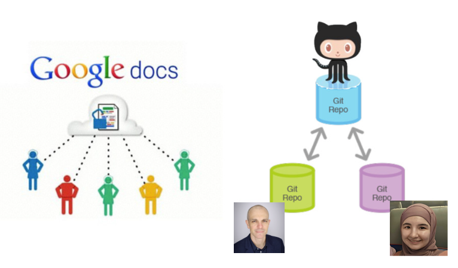
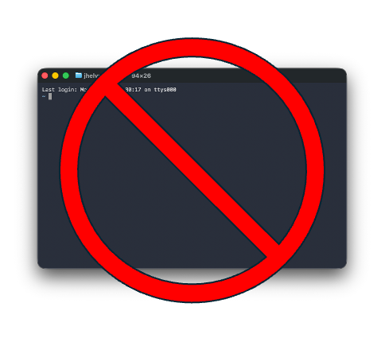
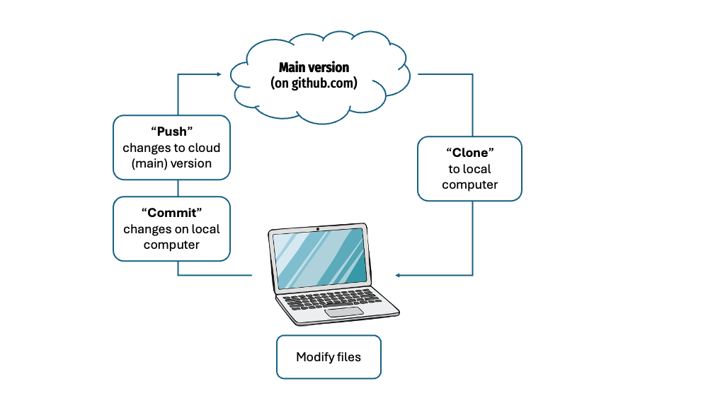
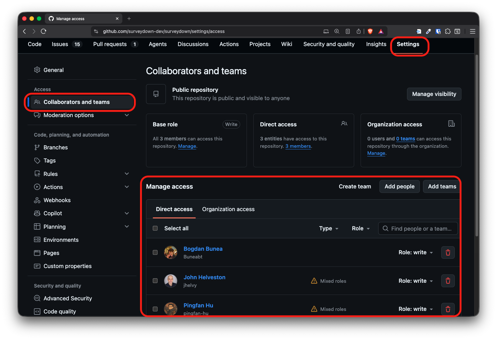



```{r}
#| include: false

agenda_items <- c(
  "Version Control with GitHub",
  "Setting Up & Using Claude Code",
  "Modes & Slash Commands",
  "Skills",
  "Working Safely"
)

defense_items <- c(
  "Ask for code, not results",
  "Run sanity-checks",
  "Use fake data"
)

# Re-usable "Defense Strategies" title slide — call once per item as you get
# to it (defense_strategies(1), then more slides, then defense_strategies(2),
# etc.) instead of copy-pasting the slide with a different line colored.
defense_strategies <- function(highlight = NULL) {
  lines <- c(
    "",
    "",
    "# [Defense Strategies]{.center}<br>",
    '::: {.col width="10%"}',
    ":::",
    '::: {.col width="90%"}',
    ""
  )
  for (i in seq_along(defense_items)) {
    item <- defense_items[i]
    if (!is.null(highlight) && i == highlight) {
      item <- sprintf("[%s]{.orange}", item)
    }
    lines <- c(lines, sprintf("## %d. %s", i, item))
  }
  lines <- c(lines, ":::")
  cat(lines, sep = "\n\n")
}
```

---

```{r}
#| echo: false
#| results: asis

agenda(0)
```

---

```{r}
#| echo: false
#| results: asis

agenda(1)
```

---



{width=50%}

VCS = Version Control System

Original domain: **software development**

Git = The most popular VCS

Our domain: **data analysis & agentic workflows**

---




# We collaborate using git on github.com

{width=70%}

---




# We won't use `git` in a terminal 

## (you can if you want to)

{width=50%}

---




Everything is a **button in GitHub Desktop**

{fig-align="center" width=90%}

---




## The github workflow

{width=90%}

---

# [Git vocabulary you should know]{.center}

<br>

::: {.col .fragment}
### ["repo"]{.center}
A project folder that<br>**tracks its own history**<br><br>**Example**: course website: [https://github.com/emse-eda-gwu/2026-Fall](https://github.com/emse-eda-gwu/2026-Fall)
:::

::: {.col .fragment}
### ["commit"]{.center}
A **labeled save point** — "this is a state worth remembering"
:::

::: {.col .fragment}
### ["push" / "pull"]{.center}
Send / recieve your commits **up to GitHub**<br>(the cloud copy)
:::

---



# The GitHub Desktop loop

<br>

::: {.font110 .darkgreen}
**Changes** (locally on your computer) → **Commit** (with a message) → **Push**
:::

---



# Write commit messages you'd thank yourself for

<br>

::: {.col}
###  [Useless]{.red}

- `stuff`
- `update`
- `asdf`
- `fixed it`
:::

::: {.col}
###  [Useful]{.darkgreen}

- `Add flights bar chart`
- `Fix airline join dropping NAs`
- `Clean column names in import`
:::

<br>

::: {.font110 .center}
A message is a note to **future you** — the one scrolling History<br>trying to find where it broke.
:::

---



::: {.font200 .fancy .center}
Checkpoint 
:::

<br>

::: {.font120}
You already ran the solo loop in **HW1** — let's make sure it stuck.

1. In **GitHub Desktop**, confirm your **`eda-practice`** repo is there
2. Open it on **GitHub.com** — can you see your commit in **History**?
3. **Thumbs up** once you can see your pushed change online
:::

<br>

::: {.font100 .center}
Missing it, or joined the class late?

Flag me now — grab the steps from [HW1](https://eda.seas.gwu.edu/2026-Fall/hw/1-agentic-workflows.html) or this [2-min walkthrough](https://youtu.be/VlD8N0ZClBo)
:::

```{r}
#| echo: false
countdown(minutes = 3, warn_when = 30, top = 0, right = 0, font_size = "2em")
```

---





# How do I collaborate with others?

---



## Add collaborators in repo settings

{fig-align="center" width=80%}

---



## Two new moves

::: {.col .fragment .center}
### "clone"
Make your own **local copy** <br> of someone else's repo
:::

::: {.col .fragment .center}
### "pull request" (PR)
**Propose your changes** back <br> they review, then **merge**
:::

<br>

::: {.font110 .center .fragment}
You work on a **branch**, so their `main` is untouched<br>until they say *yes*.
:::

---

# [Why work on a branch?]{.center}

<br>

::: {.col}
###  [On a branch]{.darkgreen}

- Their `main` stays **untouched**
- You experiment freely
- Nothing lands until it's **approved**
:::

::: {.col}
###  [Straight to `main`]{.red}

- Your half-done work **is** the project
- No review step
- Mistakes hit everyone at once
:::

. . .

<br>

::: {.font110 .center}
A branch is a **sandbox**. The pull request is where they say *yes, bring it in.*
:::

---




<br>

::: {.font110 .darkgreen}
**New Branch** → **Commit** on branch → **Make PR** → **Merge** to `main`
:::

# Pull request loop

{fig-align="center" width=100%}

---



::: {.font200 .fancy .center}
Your turn
:::

<br>

::: {.center}
**Team up and send your partner a pull request**
:::

<br>

::: {.font90}

1. Pair with a neighbor. In *your* `eda-practice` repo on GitHub.com:<br>**Settings › Collaborators** → add your partner's GH username → they **accept** the emailed invite
2. Swap repo links. In GitHub Desktop, **File › Clone Repository** → clone *your partner's* repo
3. **Branch › New Branch** → name it `new-edits`
4. Edit their `README.md` in Positron → **Commit** to your branch → **Publish branch**
5. Click **Create Pull Request** → describe your change → submit it on GitHub.com
6. Back on *your* repo, review your partner's PR and **Merge** it
:::

```{r}
#| echo: false
countdown(minutes = 10, warn_when = 60, top = 0, right = 0, font_size = "2em")
```

---





# In GitHub, you can contribute to *any* public repo

---

```{r}
#| echo: false
#| results: asis

agenda(2)
```

---

# [Assistants vs. Agents]{.center}

<br>

::: {.col}
### [Assistants]{.blue}

**One-off tasks**

- ChatGPT · Claude · Gemini
- Daily questions, small tasks
- A smarter search engine
:::

::: {.col}
### [Agents]{.orange}

**Full project workflows**

- Claude Code · Codex · Gemini CLI
- **Edit your files**, run commands
- Carry a project forward over time
:::

<br>

::: {.font120 .center}
This class lives on the [**agent**]{.orange} side.
:::

---



# [Agent = model + skills + files]{.center}

<br>

::: {.col .center}
### [Model]{.purple}
The reasoning<br>*(Claude)*
:::

::: {.col .center}
### [Skills]{.darkgreen}
Reusable know-how<br>*(slash commands)*
:::

::: {.col .center}
### [Files]{.orange}
Your project<br>*(the folder it works in)*
:::

<br>

::: {.font110 .center}
Claude Code is the agent. **You** supply the project and the direction.
:::

---



# [An agent can do almost anything with files]{.center}

<br>

::: {.card .center cols="4" color="purple"}


### Write code
:::

::: {.card .center color="darkgreen"}


### Debug & refactor
:::

::: {.card .center color="dodgerblue"}


### Analyze data
:::

::: {.card .center color="purple"}


### Generate images
:::

::: {.card .center color="orange"}


### Summarize docs
:::

::: {.card .center color="darkgreen"}


### Write & edit prose
:::

::: {.card .center color="gray"}


### Automate tasks
:::

::: {.card .center color="red"}


### Build HTML
:::

--- 

# [Claude Code is an agent (a particular "harness")]{.center}

<br>

Other agents:

::: {.col}
### [[Gemini CLI](https://github.com/google-gemini/gemini-cli)]{.blue}
Google's open-source terminal agent
:::

::: {.col}
### [[Codex](https://openai.com/codex/)]{.darkgreen}
OpenAI's coding agent (CLI + cloud)
:::

---

# [Using Claude code in Positron]{.center}

<br>

## 1. Make a folder (no spaces in the name)

::: {.fragment}
## 2. In Positron: **File › Open Folder…** and pick it
:::

::: {.fragment}
## 3. In the terminal pane, type `claude` and press Enter
:::

---



# [Your first agentic project:<br>**a Quarto website**]{.center}

::: {.font120}
Direct the agent to build a multi-page Quarto website about **someone you admire (a scientist, athlete, artist, etc.)**
:::

1. Using GitHub Desktop, make a new repo called `my-website` like you did in the HW (include a `README` file). Make it `public` (not `private`), and publish it to GitHub.
2. On your computer, open Positron, then open the folder of the repo. 
3. Launch `claude` in terminal.
4. Prompt Claude for a mutli-page **Quarto website** about someone you admire.
5. When it's done, ask it to render the site (if it didn't already).
6. Open the `index.html` file in the `_site` folder.
7. If satisfied with the site, **commit + push** it to GitHub.

```{r}
#| echo: false
countdown(minutes = 15, warn_when = 120, top = 0, right = 0, font_size = "2em")
```

---



# [Bonus: publish your site with GitHub Pages]{.center}

<br>

1. Ask Claude to change the Quarto output folder from `_site` to `docs` (edit `_quarto.yml`'s `output-dir`), then re-render.
2. **Commit + push** your changes to GitHub.
3. On GitHub.com, go to your repo's **Settings › Pages**.
4. Under **Build and deployment**, set **Source: Deploy from a branch**, **Branch: `main`**, **Folder: `/docs`** → **Save**.
5. Wait a minute, then visit the URL GitHub shows you at the top of the Pages settings page.


---

```{r}
#| echo: false
#| results: asis

agenda(3)
```

---



## [Four modes of Claude Code]{.center}

<br>

::: {.card .icon-left cols="2" color="dodgerblue"}


### Plan

Make a plan before doing big work.

[read-only]{.tag}
:::

::: {.card .icon-left color="gray"}


### Manual

Approve or deny each edit.

[safe but slow]{.tag}
:::

::: {.card .icon-left color="darkgreen"}


### Accept Edits

Auto-applies file edits.

[semi engagement]{.tag}
:::

::: {.card .icon-left color="orange"}


### Auto

Approves EVERYTHING.

[full file access, use with care]{.tag}
:::
 
::: {.font130 .center}
Press [**shift + tab**]{.blue} to cycle through them
:::

::: {.font110 .center}
The current mode always shows at the **bottom of the prompt box**
:::

---



# [Modes are your permission dial]{.center}

<br>

::: {.font120 .center}
[plan]{.blue} &nbsp;→&nbsp; [manual]{.gray} &nbsp;→&nbsp; [accept edits]{.darkgreen} &nbsp;→&nbsp; [auto]{.orange}
:::

::: {.font110 .center}
[less freedom, more supervision]{.gray} &emsp;&emsp; [more freedom, less supervision]{.gray}
:::

<br>

. . .

::: {.font110 .center}
Give more autonomy to Claude when<br>you have a _very_ clear step-by-step plan
:::

<br>

::: {.font110 .red .center}
Whatever the mode, **git is your safety net.**<br>Commit before you let the agent run loose.
:::


---



# More control over session with slash commands

<br>

::: {.font110}
Five you'll reach for constantly:
:::

::: {.font120 .center}
`/init` &ensp;·&ensp; `/model` &ensp;·&ensp; `/effort` &ensp;·&ensp; `/clear` &ensp;·&ensp; `/compact`
:::

---

# `CLAUDE.md`: standing instructions

::: {.font110}
- A plain markdown file the agent **reads at the start of every session**
- It's your project's **house rules** — what this project is, how to run it, what you want done differently
- Keep it **high-level**, not exhaustive; refresh it at milestones
:::

<br>

::: {.col}
**Project** `CLAUDE.md`<br>[rules for *this* repo, shared with anyone who clones it]{.gray}
:::

::: {.col}
**Home** `~/.claude/CLAUDE.md`<br>[rules for *everything* you do, on your machine only]{.gray}
:::

---

# `/init` — let the agent write `CLAUDE.md` for you

<br>

::: {.font110}
You don't write `CLAUDE.md` from scratch. `/init` is a **prompt that tells Claude to go read your project and describe it back to you.**
:::

<br>

::: {.font110}
When you run it, Claude:

1. Walks the folder — file tree, `README`, config files, existing code
2. Works out **what the project is** and **how it gets built or run**
3. Writes `CLAUDE.md` in the project root
:::

---

# What `/init` actually produces

::: {.font110}
A short file, roughly:
:::

::: {.font90}
```markdown
# CLAUDE.md

## Project overview
A multi-page Quarto website about Ada Lovelace.

## Building
`quarto render` builds the site to `_site/`.
`quarto preview` for live preview.

## Structure
- `index.qmd` — home page
- `_quarto.yml` — site config & navbar
```
:::

. . .

::: {.font110 .center}
Notice it's **all things you could have written yourself** —<br>the agent just saved you the typing.
:::

---

# `/init` is a *draft*, not gospel

::: {.font110}
Claude is **guessing** from what it can see. It gets things wrong.
:::

<br>

::: {.col}
###  Always read it
- Is the description right?
- Are the build commands real?
- Did it invent a convention you don't follow?
:::

::: {.col}
###  Then edit it by hand
- Delete what's wrong or obvious
- Add rules it can't know:<br>*"charts use `theme_minimal_hgrid()`"*
- Re-run `/init` only after big changes
:::

. . .

<br>

::: {.font110 .red .center}
This file steers **every future session**<br>A wrong line in `CLAUDE.md` is a mistake you'll make over and over
:::

---

# [`/model` — pick the right **brain** for the job]{.center}

<br>

Model         | Good for
--------------|--------------------------------------------
**Opus**      | Hard reasoning, tricky bugs, big refactors
**Sonnet**    | Everyday work — fast, capable, cheaper
**Haiku**     | Quick, simple, high-volume tasks

<br>

::: {.font110 .center}
`/model` switches anytime. Bigger isn't always better.<br>**Match the model to the task**.
:::

---

# [`/effort` — how *hard* the model thinks]{.center}

<br>

::: {.font110 .center}
Same model, different amount of thinking before it acts.
:::

Level         | What it's for
--------------|--------------------------------------------
`low`         | Simple, mechanical edits — fastest, cheapest
`medium`      | Everyday work
`high`        | Multi-step tasks, debugging, design decisions
`xhigh`       | Genuinely hard problems — slowest, most expensive

<br>

::: {.font110 .center}
`/effort auto` returns to your model's default.
:::

---

# [`/model` vs. `/effort`]{.center}

<br>

::: {.col}
### `/model`
**Which brain.**

Changes the underlying capability — reasoning ability, speed, cost per token.
:::

::: {.col}
### `/effort`
**How long it thinks.**

Same brain, more deliberation before it starts editing files.
:::

. . .

<br>

General rules of thumb: 

- Turn effort **up** when the hart part is ***deciding what to do***
- Turn effort **down** when **you already know exactly what you want**

---

# `/clear` vs. `/compact` — managing memory

<br>

::: {.col}
### `/clear`

**Wipe the slate.**

- Forgets the whole conversation
- Fresh start, empty context
- Use it **between unrelated tasks**
:::

::: {.col}
### `/compact`

**Summarize and continue.**

- Condenses the chat so far
- Keeps the gist, frees up room
- Use it **mid-task** when things get long
:::

. . .

<br>

::: {.font110 .red .center}
Agents have **limited memory**<br>Unfocused context makes the agent *slower and dumber*
:::

---



# [Your turn]{.center}

::: {.font120 .center}
Go back to your `my-website` repo
:::

::: {.font110}
1. Run `/init` — then **open the `CLAUDE.md` it wrote and read it.** Is it right? Fix anything wrong, and add one rule of your own.
2. Run `/model` and `/effort` to see your options.
3. Ask for a **small** change (new page, tweak the navbar) at `/effort low`.
4. Hit **shift + tab** into **plan mode**, then ask for something harder, e.g., "*collapse everything into a single page website*" at `/effort high`. Read the plan before you approve it.
5. `/compact`, then keep going — it should still know what you're building.
6. `/clear`, then ask *"what am I working on?"* — see what it lost, and what `CLAUDE.md` saved.
7. **Commit + push** your changes to GitHub.
:::

```{r}
#| echo: false
countdown(minutes = 15, warn_when = 60, top = 0, right = 0, font_size = "2em")
```

---

```{r}
#| echo: false
#| results: asis

agenda(4)
```

---

# Skills: a command that wraps a whole recipe

<br>

`/init`, `/clear`, `/effort`, etc. are **built in** with Claude Code

<br>


A **skill** is a slash command *you* define that teaches the agent one of **your** recipes.

. . .

<br>

::: {.col}
### Why they help
-  Save time
-  Reproducible
-  Stable & consistent
:::

::: {.col}
### Using one
- Live in `~/.claude/skills/`<br>[(or `.claude/skills/` in a repo)]{.gray}
- Invoke with `/skill-name`
- We'll try one for **charts**: `/my-chart-style`
:::

---

# A skill in action: [`/my-chart-style`]{.blue}

Same request — *"mean departure delay by airline, as a bar chart"* :

```{r}
#| include: false

library(here)

flights <- read_csv(here("data", "flights.csv"))
airlines <- read_csv(here("data", "airlines.csv"))

delay_by_airline <- flights |>
  left_join(airlines, by = "carrier") |>
  group_by(name) |>
  summarize(mean_dep_delay = mean(dep_delay, na.rm = TRUE)) |>
  filter(!is.na(name), !is.nan(mean_dep_delay))
```

::: {.col}
[**Without** the skill]{.red}

```{r}
#| echo: false
#| fig-width: 6
#| fig-height: 4.6

ggplot(delay_by_airline, aes(x = mean_dep_delay, y = name)) +
  geom_col()
```
:::

::: {.col}
[**With** the skill]{.darkgreen}

```{r}
#| echo: false
#| fig-width: 6
#| fig-height: 4.6

font <- "sans"

delay_by_airline |>
  ggplot(aes(x = mean_dep_delay, y = reorder(name, mean_dep_delay))) +
  geom_col(fill = "#80C5DCFF", width = 0.8) +
  scale_x_continuous(expand = expansion(mult = c(0, 0.05))) +
  labs(
    x = "Mean departure delay (minutes)",
    y = NULL,
    title = "Some airlines leave late more than others",
    caption = "Data source: nycflights13"
  ) +
  theme_minimal_vgrid(font_family = font) +
  theme(
    plot.title.position = "plot",
    plot.caption.position = "plot",
    plot.caption = element_text(hjust = 0, face = "italic"),
    panel.background = element_rect(fill = "white", color = NA),
    plot.background = element_rect(fill = "white", color = NA)
  )
```
:::

---

# What this skill defines

<br>

- a `cowplot` package minimal theme (gridlines matched to the plot)
- white background, de-cluttered gridlines
- a consistent color palette + sorted bars
- a title / caption that state the point and the source

<br>

::: {.font110 .darkgreen .center}
Learn the conventions once → **encode them in a skill**
:::

---



::: {.font200 .fancy .center}
Your turn
:::

::: {.center}
**See the difference a skill makes**
:::

::: {.font120}

1. Ask Claude to copy the `my-chart-style` skill from today's class folder into `.claude/skills/` in your project (create the folder if it doesn't exist)
2. Come up with a chart you'd like to see that uses the `flights.csv` data.
3. Ask Claude for a chart first **without** the skill, then again invoking **`/my-chart-style`**.
4. Modify the skill, then re-create the chart again with the modified skill (e.g., tell it a specific color to use for all charts, tell it to use a different theme, etc.) 
:::

```{r}
#| echo: false
countdown(minutes = 15, warn_when = 60, top = 0, right = 0, font_size = "2em")
```

---

```{r}
#| echo: false
#| results: asis

agenda(5)
```

---



# Agents will be *confidently wrong*

<br>

. . .

They won't say *"I'm not sure"*

<br>

[Fast]{.red} &nbsp;≠&nbsp; [Better]{.darkgreen}

<br>

Throughput goes up, but **quality is not guaranteed**

---

```{r}
#| echo: false
#| results: asis

defense_strategies(1)
```

---



# The pipeline hasn't changed

<br>

::: {.font140 .center}
[`data.csv`]{.blue} &nbsp;→&nbsp; [`script.R`]{.purple} &nbsp;→&nbsp; [`figure.png`]{.darkgreen}
:::

<br>

::: {.font110 .center}
Raw data in, a script in the middle, a result out.<br>That's still the whole job — agent or not.
:::

---

# [Same workflow, with or without AI]{.center}

<br>

::: {.col}
###  [By hand]{.red}

- Set up the project
- Build the scripts
- Run it
- **Verify the output**
:::

::: {.col}
###  [With AI]{.darkgreen}

- Set up the project
- Build the scripts
- Run it
- **Verify the output** <- Still yours
:::

. . .

<br>

::: {.font110 .center}
AI can do the first three. [**Verifying the output is still yours.**]{.red}
:::

---



# Agents rarely make a syntax mistake

<br>

- No typos
- No missing brackets
- A tidy `input/` `scripts/` `output/` layout
:::

<br>

. . .

::: {.font130 .center .darkgreen}
But **running** isn't the same as **right**.
:::

<br>

::: {.font120 .center}
**You are still the gatekeeper for the results.**
:::

---

```{r}
#| echo: false
#| results: asis

defense_strategies(2)
```

---



# [Verify against an *independent* check]{.center}

<br>

::: {.center}
Don't ask the agent if it's right — it'll say yes.<br> Check it a way it **can't fake**:
:::

<br>

::: {.col}
###  A published number

Codebook, prior paper,<br>official table
:::

::: {.col}
###  A hand calculation

Back-of-envelope,<br>done by *you*
:::

::: {.col}
###  A second analyst

Different chat, different<br>prompt, different model
:::

---



# Your verification checklist

<br>

::: {.font110}
Run these every time — they're the skill this whole course is really about:

- Did **row / column counts** change the way I expected?
- Did I **read the code**, not just the summary?
- Did I **spot-check** a few values against the source file?
- Were rows **silently dropped** (`NA` handling, inner vs. left join)?
- Do **totals / aggregates** make sense?
- Is it **reproducible**, or did it hard-code an answer?
:::

---



# What a sanity-check script looks like

<br>

::: {.font110}
-  row count survived the merge — [1,200 → 1,200]{.darkgreen}
-  every ID appears once — [0 duplicates]{.darkgreen}
-  a percentage above 100% — [check the units]{.orange}
:::

<br>

::: {.font110 .center}
Two checks passed silently. **One caught something real.**
:::

---

```{r}
#| echo: false
#| results: asis

defense_strategies(3)
```

---



# Sometimes you *can't* hand over the data

<br>

- Medical records.
- Student grades. 
- Proprietary sales figures.
- Anything under an NDA or an IRB protocol.

<br>

. . .

::: {.font120 .center .darkgreen}
Make **fake data with the same shape**, and work on that instead.
:::

---



# The better reason: [you know the answer]{.blue}

<br>

::: {.font110}
Real data has no answer key. **Fake data does — you wrote it.**
:::

<br>

. . .

::: {.font110}
Plant exactly 3 duplicate IDs. Plant exactly 12 `NA`s.<br>Set the mean to exactly 50.
:::

<br>

. . .

::: {.font120 .center}
If the script doesn't find them, [the *script* is wrong]{.red} — not the data.
:::

---

# The fake-data workflow

<br>

::: {.font110}
1. Build a **small fake table** with the same columns and types as the real thing
2. Have the agent write the script against **that**
3. Check the result against the answer **you** planted
4. Run the *same script* on the real data — on your machine
:::

<br>

. . .

::: {.font120 .center .darkgreen}
The agent never sees the real data. **The script still works on it.**
:::

---

# [`charlatan`]{.blue}: fake data in R

::: {.col .font80}
```r
install.packages("charlatan")
library(charlatan)

ch_name()
#> "Dr. Garey Hamill"

ch_job()
#> "Corporate investment banker"

# reproducible, like any RNG in R
set.seed(42)
```
:::

::: {.col .font80}
```r
# a whole data frame at once
ch_generate("name", "job", "phone_number", n = 5)

#> # A tibble: 5 x 3
#>   name             job                 phone_number
#>   <chr>            <chr>               <chr>
#> 1 Dr. Garey Hamill Corporate inves...  1-536-993-1904
#> 2 Elmer Rippin     Herbalist           (901)584-4419
#> ...
```
:::

<br>

::: {.font105 .center}
Also emails, addresses, colors, coordinates, credit cards, DOIs — and other locales:<br>`ch_job(locale = "fr_FR", n = 3)`
:::

---

# Same idea in Python: [`faker`]{.blue}

::: {.col .font80}
```bash
pip install Faker
```

```python
from faker import Faker
fake = Faker()

fake.name()
#> 'Lucy Cechtelar'

fake.email()
#> 'tremblay.noe@example.org'
```
:::

::: {.col .font80}
```python
# reproducible
Faker.seed(4321)

# other locales
fake = Faker('fr_FR')

# build rows however you like
[fake.name() for _ in range(5)]
```
:::

<br>

::: {.font105 .center}
 &nbsp;`charlatan` is an R port of this package — [same idea, either language]{.gray}<br>
[github.com/joke2k/faker]{.font90}
:::

---



::: {.font200 .fancy .center}
Practice 5
:::

::: {.font120}
**Catch the bug.**

I've given Claude a task where its *first answer is wrong.* Find it with the checklist.

1. Ask Claude to join `flights.csv` with `airlines.csv` and count flights per airline
2. **Something is off.** Verify before you believe it.
3. When you catch it, tell Claude *specifically* what's wrong and have it fix it
4. **Commit** the fix with a message that says what was broken
:::

```{r}
#| echo: false
countdown(minutes = 18, warn_when = 120, top = 0, right = 0, font_size = "2em")
```

---

# The catch is the whole job

::: {.font120}
An agent can write the code. [It cannot know if the answer is *true*.]{.red}
:::

. . .

::: {.font120}
*Plausible* is not the same as *correct*. *Reproducible* is not the same as *defensible*.
:::

. . .

::: {.font120 .darkgreen}
**That part is yours.** It's what you're actually being graded on.
:::

---





# [Wrap-up]{.fancy}

---

# Today, in one slide

::: {.font120 .center}
**prompt** [→]{.gray} **read the diff** [→]{.gray} **verify** [→]{.gray} **commit / push**
:::

::: {.font110}
- You can **make a repo and push** with a button
- You can **set up and direct Claude Code** — and read what it does
- You know `/init`, `/model`, `/effort`, `/clear`, `/compact`, `CLAUDE.md`, skills, and **modes**
- You know the agent **lies with confidence** — and you have a checklist
:::

---

# Before next week

::: {.font110}
- Finish pushing today's work to your `eda-practice` repo
- **Reading reflection:** read forward on tidy data + joins, try the light practice, reflect
- Next week: **Cleaning, Reshaping & Joining** — same loop, on real data
:::

. . .

<br>

::: {.font130 .fancy .darkgreen .center}
Direct boldly. Verify relentlessly.
:::

---





# Use [this link](https://docs.google.com/spreadsheets/d/1cXNvWVfZ-WN4oLqbhv76cFTXPBi0KCiQdkCG7ivm7i4/edit?usp=sharing) to form teams
