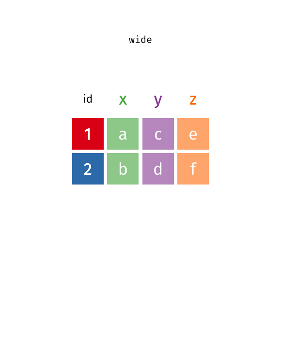
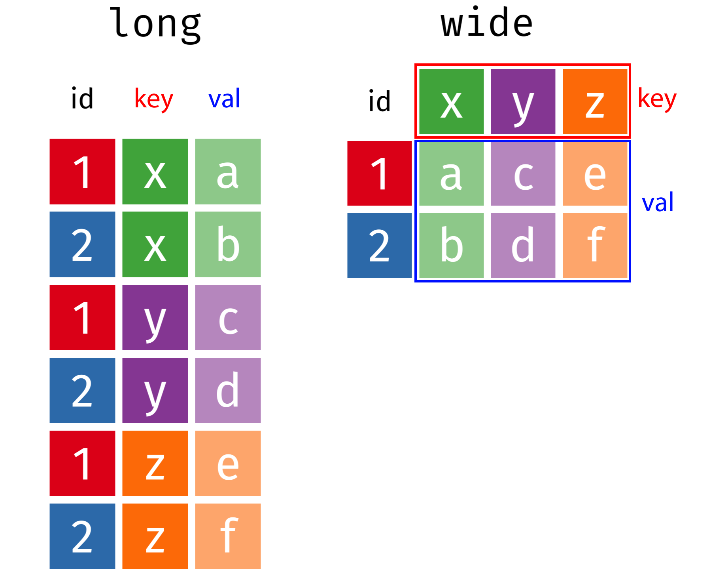
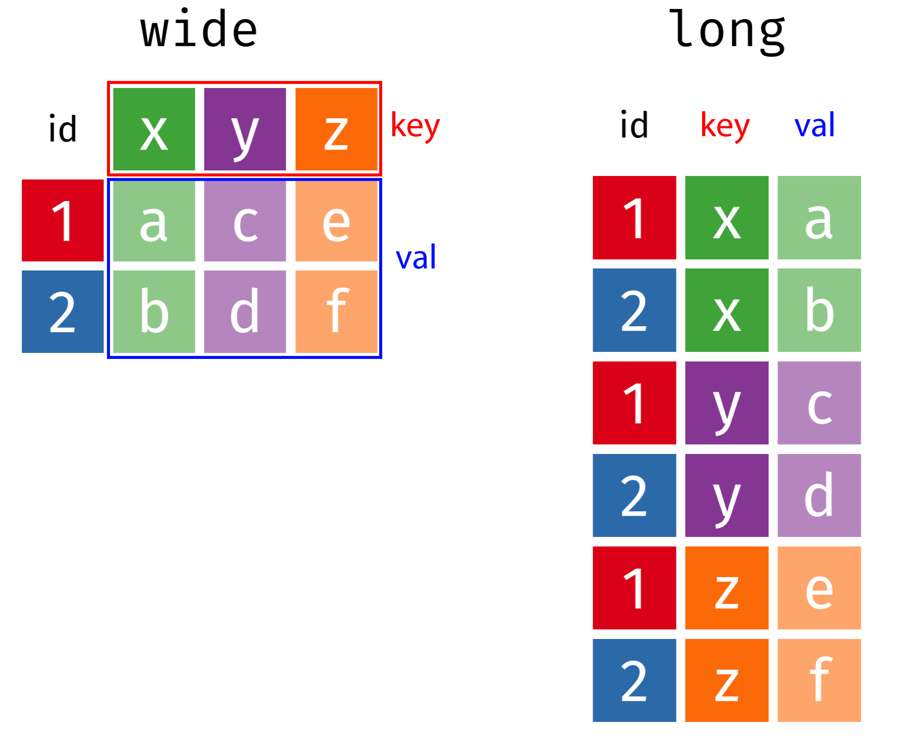



```{r}
#| include: false

agenda_items <- c(
  "Tidy Data",
  "Tidy Data Wrangling",
  "Tidy Data Visualization",
  "Data Provenance & Curation",
  "Writing a Research Question"
)

library(here)
library(ggrepel)
library(readxl)

# Read in data sets for class
tb_cases <- read_csv(here('data', 'tb_cases.csv'))
milk_production <- read_csv(here('data', 'milk_production.csv'))
fed_spend_long <- read_csv(here('data', 'fed_spend_long.csv'))
fed_spend <- fed_spend_long
fed_spend_wide <- read_csv(here('data', 'fed_spend_wide.csv'))
lotr_words <- read_csv(here('data', 'lotr_words.csv'))
pv_cells <- read_excel(
    here('data', 'pv_cell_production.xlsx'),
    sheet = 'Cell Prod by Country', skip = 2) %>%
  mutate(Year = as.numeric(Year)) %>%
  filter(!is.na(Year))

fed_spend_bars <- ggplot(fed_spend_long) +
  geom_col(
    aes(x = rd_budget_mil, y = reorder(department, rd_budget_mil)),
    width = 0.7, alpha = 0.8
  ) +
  theme_bw(base_size = 15) +
  labs(
    x = "R&D Spending ($Millions)",
    y = "Federal Agency"
  )
```

---

```{r}
#| echo: false
#| results: asis

agenda(0)
```

---

```{r}
#| echo: false
#| results: asis

agenda(1)
```

---

## [Federal R&D Spending by Department]{.center}

```{r}
#| echo: false

head(fed_spend_wide)
```

---

## [Federal R&D Spending by Department]{.center}

::: {.col width="60%"}
# "Wide" format

::: {.font70}
```{r}
#| echo: false

head(fed_spend_wide)
```
:::
:::

::: {.col width="40%" .fragment}
# "Long" format

::: {.font70}
```{r}
#| echo: false

head(fed_spend_long)
```
:::
:::

---

## [Federal R&D Spending by Department]{.center}

::: {.col width="60%"}
# "Wide" format

::: {.font70}
```{r}
#| echo: false

head(fed_spend_wide)
dim(fed_spend_wide)
```
:::
:::

::: {.col width="40%"}
# "Long" format

::: {.font70}
```{r}
#| echo: false

head(fed_spend_long)
dim(fed_spend_long)
```
:::
:::

---

# [Tidy data = "Long" format]{.center}

- Each **variable** has its own **column**
- Each **observation** has its own **row**

{width="1000"}

---

::: {.col}
# Tidy data

- Each **variable** has its own **column**
- Each **observation** has its own **row**
:::

::: {.col}
```{r}
#| echo: false

head(fed_spend_long)
```
:::

{width="1000"}

---

::: {.col width="40%"}
# "Long" format

::: {.font70}
```{r}
#| echo: false

head(fed_spend_long)
```
:::
:::

::: {.col width="60%"}
# "Wide" format

::: {.font70}
```{r}
#| echo: false

head(fed_spend_wide)
```
:::
:::

---

# [**Do the names describe the values?**]{.center}

::: {.col width="40%"}
## **Yes**: "Long" format

::: {.font70}
```{r}
#| echo: false

head(fed_spend_long)
```
:::
:::

::: {.col width="60%"}
## **No**: "Wide" format

::: {.font70}
```{r}
#| echo: false

head(select(fed_spend_wide, year:HHS))
```
:::
:::

---

# **Quick practice 1**: "long" or "wide" format?

**Description**: Tuberculosis cases in various countries

```{r}
#| echo: false

tb_cases
```

---

# **Quick practice 2**: "long" or "wide" format?

**Description**: Word counts in LOTR trilogy

::: {.font90}
```{r}
#| echo: false

lotr_words
```
:::

---

# **Quick practice 3**: "long" or "wide" format?

**Description**: Word counts in LOTR trilogy

```{r}
#| echo: false

lotr_words %>%
    pivot_longer(
        cols = Female:Male,
        names_to = "Gender",
        values_to = "Word_Count"
    ) %>%
    head(15)
```

---





# Reshaping data with

## `pivot_longer()` and `pivot_wider()`

---



::: {.col width="40%"}
# Reshaping data

## `pivot_longer()`<br>`pivot_wider()`
:::

::: {.col width="60%"}
{width="530"}
:::

---

## [From "long" to "wide" with `pivot_wider()`]{.center}

{width="600"}

---

## [From "long" to "wide" with `pivot_wider()`]{.center}

::: {.col width="45%"}
```{r}
head(fed_spend_long)
```
:::

::: {.col width="55%"}
```{r}
#| code-line-numbers: "3,4"

fed_spend_wide <- fed_spend_long %>%
    pivot_wider(
        names_from  = department,
        values_from = rd_budget_mil
    )

head(fed_spend_wide)
```
:::

---

## [From "wide" to "long" with `pivot_longer()`]{.center}

{width="600"}

---

## [From "wide" to "long" with `pivot_longer()`]{.center}

::: {.col width="45%"}
```{r}
head(fed_spend_wide)
```
:::

::: {.col width="55%"}
```{r}
#| code-line-numbers: "3,4,5"

fed_spend_long <- fed_spend_wide %>%
    pivot_longer(
        names_to  = "department",
        values_to = "rd_budget_mil",
        cols      = DOD:Other
    )

head(fed_spend_long)
```
:::

---

## Can also set `cols` by selecting which columns _not_ to use

::: {.col width="45%"}
```{r}
names(fed_spend_wide)
```
:::

::: {.col width="55%"}
```{r}
#| code-line-numbers: "5"

fed_spend_long <- fed_spend_wide %>%
    pivot_longer(
        names_to  = "department",
        values_to = "rd_budget_mil",
        cols      = -year
    )

head(fed_spend_long)
```
:::

---



```{r}
#| echo: false

countdown(
  minutes = 15,
  warn_when = 15,
  update_every = 1,
  top = 0,
  right = 0,
  font_size = "2em"
)
```

# Your turn: Reshaping Data

Open the `practice.qmd` file.

Run the code chunk to read in the following two data files:

- `pv_cell_production.xlsx`: Data on solar photovoltaic cell production by country
- `milk_production.csv`: Data on milk production by state

Now modify the format of each:

- If the data are in "wide" format, convert it to "long" with `pivot_longer()`
- If the data are in "long" format, convert it to "wide" with `pivot_wider()`

---

```{r}
#| echo: false
#| results: asis

agenda(2)
```

---





# Why do we need tidy data?

(a quick explanation with cute graphics, by [Allison Horst](https://github.com/allisonhorst/stats-illustrations))

---



---



---



---

# Tidy data wrangling

Compute the total R&D spending in each year

```{r}
head(fed_spend_wide)
```

---

# Tidy data wrangling

Compute the total R&D spending in each year

**Approach 1**: Create new `total` by adding each variable

```{r}
fed_spend_wide %>%
  mutate(total = DHS + DOC + DOD + DOE + DOT + EPA + HHS + Interior + NASA + NIH + NSF + Other + USDA + VA) %>%
  select(year, total)
```

---

# Tidy data wrangling

Compute the total R&D spending by department in each year

**Approach 2**: Reshape first, then summarise

::: {.col}
```{r}
fed_spend_long <- fed_spend_wide %>%
    pivot_longer(
        names_to = "department",
        values_to = "rd_budget_mil",
        cols = -year)

head(fed_spend_long)
```
:::

::: {.col .fragment}
```{r}
fed_spend_long %>%
    group_by(year) %>%
    summarise(total = sum(rd_budget_mil))
```
:::

---

# Tidy data wrangling

Compute the total R&D spending by department in each year

**Approach 2**: Reshape first, then summarise

::: {.col}
```{r}
annual_spending <- fed_spend_wide %>%
    pivot_longer(
        names_to = "department",
        values_to = "rd_budget_mil",
        cols = -year
    ) %>%
    group_by(year) %>%
    summarise(total = sum(rd_budget_mil))
```
:::

::: {.col}
```{r}
head(annual_spending)
```
:::

---

# Tidy data wrangling

Compute the total R&D spending by department in each year

**Approach 2**: Reshape first, then summarise

::: {.col}
```{r}
total <- fed_spend_wide %>%
    pivot_longer(
        names_to = "department",
        values_to = "rd_budget_mil",
        cols = -year) %>%
    group_by(year) %>%
    summarise(total = sum(rd_budget_mil))
```
:::

::: {.col}
```{r}
head(total)
```
:::

---



```{r}
#| echo: false

countdown(
  minutes = 12,
  warn_when = 15,
  update_every = 1,
  top = 0,
  right = 0,
  font_size = "2em"
)
```

# Your turn: Tidy Data Wrangling

Open the `practice.qmd` file.

Run the code chunk to read in the following two data files:

- `gapminder.csv`: Life expectancy in different countries over time
- `gdp.csv`: GDP of different countries over time

Now convert the data into a tidy (long) structure, then create the following summary data frames:

- Mean life expectancy in each year.
- Mean GDP in each year.

---




# [Break]{.fancy}

```{r}
#| echo: false

countdown(
  minutes = 5,
  warn_when = 30,
  update_every = 1,
  left = 0,
  right = 0,
  top = 1,
  bottom = 0,
  margin = "5%",
  font_size = "8em"
)
```

---

```{r}
#| echo: false
#| results: asis

agenda(3)
```

---

# Tidy data vizualization

Make a bar chart of total R&D spending by agency

::: {.col width="55%"}
```{r}
head(fed_spend_wide)
```
:::

::: {.col width="45%"}
```{r}
#| echo: false

fed_spend_bars
```
:::

---

# Tidy data vizualization

Make a bar chart of total R&D spending by agency

::: {.col width="55%"}
```{r}
#| error: true
#| fig-show: hide
#| code-line-numbers: "2"

ggplot(fed_spend_wide) +
  geom_col(aes(x = rd_budget_mil, y = department)) +
  theme_bw() +
  labs(
      x = "R&D Spending ($Millions)",
      y = "Federal Agency"
  )
```
:::

::: {.col width="45%"}
```{r}
#| echo: false

fed_spend_bars
```
:::

---

# Tidy data vizualization

Make a bar chart of total R&D spending by agency

::: {.col width="55%"}
```{r}
#| error: true
#| fig-show: hide
#| code-line-numbers: "2,3,4,5,6"

fed_spend_wide %>%
  pivot_longer(
    names_to = "department",
    values_to = "rd_budget_mil",
    cols = -year
  ) %>%
  ggplot() +
  geom_col(aes(x = rd_budget_mil, y = department)) +
  theme_bw() +
  labs(
    x = "R&D Spending ($Millions)",
    y = "Federal Agency"
  )
```
:::

::: {.col width="45%"}
```{r}
#| echo: false

fed_spend_bars
```
:::

---



```{r}
#| echo: false

countdown(
  minutes = 15,
  warn_when = 15,
  update_every = 1,
  top = 0,
  right = 0,
  font_size = "2em"
)
```

# Your turn: Tidy Data Visualization

Run the code chunk to read in the two data files, then convert the data into a tidy (long) structure to create the following charts:

::: {.col}
```{r}
#| echo: false

lotr <- read_csv(here::here('data', 'lotr_words.csv'))
fed_spending <- read_csv(here::here('data', 'fed_spend_wide.csv'))

lotr %>%
    pivot_longer(
        cols = Female:Male,
        names_to = "gender",
        values_to = "word_count"
    ) %>%
    ggplot() +
    geom_col(aes(x = word_count, y = Film, fill = gender)) +
    labs(
        x     = "Number of words spoken by characters",
        y     = 'Film',
        fill  = "Gender of character",
        title = "Male characters had far more speakings\nroles in the LOTR series films"
    ) +
    theme_bw()
```
:::

::: {.col}
```{r}
#| echo: false

fed_spending %>%
    pivot_longer(
        names_to = "department",
        values_to = "rd_budget_mil",
        cols = DOD:Other
    ) %>%
    group_by(year) %>%
    summarise(total = sum(rd_budget_mil)) %>%
    ggplot(aes(x = year, y = total)) +
    geom_line() +
    geom_point() +
    labs(
        x     = "Year",
        y     = 'R&D Spending ($ M)',
        title = "Total U.S. federal R&D spending over time"
    ) +
    theme_bw()
```
:::

---

```{r}
#| echo: false
#| results: asis

agenda(4)
```

---

### Data provenance - It matters where you get your data

::: {.fragment}
**Validity**:

- Is this data trustworthy? Is it authentic?
- Where did the data come from?
- How has the data been changed / managed over time?
- Is the data complete?
:::

::: {.fragment}
**Comprehension**:

- Is this data accurate?
- Can you explain your results?
- Is this the right data to answer your question?
:::

::: {.fragment}
**Reproducibility**:

- I should be able to fully replicate your results from your raw data and code.
:::

---

## `r fa("magnifying-glass")` **Document your source like a museum curator**

**Example**: View `README.md` file in the `data` folder

. . .

Whenever you download data, you should **at a minimum** record the following:

  - The name of the file you are describing.
  - The date you downloaded it.
  - The original name of the downloaded file (in case you renamed it).
  - The url to the site you downloaded it from.
  - The source of the _original_ data (sometimes different from the site you downloaded it from).
  - A short description of the data, maybe how they were collected (if available).
  - A dictionary for the data (e.g. a simple markdown table describing each variable).

---



```{r}
#| echo: false

countdown(
  minutes = 8,
  warn_when = 15,
  update_every = 1,
  top = 0,
  right = 0,
  font_size = "2em"
)
```

# Your turn

Documentation in the "data/README.md" file is missing for the following data sets:

- wildlife_impacts.csv: [source](https://github.com/rfordatascience/tidytuesday/tree/master/data/2019/2019-07-23)
- north_america_bear_killings.txt: [source](https://data.world/makeovermonday/2019w21)
- uspto_clean_energy_patents.xlsx: [source](https://www.nsf.gov/statistics/2018/nsb20181/report/sections/industry-technology-and-the-global-marketplace/global-trends-in-sustainable-energy-research-and-technologies)

Go to the above sites and add the following information to the "data/README.md" file:

- The name of the downloaded file.
- The web address to the site you downloaded the data from.
- The source of the _original_ data (if different from the website).
- A short description of the data and how they were collected.
- A dictionary for the data (hint: the site might already have this!).

---

```{r}
#| echo: false
#| results: asis

agenda(5)
```

---

# Writing a research question

Follow [these guidelines](https://writingcenter.gmu.edu/guides/how-to-write-a-research-question) - your question should be:

::: {.incremental}
- **Clear**: your audience can easily understand its purpose without additional explanation.
- **Focused**: it is narrow enough that it can be addressed thoroughly with the data available and within the limits of the final project report.
- **Concise**: it is expressed in the fewest possible words.
- **Complex**: it is not answerable with a simple "yes" or "no," but rather requires synthesis and analysis of data.
- **Arguable**: its potential answers are open to debate rather than accepted facts (do others care about it?)
:::

---

# Writing a research question

::: {.fragment}
**Bad question: Why are social networking sites harmful?**

- Unclear: it does not specify _which_ social networking sites or state what harm is being caused; assumes that "harm" exists.
:::

::: {.fragment}
**Improved question: How are online users experiencing or addressing privacy issues on social networking sites such as Facebook and Twitter?**

- Specifies the sites (Facebook and Twitter), type of harm (privacy issues), and who is harmed (online users).
:::

---

# Writing a research question

**Example from previous classes**:

- [Genders in the Workforce](https://eda.seas.gwu.edu/showcase/2021-Spring/gender_pay_gap.html): How has the US gender wage gap changed over time for different occupations and age groups?
- [NFL Suspensions](https://eda.seas.gwu.edu/showcase/2021-Spring/nfl_suspensions.html): What factors contribute to the severity of disciplinary actions towards NFL players from 2002-2014?

**Other good examples**: See the [Example Projects](https://eda.seas.gwu.edu/2024-Fall/project/examples.html) page

---





# Use [this link](https://docs.google.com/spreadsheets/d/1pPfVs7bBcbA-L1Hp6sXcYg2ybTBsRmpfcXdF2oBf7xQ/edit?usp=sharing) to form teams
