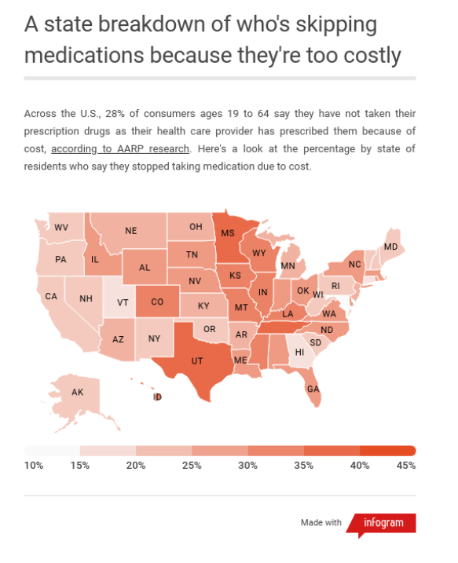
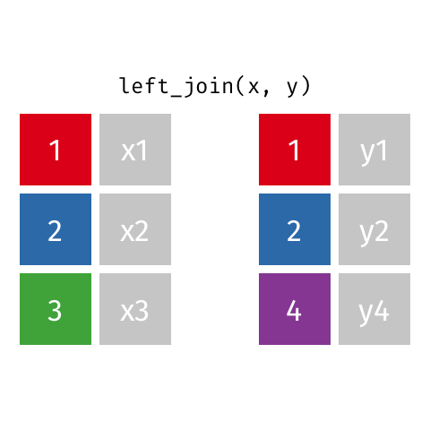
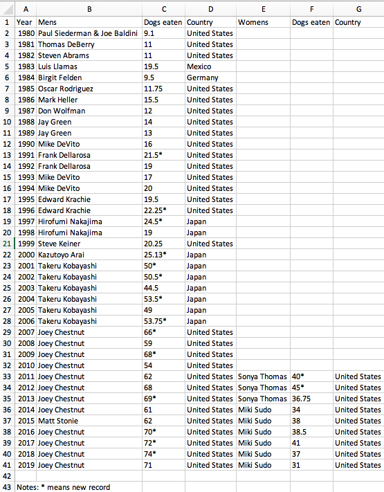
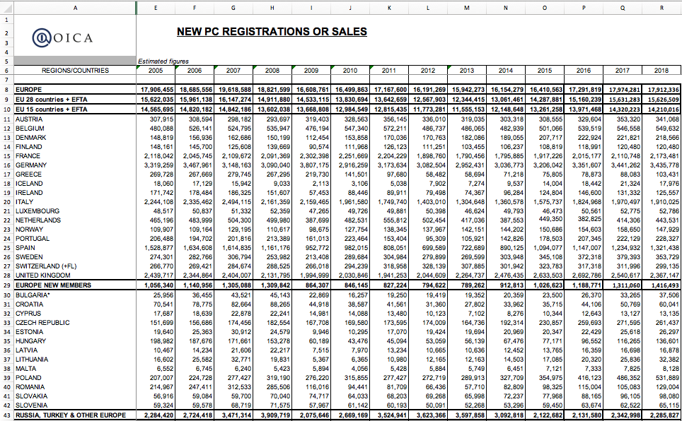



```{r}
#| include: false

agenda_items <- c(
  "Merging datasets with joins",
  "Are your variables the right _type_?",
  "Are your variables the right _name_?",
  "Re-coding variables",
  "Dates",
  "Dealing with messy Excel files"
)

library(here)

# Read in data
wildlife_impacts <- read_csv(here::here('data', 'wildlife_impacts.csv'))
milk_production  <- read_csv(here::here('data', 'milk_production.csv'))
tb_rates <- table3

# Add new variables
wildlife_impacts_orig <- wildlife_impacts
wildlife_impacts <- wildlife_impacts %>%
    mutate(
        weekday_name = wday(incident_date, label = TRUE),
        phase_of_flt = str_to_lower(phase_of_flt),
        phase_of_flt = case_when(
            phase_of_flt %in% c('approach', 'arrival', 'descent',
                                'landing roll') ~ 'arrival',
            phase_of_flt %in% c('climb', 'departure',
                                'take-off run') ~ 'departure',
            TRUE ~ 'other'))

# Abbreviations: https://www.50states.com/abbreviations.htm
state_abbs <- tibble::tribble(
                  ~state_name,              ~state_abb,
                     "Alabama",             "AL",
                      "Alaska",             "AK",
                     "Arizona",             "AZ",
                    "Arkansas",             "AR",
                  "California",             "CA",
                    "Colorado",             "CO",
                 "Connecticut",             "CT",
                    "Delaware",             "DE",
                     "Florida",             "FL",
                     "Georgia",             "GA",
                      "Hawaii",             "HI",
                       "Idaho",             "ID",
                    "Illinois",             "IL",
                     "Indiana",             "IN",
                        "Iowa",             "IA",
                      "Kansas",             "KS",
                    "Kentucky",             "KY",
                   "Louisiana",             "LA",
                       "Maine",             "ME",
                    "Maryland",             "MD",
               "Massachusetts",             "MA",
                    "Michigan",             "MI",
                   "Minnesota",             "MN",
                 "Mississippi",             "MS",
                    "Missouri",             "MO",
                     "Montana",             "MT",
                    "Nebraska",             "NE",
                      "Nevada",             "NV",
               "New Hampshire",             "NH",
                  "New Jersey",             "NJ",
                  "New Mexico",             "NM",
                    "New York",             "NY",
              "North Carolina",             "NC",
                "North Dakota",             "ND",
                        "Ohio",             "OH",
                    "Oklahoma",             "OK",
                      "Oregon",             "OR",
                "Pennsylvania",             "PA",
                "Rhode Island",             "RI",
              "South Carolina",             "SC",
                "South Dakota",             "SD",
                   "Tennessee",             "TN",
                       "Texas",             "TX",
                        "Utah",             "UT",
                     "Vermont",             "VT",
                    "Virginia",             "VA",
                  "Washington",             "WA",
               "West Virginia",             "WV",
                   "Wisconsin",             "WI",
                     "Wyoming",             "WY",
        "District of Columbia",             "DC",
            "Marshall Islands",             "MH",
         "Armed Forces Africa",             "AE",
       "Armed Forces Americas",             "AA",
         "Armed Forces Canada",             "AE",
         "Armed Forces Europe",             "AE",
    "Armed Forces Middle East",             "AE",
        "Armed Forces Pacific",             "AP"
)

bad_abbs <- c("MH", "AE", "AA", "AE", "AP")

state_abbs_50 <- state_abbs %>%
  filter(!state_abb %in% bad_abbs)

# # scraping version:
# library(rvest)
# html <- read_html('https://www.50states.com/abbreviations.htm')
# table <- html %>%
#     html_node('#content') %>%
#     html_nodes("table") %>%
#     html_table(fill = T)
# table[[1]]
```

---





# [Tip of the week]{.fancy .blue}

## Copy-paste magic with [`datapasta`](https://milesmcbain.github.io/datapasta/)

<br>

### **Useful for "small data"**: e.g., [U.S. State Abbreviations](https://www.50states.com/abbreviations.htm)

---

## Today's data

"Clean" data

```{r}
#| eval: false

wildlife_impacts <- read_csv(here::here('data', 'wildlife_impacts.csv'))
milk_production <- read_csv(here::here('data', 'milk_production.csv'))
msleep <- read_csv(here::here('data', 'msleep.csv'))
```

"Messy" data

```{r}
#| eval: false

wind <- read_excel(here::here('data', 'US_State_Wind_Energy_Facts_2018.xlsx'))
hot_dogs <- read_excel(here::here('data', 'hot_dog_winners.xlsx'))
```

---

## Plus two new packages:

```{r}
#| eval: false

# For manipulating dates
install.packages('lubridate')

# For cleaning column names
install.packages('janitor')
```

---

```{r}
#| echo: false
#| results: asis

agenda(0)
```

---

```{r}
#| echo: false
#| results: asis

agenda(1)
```

---

::: {.col}
{height="600"}
:::

::: {.col}
## [What's wrong with this map?]{.center}
:::

---

### Likely culprit: Merging two columns

::: {.col}
```{r}
#| echo: false

names <- data.frame(state_name = sort(state_abbs_50$state_name))
abbs  <- data.frame(state_abb = sort(state_abbs_50$state_abb))
```

```{r}
head(names)
head(abbs)
```
:::

::: {.col .fragment}
```{r}
result <- bind_cols(names, abbs)
head(result)
```
:::

---

## Joins

1. `inner_join()`
2. `left_join()` / `right_join()`
3. `full_join()`

. . .

Example: `band_members` & `band_instruments`

::: {.col}
```{r}
band_members
```
:::

::: {.col}
```{r}
band_instruments
```
:::

---

::: {.col}
## `inner_join()`

```{r}
band_members %>%
    inner_join(band_instruments)
```
:::

::: {.col}
<br>


:::

---

::: {.col}
## `full_join()`

```{r}
band_members %>%
    full_join(band_instruments)
```
:::

::: {.col}
<br>


:::

---

::: {.col}
## `left_join()`

```{r}
band_members %>%
    left_join(band_instruments)
```
:::

::: {.col}
<br>


:::

---

::: {.col}
## `right_join()`

```{r}
band_members %>%
    right_join(band_instruments)
```
:::

::: {.col}
<br>


:::

---

## Specify the joining variable name

::: {.col}
```{r}
#| message: true

band_members %>%
    left_join(band_instruments)
```
:::

::: {.col}
```{r}
#| message: true
#| code-line-numbers: "4"

band_members %>%
    left_join(
        band_instruments,
        by = 'name'
    )
```
:::

---

## Specify the joining variable name

If the names differ, use `by = c("left_name" = "joining_name")`

::: {.col}
```{r}
band_members
```

```{r}
band_instruments2
```
:::

::: {.col .fragment}
```{r}
#| code-line-numbers: "4"

band_members %>%
    left_join(
        band_instruments2,
        by = c("name" = "artist")
    )
```
:::

---

## Specify the joining variable name

Or just rename the joining variable in a pipe

::: {.col}
```{r}
band_members
```

```{r}
band_instruments2
```
:::

::: {.col}
```{r}
#| code-line-numbers: "2,5"

band_members %>%
    rename(artist = name) %>%
    left_join(
        band_instruments2,
        by = "artist"
    )
```
:::

---



```{r}
#| echo: false

countdown(
  minutes = 15,
  warn_when = 15,
  update_every = 1,
  top = 0,
  right = 0,
  font_size = "2em"
)
```

## Your turn

::: {.col .font80}
1) Create a data frame called `state_data` by joining the data frames `states_abbs` and `milk_production` and then selecting the variables `region`, `state_name`, `state_abb`. **Hint**: Use the `distinct()` function to drop repeated rows.

Your result should look like this:

::: {.font70}
```{r}
#| include: false

state_data <- milk_production %>%
    left_join(state_abbs, by = c('state' = 'state_name')) %>%
    select(region, state_name = state, state_abb) %>%
    distinct()
```

```{r}
head(state_data)
```
:::
:::

::: {.col .font80}
2) Join the `state_data` data frame to the `wildlife_impacts` data frame, adding the variables `region` and `state_name`

```{r}
#| include: false

wildlife_impacts2 <- state_data %>%
    right_join(wildlife_impacts, by = c('state_abb' = 'state')) %>%
    mutate(state_abb = ifelse(state_abb == 'N/A', NA, state_abb))
```

::: {.font50}
```{r}
#| eval: false

glimpse(wildlife_impacts)
```

```{r}
#| echo: false

glimpse(wildlife_impacts2)
```
:::
:::

---

```{r}
#| echo: false
#| results: asis

agenda(2)
```

---

## Always check variable types after reading in data!

```{r}
wind <- read_excel(here::here(
  'data', 'US_State_Wind_Energy_Facts_2018.xlsx'))

glimpse(wind)
```

---

## [Be careful converting strings to numbers!]{.center}

::: {.col}
## [`as.numeric()`]{.center}

```{r}
as.numeric(c("2.1", "3.7", "4.50"))
as.numeric(c("$2.1", "$3.7", "$4.50"))
```
:::

::: {.col .fragment}
## [`parse_number()`]{.center}

```{r}
parse_number(c("2.1", "3.7", "4.50"))
parse_number(c("$2.1", "$3.7", "$4.50"))
parse_number(c("1-800-123-4567"))
```
:::

---

```{r}
#| code-line-numbers: "4,5,6,7"

wind <- read_excel(here::here(
  'data', 'US_State_Wind_Energy_Facts_2018.xlsx')) %>%
  mutate(
    Ranking = as.numeric(Ranking),
    `Equivalent Homes Powered` = as.numeric(`Equivalent Homes Powered`),
    `Total Investment ($ Millions)` = as.numeric(`Total Investment ($ Millions)`),
    `# of Wind Turbines` = as.numeric(`# of Wind Turbines`)
  )

glimpse(wind)
```

---

```{r}
#| echo: false
#| results: asis

agenda(3)
```

<!--
got the content on select() from Suzan Baert:
https://suzan.rbind.io/2018/01/dplyr-tutorial-1/
-->

---

## Renaming made easy

::: {.col width="35%" .center}
`janitor::clean_names()`

{width="200"}
:::

::: {.col width="65%" .fragment}
```{r}
wind <- read_excel(here::here(
  'data', 'US_State_Wind_Energy_Facts_2018.xlsx'))

glimpse(wind)
```
:::

---

## Renaming made easy

::: {.col width="35%" .center}
`janitor::clean_names()`

{width="200"}
:::

::: {.col width="65%"}
```{r}
#| code-line-numbers: "1,5"

library(janitor)

wind <- read_excel(here::here(
  'data', 'US_State_Wind_Energy_Facts_2018.xlsx')) %>%
  clean_names()

glimpse(wind)
```
:::

---

## Renaming made easy

::: {.col width="35%" .center}
`janitor::clean_names()`

{width="200"}
:::

::: {.col width="65%"}
```{r}
#| code-line-numbers: "1,5"

library(janitor)

wind <- read_excel(here::here(
  'data', 'US_State_Wind_Energy_Facts_2018.xlsx')) %>%
  clean_names(case = 'lower_camel')

glimpse(wind)
```
:::

---

## Renaming made easy

::: {.col width="35%" .center}
`janitor::clean_names()`

{width="200"}
:::

::: {.col width="65%"}
```{r}
#| code-line-numbers: "1,5"

library(janitor)

wind <- read_excel(here::here(
  'data', 'US_State_Wind_Energy_Facts_2018.xlsx')) %>%
  clean_names(case = 'screaming_snake')

glimpse(wind)
```
:::

---

### `select()`: more powerful than you probably thought

. . .

::: {.col width="60%"}
Example: data on sleeping patterns of different mammals

::: {.font70}
```{r}
glimpse(msleep)
```
:::
:::

::: {.col width="40%"}
:::

---

### `select()`: more powerful than you probably thought

::: {.col width="55%"}
Use `select()` to choose which columns to **keep**

::: {.font70}
```{r}
#| code-line-numbers: "2"

msleep %>%
  select(name:order, sleep_total:sleep_cycle) %>%
  glimpse()
```
:::
:::

::: {.col width="45%" .fragment}
Use `select()` to choose which columns to **drop**

::: {.font70}
```{r}
msleep %>%
  select(-(name:order)) %>%
  glimpse()
```
:::
:::

---

## Select columns based on **partial column names**

. . .

::: {.col}
Select columns that start with "sleep":

::: {.font70}
```{r}
msleep %>%
  select(name, starts_with("sleep")) %>%
  glimpse()
```
:::
:::

::: {.col .fragment}
Select columns that contain "eep" and end with "wt":

::: {.font70}
```{r}
msleep %>%
  select(contains("eep"), ends_with("wt")) %>%
  glimpse()
```
:::
:::

---

## Select columns based on their **data type**

::: {.col}
Select only numeric columns:

```{r}
msleep %>%
    select_if(is.numeric) %>%
    glimpse()
```
:::

::: {.col .fragment}
Select only character columns:

```{r}
msleep %>%
    select_if(is.character) %>%
    glimpse()
```
:::

---

## Use `select()` to **reorder** variables

. . .

::: {.col width="45%"}
::: {.font70}
```{r}
msleep %>%
    select(everything()) %>%
    glimpse()
```
:::
:::

::: {.col width="55%" .fragment}
::: {.font70}
```{r}
msleep %>%
    select(conservation, awake, everything()) %>%
    glimpse()
```
:::
:::

---

## Use `select()` to **rename** variables

. . .

::: {.col}
Use `rename()` to just change the name

::: {.font70}
```{r}
#| code-line-numbers: "2"

msleep %>%
  rename(
    animal = name,
    extinction_threat = conservation
  ) %>%
  glimpse()
```
:::
:::

::: {.col .fragment}
Use `select()` to change the name **and drop everything else**

::: {.font70}
```{r}
#| code-line-numbers: "2"

msleep %>%
  select(
    animal = name,
    extinction_threat = conservation
  ) %>%
  glimpse()
```
:::
:::

---

## Use `select()` to **rename** variables

::: {.col}
Use `rename()` to just change the name

::: {.font70}
```{r}
#| code-line-numbers: "2"

msleep %>%
  rename(
    animal = name,
    extinction_threat = conservation
  ) %>%
  glimpse()
```
:::
:::

::: {.col}
Use `select()` + `everything()` to change names **and keep everything else**

::: {.font70}
```{r}
#| code-line-numbers: "2,6"

msleep %>%
  select(
    animal = name,
    extinction_threat = conservation,
    everything()
  ) %>%
  glimpse()
```
:::
:::

---



```{r}
#| echo: false

countdown(
  minutes = 15,
  warn_when = 15,
  update_every = 1,
  bottom = 0,
  left = 0,
  font_size = "2em"
)
```

::: {.col width="40%"}
## Your turn

Read in the `hot_dog_winners.xlsx` file and adjust the variable names and types to the following:

```{r}
#| echo: false

hot_dogs <- read_excel(
    here::here('data', 'hot_dog_winners.xlsx'),
    col_types = c(
        'numeric', 'text', 'numeric', 'text',
        'text', 'numeric', 'text')
    ) %>%
    clean_names() %>%
    select(
        year,
        competitor.mens   = mens,
        competitor.womens = womens,
        dogs_eaten.mens   = dogs_eaten_3,
        dogs_eaten.womens = dogs_eaten_6,
        country.mens      = country_4,
        country.womens    = country_7
    )

glimpse(hot_dogs)
```
:::

::: {.col width="60%"}
{width="500"}
:::

---




# [Break]{.fancy}

```{r}
#| echo: false

countdown(
  minutes = 5,
  warn_when = 30,
  update_every = 1,
  left = 0,
  right = 0,
  top = 1,
  bottom = 0,
  margin = "5%",
  font_size = "8em"
)
```

---

```{r}
#| echo: false
#| results: asis

agenda(4)
```

---

# Recoding with `ifelse()`

::: {.col width="35%"}
Example: Create a variable, `cost_high`, that is `TRUE` if the repair costs were greater than the median costs and `FALSE` otherwise.
:::

::: {.col width="65%"}
::: {.font70}
```{r}
#| code-line-numbers: "6"

wildlife_impacts1 <- wildlife_impacts %>%
  rename(cost = cost_repairs_infl_adj) %>%
  filter(!is.na(cost)) %>%
  mutate(
    cost_median = median(cost),
    cost_high = ifelse(cost > cost_median, TRUE, FALSE)
  )

wildlife_impacts1 %>%
  select(cost, cost_median, cost_high) %>%
  head()
```
:::
:::

---

## Recoding with **nested** `ifelse()`

::: {.col width="35%"}
Create a variable, `season`, based on the `incident_month` variable.
:::

::: {.col width="65%"}
::: {.font70}
```{r}
#| code-line-numbers: "2,3,4,5"

wildlife_impacts2 <- wildlife_impacts %>%
  mutate(season = ifelse(
    incident_month %in% c(3, 4, 5), 'spring', ifelse(
    incident_month %in% c(6, 7, 8), 'summer', ifelse(
    incident_month %in% c(9, 10, 11), 'fall', 'winter')))
  )

wildlife_impacts2 %>%
  distinct(incident_month, season) %>%
  head()
```
:::
:::

---

## Recoding with `case_when()`

::: {.col width="35%"}
Create a variable, `season`, based on the `incident_month` variable.

**Note**: If you don't include the final `TRUE ~ 'winter'` condition, you'll get `NA` for those cases.
:::

::: {.col width="65%"}
::: {.font70}
```{r}
#| code-line-numbers: "2,3,4,5,6"

wildlife_impacts2 <- wildlife_impacts %>%
  mutate(season = case_when(
    incident_month %in% c(3, 4, 5) ~ 'spring',
    incident_month %in% c(6, 7, 8) ~ 'summer',
    incident_month %in% c(9, 10, 11) ~ 'fall',
    TRUE ~ 'winter')
  )

wildlife_impacts2 %>%
  distinct(incident_month, season) %>%
  head()
```
:::
:::

---

## Recoding with `case_when()` with `between()`

::: {.col width="35%"}
Create a variable, `season`, based on the `incident_month` variable.
:::

::: {.col width="65%"}
::: {.font70}
```{r}
#| code-line-numbers: "3,4,5"

wildlife_impacts2 <- wildlife_impacts %>%
  mutate(season = case_when(
    between(incident_month, 3, 5) ~ 'spring',
    between(incident_month, 6, 8) ~ 'summer',
    between(incident_month, 9, 11) ~ 'fall',
    TRUE ~ 'winter')
  )

wildlife_impacts2 %>%
    distinct(incident_month, season) %>%
    head()
```
:::
:::

---

## `case_when()` is "cleaner" than `ifelse()`

. . .

Convert the `num_engs` variable into a word of the number.

::: {.col width="55%"}
`ifelse()`

::: {.font70}
```{r}
wildlife_impacts3 <- wildlife_impacts %>%
  mutate(num_engs = ifelse(
    num_engs == 1, 'one', ifelse(
    num_engs == 2, 'two', ifelse(
    num_engs == 3, 'three', ifelse(
    num_engs == 4, 'four',
    as.character(num_engs)))))
  )

unique(wildlife_impacts3$num_engs)
```
:::
:::

::: {.col width="45%" .fragment}
`case_when()`

::: {.font70}
```{r}
wildlife_impacts3 <- wildlife_impacts %>%
  mutate(num_engs = case_when(
    num_engs == 1 ~ 'one',
    num_engs == 2 ~ 'two',
    num_engs == 3 ~ 'three',
    num_engs == 4 ~ 'four')
  )

unique(wildlife_impacts3$num_engs)
```
:::
:::

---

## Break a single variable into two with `separate()`

::: {.col width="40%"}
```{r}
tb_rates
```
:::

::: {.col width="60%" .fragment}
```{r}
#| code-line-numbers: "2"

tb_rates %>%
  separate(rate, into = c("cases", "population"))
```
:::

---

## Break a single variable into two with `separate()`

::: {.col width="40%"}
```{r}
tb_rates
```
:::

::: {.col width="60%"}
```{r}
#| code-line-numbers: "3,4,5"

tb_rates %>%
  separate(
      rate,
      into = c("cases", "population"),
      sep = "/"
  )
```
:::

---

## Break a single variable into two with `separate()`

::: {.col width="40%"}
```{r}
tb_rates
```
:::

::: {.col width="60%"}
```{r}
#| code-line-numbers: "6"

tb_rates %>%
  separate(
      rate,
      into = c("cases", "population"),
      sep = "/",
      convert = TRUE
  )
```
:::

---

## You can also break up a variable by an index

::: {.col width="40%"}
```{r}
tb_rates
```
:::

::: {.col width="60%"}
```{r}
#| code-line-numbers: "4,5"

tb_rates %>%
  separate(
      year,
      into = c("century", "year"),
      sep = 2
  )
```
:::

---

## `unite()`: The opposite of `separate()`

::: {.col width="40%"}
```{r}
tb_rates
```
:::

::: {.col width="60%"}
```{r}
#| code-line-numbers: "4"

tb_rates %>%
  separate(year, into = c("century", "year"),
           sep = 2) %>%
  unite(year_new, century, year)
```
:::

---

## `unite()`: The opposite of `separate()`

::: {.col width="40%"}
```{r}
tb_rates
```
:::

::: {.col width="60%"}
```{r}
#| code-line-numbers: "5"

tb_rates %>%
  separate(year, into = c("century", "year"),
           sep = 2) %>%
  unite(year_new, century, year,
        sep = "")
```
:::

---

```{r}
#| echo: false
#| results: asis

agenda(5)
```

---





{width="600"}

---

### Create dates from strings - **order is the ONLY thing that matters!**

. . .

::: {.col}
[Year-Month-Day]{.center}

```{r}
ymd('2026-09-09')
```
:::

::: {.col}
:::

::: {.col}
:::

---

### Create dates from strings - **order is the ONLY thing that matters!**

::: {.col}
[Year-Month-Day]{.center}

```{r}
ymd('2026-09-09')
ymd('2026 sep 9')
```
:::

::: {.col}
:::

::: {.col}
:::

---

### Create dates from strings - **order is the ONLY thing that matters!**

::: {.col}
[Year-Month-Day]{.center}

```{r}
ymd('2026-09-09')
ymd('2026 Sep 9')
ymd('2026 Sep. 9')
ymd('2026 september 9')
```
:::

::: {.col .fragment}
[Month-Day-Year]{.center}

```{r}
mdy('September 9, 2026')
mdy('Sep. 9, 2026')
mdy('Sep 9 2026')
```
:::

::: {.col .fragment}
[Day-Month-Year]{.center}

```{r}
dmy('9 September 2026')
dmy('9 Sep. 2026')
dmy('9 Sep. 2026')
```
:::

---




# Check out the `lubridate` **[cheat sheet](https://rawgit.com/rstudio/cheatsheets/master/lubridate.pdf)**

---

## Extracting information from dates

::: {.font60}
```{r}
date <- today()
date
```
:::

. . .

::: {.col}
::: {.font60}
```{r}
# Get the year
year(date)
```
:::
:::

::: {.col}
:::

---

## Extracting information from dates

::: {.font60}
```{r}
date <- today()
date
```
:::

::: {.col}
::: {.font60}
```{r}
# Get the year
year(date)

# Get the month
month(date)

# Get the month name
month(date, label = TRUE, abbr = FALSE)
```
:::
:::

::: {.col .fragment}
::: {.font60}
```{r}
# Get the day
day(date)

# Get the weekday
wday(date)

# Get the weekday name
wday(date, label = TRUE, abbr = TRUE)
```
:::
:::

---



# Quick practice

On what day of the week were you born?

::: {.col width="60%"}
```{r}
wday("2026-09-09", label = TRUE)
```
:::

::: {.col width="40%"}
:::

---

## Modifying date elements

```{r}
date <- today()
date
```

. . .

```{r}
# Change the year
year(date) <- 2016
date
```

. . .

```{r}
# Change the day
day(date) <- 30
```

. . .

```{r}
date
```

---



# Quick practice

What do you think will happen if we do this?

```{r}
date <- ymd("2026-02-28")
day(date) <- 30
```

. . .

```{r}
date
```

---



::: {.col .font80}
### Your turn

1) Use `case_when()` to modify the `phase_of_flt` variable in the `wildlife_impacts` data:

- The values `'approach'`, `'arrival'`, `'descent'`, and `'landing roll'` should be merged into a single value called `'arrival'`.
- The values `'climb'`, `'departure'`,  and `'take-off run'` should be merged into a single value called `'departure'`.
- All other values should be called `'other'`.

Before:

::: {.font70}
```{r}
#| eval: false

unique(str_to_lower(wildlife_impacts$phase_of_flt))
```

```{r}
#| echo: false

unique(str_to_lower(wildlife_impacts_orig$phase_of_flt))
```

After:

```{r}
#| echo: false

unique(str_to_lower(wildlife_impacts$phase_of_flt))
```
:::
:::

::: {.col .font80 .fragment}
```{r}
#| echo: false

countdown(
    minutes = 20,
    warn_when = 30,
    update_every = 15,
    right = 0,
    font_size = '1.5em',
    style = "position: relative; width: min-content;
             display: block; margin-left: 300px;"
)
```

2) Use the **lubridate** package to create a new variable, `weekday_name`, from the `incident_date` variable in the `wildlife_impacts` data.

3) Use `weekday_name` and `phase_of_flt` to make this plot of "arrival" and "departure" impacts from **Mar. 2016**.

```{r}
#| echo: false
#| fig-width: 9
#| fig-height: 4.5
#| fig-align: center

wildlife_impacts %>%
    filter(incident_year == 2016,
           incident_month == 3) %>%
    mutate(phase_of_flt = str_to_title(phase_of_flt)) %>%
    count(weekday_name, phase_of_flt) %>%
    ggplot() +
    geom_col(aes(x = weekday_name, y = n), width = 0.8) +
    facet_wrap(~phase_of_flt, nrow = 1) +
    theme_minimal_hgrid() +
    labs(x = 'Day of the week',
         y = 'Number of incidents',
         title = 'Impacts by day of the week & phase of flight in March, 2016')
```
:::

---

```{r}
#| echo: false
#| results: asis

agenda(6)
```

---

# Reminders:

- You have **11** days until your [Project Proposal](https://eda.seas.gwu.edu/2026-Fall/project/1-proposal.html) is due.
- You have **13** days until your [Mini Project 1](https://eda.seas.gwu.edu/2026-Fall/mini/1-data-cleaning.html) is due.

<br>

- Next week: **Project Proposal Meetings** - sign up **[HERE](https://calendar.app.google/niXopBudj9t4pmbj7)**

---

::: {.col width="40%"}
## When columns are repeated

Example: Winners of Nathan's hot dog eating contest

## Stragies

#### 1. divide & conquer
#### 2. pivot long, separate, pivot wide
:::

::: {.col width="60%" .center}
{width="500"}
:::

---

## Strategy 1: divide & conquer

::: {.col width="40%"}
Steps:

1. Read in the data
2. Clean the names
3. Remove `*` note at bottom of table
:::

::: {.col width="60%"}
```{r}
hot_dogs <- read_excel(
    here::here('data', 'hot_dog_winners.xlsx'),
    sheet = 'hot_dog_winners') %>%
    clean_names() %>%
    dplyr::filter(!is.na(mens))

glimpse(hot_dogs)
```
:::

---

## Strategy 1: divide & conquer

::: {.col width="40%"}
Steps

1. Read in the data
2. Clean the names
3. Remove `*` note at bottom of table
4. **Split data into two competitions with the same variable names**
5. **Create new variable in each data frame: `competition`**
:::

::: {.col width="60%"}
```{r}
#| code-line-numbers: "7,15"

hot_dogs_m <- hot_dogs %>%
    select(
        year,
        competitor = mens,
        dogs_eaten = dogs_eaten_3,
        country    = country_4) %>%
    mutate(competition = 'Mens')

hot_dogs_w <- hot_dogs %>%
    select(
        year,
        competitor = womens,
        dogs_eaten = dogs_eaten_6,
        country    = country_7) %>%
    mutate(competition = 'Womens') %>%
    dplyr::filter(!is.na(competitor))
```
:::

---

## Strategy 1: divide & conquer

::: {.col width="40%"}
Steps

1. Read in the data
2. Clean the names
3. Remove `*` note at bottom of table
4. Split data into two competitions with the same variable names
5. Create new variable in each data frame: `competition`
6. **Merge data together with `bind_rows()`**
7. **Clean up final data frame**
:::

::: {.col width="60%"}
```{r}
#| code-line-numbers: "1"

hot_dogs <- bind_rows(hot_dogs_m, hot_dogs_w) %>%
    mutate(
        new_record = str_detect(dogs_eaten, "\\*"),
        dogs_eaten = parse_number(dogs_eaten),
        year       = as.numeric(year))

glimpse(hot_dogs)
```
:::

---

::: {.col width="45%"}
{width="500"}
:::

::: {.col width="55%"}
::: {.font50}
```{r}
head(hot_dogs)
```
:::
:::

---

## Strategy 2: pivot long, separate, pivot wide

::: {.col width="40%"}
Steps:

1. Read in the data
2. Clean the names
3. Remove `*` note at bottom of table
:::

::: {.col width="60%"}
```{r}
hot_dogs <- read_excel(
    here::here('data', 'hot_dog_winners.xlsx'),
    sheet = 'hot_dog_winners') %>%
    clean_names() %>%
    dplyr::filter(!is.na(mens))

glimpse(hot_dogs)
```
:::

---

## Strategy 2: pivot long, separate, pivot wide

::: {.col width="40%"}
Steps:

1. Read in the data
2. Clean the names
3. Remove `*` note at bottom of table
4. **Rename variables**
5. **Gather all the "joint" variables**
:::

::: {.col width="60%"}
```{r}
#| code-line-numbers: "10,11"

hot_dogs <- hot_dogs %>%
    select(
        year,
        competitor.mens   = mens,
        competitor.womens = womens,
        dogs_eaten.mens   = dogs_eaten_3,
        dogs_eaten.womens = dogs_eaten_6,
        country.mens      = country_4,
        country.womens    = country_7) %>%
    pivot_longer(names_to = 'variable', values_to = 'value',
           competitor.mens:country.womens)

head(hot_dogs, 3)
```
:::

---

## Strategy 2: pivot long, separate, pivot wide

::: {.col width="30%"}
Steps:

1. Read in the data
2. Clean the names
3. Remove `*` note at bottom of table
4. Rename variables
5. Gather all the "joint" variables
6. **Separate "joint" variables into components**
:::

::: {.col width="70%"}
```{r}
#| code-line-numbers: "2,3"

hot_dogs <- hot_dogs %>%
    separate(variable, into = c('variable', 'competition'),
             sep = '\\.')

head(hot_dogs)
```
:::

---

## Strategy 2: pivot long, separate, pivot wide

::: {.col width="30%"}
Steps:

1. Read in the data
2. Clean the names
3. Remove `*` note at bottom of table
4. Rename variables
5. Gather all the "joint" variables
6. Separate "joint" variables into components
7. **Spread variable and value back to columns**
8. **Clean up final data frame**
:::

::: {.col width="70%"}
```{r}
#| code-line-numbers: "2"

hot_dogs <- hot_dogs %>%
    spread(key = variable, value = value) %>%
    mutate(
        new_record = str_detect(dogs_eaten, "\\*"),
        dogs_eaten = parse_number(dogs_eaten),
        year       = as.numeric(year))

glimpse(hot_dogs)
```
:::

---

::: {.col}
Divide & conquer

::: {.font60}
```{r}
#| eval: false
#| code-line-numbers: "7-22,25"

hot_dogs <- read_excel(
    here::here('data', 'hot_dog_winners.xlsx'),
    sheet = 'hot_dog_winners') %>%
    clean_names() %>%
    dplyr::filter(!is.na(mens))

# Divide
hot_dogs_m <- hot_dogs %>%
    select(
        year,
        competitor = mens,
        dogs_eaten = dogs_eaten_3,
        country    = country_4) %>%
    mutate(competition = 'Mens')
hot_dogs_w <- hot_dogs %>%
    select(
        year,
        competitor = womens,
        dogs_eaten = dogs_eaten_6,
        country    = country_7) %>%
    mutate(competition = 'Womens') %>%
    dplyr::filter(!is.na(competitor))

# Merge and finish cleaning
hot_dogs <- bind_rows(hot_dogs_m, hot_dogs_w) %>%
    mutate(
        new_record = str_detect(dogs_eaten, "\\*"),
        dogs_eaten = parse_number(dogs_eaten),
        year       = as.numeric(year))
```
:::
:::

::: {.col}
Pivot long, separate, pivot wide

::: {.font60}
```{r}
#| eval: false
#| code-line-numbers: "7-23"

hot_dogs <- read_excel(
    here::here('data', 'hot_dog_winners.xlsx'),
    sheet = 'hot_dog_winners') %>%
    clean_names() %>%
    dplyr::filter(!is.na(mens)) %>%

    # Rename variables
    select(
        year,
        competitor.mens   = mens,
        competitor.womens = womens,
        dogs_eaten.mens   = dogs_eaten_3,
        dogs_eaten.womens = dogs_eaten_6,
        country.mens      = country_4,
        country.womens    = country_7) %>%
    # Gather "joint" variables
    pivot_longer(names_to = 'variable', values_to = 'value',
           competitor.mens:country.womens) %>%
    # Separate "joint" variables
    separate(variable, into = c('variable', 'competition'),
             sep = '\\.') %>%
    # Spread "joint" variables
    pivot_wider(names_from = variable, values_from = value) %>%
    # Finish cleaning
    mutate(
        new_record = str_detect(dogs_eaten, "\\*"),
        dogs_eaten = parse_number(dogs_eaten),
        year       = as.numeric(year))
```
:::
:::

---

::: {.col width="30%"}
## Strategies for dealing with **sub-headers**

<br>

Example:

OICA passenger car sales data
:::

::: {.col width="70%" .center}
<br>

{width="800"}
:::

---

## Strategies for dealing with sub-headers

::: {.col width="40%"}
Steps:

1. Read in the data, skipping first 5 rows
2. Clean the names
:::

::: {.col width="60%"}
```{r}
#| code-line-numbers: "3"

pc_sales <- read_excel(
    here::here('data', 'pc_sales_2018.xlsx'),
    sheet = 'pc_sales', skip = 5) %>%
    clean_names() %>%
    rename(country = regions_countries)

glimpse(pc_sales)
```
:::

---

## Strategies for dealing with sub-headers

::: {.col width="30%"}
Steps:

1. Read in the data, skipping first 5 rows
2. Clean the names
3. **Drop bad columns**
4. **Filter out bad rows**

<br>

Use **datapasta** to get rows to drop
:::

::: {.col width="70%"}
```{r}
#| code-line-numbers: "10"

drop <- c(
    'EUROPE', 'EU 28 countries + EFTA',
    'EU 15 countries + EFTA', 'EUROPE NEW MEMBERS',
    'RUSSIA, TURKEY & OTHER EUROPE', 'AMERICA',
    'NAFTA', 'CENTRAL & SOUTH AMERICA',
    'ASIA/OCEANIA/MIDDLE EAST', 'AFRICA', 'ALL COUNTRIES')

pc_sales <- pc_sales %>%
    select(-c(x2:x4)) %>%       # Drop bad columns
    filter(! country %in% drop, # Drop bad rows
           ! is.na(country))

head(pc_sales)
```
:::

---

## Strategies for dealing with sub-headers

::: {.col width="30%"}
Steps:

1. Read in the data, skipping first 5 rows
2. Clean the names
3. Drop bad columns
4. Filter out bad rows
5. **Gather the year variables**
:::

::: {.col width="70%"}
```{r}
#| code-line-numbers: "3"

pc_sales <- pc_sales %>%
    pivot_longer(names_to = 'year', values_to = 'num_cars',
                 cols = x2005:x2018)

head(pc_sales)
```
:::

---

## Strategies for dealing with sub-headers

::: {.col width="30%"}
Steps:

1. Read in the data, skipping first 5 rows
2. Clean the names
3. Drop bad columns
4. Filter out bad rows
5. Gather the year variables
6. **Separate the "x" from the year**
:::

::: {.col width="70%"}
```{r}
#| code-line-numbers: "2,3"

pc_sales <- pc_sales %>%
    separate(year, into = c('drop', 'year'), sep = 'x',
             convert = TRUE)

head(pc_sales)
```
:::

---

## Strategies for dealing with sub-headers

::: {.col width="30%"}
Steps:

1. Read in the data, skipping first 5 rows
2. Clean the names
3. Drop bad columns
4. Filter out bad rows
5. Gather the year variables
6. Separate the "x" from the year
7. **Remove the `drop` column**
8. **Finish cleaning**
:::

::: {.col width="70%"}
```{r}
#| code-line-numbers: "2"

pc_sales <- pc_sales %>%
  select(-drop) %>%
  mutate(country  = str_to_title(country))

head(pc_sales)
```
:::

---




# What if I wanted to keep the continents?

. . .

### Strategy: Join a new data frame linking country -> continent

---

::: {.font70}
```{r}
drop <- c(
  'EUROPE', 'EU 28 countries + EFTA',
  'EU 15 countries + EFTA', 'EUROPE NEW MEMBERS',
  'RUSSIA, TURKEY & OTHER EUROPE', 'AMERICA',
  'NAFTA', 'CENTRAL & SOUTH AMERICA',
  'ASIA/OCEANIA/MIDDLE EAST', 'AFRICA', 'ALL COUNTRIES')

pc_sales <- read_excel(
  here::here('data', 'pc_sales_2018.xlsx'),
  sheet = 'pc_sales', skip = 5) %>%
  clean_names() %>%
  rename(country = regions_countries) %>%
  select(-c(x2:x4)) %>%       # Drop bad columns
  filter(! country %in% drop, # Drop bad rows
         ! is.na(country)) %>%
  pivot_longer(
    names_to = 'year', values_to = 'num_cars',
    cols = x2005:x2018) %>%
  separate(year, into = c('drop', 'year'), sep = 'x',
           convert = TRUE) %>%
  select(-drop)

head(pc_sales, 3)
```
:::

---

## Strategy 1: Find another source

## Strategy 2: Hand-make it

. . .

::: {.col}
```{r}
pc_regions <- read_csv(here::here(
  "data", "pc_regions.csv"))

head(pc_regions)
```
:::

::: {.col .fragment}
```{r}
#| code-line-numbers: "2"

pc_sales <- pc_sales %>%
  left_join(pc_regions)

head(pc_sales)
```
:::

---

::: {.col}
{width="800"}
:::

::: {.col}
::: {.font50}
```{r}
drop <- c(
  'EUROPE', 'EU 28 countries + EFTA',
  'EU 15 countries + EFTA', 'EUROPE NEW MEMBERS',
  'RUSSIA, TURKEY & OTHER EUROPE', 'AMERICA',
  'NAFTA', 'CENTRAL & SOUTH AMERICA',
  'ASIA/OCEANIA/MIDDLE EAST', 'AFRICA', 'ALL COUNTRIES')

pc_regions <- read_csv(here::here("data", "pc_regions.csv"))

pc_sales <- read_excel(
  here::here('data', 'pc_sales_2018.xlsx'),
  sheet = 'pc_sales', skip = 5) %>%
  clean_names() %>%
  rename(country = regions_countries) %>%
  select(-c(x2:x4)) %>%       # Drop bad columns
  filter(! country %in% drop, # Drop bad rows
         ! is.na(country)) %>%
  pivot_longer(
    names_to = 'year', values_to = 'num_cars',
    cols = x2005:x2018) %>%
  separate(year, into = c('drop', 'year'), sep = 'x',
           convert = TRUE) %>%
  select(-drop) %>%
  left_join(pc_regions) %>%
  mutate(
    country  = str_to_title(country),
    region  = str_to_title(region),
    subregion  = str_to_title(subregion))

head(pc_sales)
```
:::
:::
