

```{r}
#| include: false

agenda_items <- c(
  "Exploring Data",
  "Data Types",
  "Centrality & Variability",
  "Visualizing Centrality & Variability",
  "Correlation",
  "Visualizing Correlation",
  "Visualizing Relationships"
)

library(HistData)

# Read in data sets for class
milk_production <- read_csv(here::here('data', 'milk_production.csv'))
lotr_words <- read_csv(here::here('data', 'lotr_words.csv'))
marathon <- read_csv(here::here('data', 'marathon.csv'))
tb_cases <- read_csv(here::here('data', 'tb_cases.csv'))
wildlife_impacts <- read_csv(here::here('data', 'wildlife_impacts.csv'))
daysToShip <- data.frame(
    order = seq(12),
    warehouseA = c(3,3,3,4,4,4,5,5,5,5,5,5),
    warehouseB = c(1,1,1,3,3,4,5,5,5,6,7,10)
)
```

---



# Quiz 1

```{r}
#| echo: false

countdown(
  minutes = 12,
  warn_when = 30,
  update_every = 1,
  top = 0,
  right = 0,
  font_size = "3em"
)
```

::: {.col}
## Write your name on the quiz!

## Rules:

- Work alone; no outside help of any kind is allowed.
- No calculators, no notes, no books, no computers, no phones.
:::

::: {.col}
<br>

{width="400"}
:::

---





# Tip of the week:

# `theme_set()`

---

```{r}
#| eval: false

ggplot(mtcars) +
  geom_point(aes(x = mpg, y = hp))
```

::: {.col}
Default theme

```{r}
#| echo: false

ggplot(mtcars) +
  geom_point(aes(x = mpg, y = hp)) +
  theme_gray()
```
:::

::: {.col}
`theme_bw(base_size = 20)`

```{r}
#| echo: false

ggplot(mtcars) +
  geom_point(aes(x = mpg, y = hp)) +
  theme_bw(base_size = 20)
```
:::

---

```{r}
#| echo: false
#| results: asis

agenda(0)
```

---

```{r}
#| echo: false
#| results: asis

agenda(1)
```

---

::: {.col}
# Exploratory Analysis

<br>

### Goal: **Form** hypotheses.
### Improves quality of **questions**.
### _(what we do in THIS class)_
:::

::: {.col .fragment}
# Confirmatory Analysis

<br>

### Goal: **Test** hypotheses.
### Improves quality of **answers**.
### _(what you do in a stats class)_
:::

---

::: {.col}
# Exploratory Analysis

<br>

RQ: Do people bike more when the weather is nice?

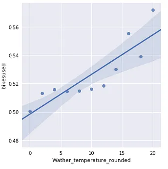
:::

::: {.col .fragment}
# Confirmatory Analysis

<br>

Let's build a model to predict bike usage based on weather.
:::

---




# Don't be Icarus

{width="800"}

---




## "An _approximate_ answer to the _right_ question is better<br>than an _exact_ answer to the _wrong_ question."
## — [John Tukey](https://en.wikipedia.org/wiki/John_Tukey)

---




**EDA is an iterative process to help you<br>_understand_ your data and ask better questions**

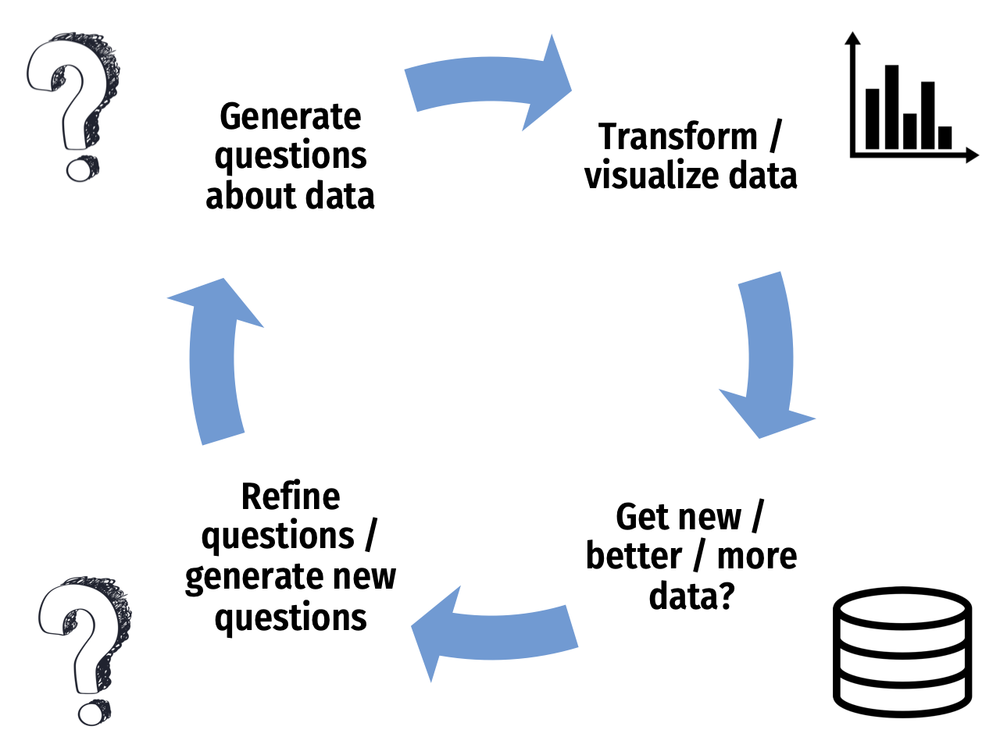{width="700"}

---

```{r}
#| echo: false
#| results: asis

agenda(2)
```

---





# 24,901

::: {.notes}
If I walked up to you, and said, "The answer is 24,901,"
you would probably be confused.
By itself, a number means nothing.
:::

---





# [Earth's circumference at the equator:]{.orange}<br>24,901

::: {.notes}
But if I were to tell you that the circumference of the earth at the equator is 24,901 miles, that would mean something.
:::

---





# Earth's circumference at the equator:<br>24,901 [miles]{.orange}

::: {.notes}
To be complete and meaningful, quantitative information consists of both quantitative data (the numbers) and categorical data (the labels that tell us what the numbers measure).
:::

---

# Types of Data

. . .

::: {.col}
### **Categorical**

Subdivide things into _groups_

- What type?
- Which category?
:::

::: {.col .fragment}
### **Numerical**

Measure things with numbers

- How many?
- How much?
:::

---

## Categorical (discrete) variables

. . .

::: {.col}
### **Nominal**

- Order doesn't matter
- Differ in "name" (nominal) only

e.g. `country` in TB case data:

::: {.font80}
```{r}
#| echo: false

tb_cases
```
:::
:::

::: {.col .fragment}
### **Ordinal**

- Order matters
- Distance between units not equal

e.g.: `Placement` 2017 Boston marathon:

::: {.font80}
```{r}
#| echo: false

marathon %>%
  dplyr::select(Placement = Overall, `Official Time`, Name) %>%
  head()
```
:::
:::

---

## Numerical data

. . .

::: {.col}
### **Interval**

- Numerical scale with<br>arbitrary starting point
- No "0" point
- Can't say "x" is double "y"

e.g.: `temp` in Beaver data

```{r}
#| echo: false

beaver1 %>%
    arrange(day) %>%
    head()
```
:::

::: {.col .fragment}
### **Ratio**

- Has a "0" point
- Can be described as percentages
- Can say "x" is double "y"

e.g.: `height` & `speed` in wildlife impacts

```{r}
#| echo: false

wildlife_impacts %>%
    filter(!is.na(height), ! is.na(speed)) %>%
    dplyr::select(incident_date, height, speed) %>%
    head()
```
:::

---





# Key Questions

::: {.col .fragment}
## Categorical

## [Does the order matter?]{.orange}

Yes: **Ordinal**

No: **Nominal**
:::

::: {.col .fragment}
## Numerical

## [Is there a "baseline"?]{.orange}

Yes: **Ratio**

No: **Interval**
:::

---




# Be careful of how variables are encoded!

---

## [When numbers are categories]{.red}

- "Dummy coding": e.g., `passedTest` = `1` or `0`)
- "North", "South", "East", "West" = `1`, `2`, `3`, `4`

. . .

## [When ratio data are discrete (i.e. counts)]{.red}

- Number of eggs in a carton, heart beats per minute, etc.
- Continuous variables measured discretely (e.g. age)

. . .

## [Time]{.red}

- As _ordinal_ categories: "Jan.", "Feb.", "Mar.", etc.
- As _interval_ scale: "Jan. 1", "Jan. 2", "Jan. 3", etc.
- As _ratio_ scale: "30 sec", "60 sec", "70 sec", etc.

---

```{r}
#| echo: false
#| results: asis

agenda(3)
```

---




# [Summary Measures:]{.center .font140}

# Single variables: [Centrality]{.red} &  [Variability]{.blue}

# Two variables: [Correlation]{.green}

---

# [Centrality (a.k.a. The "Average" Value)]{.center .red}

. . .

### [A single number representing the _middle_ of a set of numbers]{.center}

<br>

. . .

### **Mean**: $\frac{\text{Sum of values}}{\text{# of values}}$

. . .

### **Median**: "Middle" value (50% of data above & below)

---

# [Mean isn't always the "best" choice]{.center}

::: {.col width="40%"}
```{r}
wildlife_impacts %>%
    filter(! is.na(height)) %>%
    summarise(
      mean = mean(height),
      median = median(height)
    )
```

Percent of data below mean:

```{r}
#| echo: false

percentiles <- ecdf(wildlife_impacts$height)
meanP <- percentiles(mean(wildlife_impacts$height, na.rm = TRUE))
paste0(round(100*meanP, 1), '%')
```
:::

::: {.col width="60%" .fragment}
[**On average, at what height do planes hit birds?**]{.center}

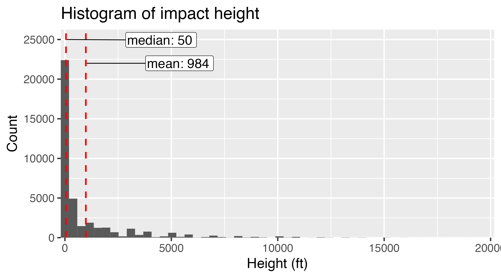
:::

::: {.notes}
On average, where do planes hit birds?
Saying ~1000 ft is misleading
It's much more likely to be under 100 ft
:::

---



# [Beware the "flaw of averages"]{.center}

::: {.col .fragment}
### What happened to the statistician that crossed a river with an average depth of 3 feet?
:::

::: {.col .fragment}
### ...he drowned

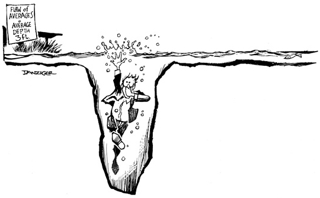{width="600"}
:::

---

# [Variability ("Spread")]{.center .blue}

. . .

### **Standard deviation**: distribution of values relative to the mean
### $s = \sqrt{\frac{\sum_{i=1}^{N}(x_i - \bar{x})^2}{N - 1}}$

. . .

### **Interquartile range (IQR)**: $Q_3 - Q_1$ (middle 50% of data)

. . .

### **Range**: max - min

---

# [[Example:]{.fancy} Days to ship]{.center}

::: {.col width="40%"}
Complaints are coming in about orders shipped from warehouse B, so you collect some data:

::: {.font70}
```{r}
daysToShip
```
:::
:::

::: {.col width="60%" .fragment}
Here, **averages** are misleading:

```{r}
#| code-line-numbers: "5,6"

daysToShip %>%
    gather(warehouse, days, warehouseA:warehouseB) %>%
    group_by(warehouse) %>%
    summarise(
        mean   = mean(days),
        median = median(days))
```
:::

---

# [[Example:]{.fancy} Days to ship]{.center}

::: {.col width="40%"}
Complaints are coming in about orders shipped from warehouse B, so you collect some data:

::: {.font70}
```{r}
daysToShip
```
:::
:::

::: {.col width="60%"}
**Variability** reveals difference in days to ship:

```{r}
#| code-line-numbers: "7,8"

daysToShip %>%
    gather(warehouse, days, warehouseA:warehouseB) %>%
    group_by(warehouse) %>%
    summarise(
        mean   = mean(days),
        median = median(days),
        range = max(days) - min(days),
        sd    = sd(days))
```
:::

---

# [[Example:]{.fancy} Days to ship]{.center}

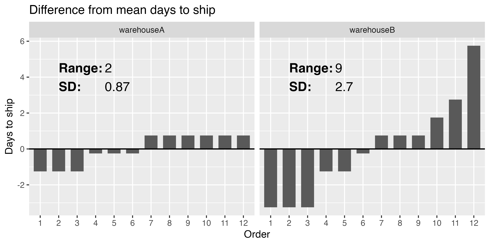{width="960"}

---



# Interpreting the standard deviation

::: {.col}
### $s = \sqrt{\frac{\sum_{i=1}^{N}(x_i - \bar{x})^2}{N - 1}}$

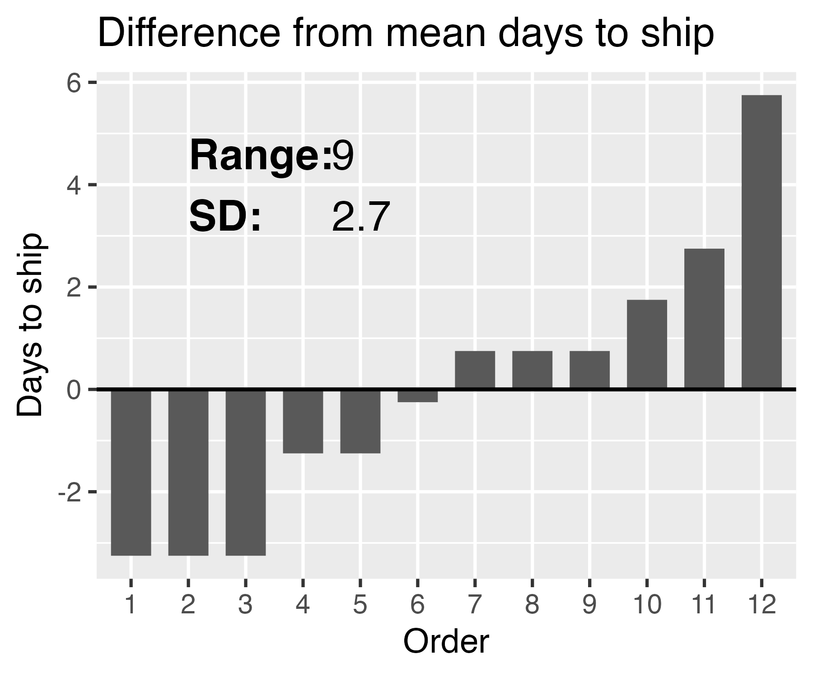{width="380"}
:::

::: {.col .fragment}
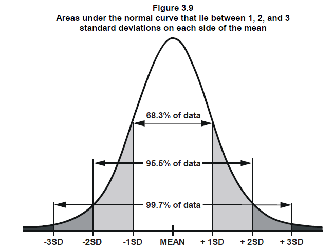
:::

---




# Outliers

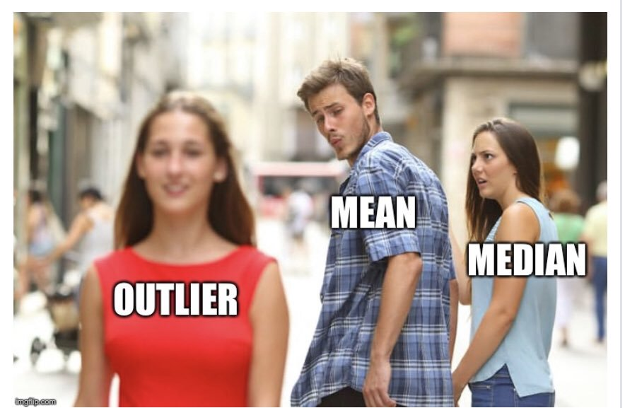{width="730"}

---

## **Mean** & **Standard Deviation** are sensitive to outliers

**Outliers**: $Q_1 - 1.5 IQR$ or $Q_3 + 1.5 IQR$

**Extreme values**: $Q_1 - 3 IQR$ or $Q_3 + 3 IQR$

. . .

::: {.col}
```{r}
data1 <- c(3,3,4,5,5,6,6,7,8,9)
```

- Mean: `r mean(data1)`
- Standard Deviation: `r round(sd(data1), 2)`
- Median: `r median(data1)`
- IQR: `r IQR(data1)`
:::

::: {.col .fragment}
```{r}
data2 <- data1
data2[10] <- 20
```

- [Mean: `r mean(data2)`]{.red}
- [Standard Deviation: `r round(sd(data2), 2)`]{.red}
- Median: `r median(data2)`
- IQR: `r IQR(data2)`
:::

---




# [Robust statistics for continuous data]{.center}
# [(less sensitive to outliers)]{.center}

## [Centrality]{.red}: Use _median_ rather than _mean_

## [Variability]{.blue}: Use _IQR_ rather than _standard deviation_

---



```{r}
#| echo: false

countdown(
  minutes = 10,
  warn_when = 15,
  update_every = 1,
  top = 0,
  right = 0,
  font_size = "2em"
)
```

# Practice with summary measurements

### 1) Read in the following data sets:

- `milk_production.csv`
- `lotr_words.csv`

### 2) For each variable in each data set, if possible, summarize its

### 1. [Centrality]{.red}
### 2. [Variability]{.blue}

---

```{r}
#| echo: false
#| results: asis

agenda(4)
```

---



# "Visualizing data helps us think"

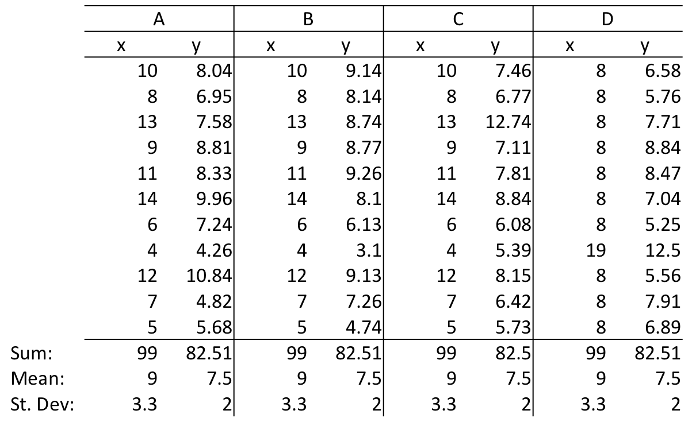{width="740"}

[Stephen Few (2009, pg. 6)]{.left .footer-small}

---




# Anscombe's Quartet

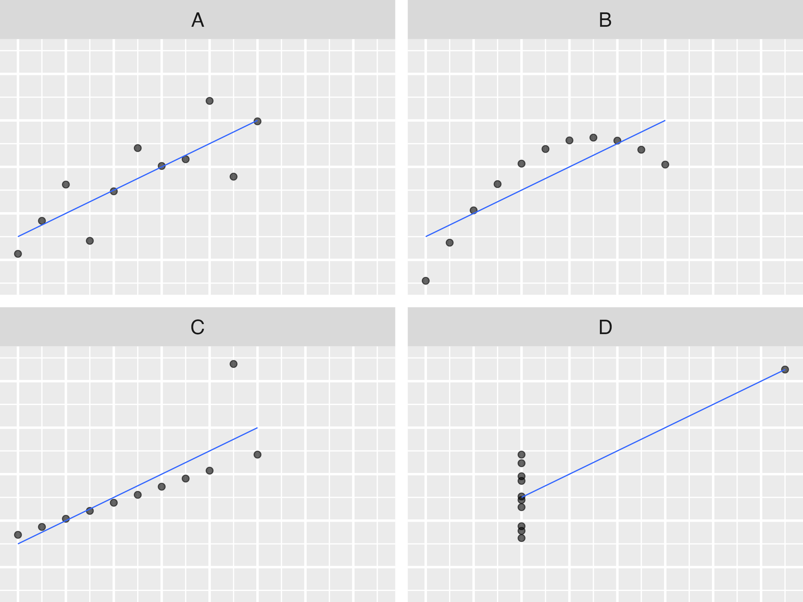{width="600"}

[Stephen Few (2009, pg. 6)]{.left .footer-small}

---




::: {.col width="60%"}
# Anscombe's Quartet

{width="600"}
:::

::: {.col width="40%"}
<br>

{width="100%"}
:::

---





# The data _type_ determines <br> how to summarize it

---

::: {.col}
### **Nominal<br>(Categorical)**

**Measures**:
- Frequency counts /<br>Proportions
<br>
<br>
<br>
<br>

**Charts**:
- Bars
:::

::: {.col .fragment}
### **Ordinal<br>(Categorical)**

**Measures**:
- Frequency counts /<br>Proportions
- [Centrality]{.red}:<br>Median, Mode
- [Variability]{.blue}: IQR
<br>

**Charts**:
- Bars
:::

::: {.col .fragment}
### **Numerical<br>(Continuous)**

**Measures**:
- [Centrality]{.red}:<br>Mean, median
- [Variability]{.blue}: Range, standard deviation, IQR
<br>
<br>

**Charts**:
- Histogram
- Boxplot
:::

---

## Summarizing **Nominal** data

::: {.col width="45%"}
Summarize with counts / percentages

```{r}
#| code-line-numbers: "2,3"

wildlife_impacts %>%
    count(operator, sort = TRUE) %>%
    mutate(p = n / sum(n))
```
:::

::: {.col width="55%" .fragment}
Visualize with (usually sorted) bars

::: {.font70}
```{r}
#| fig-width: 7
#| fig-height: 3
#| code-line-numbers: "3,4,5"

wildlife_impacts %>%
    count(operator, sort = TRUE) %>%
    ggplot() +
    geom_col(aes(x = n, y = reorder(operator, n)),
             width = 0.7) +
    labs(x = "Count", y = "Operator")
```
:::
:::

---

## Summarizing **Ordinal** data

::: {.col}
**Summarize**: Counts / percentages

::: {.font70}
```{r}
#| code-line-numbers: "2,3"

wildlife_impacts %>%
    count(incident_month, sort = TRUE) %>%
    mutate(p = n / sum(n))
```
:::
:::

::: {.col .fragment}
**Visualize**: Bars

::: {.font70}
```{r}
#| fig-width: 7
#| fig-height: 3.7
#| code-line-numbers: "3,4,5"

wildlife_impacts %>%
    count(incident_month, sort = TRUE) %>%
    ggplot() +
    geom_col(aes(x = as.factor(incident_month),
                 y = n), width = 0.7) +
    labs(x = "Incident month")
```
:::
:::

---

## Summarizing **continuous** variables

::: {.col width="30%"}
**Histograms**:

- Skewness
- Number of modes

<br>

**Boxplots**:

- Outliers
- Comparing variables
:::

::: {.col width="70%" .border}
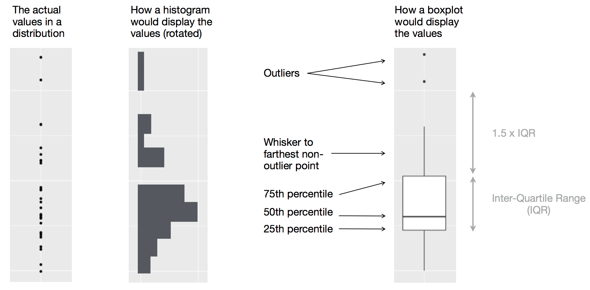
:::

---

## **Histogram**: Identify Skewness & # of Modes

::: {.col width="40%"}
**Summarise**:<br>Mean, median, sd, range, & IQR:

```{r}
summary(wildlife_impacts$height)
```
:::

::: {.col width="60%" .fragment}
**Visualize**:<br>Histogram (identify skewness & modes)

```{r}
#| fig-width: 7
#| fig-height: 3.7
#| fig-align: center
#| code-line-numbers: "2"

ggplot(wildlife_impacts) +
  geom_histogram(aes(x = height), bins = 50) +
  labs(x = 'Height (ft)', y = 'Count')
```
:::

---

## **Histogram**: Identify Skewness & # of Modes

::: {.col}
**Height**

```{r}
#| fig-width: 7
#| fig-height: 3.7
#| fig-align: center

ggplot(wildlife_impacts) +
  geom_histogram(aes(x = height), bins = 50) +
  labs(x = 'Height (ft)', y = 'Count')
```
:::

::: {.col}
**Speed**

```{r}
#| fig-width: 7
#| fig-height: 3.7
#| fig-align: center
#| code-line-numbers: "2"

ggplot(wildlife_impacts) +
  geom_histogram(aes(x = speed), bins = 50) +
  labs(x = 'speed (mph)', y = 'Count')
```
:::

---

## **Boxplot**: Identify outliers

::: {.col}
**Height**

```{r}
#| fig-width: 7
#| fig-height: 3
#| fig-align: center
#| code-line-numbers: "2"

ggplot(wildlife_impacts) +
    geom_boxplot(aes(x = height)) +
    labs(x = 'Height (ft)', y = NULL)
```
:::

::: {.col}
**Speed**

```{r}
#| fig-width: 7
#| fig-height: 3
#| fig-align: center
#| code-line-numbers: "2"

ggplot(wildlife_impacts) +
    geom_boxplot(aes(x = speed)) +
    labs(x = 'Speed (mph)', y = NULL)
```
:::

---

::: {.col}
## Histogram

- Skewness
- Modes

```{r}
#| echo: false
#| fig-width: 7
#| fig-height: 3.7
#| fig-align: center

ggplot(wildlife_impacts) +
  geom_histogram(aes(x = speed), bins = 50) +
  labs(x = 'speed (mph)', y = 'Count')
```
:::

::: {.col}
## Boxplot

- Outliers

<br><br>

```{r}
#| echo: false
#| fig-width: 7
#| fig-height: 3
#| fig-align: center

ggplot(wildlife_impacts) +
    geom_boxplot(aes(x = speed)) +
    labs(x = 'Speed (mph)', y = NULL)
```
:::

---



```{r}
#| echo: false

countdown(
  minutes = 15,
  warn_when = 15,
  update_every = 1,
  top = 0,
  right = 0,
  font_size = "2em"
)
```

# Practicing visual summaries

::: {.font90}
1) Read in the following data sets:

- `faithful.csv`
- `marathon.csv`

2) Summarize the following variables using an appropriate chart (bar chart, histogram, and / or boxplot):

- faithful: `eruptions`
- faithful: `waiting`
- marathon: `Age`
- marathon: `State`
- marathon: `Country`
- marathon: `` `Official Time` ``
:::

---




# Break!

## Stand up, Move around, Stretch!

```{r}
#| echo: false

countdown(
  minutes = 5,
  warn_when = 30,
  update_every = 1,
  left = 0,
  right = 0,
  top = 1,
  bottom = 0,
  margin = "5%",
  font_size = "8em"
)
```

---

```{r}
#| echo: false
#| results: asis

agenda(5)
```

---

## [Correlation: a rather racist origin in [eugenics](https://en.wikipedia.org/wiki/Eugenics) ("well born")]{.center}

::: {.col .fragment}
### [Sir Francis Galton](https://en.wikipedia.org/wiki/Francis_Galton) (1822 - 1911)

- Charles Darwin's cousin.
- "Father" of [eugenics](https://en.wikipedia.org/wiki/Eugenics).
- Interested in heredity.

::: {.center}
{width="200"}
:::
:::

::: {.col .fragment}
### [Karl Pearson](https://en.wikipedia.org/wiki/Karl_Pearson) (1857 - 1936)

- Galton's ([hero-worshiping](https://en.wikipedia.org/wiki/Apotheosis)) protégé.
- Defined correlation equation.
- "Father" of mathematical statistics.

::: {.center}
{width="220"}
:::
:::

::: {.notes}
The beautiful irony is that human genetics was also the field that conclusively demonstrated the biological falsity of race.
:::

---

::: {.col}
# Galton's family data

Galton, F. (1886). ["Regression towards mediocrity in hereditary stature"](http://www.stat.ucla.edu/~nchristo/statistics100C/history_regression.pdf). _The Journal of the Anthropological Institute of Great Britain and Ireland_ 15: 246-263.

**Galton's question**: Does marriage selection indicate a relationship between the heights of husbands and wives?<br>(He called this "assortative mating")

"midparent height" is just a scaled mean:

```{r}
#| eval: false

midparentHeight =  (father + 1.08*mother)/2
```
:::

::: {.col .fragment}
::: {.font70}
```{r}
#| eval: false

library(HistData)

galtonScatterplot <- ggplot(GaltonFamilies) +
    geom_point(aes(x = midparentHeight,
                   y = childHeight),
               size = 0.5, alpha = 0.7) +
    theme_classic() +
    labs(x = 'Midparent height (inches)',
         y = 'Child height (inches)')
```
:::

::: {.center}
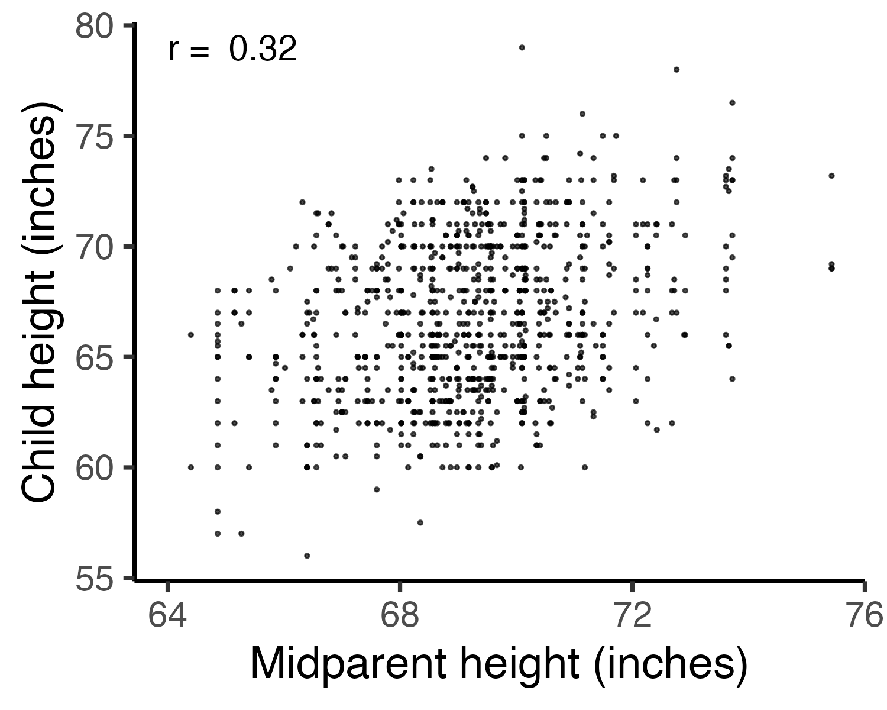{width="450"}
:::
:::

---




# How do you measure correlation?

<br>

# Pearson came up with this:

# $r = \frac{\text{Cov}(x, y)}{\text{sd}(x) * \text{sd}(y)}$

---

# How do you measure correlation?

::: {.col width="60%"}
## $r = \frac{\text{Cov}(x, y)}{\text{sd}(x) * \text{sd}(y)}$

::: {.font130}
Assumptions:

1. Variables must be interval or ratio
2. Linear relationship
:::
:::

::: {.col width="40%" .fragment}
{width="275"}

<br>

{width="275"}
:::

---

# How do you _interpret_ $r$?

::: {.col}
## $r = \frac{\text{Cov}(x, y)}{\text{sd}(x) * \text{sd}(y)}$

Interpretation:

- $-1 \le r \le 1$
- Closer to 1 is stronger correlation
- Closer to 0 is weaker correlation
:::

::: {.col .fragment}
::: {.font70}
```{r}
cor(x = GaltonFamilies$midparentHeight,
    y = GaltonFamilies$childHeight,
    method = 'pearson')
```
:::

::: {.center}
{width="400"}
:::
:::

---

## What does $r$ mean?

::: {.col width="40%" .font120}
- $\pm 0.1 - 0.3$: Weak
- $\pm 0.3 - 0.5$: Moderate
- $\pm 0.5 - 0.8$: Strong
- $\pm 0.8 - 1.0$: Very strong
:::

::: {.col width="60%"}

:::

---




# Visualizing correlation is...um...easy, right?

<br>

# [guessthecorrelation.com](http://guessthecorrelation.com/)

# Click [here](https://docs.google.com/presentation/d/1-7VqNRJp53FawfNJwKLEkpoubGQ_x0wIkN2lAMP7Emw/edit?usp=sharing) to vote!

---



::: {.col width="20%"}
## The datasaurus

### (More [here](https://www.autodeskresearch.com/publications/samestats))
:::

::: {.col width="80%"}
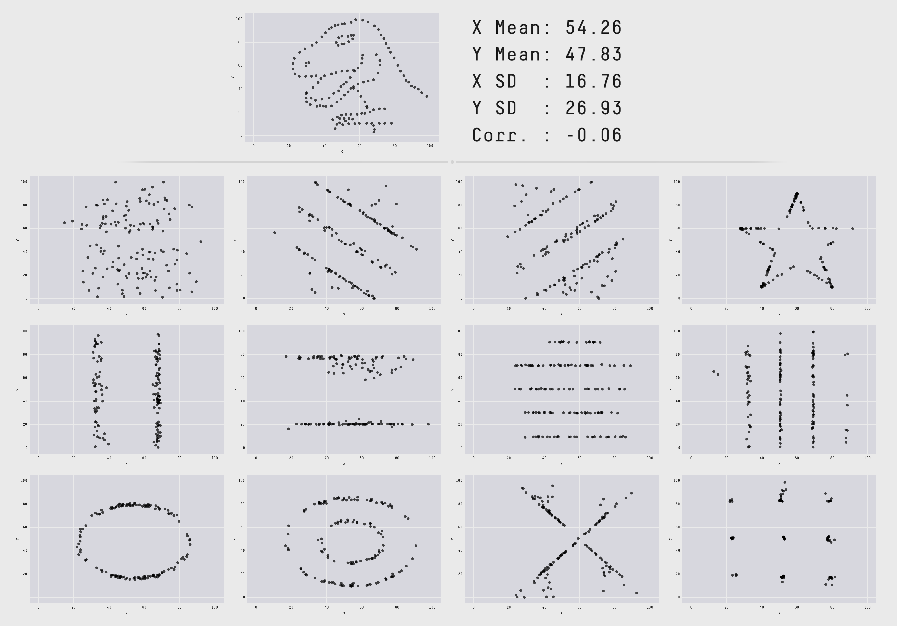
:::

---

# Coefficient of determination: $r^2$

::: {.col .font130}
Percent of variance in one variable that is explained by the other variable

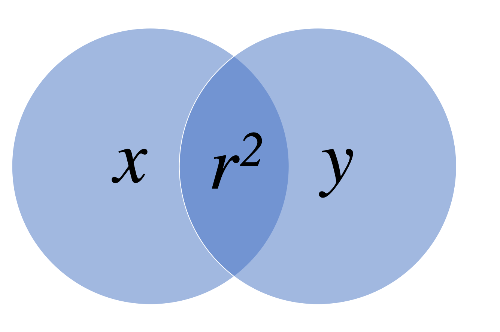
:::

::: {.col .fragment}
$r$ | $r^2$
----|------
0.1 | 0.01
0.2 | 0.04
0.3 | 0.09
0.4 | 0.16
0.5 | 0.25
0.6 | 0.36
0.7 | 0.49
0.8 | 0.64
0.9 | 0.81
1.0 | 1.00
:::

---

## You should report both $r$ and $r^2$

<br>

### Correlation between parent and child height is 0.32, therefore 10% of the variance in the child height is explained by the parent height.

---

# Correlation != Causation

. . .

### X causes Y

- Training causes improved performance

. . .

### Y causes X

- Good (bad) performance causes people to train harder (less hard).

. . .

### Z causes both X & Y

- Commitment and motivation cause increased training and better performance.

---



## Be weary of dual axes!

## ([They can cause spurious correlations](https://www.tylervigen.com/spurious-correlations))

::: {.col .fragment}
[Dual axes]{.font120}

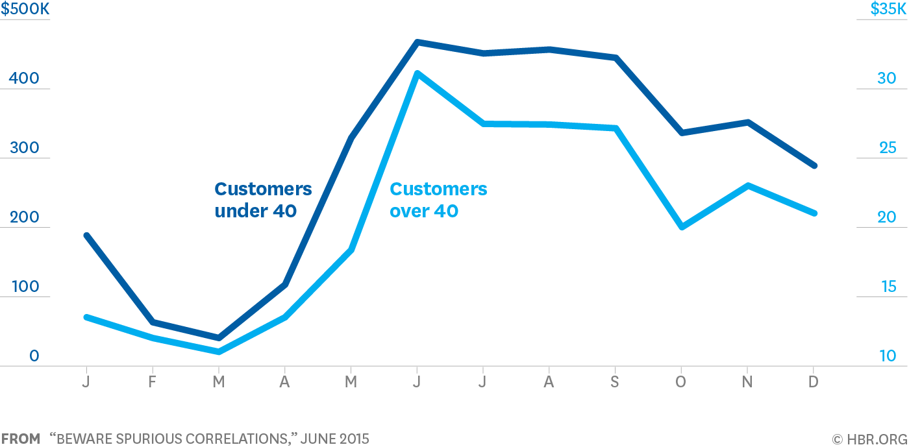
:::

::: {.col .fragment}
[Single axis]{.font120}

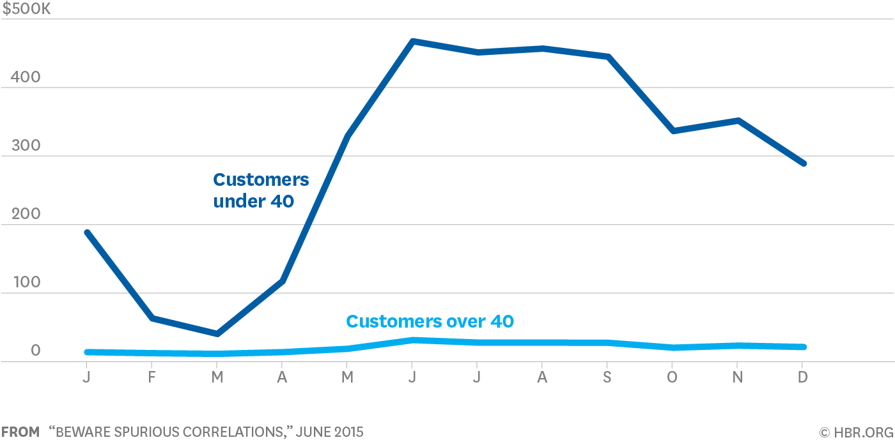
:::

---




# Outliers

{width="730"}

---




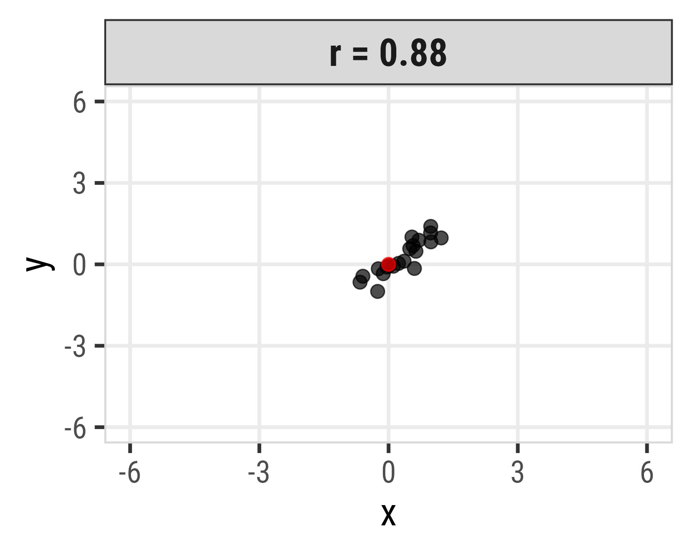{width="600"}

---




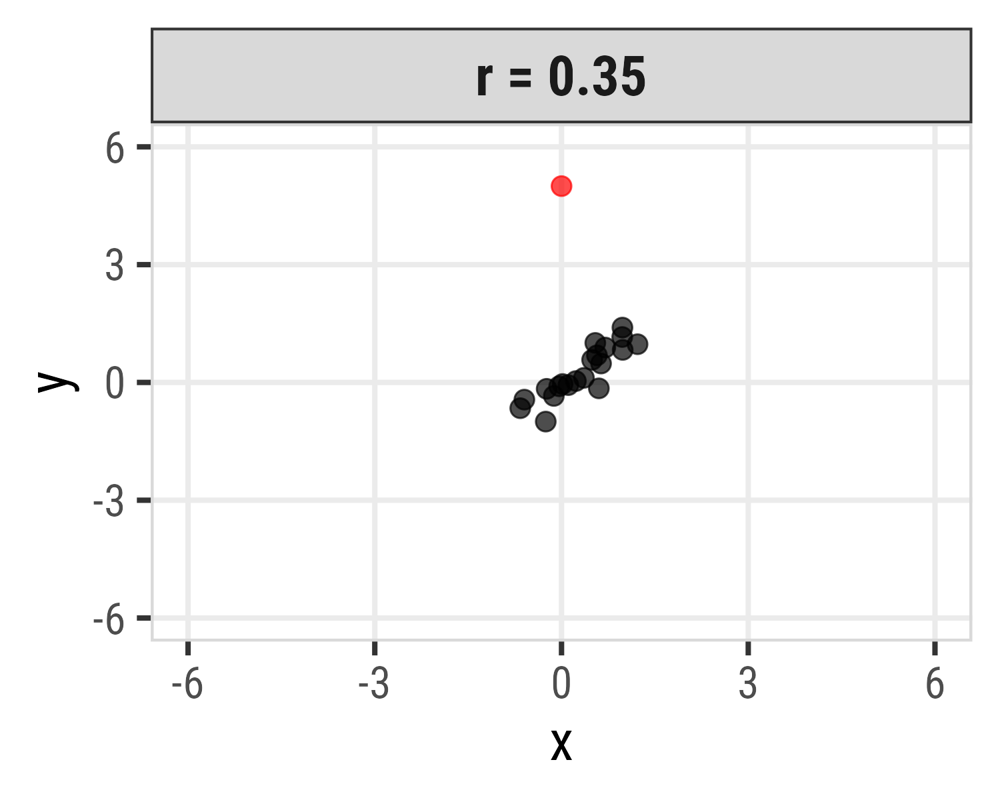{width="600"}

---




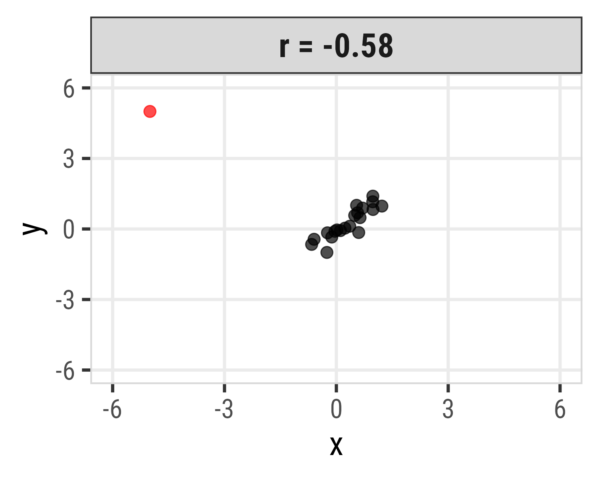{width="600"}

---




## **Pearson** correlation is highly sensitive to outliers

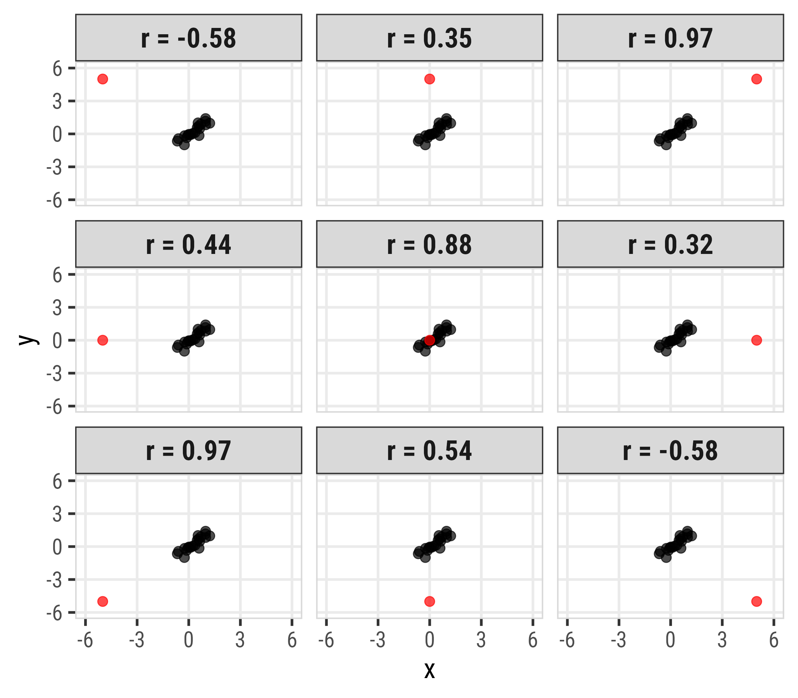{width="600"}

---

# **Spearman**'s rank-order correlation

# $r = \frac{\text{Cov}(x, y)}{\text{sd}(x) * \text{sd}(y)}$

. . .

::: {.font120}
- Separately rank the values of X & Y.
- Use Pearson's correlation on the _ranks_ instead of the $x$ & $y$ values.
:::

. . .

::: {.font120}
Assumptions:

- Variables can be ordinal, interval or ratio
- Relationship must be monotonic (i.e. does not require linearity)
:::

---




## Spearman correlation more robust to outliers

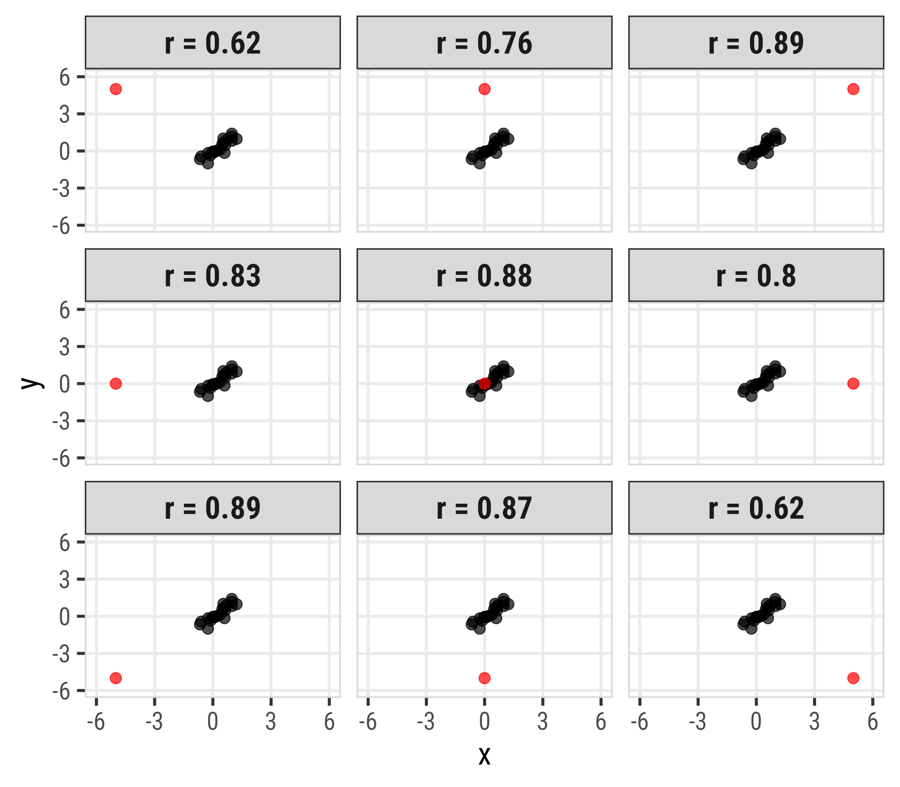{width="600"}

---




## Spearman correlation more robust to outliers

::: {.col}

:::

::: {.col}
```{r}
#| echo: false

tribble(
    ~Pearson, ~Spearman,
    -0.56,    0.53,
    0.39,     0.69,
    0.94,     0.81,
    0.38,     0.76,
    0.81,     0.79,
    0.31,     0.70,
    0.95,     0.81,
    0.51,     0.75,
    -0.56,    0.53) %>%
    kable()
```
:::

::: {.col}
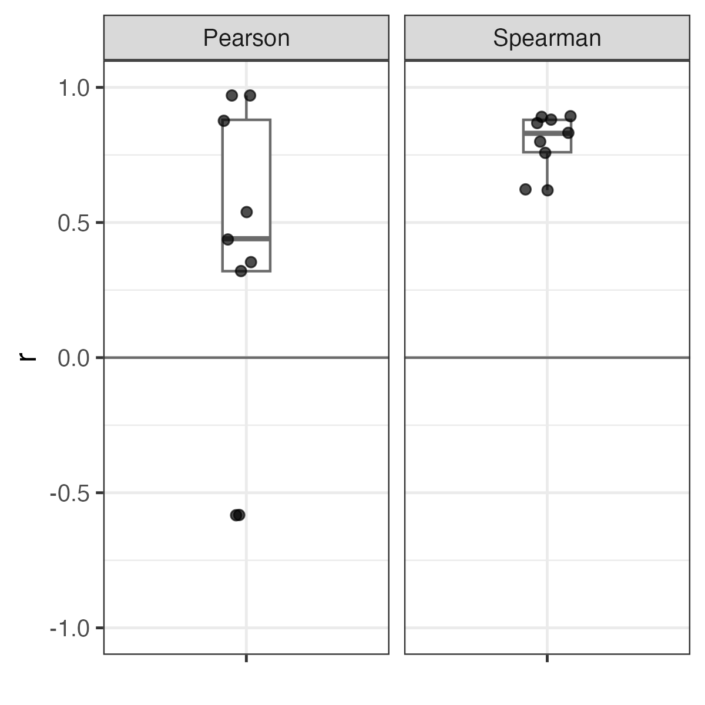
:::

---

## Summary of correlation

::: {.font120}
- **Pearson's correlation**: Described the strength of a **linear** relationship between two variables that are interval or ratio in nature.
- **Spearman's rank-order correlation**: Describes the strength of a **monotonic** relationship between two variables that are ordinal, interval, or ratio. **It is more robust to outliers**.
- The **coefficient of determination** ( $r^2$ ) describes the amount of variance in one variable that is explained by the other variable.
- **Correlation != Causation**
:::

. . .

R command (hint: add `use = "complete.obs"` to drop NA values)

```{r}
#| eval: false

pearson  <- cor(x, y, method = "pearson", use = "complete.obs")
spearman <- cor(x, y, method = "spearman", use = "complete.obs")
```

---

```{r}
#| echo: false
#| results: asis

agenda(6)
```

---

## **Scatterplots**: The correlation workhorse

::: {.col}
```{r}
#| eval: false
#| code-line-numbers: "3,4,5,6"

scatterplot <- mtcars %>%
  ggplot() +
  geom_point(
    aes(x = mpg, y = hp),
    size = 2, alpha = 0.7
  ) +
  theme_classic(base_size = 20) +
  labs(
    x = 'Fuel economy (mpg)',
    y = 'Engine power (hp)'
  )

scatterplot
```
:::

::: {.col}
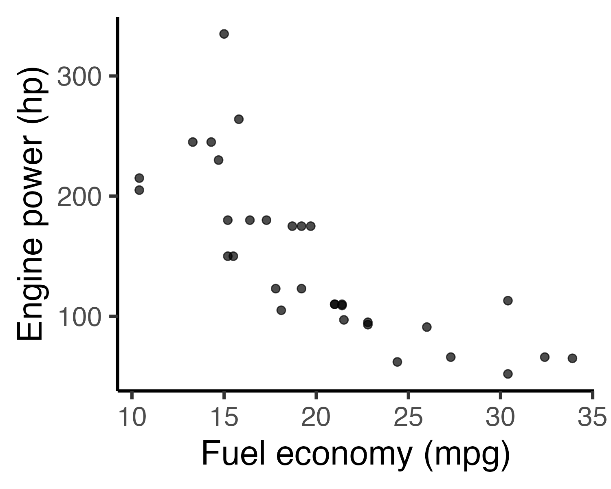
:::

---

## Adding a correlation label to a chart

::: {.col}
Make the correlation label

```{r}
#| eval: false
#| code-line-numbers: "5"

corr <- cor(
    mtcars$mpg, mtcars$hp,
    method = 'pearson')

corrLabel <- paste('r = ', round(corr, 2))
```

Add label to the chart with `annotate()`

```{r}
#| eval: false
#| code-line-numbers: "2,3,4,5,6,7"

scatterplot +
  annotate(
    geom = 'text',
    x = 25, y = 310,
    label = corrLabel,
    hjust = 0, size = 7
  )
```
:::

::: {.col}
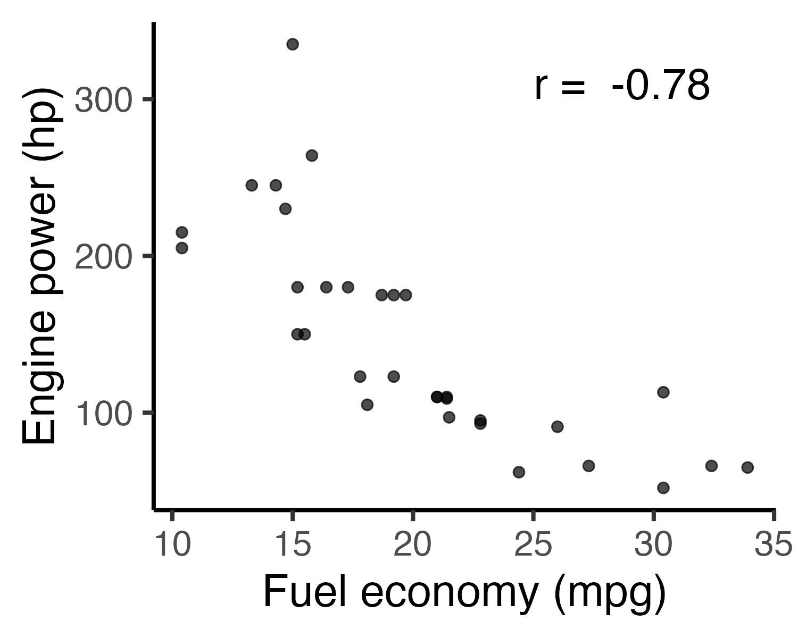
:::

---





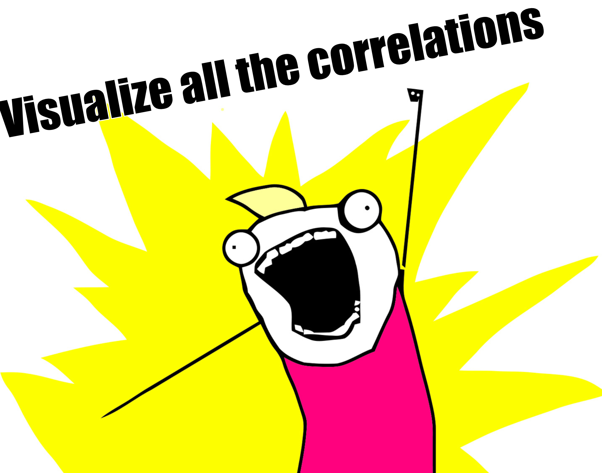{width="700"}

---

## Visualize all the correlations: `ggcorr()`

::: {.col}
```{r}
#| eval: false

library('GGally')
```

```{r}
#| eval: false
#| code-line-numbers: "2"

mtcars %>%
    ggcorr()
```
:::

::: {.col}
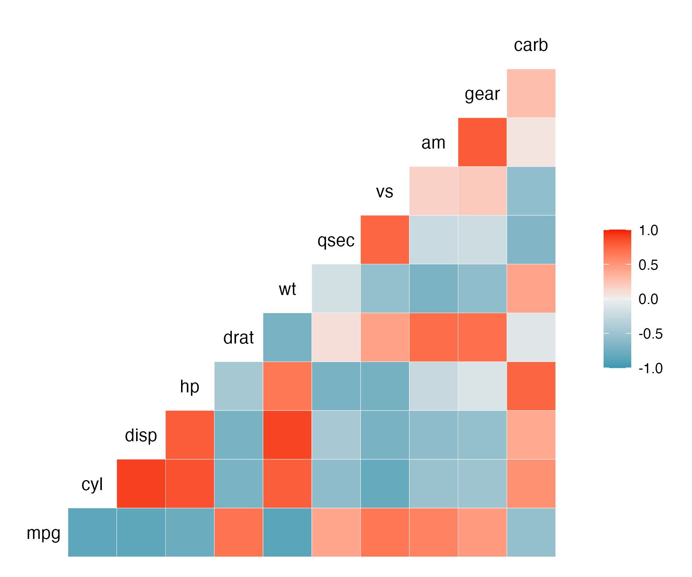
:::

---

## Visualizing correlations: `ggcorr()`

::: {.col}
```{r}
#| eval: false

library('GGally')
```

```{r}
#| eval: false
#| code-line-numbers: "2,3,4"

mtcars %>%
    ggcorr(label = TRUE,
           label_size = 3,
           label_round = 2)
```
:::

::: {.col}
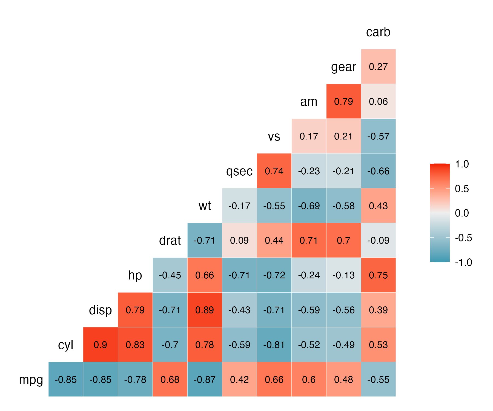
:::

---

## Visualizing correlations: `ggcorr()`

::: {.col}
```{r}
#| eval: false
#| code-line-numbers: "5,6,7"

ggcor_mtcars_final <- mtcars %>%
    ggcorr(label = TRUE,
           label_size = 3,
           label_round = 2,
           label_color = 'white',
           nbreaks = 5,
           palette = "RdBu")
```
:::

::: {.col}
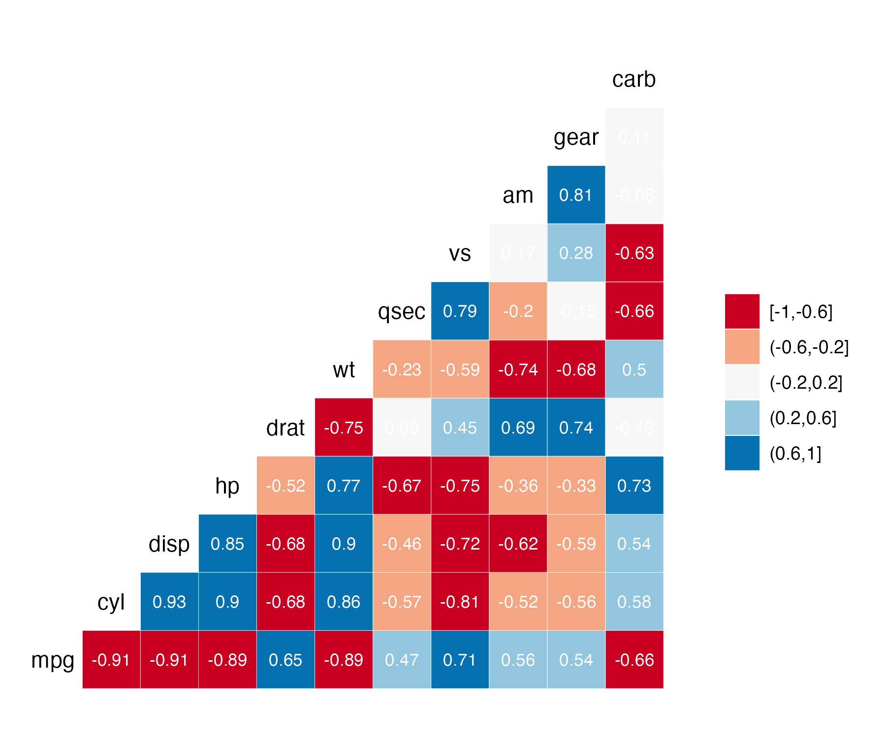
:::

---

::: {.col}
## [Pearson]{.center}

```{r}
#| eval: false
#| code-line-numbers: "5"

mtcars %>%
    ggcorr(label = TRUE,
           label_size = 3,
           label_round = 2,
           method = c("pairwise", "pearson"))
```

::: {.center}
{width="400"}
:::
:::

::: {.col}
## [Spearman]{.center}

```{r}
#| eval: false
#| code-line-numbers: "5"

mtcars %>%
    ggcorr(label = TRUE,
           label_size = 3,
           label_round = 2,
           method = c("pairwise", "spearman"))
```

::: {.center}
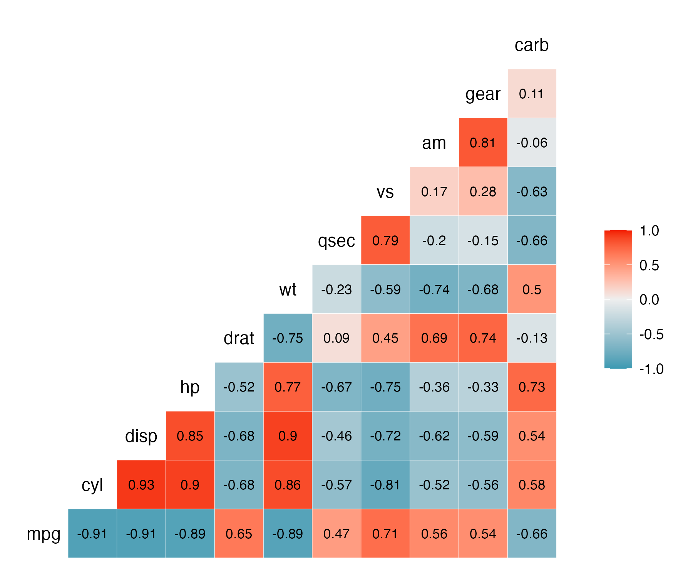{width="400"}
:::
:::

---

## Correlograms: `ggpairs()`

::: {.col width="40%"}
```{r}
#| eval: false

library('GGally')
```

```{r}
#| eval: false
#| code-line-numbers: "3"

mtcars %>%
    select(mpg, cyl, disp, hp, wt) %>%
    ggpairs()
```

- Look for linear relationships
- View distribution of each variable
:::

::: {.col width="60%"}
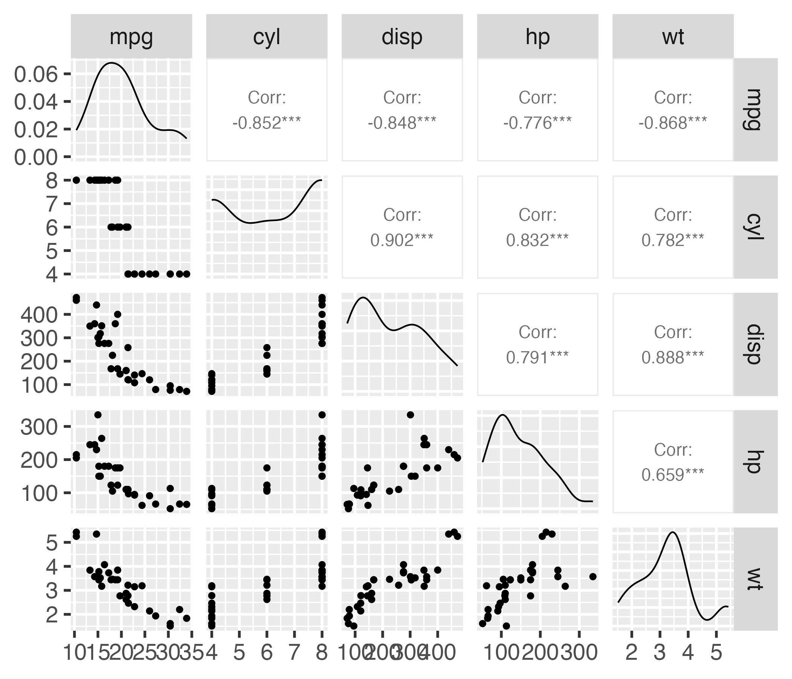{width="600"}
:::

---

## Correlograms: `ggpairs()`

::: {.col width="40%"}
```{r}
#| eval: false

library('GGally')
```

```{r}
#| eval: false
#| code-line-numbers: "4"

mtcars %>%
    select(mpg, cyl, disp, hp, wt) %>%
    ggpairs() +
    theme_classic()
```

- Look for linear relationships
- View distribution of each variable
:::

::: {.col width="60%"}
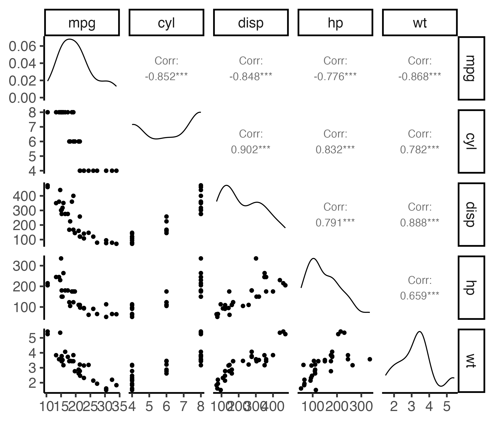{width="600"}
:::

---



## Your turn

```{r}
#| echo: false

countdown(
  minutes = 15,
  warn_when = 30,
  update_every = 15,
  top = 0,
  font_size = "2em"
)
```

::: {.col}
Using the `penguins` data frame:

1. Find the two variables with the largest correlation in absolute value (i.e. closest to -1 or 1).

2. Create a scatter plot of those two variables.

3. Add an annotation for the Pearson correlation coefficient.
:::

::: {.col}
### [[palmerpenguins library](https://allisonhorst.github.io/palmerpenguins/)]{.center}

{width="700"}

[Artwork by [@allison_horst](https://twitter.com/allison_horst)]{.right}
:::

---

## **Simpson's Paradox**: when correlation betrays you

::: {.col .fragment}
[**Body mass vs. Bill depth**]{.center}

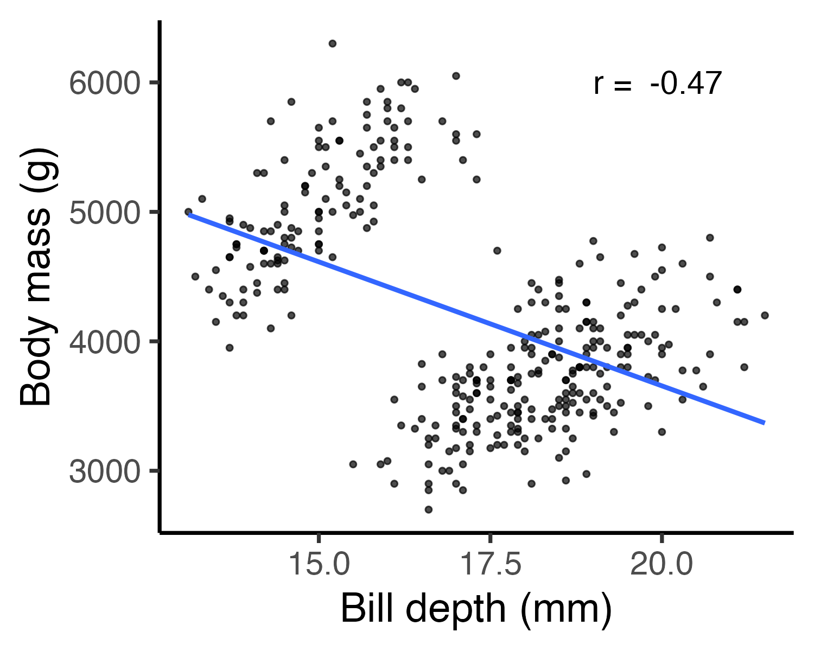{width="450"}
:::

::: {.col .fragment}
[**Body mass vs. Bill depth**]{.center}

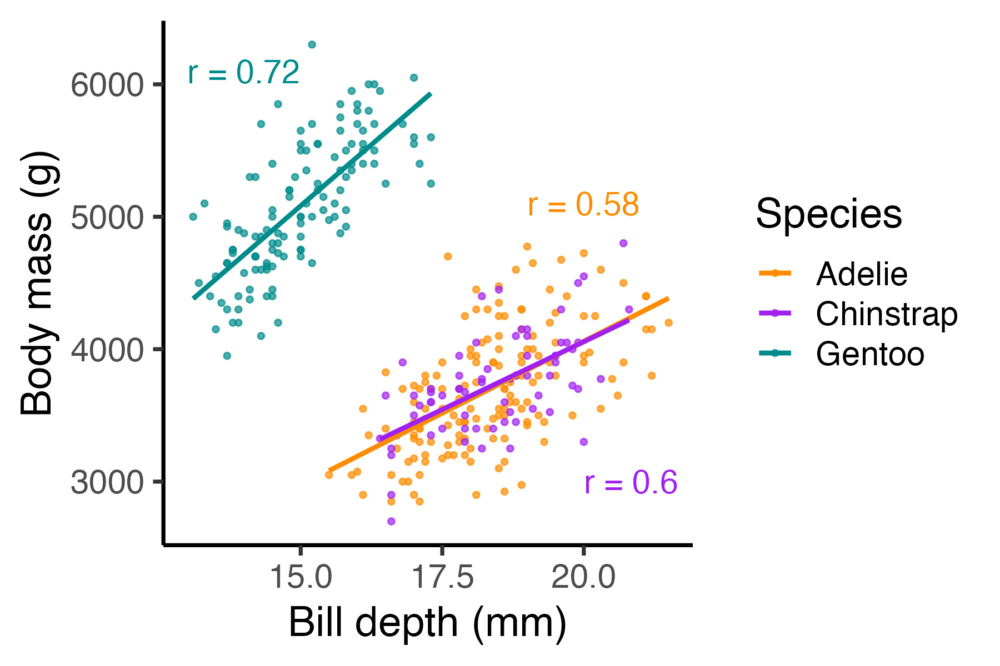{width="600"}
:::

---

```{r}
#| echo: false
#| results: asis

agenda(7)
```

---

## Visualizing variation

::: {.col width="30%"}
Ask yourself:

- What type of **variation** occurs within my variables?
- What type of **covariation** occurs between my variables?

Check out [these guides](https://eda.seas.gwu.edu/2023-Fall/references.html#choosing-the-right-chart)
:::

::: {.col width="70%"}
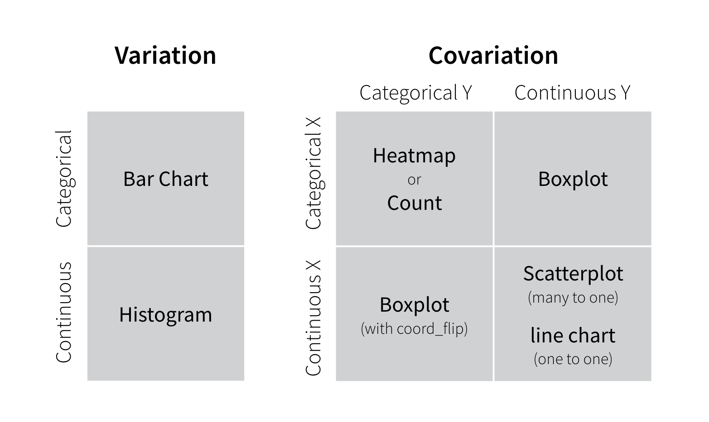{width="800"}
:::

---

## Two **Categorical** Variables

Summarize with a table of counts

::: {.col width="60%"}
```{r}
#| code-line-numbers: "2"

wildlife_impacts %>%
    count(operator, time_of_day)
```
:::

::: {.col width="40%"}
:::

---

## Two **Categorical** Variables

Convert to "wide" format with `pivot_wider()` to make it easier to compare values

::: {.col width="70%"}
```{r}
#| code-line-numbers: "3"

wildlife_impacts %>%
    count(operator, time_of_day) %>%
    pivot_wider(names_from = time_of_day, values_from = n)
```
:::

::: {.col width="30%"}
:::

---

## Two **Categorical** Variables

::: {.col width="45%"}
Visualize with bars:<br>map **fill** to denote 2nd categorical var

```{r}
#| fig-show: hide
#| code-line-numbers: "8,11"

wildlife_impacts %>%
  count(operator, time_of_day) %>%
  ggplot() +
  geom_col(
    aes(
      x = n,
      y = reorder(operator, n),
      fill = reorder(time_of_day, n)
    ),
    width = 0.7,
    position = 'dodge') +
  theme(legend.position = "bottom") +
  labs(
    fill = "Time of day",
    y = "Airline"
  )
```
:::

::: {.col width="55%"}
```{r}
#| echo: false
#| fig-width: 9
#| fig-height: 6
#| fig-align: center

wildlife_impacts %>%
  count(operator, time_of_day) %>%
  ggplot() +
  geom_col(
    aes(
      x = n,
      y = reorder(operator, n),
      fill = reorder(time_of_day, n)
    ),
    width = 0.7,
    position = 'dodge') +
  theme(legend.position = "bottom") +
  labs(
    fill = "Time of day",
    y = "Airline"
  )
```
:::

---

## Two **Continuous** Variables

Visualize with scatterplot - looking for _clustering_ and/or _correlational_ relationship

::: {.col width="45%"}
```{r}
#| fig-show: hide

ggplot(wildlife_impacts) +
  geom_point(
    aes(
      x = speed,
      y = height
    ),
    size = 0.5) +
  labs(
    x = 'Speed (mph)',
    y = 'Height (f)'
  )
```
:::

::: {.col width="55%"}
```{r}
#| echo: false
#| fig-width: 7
#| fig-height: 4
#| fig-align: center

ggplot(wildlife_impacts) +
  geom_point(
    aes(
      x = speed,
      y = height
    ),
    size = 0.5) +
  labs(
    x = 'Speed (mph)',
    y = 'Height (f)'
  )
```
:::

---

## One **Continuous**, One **Categorical**

Visualize with **boxplot**

::: {.col width="45%"}
```{r}
#| fig-show: hide

ggplot(wildlife_impacts) +
  geom_boxplot(
    aes(
      x = speed,
      y = operator)
    ) +
  labs(
    x = 'Speed (mph)',
    y = 'Airline'
  )
```
:::

::: {.col width="55%"}
```{r}
#| echo: false
#| fig-width: 7
#| fig-height: 4
#| fig-align: center

ggplot(wildlife_impacts) +
  geom_boxplot(
    aes(
      x = speed,
      y = operator)
    ) +
  labs(
    x = 'Speed (mph)',
    y = 'Airline'
  )
```
:::

---



```{r}
#| echo: false

countdown(
  minutes = 15,
  warn_when = 15,
  update_every = 1,
  top = 0,
  right = 0,
  font_size = "2em"
)
```

# Practice doing EDA

1) Read in the `candy_rankings.csv` data sets

2) Preview the data, note the data types and what each variable is.

3) Visualize (at least) three _relationships_ between two variables (guided by a question) using an appropriate chart:

- Bar chart
- Scatterplot
- Boxplot
