

```{r}
#| include: false

agenda_items <- c(
  "Manipulating factors",
  "Graphing amounts",
  "Graphing proportions"
)

# Read in data sets for class
avengers         <- read_csv(here::here('data', 'avengers.csv'))
bears            <- read_csv(here::here('data', 'north_america_bear_killings.csv'))
federal_spending <- read_csv(here::here('data', 'fed_spending_long.csv'))
gapminder        <- read_csv(here::here('data', 'gapminder.csv'))
lotr_words       <- read_csv(here::here('data', 'lotr_words.csv'))
milk_production  <- read_csv(here::here('data', 'milk_production.csv'))
wildlife_impacts <- read_csv(here::here('data', 'wildlife_impacts.csv'))
milk_summary_2017 <- milk_production %>%
  filter(year == 2017) %>%
  mutate(state = fct_other(state,
    keep = c('California', 'Wisconsin'))) %>%
  group_by(state) %>%
  summarise(milk_produced = sum(milk_produced)) %>%
  mutate(milk_produced = milk_produced / 10^9)
```

---



# Quiz 2

```{r}
#| echo: false

countdown(
  minutes = 12,
  warn_when = 30,
  update_every = 1,
  top = 0,
  right = 0,
  font_size = "3em"
)
```

::: {.col}
## Write your name on the quiz!

## Rules:

- Work alone; no outside help of any kind is allowed.
- No calculators, no notes, no books, no computers, no phones.
:::

::: {.col}
<br>

{width="400"}
:::

---




# Next projects due:

## - [Mini project 2](https://eda.seas.gwu.edu/2026-Fall/mini/2-exploring-data.html): Exploring Data (Due 10/13)
## - [Project Progress Report](https://eda.seas.gwu.edu/2026-Fall/project/2-progress-report.html) (Due 10/25)

---

## Today's data

```{r}
#| eval: false

avengers         <- read_csv(here('data', 'avengers.csv'))
bears            <- read_csv(here('data', 'north_america_bear_killings.csv'))
federal_spending <- read_csv(here('data', 'fed_spend_long.csv'))
gapminder        <- read_csv(here('data', 'gapminder.csv'))
lotr_words       <- read_csv(here('data', 'lotr_words.csv'))
milk_production  <- read_csv(here('data', 'milk_production.csv'))
wildlife_impacts <- read_csv(here('data', 'wildlife_impacts.csv'))
```

## New packages

The [{waffle} package](https://github.com/hrbrmstr/waffle)

```{r}
#| eval: false

install.packages("waffle")
```

---

```{r}
#| echo: false
#| results: asis

agenda(0)
```

---

```{r}
#| echo: false
#| results: asis

agenda(1)
```

---



# Sorting in ggplot is done by reordering factors

::: {.col}
{width="75"}
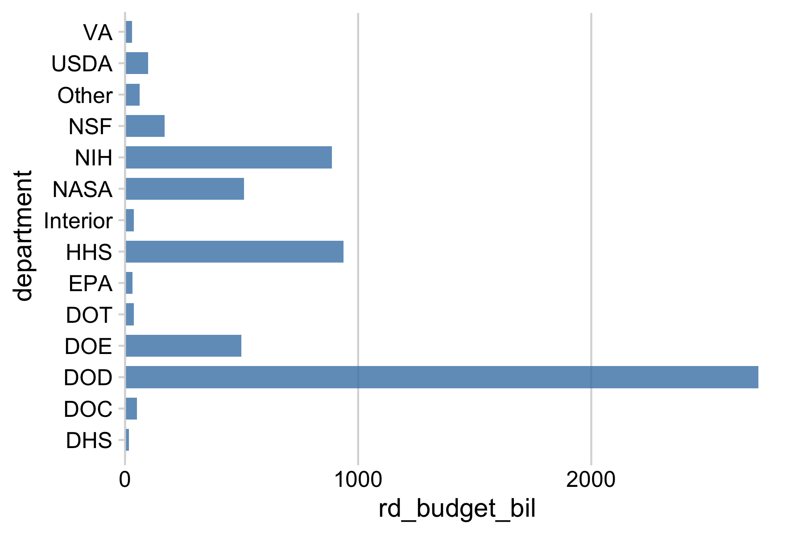
:::

::: {.col}
{width="100"}
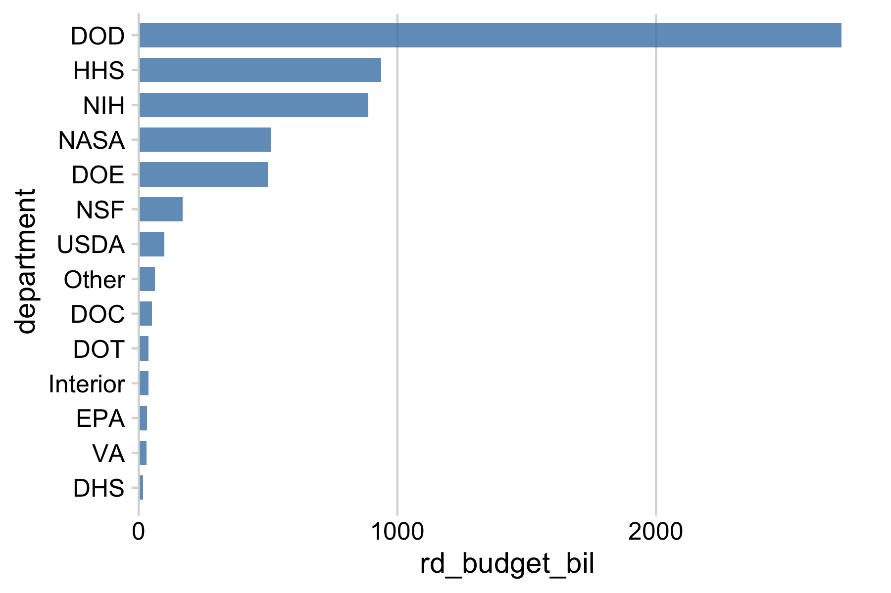
:::

---

## [Two ways to sort]{.center}

**Method 1**: Use `reorder()` inside aesthetic mapping

::: {.col width="60%"}
::: {.font70}
```{r}
#| eval: false
#| code-line-numbers: "12"

# Format the data frame
federal_spending %>%
  group_by(department) %>%
  summarise(
    rd_budget_bil = sum(rd_budget_mil) / 10^3) %>%

# Make the chart
  ggplot() +
  geom_col(
    aes(
      x = rd_budget_bil,
      y = reorder(department, rd_budget_bil)
    ),
    width = 0.7, alpha = 0.8,
    fill = "steelblue"
  ) +
  scale_x_continuous(
    expand = expansion(mult = c(0, 0.05))) +
  theme_minimal_vgrid()
```
:::
:::

::: {.col width="40%"}

:::

---

## [Two ways to sort]{.center}

**Method 2**: Use `fct_reorder()` when formatting the data frame

::: {.col width="60%"}
::: {.font70}
```{r}
#| eval: false
#| code-line-numbers: "7"

# Format the data frame
federal_spending %>%
  group_by(department) %>%
  summarise(
    rd_budget_bil = sum(rd_budget_mil) / 10^3) %>%
  mutate(
    department = fct_reorder(department, rd_budget_bil)
  ) %>%
# Make the chart
  ggplot() +
  geom_col(
    aes(x = rd_budget_bil, y = department),
    width = 0.7, alpha = 0.8,
    fill = "steelblue"
  ) +
  scale_x_continuous(
    expand = expansion(mult = c(0, 0.05))) +
  theme_minimal_vgrid()
```
:::
:::

::: {.col width="40%"}

:::

---



::: {.col width="60%"}
## Reorder & modify factors with<br>the **forcats** library

Loaded with `library(tidyverse)`
:::

::: {.col width="40%"}
{width="400"}
:::

---




## Common situations for modifying / reording factors:

### 1. Reorder factors based on another numerical variable
### 2. Reorder factors manually
### 3. Modify factors manually
### 4. What if there are too many factor levels?

---

### 1. Reorder factors based on another **numerical variable**

::: {.col width="60%"}
Use `fct_reorder()`

::: {.font70}
```{r}
#| eval: false

# Format the data frame
federal_spending %>%
  group_by(department) %>%
  summarise(
    rd_budget_bil = sum(rd_budget_mil) / 10^3) %>%
  mutate(
    department = fct_reorder(department, rd_budget_bil)
  ) %>%
# Make the chart
  ggplot() +
  geom_col(
    aes(x = rd_budget_bil, y = department),
    width = 0.7, alpha = 0.8,
    fill = "steelblue"
  ) +
  scale_x_continuous(
    expand = expansion(mult = c(0, 0.05))) +
  theme_minimal_vgrid()
```
:::
:::

::: {.col width="40%"}
<br>


:::

---

### 2. Reorder factors **manually**

::: {.col}
::: {.font70}
```{r}
#| eval: false

# Format the data frame
lotr_words %>%
  pivot_longer(
      names_to = 'gender',
      values_to = 'wordCount',
      cols = Female:Male) %>%

# Make the chart
  ggplot() +
  geom_col(
    aes(x = wordCount, y = Film),
    width = 0.7, alpha = 0.8
  ) +
  scale_x_continuous(
    expand = expansion(mult = c(0, 0.05))) +
  theme_minimal_vgrid()
```
:::
:::

::: {.col}
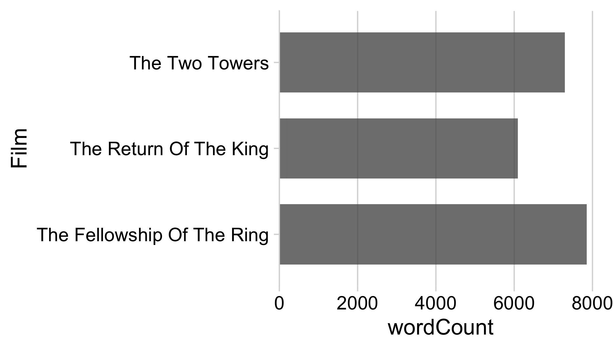
:::

---

### 2. Reorder factors **manually** with `fct_relevel()`

::: {.col}
::: {.font70}
```{r}
#| eval: false
#| code-line-numbers: "7,8,9,10,11"

# Format the data frame
lotr_words %>%
  pivot_longer(
      names_to = 'gender',
      values_to = 'wordCount',
      cols = Female:Male) %>%
  mutate(
    Film = fct_relevel(Film, levels = c(
      'The Fellowship Of The Ring',
      'The Two Towers',
      'The Return Of The King'))) %>%

# Make the chart
  ggplot() +
  geom_col(
    aes(x = wordCount, y = Film),
    width = 0.7, alpha = 0.8
  ) +
  scale_x_continuous(
    expand = expansion(mult = c(0, 0.05))) +
  theme_minimal_vgrid()
```
:::
:::

::: {.col}
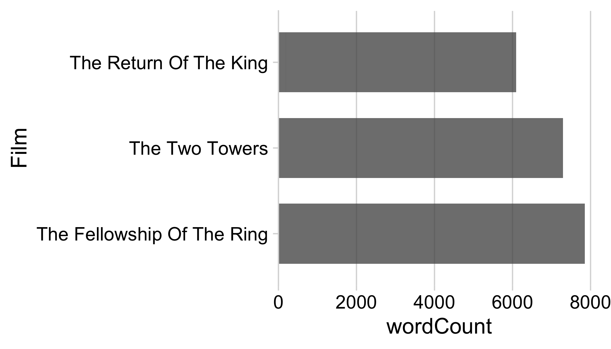
:::

---

### 3. Modify factors manually

::: {.col}
::: {.font70}
<br>

```{r}
#| eval: false

# Format the data frame
lotr_words %>%
  pivot_longer(
      names_to = 'gender',
      values_to = 'wordCount',
      cols = Female:Male) %>%

# Make the chart
  ggplot() +
  geom_col(
    aes(x = wordCount, y = Film),
    width = 0.7, alpha = 0.8
  ) +
  scale_x_continuous(
    expand = expansion(mult = c(0, 0.05))) +
  theme_minimal_vgrid()
```
:::
:::

::: {.col}
[[The film names here are too long]{.red}]{.center}


:::

---

### 3. Modify factors manually with `fct_recode()`

`"new label" = "old label"`

::: {.col width="60%"}
::: {.font70}
```{r}
#| eval: false
#| code-line-numbers: "7,8,9,10"

# Format the data frame
lotr_words %>%
  pivot_longer(
      names_to = 'gender',
      values_to = 'wordCount',
      cols = Female:Male) %>%
  mutate(
    Film = fct_recode(Film,
      'The Fellowship\nof the Ring' = 'The Fellowship Of The Ring',
      'The Return\nof the King' = 'The Return Of The King')) %>%

# Make the chart
  ggplot() +
  geom_col(
    aes(x = wordCount, y = Film),
    width = 0.7, alpha = 0.8
  ) +
  scale_x_continuous(
    expand = expansion(mult = c(0, 0.05))) +
  theme_minimal_vgrid()
```
:::
:::

::: {.col width="40%"}
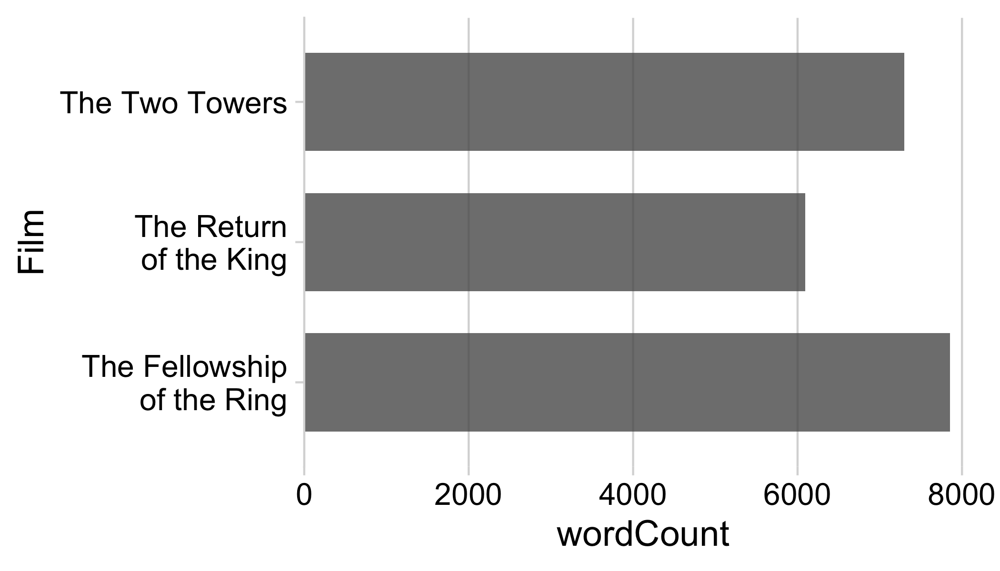
:::

---

### 2 & 3. Modify and reorder factors manually

::: {.col width="60%"}
::: {.font70}
```{r}
#| eval: false
#| code-line-numbers: "7,8,9,10,11,12,13,14"

# Format the data frame
lotr_words %>%
  pivot_longer(
      names_to = 'gender',
      values_to = 'wordCount',
      cols = Female:Male) %>%
  mutate(
    Film = fct_relevel(Film, levels = c(
      'The Fellowship Of The Ring',
      'The Two Towers',
      'The Return Of The King')),
    Film = fct_recode(Film,
      'The Fellowship\nof the Ring' = 'The Fellowship Of The Ring',
      'The Return\nof the King' = 'The Return Of The King')) %>%

# Make the chart
  ggplot() +
  geom_col(
      aes(x = wordCount, y = Film),
      width = 0.7, alpha = 0.8
  ) +
  scale_x_continuous(
    expand = expansion(mult = c(0, 0.05))) +
  theme_minimal_vgrid()
```
:::
:::

::: {.col width="40%"}
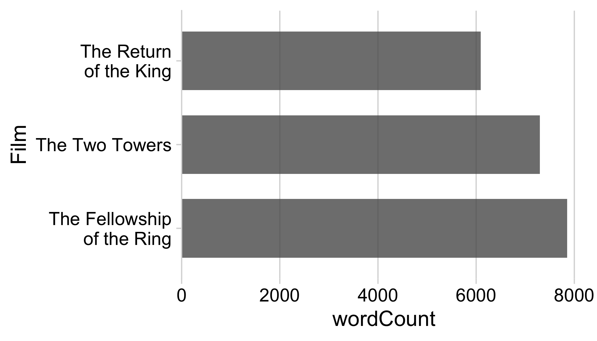
:::

---

### 4. What if there are too many factor levels?

::: {.col width="55%"}
::: {.font70}
```{r}
#| eval: false

# Format the data frame
federal_spending %>%
  group_by(department) %>%
  summarise(
    rd_budget_bil = sum(rd_budget_mil) / 10^3) %>%
  mutate(
    department = fct_reorder(department, rd_budget_bil)
  ) %>%
# Make the chart
  ggplot() +
  geom_col(
    aes(x = rd_budget_bil, y = department),
    width = 0.7, alpha = 0.8,
    fill = "steelblue"
  ) +
  scale_x_continuous(
    expand = expansion(mult = c(0, 0.05))) +
  theme_minimal_vgrid()
```
:::
:::

::: {.col width="45%"}

:::

---

### 4. What if there are too many factor levels?

**Strategy**: Merge smaller factors into "Other" with `fct_other()`

::: {.col width="60%"}
::: {.font70}
```{r}
#| eval: false
#| code-line-numbers: "3,4,5"

# Format the data frame
federal_spending %>%
  mutate(
    department = fct_other(department,
      keep = c('DOD', 'HHS', 'NIH', 'NASA', 'DOE'))) %>%
  group_by(department) %>%
  summarise(
    rd_budget_bil = sum(rd_budget_mil) / 10^3) %>%
  mutate(
    department = fct_reorder(department, rd_budget_bil)) %>%

# Make the chart
  ggplot() +
  geom_col(
    aes(x = rd_budget_bil, y = department),
    width = 0.7, alpha = 0.8,
    fill = "steelblue"
  ) +
  scale_x_continuous(
    expand = expansion(mult = c(0, 0.05))) +
  theme_minimal_vgrid()
```
:::
:::

::: {.col width="40%"}
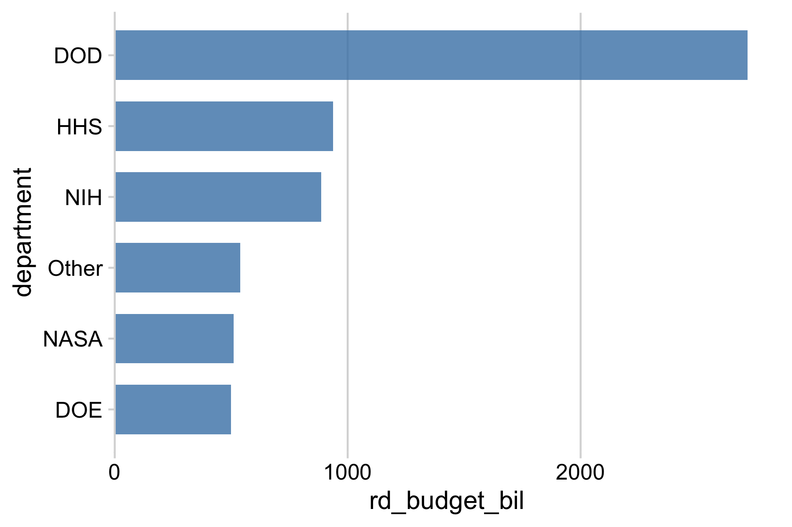{width="500"}
:::

---

### 4. What if there are _really_ too many factor levels?

::: {.col}
::: {.font70}
```{r}
#| eval: false
#| code-line-numbers: "4"

# Format the data frame
avengers %>%
  mutate(
    name_alias = fct_reorder(name_alias, appearances)) %>%

# Make the chart
  ggplot() +
  geom_col(
    aes(x = appearances,y = name_alias),
    width = 0.7, alpha = 0.8
  ) +
  scale_x_continuous(
    expand = expansion(mult = c(0, 0.05))) +
  theme_minimal_vgrid()
```
:::
:::

::: {.col}
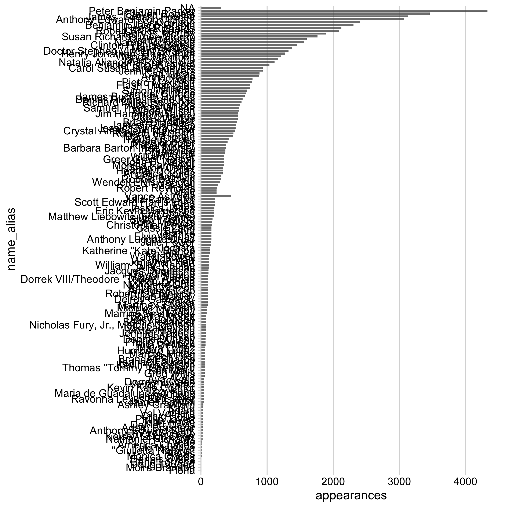{width="500"}
:::

---

### 4. What if there are _really_ too many factor levels?

**Strategy**: Keep top N, drop the rest with `slice()`

::: {.col}
::: {.font70}
```{r}
#| eval: false
#| code-line-numbers: "5,6"

# Format the data frame
avengers %>%
  mutate(
    name_alias = fct_reorder(name_alias, appearances)) %>%
  arrange(desc(appearances)) %>%
  slice(1:10) %>%

# Make the chart
  ggplot() +
  geom_col(
    aes(x = appearances, y = name_alias),
    width = 0.7, alpha = 0.8
  ) +
  scale_x_continuous(
    expand = expansion(mult = c(0, 0.05))) +
  theme_minimal_vgrid()
```
:::
:::

::: {.col}
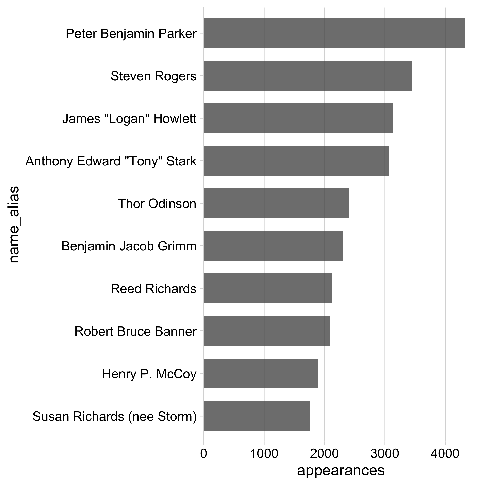{width="450"}
:::

---

### 4. What if there are _really_ too many factor levels?

`slice()` works with grouping too!

::: {.col}
::: {.font70}
```{r}
#| eval: false
#| code-line-numbers: "5,6,7"

# Format the data frame
avengers %>%
  mutate(
    name_alias = fct_reorder(name_alias, appearances)) %>%
  arrange(desc(appearances)) %>%
  group_by(gender) %>%
  slice(1:10) %>%

# Make the chart
  ggplot() +
  geom_col(
    aes(
      x = appearances,
      y = name_alias,
      fill = gender
    ),
    width = 0.7, alpha = 0.8
  ) +
  scale_x_continuous(
    expand = expansion(mult = c(0, 0.05))) +
  theme_minimal_vgrid()
```
:::
:::

::: {.col}
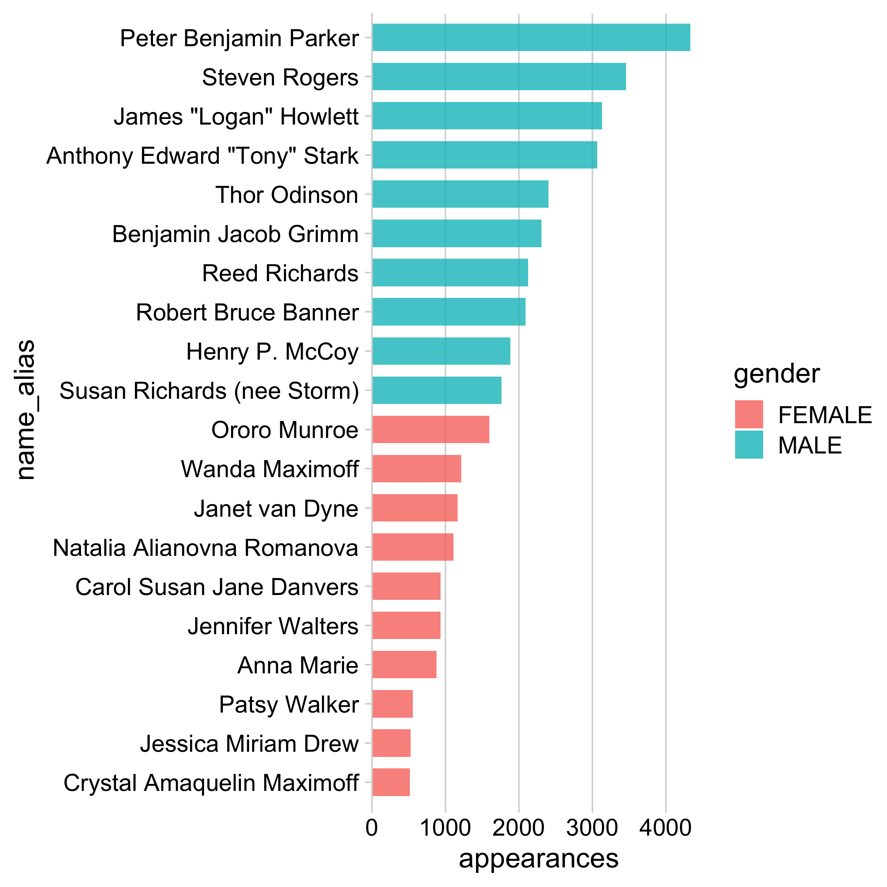{width="450"}
:::

---



## Your turn - practice manipulating factors

Use the `wildlife_impacts` data to create the following plot

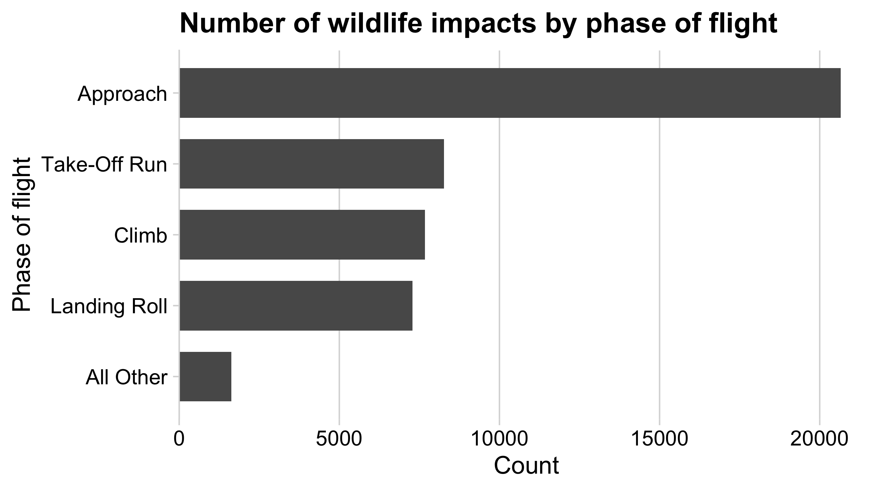{width="800"}

```{r}
#| echo: false

countdown(
  minutes = 15,
  warn_when = 30,
  update_every = 1,
  top = 0,
  right = 0,
  font_size = "2em"
)
```

---

```{r}
#| echo: false
#| results: asis

agenda(2)
```

---





# Show amounts with:

::: {.col}
<br>

{width="350"}
:::

::: {.col}
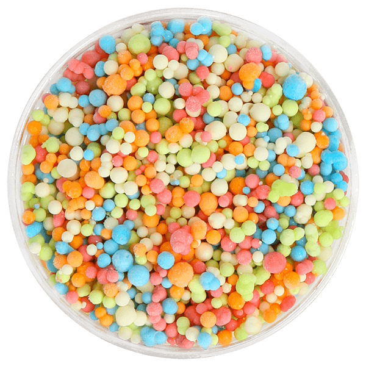{width="280"}
:::

::: {.col}

:::

---




::: {.col}


## Bar chart


:::

::: {.col}
{width="160"}

## Dot chart

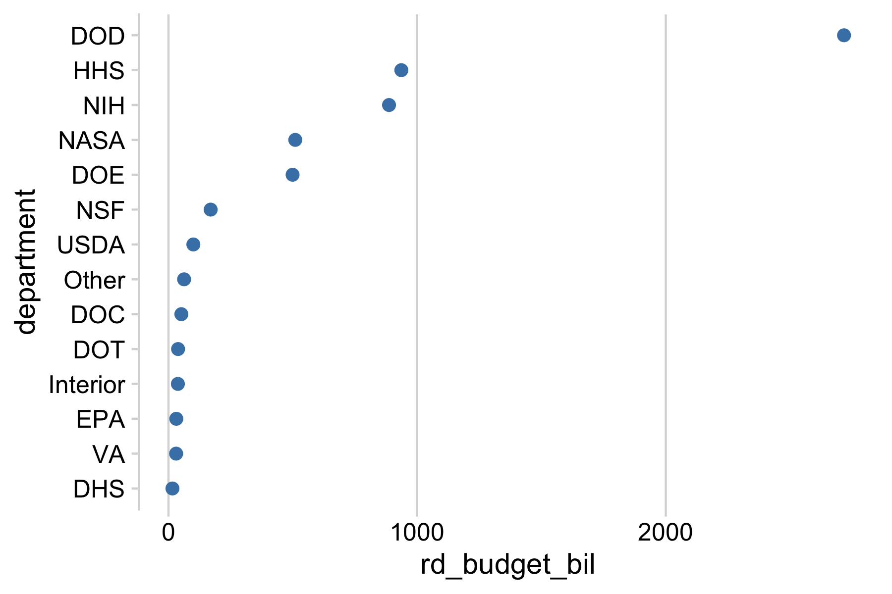
:::

::: {.col}
{width="330"}

## Lollipop chart

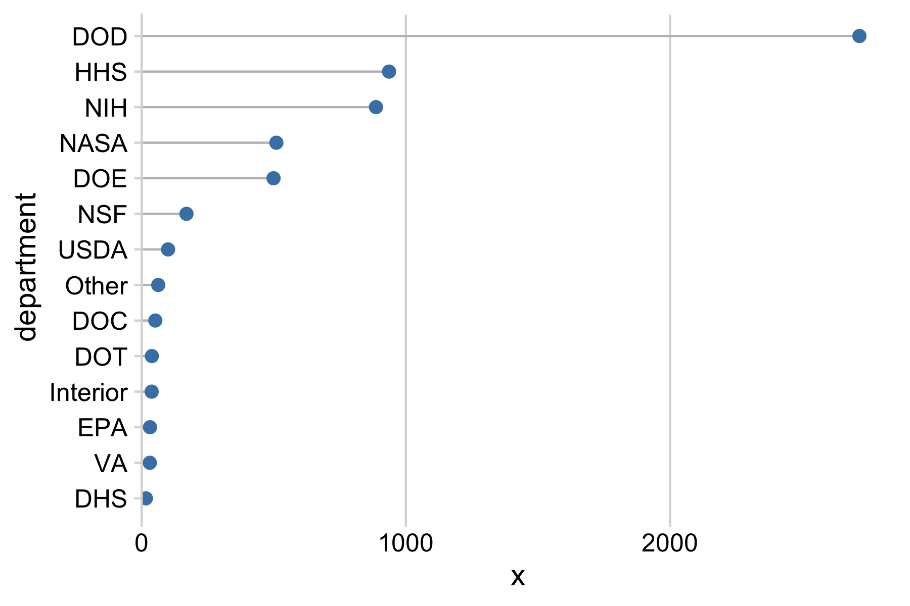
:::

---



## Bars are good for highlighting specific categories

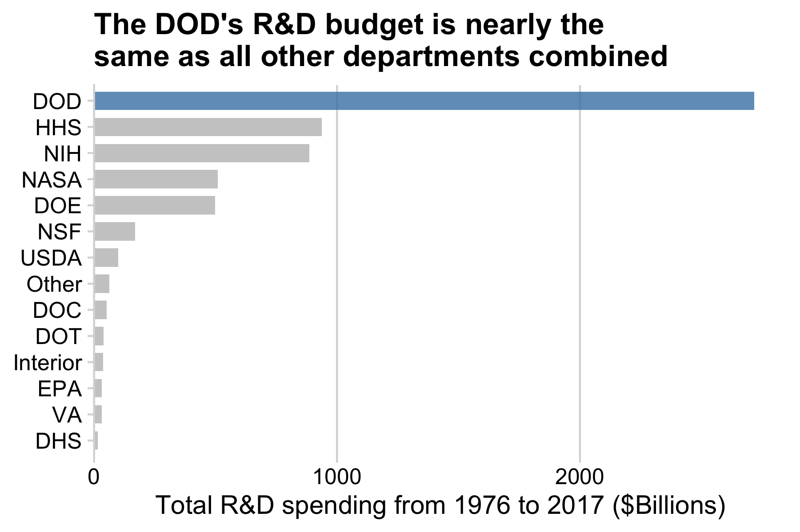{width="700"}

---

## Use lollipops when:

### - The bars are overwhelming<br> - You're not highlighting categories

<!-- Idea from https://www.data-to-viz.com/graph/lollipop.html -->

::: {.col}
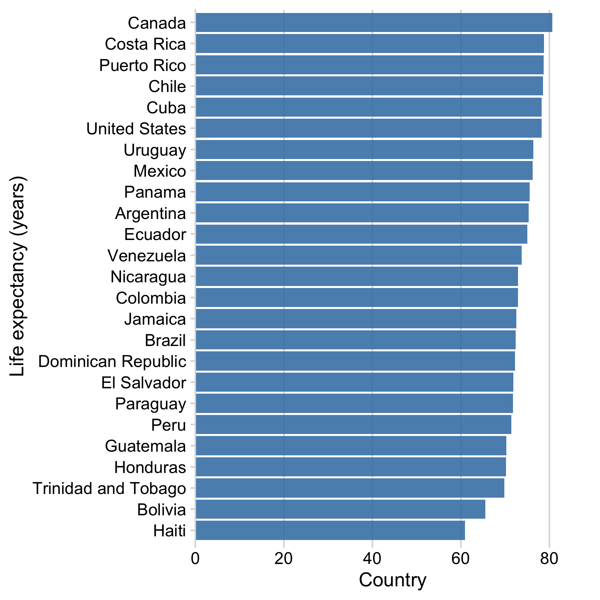{width="400"}
:::

::: {.col}
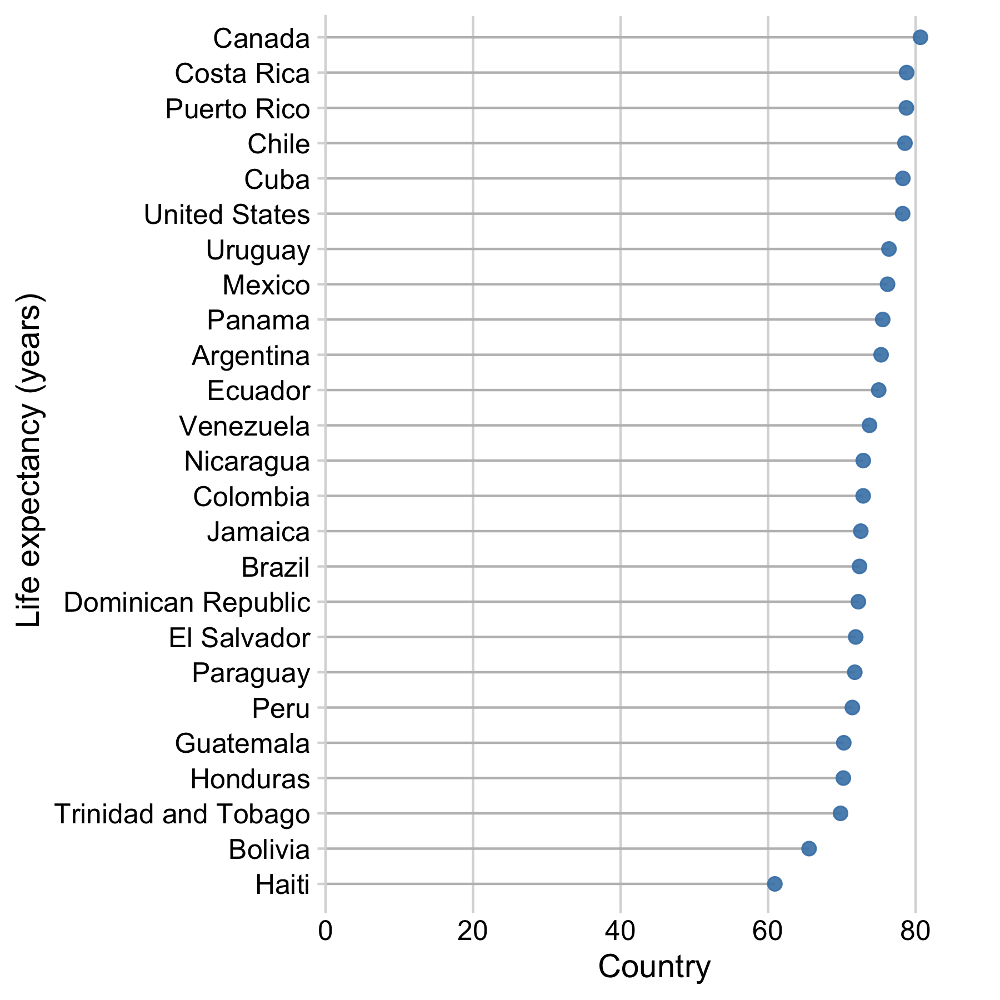{width="400"}
:::

---



## Or use dots and don't set axis to 0

::: {.col}
{width="500"}
:::

::: {.col}
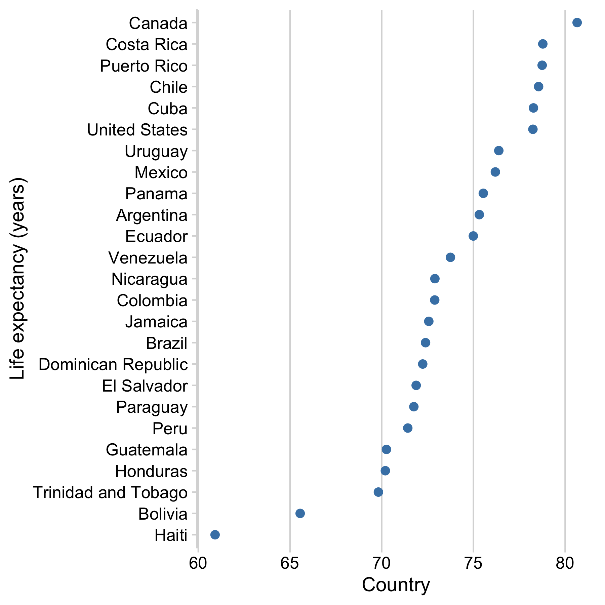{width="500"}
:::

---

## How to make a **Bar chart**

::: {.col width="60%"}
::: {.font70}
```{r}
#| eval: false
#| code-line-numbers: "5,9,10"

# Summarize the data
federal_spending %>%
  group_by(department) %>%
  summarise(rd_budget_bil = sum(rd_budget_mil) / 10^3) %>%
  mutate(department = fct_reorder(department, rd_budget_bil)) %>%

# Make chart
  ggplot() +
  geom_col(
    aes(x = rd_budget_bil, y = department),
    width = 0.7, alpha = 0.8,
    fill = 'steelblue') +
  scale_x_continuous(
    expand = expansion(mult = c(0, 0.05))) +
  theme_minimal_vgrid()
```
:::
:::

::: {.col width="40%"}

:::

---

## Filling the bars with color

::: {.col width="60%"}
::: {.font70}
```{r}
#| eval: false
#| code-line-numbers: "7,8,14"

# Summarize the data
federal_spending %>%
  group_by(department) %>%
  summarise(rd_budget_bil = sum(rd_budget_mil) / 10^3) %>%
  mutate(
    department = fct_reorder(department, rd_budget_bil),
    is_dod = if_else(
      department == 'DOD', TRUE, FALSE)) %>%

# Make the chart
  ggplot() +
  geom_col(
    aes(x = rd_budget_bil, y = department,
        fill = is_dod),
    width = 0.7, alpha = 0.8) +
  scale_x_continuous(
    expand = expansion(mult = c(0, 0.05))) +
  theme_minimal_vgrid() +
  theme(legend.position = 'none')
```
:::
:::

::: {.col width="40%" .center}
The DOD's R&D budget is nearly the same as all other departments combined

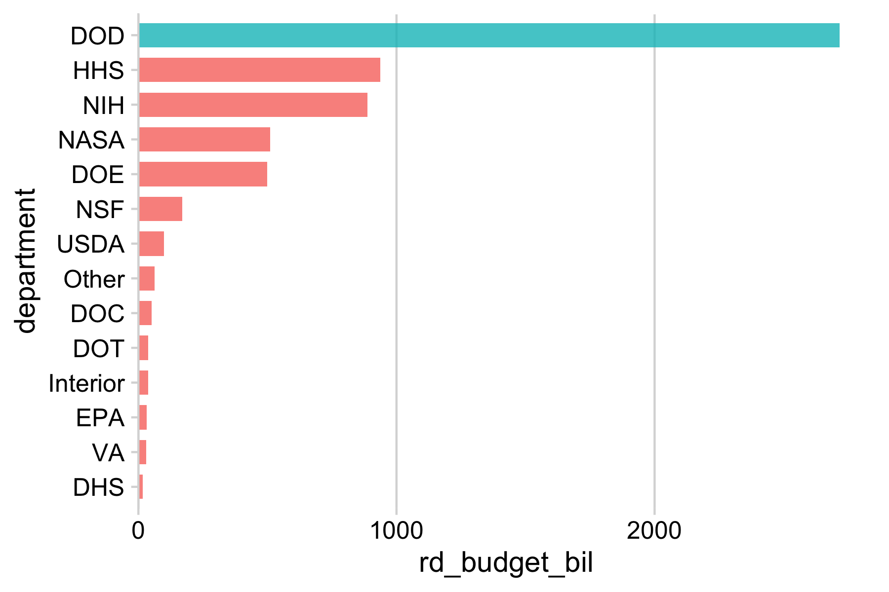
:::

---

## Filling the bars with color

::: {.col width="60%"}
::: {.font70}
```{r}
#| eval: false
#| code-line-numbers: "18"

# Summarize the data
federal_spending %>%
  group_by(department) %>%
  summarise(rd_budget_bil = sum(rd_budget_mil) / 10^3) %>%
  mutate(
    department = fct_reorder(department, rd_budget_bil),
    is_dod = if_else(
      department == 'DOD', TRUE, FALSE)) %>%

# Make the chart
  ggplot() +
  geom_col(
    aes(x = rd_budget_bil, y = department,
        fill = is_dod),
    width = 0.7, alpha = 0.8) +
  scale_x_continuous(
    expand = expansion(mult = c(0, 0.05))) +
  scale_fill_manual(values = c('grey', 'steelblue')) +
  theme_minimal_vgrid() +
  theme(legend.position = 'none')
```
:::
:::

::: {.col width="40%" .center}
The DOD's R&D budget is nearly the same as all other departments combined

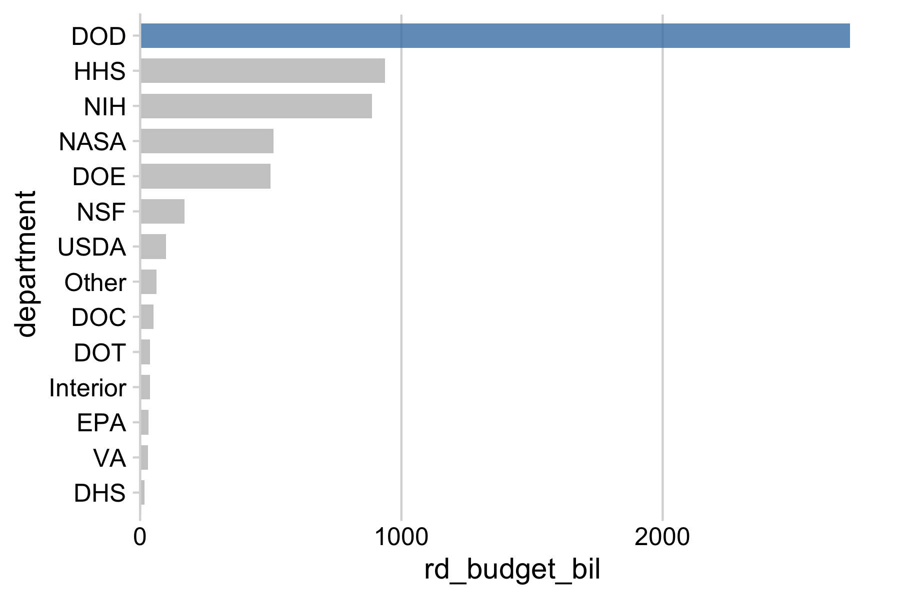
:::

---

## How to make a **Dot chart**

::: {.col width="60%"}
Summarize data frame:

::: {.font70}
```{r}
#| eval: false
#| code-line-numbers: "11,12"

# Summarize the data
federal_spending %>%
  group_by(department) %>%
  summarise(
    rd_budget_bil = sum(rd_budget_mil) / 10^3) %>%
  mutate(
    department = fct_reorder(department, rd_budget_bil)) %>%

# Make the chart
  ggplot() +
  geom_point(
    aes(x = rd_budget_bil, y = department),
    size = 2.5, color = 'steelblue') +
  theme_minimal_vgrid()
```
:::
:::

::: {.col width="40%" .center}
**Dot chart** of federal R&D spending by department


:::

---

## How to make a **Lollipop chart**

::: {.col width="60%"}
Summarize data frame:

::: {.font70}
```{r}
#| eval: false
#| code-line-numbers: "11,12,13,15,16"

# Summarize the data
federal_spending %>%
  group_by(department) %>%
  summarise(
    rd_budget_bil = sum(rd_budget_mil) / 10^3) %>%
  mutate(
    department = fct_reorder(department, rd_budget_bil)) %>%

# Make the chart
  ggplot() +
  geom_segment(
    aes(x = 0, xend = rd_budget_bil,
        y = department, yend = department),
    color = 'grey') +
  geom_point(
    aes(x = rd_budget_bil, y = department),
    size = 2.5, color = 'steelblue') +
  theme_minimal_vgrid()
```
:::
:::

::: {.col width="40%" .center}
**Lollipop chart** of federal R&D spending by department


:::

---




```{r}
#| echo: false

countdown(
  minutes = 20,
  warn_when = 30,
  update_every = 1,
  top = 0,
  right = 0,
  font_size = "2em"
)
```

## Your turn - practice plotting amounts

Create the following charts:

::: {.col}
Data: `bears`

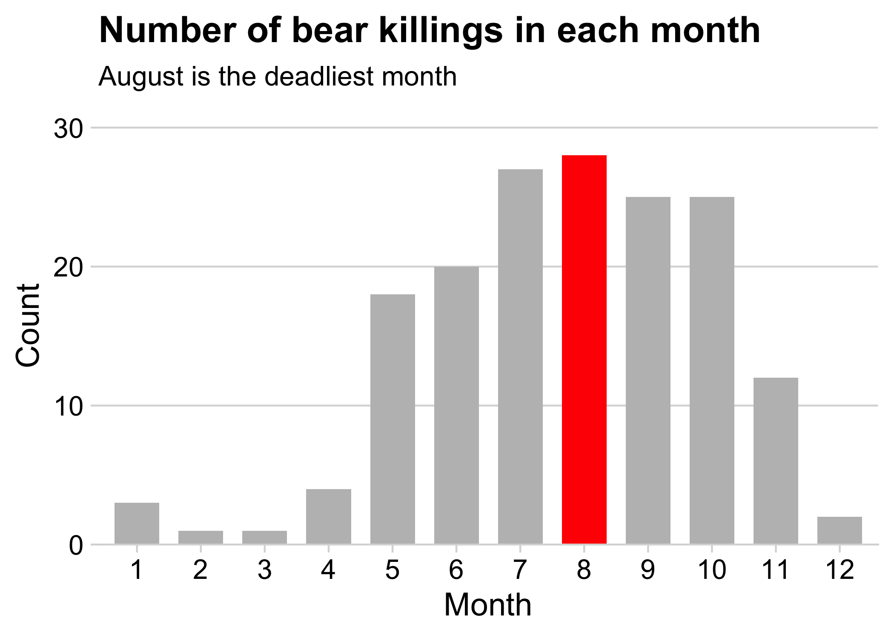{width="500"}
:::

::: {.col}
Data: `milk_production`

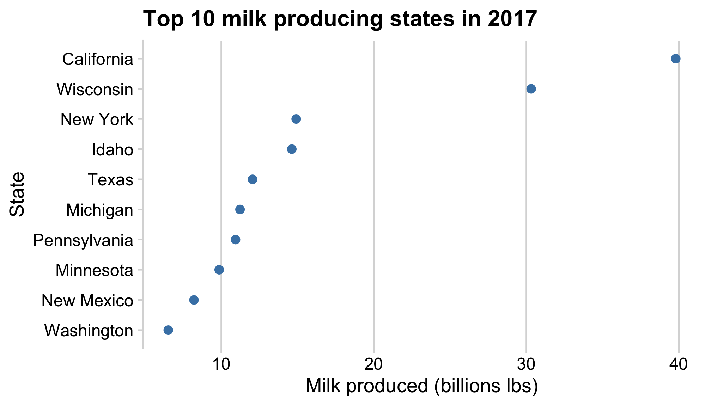
:::

---




```{r}
#| echo: false

countdown(
  minutes = 5,
  warn_when = 30,
  update_every = 1,
  left = 0,
  right = 0,
  top = 1,
  bottom = 0,
  margin = "5%",
  font_size = "8em"
)
```

# Break!

## Stand up, Move around, Stretch!

---

```{r}
#| echo: false
#| results: asis

agenda(3)
```

---





# Show proportions with:

::: {.col}
<br>

{width="350"}
:::

::: {.col}
{width="300"}
:::

::: {.col}

:::

---




::: {.col}


## Bar charts

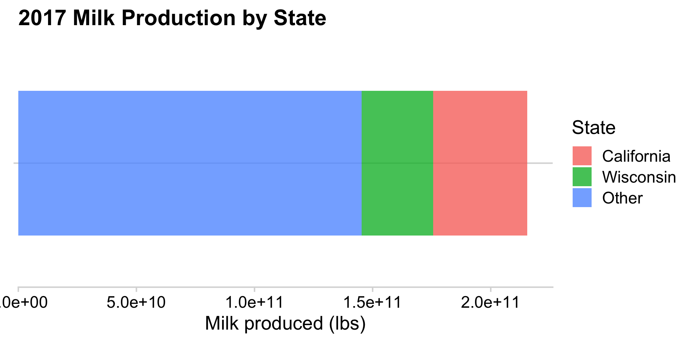
:::

::: {.col}
{width="160"}

## Pie charts

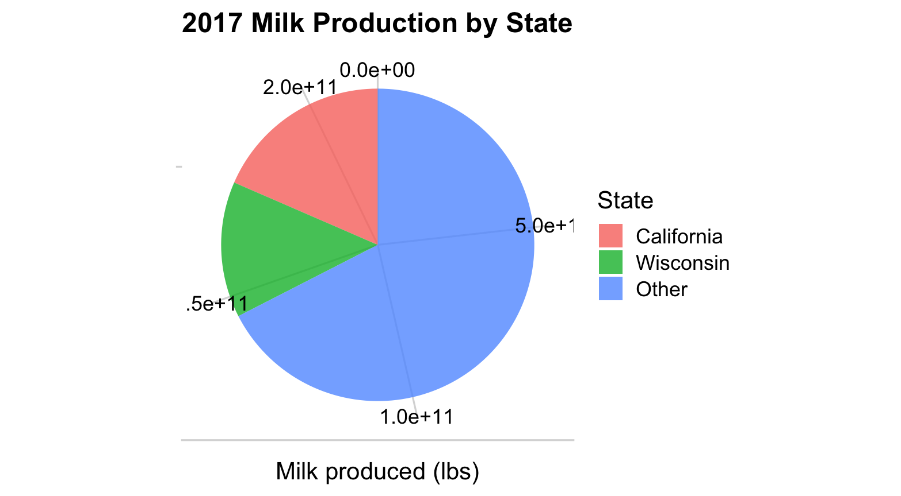{width="300"}
:::

::: {.col}
{width="180"}

## Waffle charts

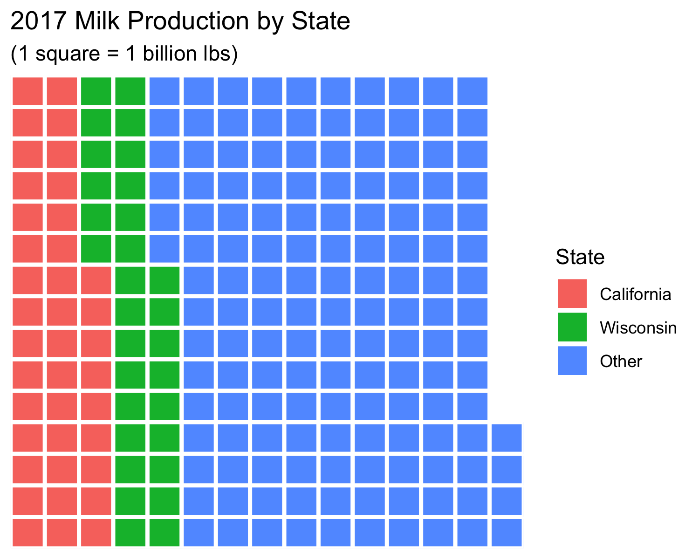{width="300"}
:::

---

## Stacked bars

::: {.col width="60%"}
::: {.font70}
```{r}
#| eval: false
#| code-line-numbers: "11,12"

# Format the data
milk_production %>%
  filter(year == 2017) %>%
  mutate(state = fct_other(state,
    keep = c('California', 'Wisconsin'))) %>%
  group_by(state) %>%
  summarise(milk_produced = sum(milk_produced)) %>%

# Make the chart
  ggplot() +
  geom_col(
    aes(x = "", y = milk_produced, fill = state),
    width = 0.7, alpha = 0.8) +
  scale_y_continuous(
    expand = expansion(mult = c(0, 0.05))) +
  theme_minimal_hgrid() +
  labs(x = NULL,
       y = 'Milk produced (lbs)',
       fill = 'State',
       title = '2017 Milk Production\nby State')
```
:::
:::

::: {.col width="40%"}
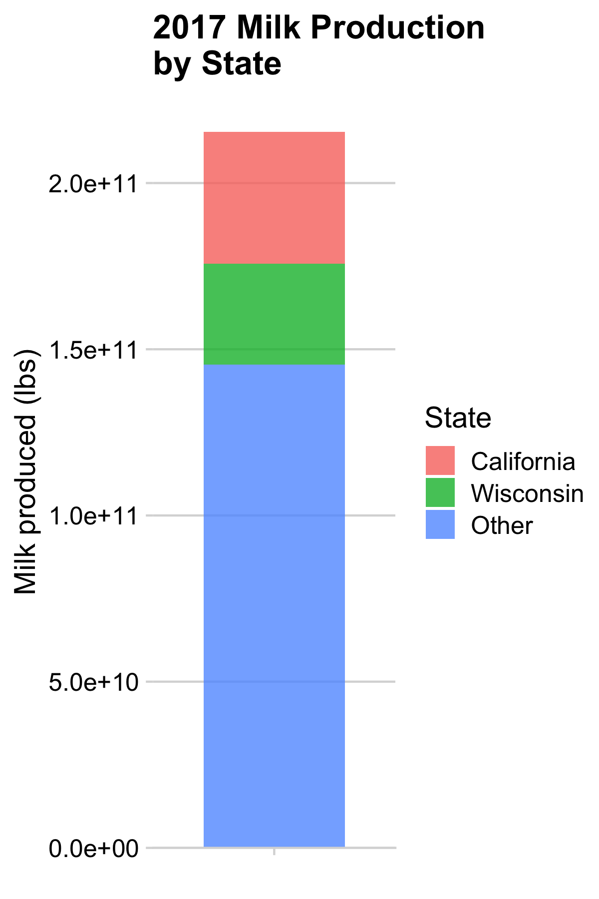{width="320"}
:::

---

## Stacked bars - Rotated also looks good

::: {.col width="60%"}
::: {.font70}
```{r}
#| eval: false
#| code-line-numbers: "11,12"

# Format the data
milk_production %>%
  filter(year == 2017) %>%
  mutate(state = fct_other(state,
    keep = c('California', 'Wisconsin'))) %>%
  group_by(state) %>%
  summarise(milk_produced = sum(milk_produced)) %>%

# Make the chart
  ggplot() +
  geom_col(
    aes(x = milk_produced, y = "", fill = state),
    width = 0.7, alpha = 0.8) +
  scale_x_continuous(
    expand = expansion(mult = c(0, 0.05))) +
  theme_minimal_hgrid() +
  labs(y = NULL,
       x = 'Milk produced (lbs)',
       fill = 'State',
       title = '2017 Milk Production by State')
```
:::
:::

::: {.col width="40%"}

:::

---

## Stacked bars - not great for more than a few categories

::: {.col width="60%"}
::: {.font70}
```{r}
#| eval: false
#| code-line-numbers: "5,6"

# Format the data
milk_production %>%
  filter(year == 2017) %>%
  mutate(state = fct_other(state,
    keep = c('California', 'Wisconsin',
             'New York', 'Idaho'))) %>%
  group_by(state) %>%
  summarise(milk_produced = sum(milk_produced))

# Make the chart
  ggplot() +
  geom_col(
    aes(x = "", y = milk_produced, fill = state),
    width = 0.7, alpha = 0.8) +
  scale_y_continuous(
    expand = expansion(mult = c(0, 0.05))) +
  theme_minimal_vgrid() +
  labs(x = NULL,
       y = 'Milk produced (lbs)',
       fill = 'State',
       title = '2017 Milk Production\nby State')
```
:::
:::

::: {.col width="40%"}
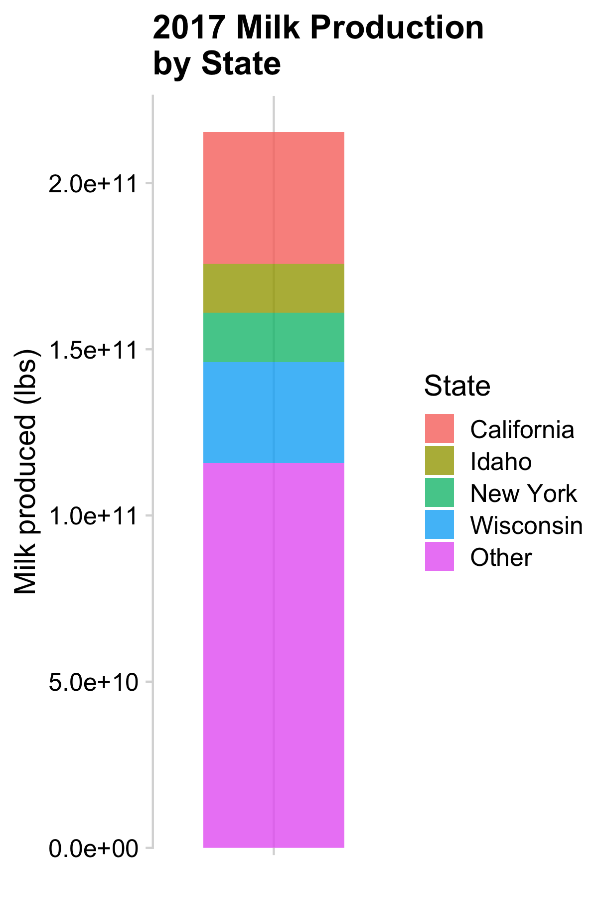{width="320"}
:::

---

::: {.col width="60%"}
## Dodged bars

Better for **part-to-whole comparison**

::: {.font70}
```{r}
#| eval: false

# Format the data
milk_production %>%
  filter(year == 2017) %>%
  mutate(state = fct_other(state,
    keep = c('California', 'Wisconsin'))) %>%
  group_by(state) %>%
  summarise(milk_produced = sum(milk_produced)) %>%
  mutate(state = fct_reorder(state, milk_produced)) %>%

# Make the chart
  ggplot() +
  geom_col(
    aes(x = milk_produced, y = state),
    width = 0.7, alpha = 0.8) +
  scale_x_continuous(
    expand = expansion(mult = c(0, 0.05))) +
  theme_minimal_vgrid() +
  labs(x = 'Milk produced (lbs)',
       y = 'State',
       title = '2017 Milk Production by State')
```
:::
:::

::: {.col width="40%"}
Okay:


Better:

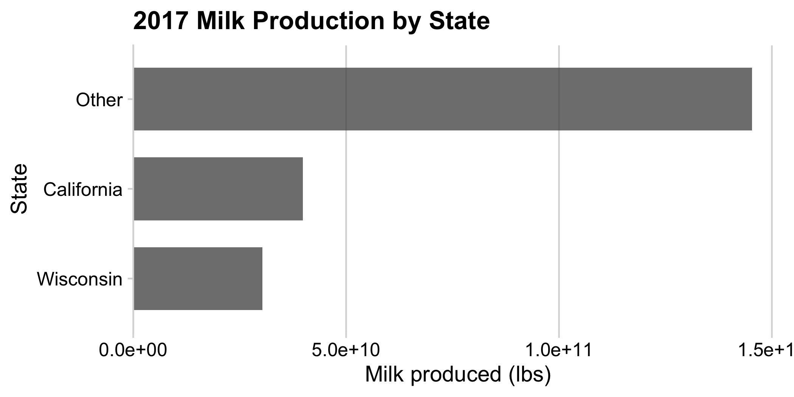
:::

---

::: {.col width="55%"}
## Dodged bars

::: {.font70}
```{r}
#| eval: false
#| code-line-numbers: "14"

milk_production %>%
  filter(year %in% c(1970, 2017)) %>%
  mutate(state = fct_other(state,
    keep = c('California', 'Wisconsin'))) %>%
  group_by(year, state) %>%
  summarise(milk_produced = sum(milk_produced)) %>%

# Make the chart
  ggplot() +
  geom_col(
    aes(x = milk_produced,
        y = as.factor(year),
        fill = state),
    position = 'dodge',
    width = 0.7, alpha = 0.8) +
  scale_x_continuous(
    expand = expansion(mult = c(0, 0.05))) +
  theme_minimal_vgrid() +
  labs(x = 'Milk produced (lbs)',
       y = 'Year',
       fill = 'State',
       title = '1970 & 2017 Milk Production by State')
```
:::
:::

::: {.col width="45%"}
Better for comparing **total**:

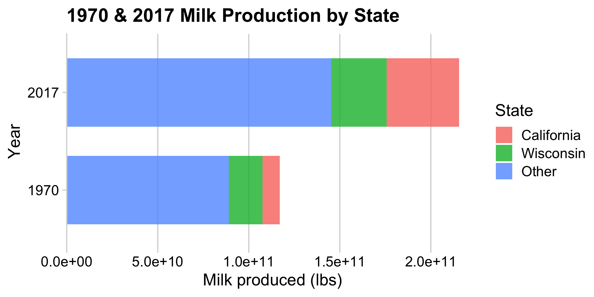

Better for comparing **parts**:

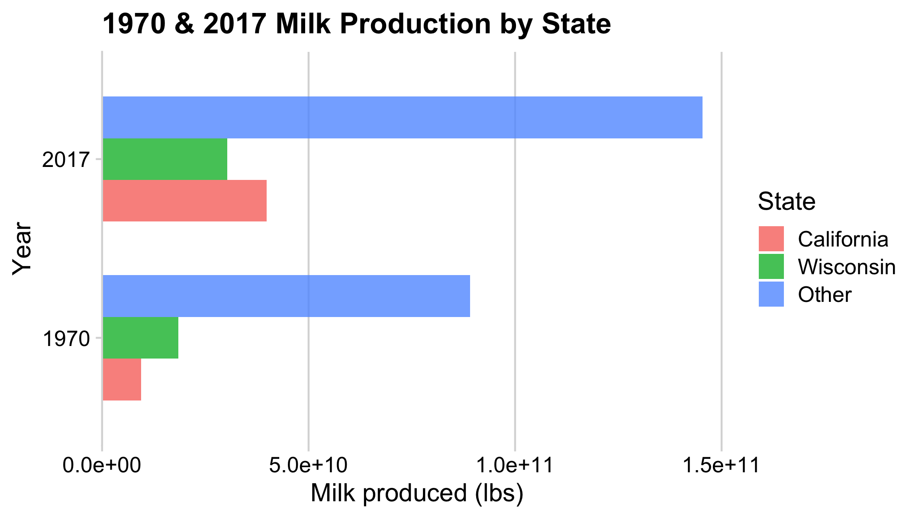
:::

---

## [Where stacking is useful]{.center}

::: {.col width="60%"}
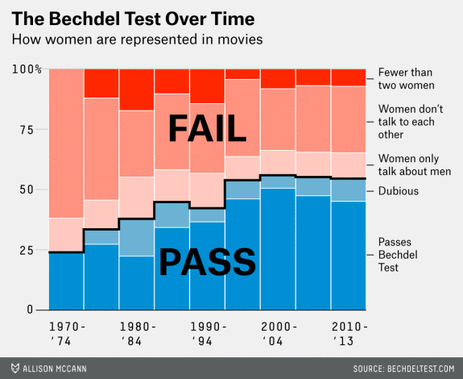{width="550"}

[https://fivethirtyeight.com/features/the-dollar-and-cents-case-against-hollywoods-exclusion-of-women/]{.font70}
:::

::: {.col width="40%"}
### - **2 to 3 groups**
### - Proportions over time
:::

---

## [Where stacking is useful]{.center}

::: {.col width="60%"}
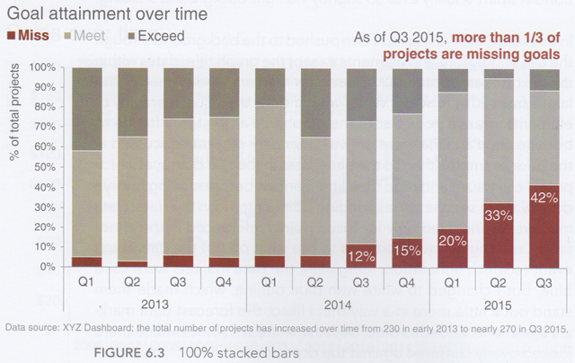{width="600"}

[https://www.perceptualedge.com/blog/?p=2239]{.font80}
:::

::: {.col width="40%"}
### - 2 to 3 groups
### - **Proportions over time**
:::

---

## The Notorious P-I-E

Start with a bar chart

::: {.col width="60%"}
::: {.font70}
```{r}
#| fig-show: hide
#| code-line-numbers: "11,12"

# Format the data
milk_production %>%
  filter(year == 2017) %>%
  mutate(state = fct_other(state,
    keep = c('California', 'Wisconsin'))) %>%
  group_by(state) %>%
  summarise(milk_produced = sum(milk_produced)) %>%

# Make the chart
  ggplot() +
  geom_col(
    aes(x = "", y = milk_produced, fill = state),
    width = 0.7, alpha = 0.8) +
  theme_minimal_hgrid() +
  labs(x = NULL,
       y = 'Milk produced (lbs)',
       fill = 'State',
       title = '2017 Milk Production\nby State')
```
:::
:::

::: {.col width="40%"}
```{r}
#| echo: false
#| fig-height: 6
#| fig-width: 4
#| fig-align: center

milk_production %>%
  filter(year == 2017) %>%
  mutate(state = fct_other(state,
    keep = c('California', 'Wisconsin'))) %>%
  group_by(state) %>%
  summarise(milk_produced = sum(milk_produced)) %>%
  ggplot() +
  geom_col(
    aes(x = "", y = milk_produced, fill = state),
    width = 0.7, alpha = 0.8) +
  theme_minimal_hgrid() +
  labs(x = NULL,
       y = 'Milk produced (lbs)',
       fill = 'State',
       title = '2017 Milk Production\nby State')
```
:::

---

## The Notorious P-I-E

Convert bar to pie with `coord_polar()`

::: {.col width="55%"}
::: {.font70}
```{r}
#| fig-show: hide
#| code-line-numbers: "14"

# Format the data
milk_production %>%
  filter(year == 2017) %>%
  mutate(state = fct_other(state,
    keep = c('California', 'Wisconsin'))) %>%
  group_by(state) %>%
  summarise(milk_produced = sum(milk_produced)) %>%

# Make the chart
  ggplot() +
  geom_col(
    aes(x = "", y = milk_produced, fill = state),
    width = 0.7, alpha = 0.8) +
  coord_polar(theta = "y") +
  theme_minimal_hgrid() +
  labs(x = NULL,
       y = 'Milk produced (lbs)',
       fill = 'State',
       title = '2017 Milk Production by State')
```
:::
:::

::: {.col width="45%"}
```{r}
#| echo: false
#| fig-height: 5
#| fig-width: 7
#| fig-align: center

milk_production %>%
  filter(year == 2017) %>%
  mutate(state = fct_other(state,
    keep = c('California', 'Wisconsin'))) %>%
  group_by(state) %>%
  summarise(milk_produced = sum(milk_produced)) %>%
  ggplot() +
  geom_col(
    aes(x = "", y = milk_produced, fill = state),
    width = 0.7, alpha = 0.8) +
  coord_polar(theta = "y") +
  theme_minimal_hgrid() +
  labs(x = NULL,
       y = 'Milk produced (lbs)',
       fill = 'State',
       title = '2017 Milk Production by State')
```
:::

---

::: {.col width="55%"}
::: {.font70}
```{r}
#| fig-show: hide
#| code-line-numbers: "8,9,10,17,18,19,20,22"

# Format the data
milk_production %>%
  filter(year == 2017) %>%
  mutate(state = fct_other(state,
    keep = c('California', 'Wisconsin'))) %>%
  group_by(state) %>%
  summarise(milk_produced = sum(milk_produced)) %>%
  arrange(desc(state)) %>%
  mutate(p = 100*(milk_produced / sum(milk_produced)),
         label = str_c(round(p), '%')) %>%

# Make the chart
  ggplot() +
  geom_col(
    aes(x = "", y = milk_produced, fill = state),
    width = 0.7, alpha = 0.8) +
  geom_text(
    aes(x = "", y = milk_produced, label = label),
    color = "white", size = 6,
    position = position_stack(vjust = 0.5)) +
  coord_polar(theta = "y") +
  theme_map() +
  labs(x = NULL,
       y = NULL,
       fill = 'State',
       title = '2017 Milk Production by State')
```
:::
:::

::: {.col width="45%"}
### The Notorious P-I-E

Final chart with labels & `theme_map()`

```{r}
#| echo: false
#| fig-height: 5
#| fig-width: 7
#| fig-align: center

milk_production %>%
  filter(year == 2017) %>%
  mutate(state = fct_other(state,
    keep = c('California', 'Wisconsin'))) %>%
  group_by(state) %>%
  summarise(milk_produced = sum(milk_produced)) %>%
  arrange(desc(state)) %>%
  mutate(p = 100*(milk_produced / sum(milk_produced)),
         label = str_c(round(p), '%')) %>%
  ggplot() +
  geom_col(
    aes(x = "", y = milk_produced, fill = state),
    width = 0.7, alpha = 0.8) +
  geom_text(
    aes(x = "", y = milk_produced, label = label),
    color = "white", size = 6,
    position = position_stack(vjust = 0.5)) +
  coord_polar(theta = "y") +
  theme_map() +
  labs(x = NULL,
       y = NULL,
       fill = 'State',
       title = '2017 Milk Production by State')
```
:::

---



## Pies are still useful if the sum of components matters

::: {.col}
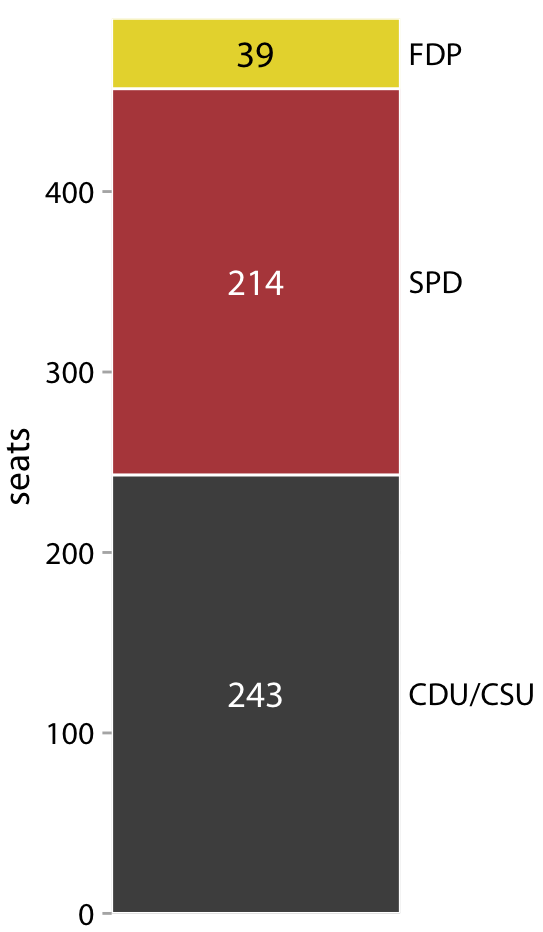{width="250"}
:::

::: {.col}
<br>

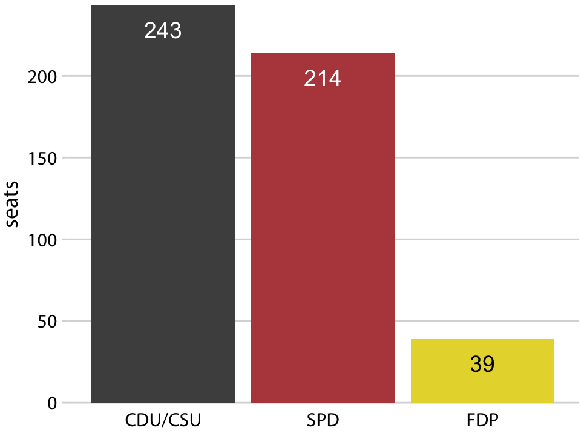
:::

::: {.col}
<br>
<br>

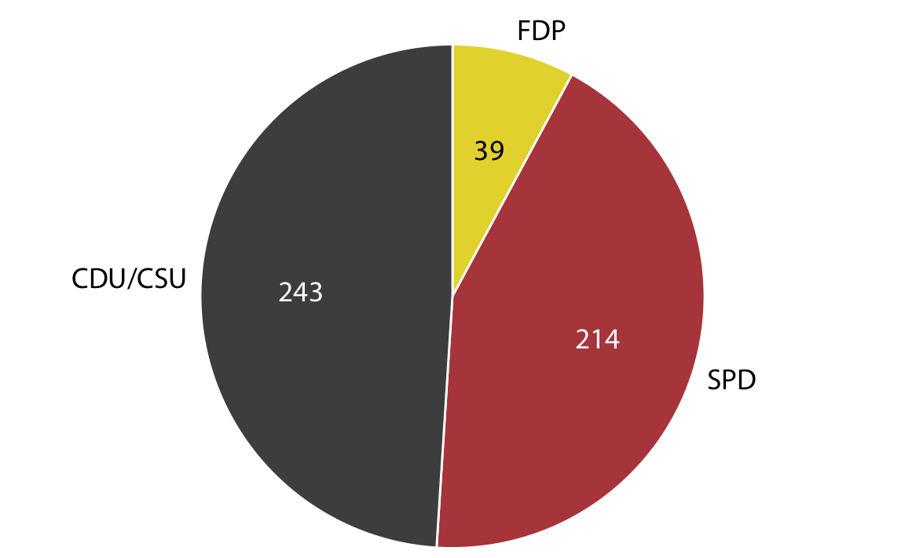
:::

---



## The best pies are **square pies**

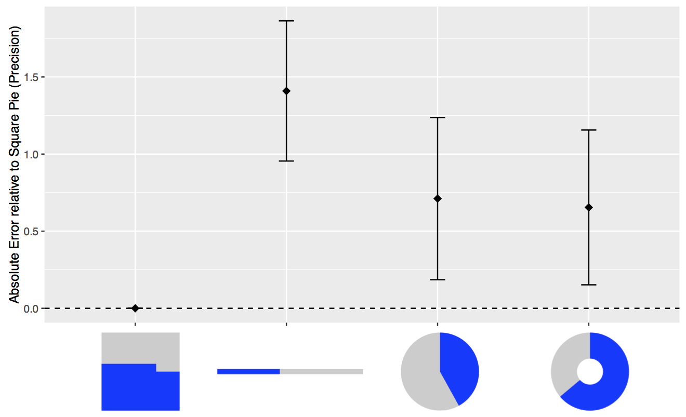{width="700"}

[https://eagereyes.org/blog/2016/a-reanalysis-of-a-study-about-square-pie-charts-from-2009]{.font80}

---

::: {.col width="55%"}
### Waffle plots

::: {.font70}
```{r}
#| fig-show: hide
#| code-line-numbers: "1,10,14,15,16"

library(waffle)

# Format the data
milk_production %>%
  filter(year == 2017) %>%
  mutate(state = fct_other(state,
    keep = c('California', 'Wisconsin'))) %>%
  group_by(state) %>%
  summarise(milk_produced = sum(milk_produced)) %>%
  mutate(milk_produced = milk_produced / 10^9) %>%

# Make the chart
  ggplot() +
  geom_waffle(
    aes(fill = state, values = milk_produced),
    color = "white", size = 1, n_rows = 10) +
  scale_x_discrete(expand = c(0, 0)) +
  scale_y_discrete(expand = c(0, 0)) +
  theme_minimal() +
  labs(fill = 'State',
       x = NULL, y = NULL,
       title = '2017 Milk Production by State',
       subtitle = '(1 square = 1 billion lbs)')
```
:::
:::

::: {.col width="45%"}
**Use values between 100 - 1,000**

[(You don't want 1,000,000,000 boxes!)]{.font80}

```{r}
#| echo: false

milk_summary_2017
```

```{r}
#| echo: false
#| fig-height: 2.2
#| fig-width: 5
#| fig-align: center

milk_summary_2017 %>%
  ggplot() +
  geom_waffle(
    aes(fill = state, values = milk_produced),
    color = "white", size = 1, n_rows = 10) +
  scale_x_discrete(expand = c(0, 0)) +
  scale_y_discrete(expand = c(0, 0)) +
  theme_minimal() +
  labs(fill = 'State',
       x = NULL, y = NULL,
       title = '2017 Milk Production by State',
       subtitle = '(1 square = 1 billion lbs)')
```
:::

---

::: {.col width="55%"}
### Waffle plots

::: {.font70}
```{r}
#| fig-show: hide
#| code-line-numbers: "1,17"

library(waffle)

# Format the data
milk_production %>%
  filter(year == 2017) %>%
  mutate(state = fct_other(state,
    keep = c('California', 'Wisconsin'))) %>%
  group_by(state) %>%
  summarise(milk_produced = sum(milk_produced)) %>%
  mutate(milk_produced = milk_produced / 10^9) %>%

# Make the chart
  ggplot() +
  geom_waffle(
    aes(fill = state, values = milk_produced),
    color = "white", size = 1, n_cols = 10,
    flip = TRUE) +
  scale_x_discrete(expand = c(0, 0)) +
  scale_y_discrete(expand = c(0, 0)) +
  theme_minimal() +
  labs(fill = 'State',
       x = NULL, y = NULL,
       title = '2017 Milk Production by State',
       subtitle = '(1 square = 1 billion lbs)')
```
:::
:::

::: {.col width="45%"}
Use `flip = TRUE` for vertical

```{r}
#| echo: false

milk_summary_2017
```

```{r}
#| echo: false
#| fig-height: 4
#| fig-width: 3
#| fig-align: center

milk_summary_2017 %>%
  ggplot() +
  geom_waffle(
    aes(fill = state, values = milk_produced),
    color = "white", size = 1, n_cols = 10,
    flip = TRUE) +
  scale_x_discrete(expand = c(0, 0)) +
  scale_y_discrete(expand = c(0, 0)) +
  theme_minimal() +
  labs(fill = 'State',
       x = NULL, y = NULL,
       title = '2017 Milk Production by State',
       subtitle = '(1 square = 1 billion lbs)')
```
:::

---

::: {.col width="55%"}
::: {.font70}
```{r}
#| label: waffle-compare
#| fig-show: hide
#| code-line-numbers: "5,8,18"

library(waffle)

# Format the data
milk_production %>%
  filter(year %in% c(1970, 2017)) %>%
  mutate(state = fct_other(state,
    keep = c('California', 'Wisconsin'))) %>%
  group_by(year, state) %>%
  summarise(milk_produced = sum(milk_produced)) %>%
  mutate(milk_produced = milk_produced / 10^9) %>%

# Make the chart
  ggplot() +
  geom_waffle(
    aes(fill = state, values = milk_produced),
    color = "white", size = 1, n_rows = 10,
    flip = TRUE) +
  facet_wrap(vars(year), strip.position = 'bottom') +
  scale_x_discrete(expand = c(0, 0)) +
  scale_y_discrete(expand = c(0, 0)) +
  theme_minimal() +
  labs(fill = 'State',
       x = NULL, y = NULL,
       title = '1970 & 2017 Milk Production by State',
       subtitle = '(1 square = 1 billion lbs)')
```
:::
:::

::: {.col width="45%"}
Use `facet_wrap` for side-by-side waffles

```{r}
#| echo: false

milk_summary_2017
```

```{r}
#| echo: false
#| fig-height: 4.5
#| fig-width: 5
#| fig-align: center

milk_production %>%
  filter(year %in% c(1970, 2017)) %>%
  mutate(state = fct_other(state,
    keep = c('California', 'Wisconsin'))) %>%
  group_by(year, state) %>%
  summarise(milk_produced = sum(milk_produced)) %>%
  mutate(milk_produced = milk_produced / 10^9) %>%
  ggplot() +
  geom_waffle(
    aes(fill = state, values = milk_produced),
    color = "white", size = 1, n_rows = 10,
    flip = TRUE) +
  facet_wrap(vars(year), strip.position = 'bottom') +
  scale_x_discrete(expand = c(0, 0)) +
  scale_y_discrete(expand = c(0, 0)) +
  theme_minimal() +
  labs(fill = 'State',
       x = NULL, y = NULL,
       title = '1970 & 2017 Milk Production by State',
       subtitle = '(1 square = 1 billion lbs)')
```
:::

---



::: {.col}
Stacked bars

{width="450"}

Dodged bars

{width="450"}
:::

::: {.col}
Pie chart

```{r}
#| echo: false
#| fig-height: 2.5
#| fig-width: 4.5
#| fig-align: center

milk_production %>%
  filter(year %in% c(1970, 2017)) %>%
  mutate(state = fct_other(state,
    keep = c('California', 'Wisconsin'))) %>%
  group_by(year, state) %>%
  summarise(milk_produced = sum(milk_produced)) %>%
  mutate(p = 100 * milk_produced / sum(milk_produced)) %>%
  arrange(desc(state), year) %>%
  mutate(
    ppos = p,
    label = str_c(round(p), '%')) %>%
  ggplot() +
  geom_col(aes(x = "", y = p, fill = state),
           width = 0.7, alpha = 0.8) +
  facet_wrap(~year, strip.position = 'bottom') +
  coord_polar(theta = "y") +
  geom_text(aes(x = 1.1, y = ppos, label = label),
            color = "white", size = 5,
            position = position_stack(vjust = 0.5)) +
  theme_map() +
  labs(x = NULL,
       y = NULL,
       fill = 'State',
       title = '1970 & 2017 Milk Production by State')
```

Waffle chart

```{r}
#| echo: false
#| fig-height: 4
#| fig-width: 4.5
#| fig-align: center

milk_production %>%
  filter(year %in% c(1970, 2017)) %>%
  mutate(state = fct_other(state,
    keep = c('California', 'Wisconsin'))) %>%
  group_by(year, state) %>%
  summarise(milk_produced = sum(milk_produced)) %>%
  mutate(milk_produced = milk_produced / 10^9) %>%
  ggplot() +
  geom_waffle(
    aes(fill = state, values = milk_produced),
    color = "white", size = 1, n_rows = 10,
    flip = TRUE) +
  facet_wrap(vars(year), strip.position = 'bottom') +
  scale_x_discrete(expand = c(0, 0)) +
  scale_y_discrete(expand = c(0, 0)) +
  theme_minimal() +
  labs(fill = 'State',
       x = NULL, y = NULL,
       title = '1970 & 2017 Milk Production by State',
       subtitle = '(1 square = 1 billion lbs)')
```
:::

---



```{r}
#| echo: false

countdown(
  minutes = 20,
  warn_when = 30,
  update_every = 1,
  top = 0,
  right = 0,
  font_size = "2em"
)
```

## Your turn

::: {.col}
Using the `wildlife_impacts` data, create plots that shows the proportion of incidents that occur at each different time of day.

For this exercise, you can remove `NA` values.

Try to create the following plots:

- Stacked bars
- Dodged bars
- Pie chart
- Waffle chart
:::

::: {.col}
To get started, you'll need to first summarize the data:

```{r}
wildlife_summary <- wildlife_impacts %>%
  filter(!is.na(time_of_day)) %>%
  count(time_of_day)

wildlife_summary
```
:::
