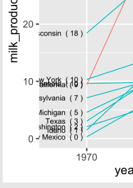



```{r}
#| include: false

agenda_items <- c(
  "Comparing to a reference",
  "Comparing variables",
  "Comparing distributions"
)

library(here)
library(ggridges)

# Read in data sets for class
college_all_ages <- read_csv(here('data', 'college_all_ages.csv'))
gapminder        <- read_csv(here('data', 'gapminder.csv'))
marathon         <- read_csv(here('data', 'marathon.csv'))
milk_production  <- read_csv(here('data', 'milk_production.csv'))
internet_regions <- read_csv(here('data', 'internet_users_region.csv'))

# Processed data
milk_compare <- milk_production %>%
  filter(year %in% c(1970, 2017)) %>%
  mutate(state = fct_other(state,
    keep = c('California', 'Wisconsin'))) %>%
  group_by(year, state) %>%
  summarise(milk_produced = sum(milk_produced) / 10^9)

# Set plot themes
theme_set(theme_gray(base_size = 18))
```

---





# [Tip of the week]{.fancy .blue}

# Shortcut keys

---




## 1) Quick shortcuts

::: {.col}
Insert a `<-` operator:

- **Windows**: `ALT` + `-`
- **Mac**: `OPTION` + `-`
:::

::: {.col .fragment}
Insert a `%>%` operator:

- **Windows**: `CTRL` + `SHIFT` + `M`
- **Mac**: `COMMAND` + `SHIFT` + `M`
:::

---




## 2) Edit multiple lines of code at once

1. Press and hold `ALT` (Windows) or `OPTION` (Mac)
2. Select multiple lines of code

https://twitter.com/i/status/995394452821721088

---




::: {.col width="20%"}
:::

::: {.col width="80%"}
## "At the heart of quantitative reasoning is a single question: **Compared to what?**"

## -- Edward Tufte
:::

---

## Today's data

```{r}
#| eval: false
#| code-line-numbers: "5"

college_all_ages <- read_csv(here('data', 'college_all_ages.csv'))
gapminder        <- read_csv(here('data', 'gapminder.csv'))
marathon         <- read_csv(here('data', 'marathon.csv'))
milk_production  <- read_csv(here('data', 'milk_production.csv'))
internet_regions <- read_csv(here('data', 'internet_users_region.csv'))
```

## New packages

```{r}
#| eval: false

install.packages("ggrepel")
install.packages("ggridges")
```

---

```{r}
#| echo: false
#| results: asis

agenda(0)
```

---

```{r}
#| echo: false
#| results: asis

agenda(1)
```

<!--
Comparing things to a reference line:
- Add a simple line
- diverging bars / lollipops,

- In any of these plots, adding a benchmark can be really useful
- Another way is to compare things to a **computed** benchmark, like the mean - diverging bars / lollipops
-->

---



## [For this section, we'll be using this data frame:]{.center}

```{r}
gapminder_americas <- gapminder %>%
  filter(continent == "Americas", year == 2007) %>%
  mutate(country = fct_reorder(country, lifeExp))
```

---



## Use reference lines to add context to chart

::: {.col}
```{r}
#| echo: false
#| fig-height: 6.5
#| fig-width: 6
#| fig-align: center

life_expectancy_dots <- ggplot(gapminder_americas) +
  geom_point(aes(x = lifeExp, y = country),
             color = 'steelblue', size = 2.5) +
  theme_minimal_vgrid(font_size = 18) +
  labs(x = 'Life expectancy (years)',
       y = 'Country')

life_expectancy_dots
```
:::

::: {.col .fragment}
```{r}
#| echo: false
#| fig-height: 6.5
#| fig-width: 6
#| fig-align: center

life_expectancy_dots_mean <- life_expectancy_dots +
  geom_vline(xintercept = mean(gapminder_americas$lifeExp),
             color = 'red', linetype = 'dashed') +
  annotate('text', x = 73.2, y = 'Puerto Rico',
           color = 'red', hjust = 1,
           label = 'Mean Life\nExpectancy')

life_expectancy_dots_mean
```
:::

---



## Or make zero the reference line

```{r}
#| echo: false

gapminder_diverging <- gapminder_americas %>%
    mutate(
        lifeExp = lifeExp - mean(lifeExp),
        color = ifelse(lifeExp > 0, 'Above', 'Below'))
```

::: {.col}
```{r}
#| echo: false
#| fig-height: 6.5
#| fig-width: 6
#| fig-align: center

ggplot(gapminder_diverging) +
  geom_segment(
    aes(x = 0, xend = lifeExp,
        y = country, yend = country,
        color = color)) +
  geom_point(
    aes(x = lifeExp, y = country,
        color = color),
    size = 2.5) +
  scale_color_manual(values = c('steelblue', 'red')) +
  theme_minimal_vgrid() +
  theme(legend.position = 'none') +
  labs(x = 'Difference from mean life expectancy (years)',
       y = 'Country')
```
:::

::: {.col}
```{r}
#| echo: false
#| fig-height: 6.5
#| fig-width: 6
#| fig-align: center

life_expectancy_bars_diverging <- ggplot(gapminder_diverging) +
  geom_col(
    aes(x = lifeExp, y = country,
        fill = color),
    width = 0.7, alpha = 0.8) +
  scale_fill_manual(values = c('steelblue', 'red')) +
  scale_x_continuous(expand = expansion(mult = c(0, 0.05))) +
  theme_minimal_vgrid() +
  theme(legend.position = 'none') +
  labs(x = 'Difference from mean life expectancy (years)',
       y = 'Country')

life_expectancy_bars_diverging
```
:::

---

## How to add a reference line

::: {.col width="60%"}
Add horizontal line with `geom_hline()`

Add vertical line with `geom_vline()`

::: {.font70}
```{r}
#| fig-show: hide
#| code-line-numbers: "5,6,7"

ggplot(gapminder_americas) +
  geom_point(
    aes(x = lifeExp, y = country),
    color = 'steelblue', size = 2.5) +
  geom_vline(
    xintercept = mean(gapminder_americas$lifeExp),
    color = 'red', linetype = 'dashed') +
  theme_minimal_vgrid() +
  labs(x = 'Life expectancy (years)',
       y = 'Country')
```
:::
:::

::: {.col width="40%"}
```{r}
#| echo: false
#| fig-height: 6.5
#| fig-width: 6
#| fig-align: center

ggplot(gapminder_americas) +
  geom_point(
    aes(x = lifeExp, y = country),
    color = 'steelblue', size = 2.5) +
  geom_vline(
    xintercept = mean(gapminder_americas$lifeExp),
    color = 'red', linetype = 'dashed') +
  theme_minimal_vgrid() +
  labs(x = 'Life expectancy (years)',
       y = 'Country')
```
:::

---

## How to add a reference line

::: {.col width="60%"}
Add text with `annotate()`

::: {.font70}
```{r}
#| eval: false
#| code-line-numbers: "9,10,11"

ggplot(gapminder_americas) +
  geom_point(
    aes(x = lifeExp, y = country),
    color = 'steelblue', size = 2.5) +
  geom_vline(
    xintercept = mean(gapminder_americas$lifeExp),
    color = 'red', linetype = 'dashed') +
  annotate(
    'text', x = 73.2, y = 'Puerto Rico',
    color = 'red', hjust = 1,
    label = 'Mean Life\nExpectancy') +
  theme_minimal_vgrid() +
  labs(x = 'Life expectancy (years)',
       y = 'Country')
```
:::
:::

::: {.col width="40%" .center}
```{r}
#| echo: false
#| fig-height: 6.5
#| fig-width: 6
#| fig-align: center

life_expectancy_dots_mean
```
:::

---

## How to make zero the reference point

::: {.col width="60%"}
::: {.font70}
```{r}
#| eval: false
#| code-line-numbers: "4,6"

gapminder_diverging <- gapminder_americas %>%
    mutate(
        # Subtract the mean
        lifeExp = lifeExp - mean(lifeExp),
        # Define the fill color
        color = ifelse(lifeExp > 0, 'Above', 'Below'))
```

```{r}
#| eval: false
#| code-line-numbers: "3,6"

ggplot(gapminder_diverging) +
  geom_col(
    aes(x = lifeExp, y = country, fill = color),
    width = 0.7, alpha = 0.8) +
  scale_fill_manual(
    values = c('steelblue', 'red')) +
  theme_minimal_vgrid() +
  theme(legend.position = 'none') +
  labs(
    x = 'Country',
    y = 'Difference from mean life expectancy (years)')
```
:::
:::

::: {.col width="40%"}
```{r}
#| echo: false
#| fig-height: 6.5
#| fig-width: 6
#| fig-align: center

life_expectancy_bars_diverging
```
:::

---



```{r}
#| echo: false

countdown(
  minutes = 15,
  warn_when = 30,
  update_every = 1,
  top = 0,
  right = 0,
  font_size = "2em"
)
```

### Your turn - comparing to a reference

Make a ranking chart and either a) add a reference line or b) show the ranking as the _difference_ from a reference (e.g. the mean). Use any dataset you want in the "data" folder (examples below using `milk_production.csv`)

::: {.col}
```{r}
#| echo: false
#| fig-height: 7
#| fig-width: 5.5
#| fig-align: center
#| out-width: "60%"

milk_summary <- milk_production %>%
  filter(year == 2017) %>%
  mutate(
    milk_produced = milk_produced / 10^9,
    state = fct_reorder(state, milk_produced))

ggplot(milk_summary) +
  geom_point(aes(x = milk_produced, y = state),
             size = 2.5, color = 'steelblue') +
  geom_vline(xintercept = mean(milk_summary$milk_produced),
             color = 'red', linetype = 'dashed') +
  annotate('text', x = 5, y = 'Georgia',
           color = 'red', hjust = 0,
           label = 'Mean\nProduction') +
  theme_minimal_vgrid() +
  labs(x = 'Milk produced (billions lbs)',
       y = 'State')
```
:::

::: {.col}
```{r}
#| echo: false
#| fig-height: 7
#| fig-width: 6
#| fig-align: center
#| out-width: "60%"

milk_summary_diverging <- milk_summary %>%
  mutate(
    milk_produced = milk_produced - mean(milk_produced),
    barColor = ifelse(milk_produced > 0, 'above', 'below'))

ggplot(milk_summary_diverging) +
  geom_col(aes(x = state, y = milk_produced,
               fill = barColor), width = 0.7) +
  scale_fill_manual(values = c('steelblue', 'sienna')) +
  coord_flip() +
  theme_minimal_vgrid() +
  theme(legend.position = 'none') +
  labs(x = 'State',
       y = 'Difference from mean milk produced (billions lbs)')
```
:::

---

```{r}
#| echo: false
#| results: asis

agenda(2)
```

<!--
Comparing categories with facets

Comparing two things (dodged bars, slope chart, dumbbell chart)

- dodged comparisons are fine, but really no more than 2 things.
- Finally, overlapping bars are great when you want to show when something exceeds a threshold. E.g. going over your budget.
- Using facets to break up 3-4 groups of 2 is okay.
- A better approach for multiple categories:
    - slope charts
    - dumbbell charts
-->

---




## Neither of these charts are great

::: {.col}
```{r}
#| echo: false
#| fig-height: 6

ggplot(diamonds, aes(clarity, fill=cut, group=cut)) +
    geom_bar(stat="count", position="stack") +
    scale_y_continuous(expand = expand_scale(mult = c(0, 0.05))) +
    theme_minimal_hgrid()
```
:::

::: {.col}
```{r}
#| echo: false
#| fig-height: 6

ggplot(diamonds, aes(clarity, fill=cut, group=cut)) +
    geom_bar(stat="count", position="dodge") +
    scale_y_continuous(expand = expand_scale(mult = c(0, 0.05))) +
    theme_minimal_hgrid()
```
:::

---



## "Parallel Coordinates" plots work well

::: {.col .left}
```{r}
#| fig-show: hide
#| code-line-numbers: "5"

diamonds %>%
  count(clarity, cut) %>%
  ggplot(
    aes(x = clarity, y = n,
        color = cut, group = cut)) +
  geom_line() +
  geom_point() +
  scale_y_continuous(limits = c(0, 5100)) +
  theme_half_open(font_size = 18) +
  labs(y = "Count")
```
:::

::: {.col}
```{r}
#| echo: false
#| fig-height: 5
#| fig-width: 7

diamonds_parallel <- diamonds %>%
  count(clarity, cut) %>%
  ggplot(
    aes(x = clarity, y = n,
        color = cut, group = cut)) +
  geom_line() +
  geom_point() +
  scale_y_continuous(limits = c(0, 5100)) +
  theme_half_open(font_size = 18) +
  labs(y = "Count")

diamonds_parallel
```
:::

---

## Consider facets for **comparing across categories**

::: {.col width="60%"}
```{r}
#| fig-show: hide
#| code-line-numbers: "6"

diamonds %>%
  count(clarity, cut) %>%
  ggplot() +
  geom_col(aes(x = clarity, y = n),
           width = 0.7) +
  facet_wrap(vars(cut), nrow = 1) +
  scale_y_continuous(
    expand = expansion(mult = c(0, 0.05))) +
  theme_minimal_hgrid(font_size = 16)
```
:::

::: {.col width="40%"}
:::

```{r}
#| echo: false
#| fig-height: 3
#| fig-width: 18

diamonds %>%
  count(clarity, cut) %>%
  ggplot() +
  geom_col(aes(x = clarity, y = n),
           width = 0.7) +
  facet_wrap(vars(cut), nrow = 1) +
  scale_y_continuous(
    expand = expansion(mult = c(0, 0.05))) +
  theme_minimal_hgrid(font_size = 16)
```

---

::: {.col}
## Consider facets for **comparing across categories**

::: {.font70}
```{r}
#| fig-show: hide
#| code-line-numbers: "7,8,11"

diamonds %>%
  count(clarity, cut) %>%
  mutate(n = n / 1000) %>%
  ggplot() +
  geom_col(aes(x = clarity, y = n),
           width = 0.7) +
  facet_wrap(vars(cut), ncol = 2) +
  coord_flip() +
  scale_y_continuous(
    expand = expansion(mult = c(0, 0.05))) +
  theme_minimal_vgrid(font_size = 16) +
  labs(y = "Count (thousands)")
```
:::
:::

::: {.col}
```{r}
#| echo: false
#| fig-height: 8
#| fig-width: 8
#| fig-align: center

diamonds_facet_ncol <- diamonds %>%
  count(clarity, cut) %>%
  mutate(n = n / 1000) %>%
  ggplot() +
  geom_col(aes(x = clarity, y = n),
           width = 0.7) +
  facet_wrap(vars(cut), ncol = 2) +
  coord_flip() +
  scale_y_continuous(
    expand = expansion(mult = c(0, 0.05))) +
  theme_minimal_vgrid(font_size = 16) +
  labs(y = "Count (thousands)")

diamonds_facet_ncol
```
:::

---



`r paste0(rep("<br>", 17), collapse = "")`

[From [Financial Times](https://www.ft.com/coronavirus-latest)]{.right}

---




## When comparing across multiple categories, consider:

::: {.col}
## Parallel coordinates charts

```{r}
#| echo: false
#| fig-height: 5
#| fig-width: 7

diamonds_parallel
```
:::

::: {.col}
## Faceting

```{r}
#| echo: false
#| fig-height: 6
#| fig-width: 6
#| out-width: "70%"
#| fig-align: center

diamonds_facet_ncol
```
:::

---

## [When comparing **only 2** things,<br>dodged bars are a good starting point]{.center}

::: {.col}
::: {.font70}
```{r}
milk_compare <- milk_production %>%
  filter(year %in% c(1970, 2017)) %>%
  mutate(state = fct_other(state,
    keep = c('California', 'Wisconsin'))) %>%
  group_by(year, state) %>%
  summarise(
    milk_produced = sum(milk_produced) / 10^9)
```

```{r}
#| echo: false

milk_compare
```

```{r}
#| echo: false
#| fig-show: hide

milk_compare_dodged <- ggplot(milk_compare) +
  geom_col(
    aes(x = milk_produced, y = state,
        fill = as.factor(year)),
    width = 0.7, alpha = 0.8,
    position = 'dodge') +
  scale_fill_manual(
      values = c('grey', 'steelblue'),
      guide  = guide_legend(reverse = TRUE)) +
  scale_x_continuous(
    expand = expansion(mult = c(0, 0.05))) +
  theme_minimal_vgrid() +
  labs(
    x = 'Milk produced (billion lbs)',
    y = NULL,
    fill = 'Year')
```
:::
:::

::: {.col}
```{r}
#| echo: false
#| fig-height: 5
#| fig-width: 7
#| fig-align: center

milk_compare_dodged
```
:::

---

## [When comparing **only 2** things,<br>dodged bars are a good starting point]{.center}

::: {.col}
::: {.font70}
```{r}
#| eval: false
#| code-line-numbers: "6"

ggplot(milk_compare) +
  geom_col(
    aes(x = milk_produced, y = state,
        fill = as.factor(year)),
    width = 0.7, alpha = 0.8,
    position = 'dodge') +
  scale_fill_manual(
      values = c('grey', 'steelblue'),
      guide  = guide_legend(reverse = TRUE)) +
  scale_x_continuous(
    expand = expansion(mult = c(0, 0.05))) +
  theme_minimal_vgrid() +
  labs(
    x = 'Milk produced (billion lbs)',
    y = NULL,
    fill = 'Year')
```
:::
:::

::: {.col}
```{r}
#| echo: false
#| fig-height: 5
#| fig-width: 7
#| fig-align: center

milk_compare_dodged
```
:::

---



## Avoid putting >2 categories in legend (if possible)

::: {.col}
{width="75"}

```{r}
#| echo: false
#| fig-height: 5
#| fig-width: 7
#| fig-align: center

milk_compare_dodged_bad <- ggplot(milk_compare) +
  geom_col(
    aes(x = as.factor(year), y = milk_produced,
        fill = state),
    width = 0.7, alpha = 0.8,
    position = 'dodge') +
  scale_fill_manual(
    values = c('grey', 'steelblue', 'sienna')) +
  scale_y_continuous(
    expand = expansion(mult = c(0, 0.05))) +
  theme_minimal_hgrid(font_size = 16) +
  labs(
    x    = 'Year',
    y    = 'Milk produced (billion lbs)')

milk_compare_dodged_bad
```
:::

::: {.col}
{width="100"}

```{r}
#| echo: false
#| fig-height: 5
#| fig-width: 7
#| fig-align: center

milk_compare_dodged
```
:::

---

## [Or use facets to get rid of the legend!]{.center}

::: {.col}
::: {.center}
{width="75"}
:::

```{r}
#| echo: false
#| fig-height: 5
#| fig-width: 7
#| fig-align: center

milk_compare_dodged_bad
```
:::

::: {.col}
::: {.center}
{width="100"}
:::

```{r}
#| echo: false
#| fig-height: 5
#| fig-width: 7
#| fig-align: center

ggplot(milk_compare) +
  geom_col(
    aes(x = as.factor(year), y = milk_produced,
        fill = as.factor(year)),
    width = 0.7, alpha = 0.8) +
  scale_fill_manual(values = c('grey', 'steelblue')) +
  facet_wrap(~state) +
  scale_y_continuous(
    expand = expansion(mult = c(0, 0.05))) +
  theme_minimal_hgrid(font_size = 18) +
  panel_border() +
  theme(legend.position = 'none') +
  labs(
    x = 'Year',
    y = 'Milk produced (billion lbs)')
```
:::

---



## "Bullet" charts are also effective for comparing **2** things

```{r}
#| echo: false
#| fig-height: 5.5
#| fig-width: 8
#| fig-align: center

milk_compare_bullet <- milk_compare %>%
  pivot_wider(
      names_from = year,
      values_from =  milk_produced) %>%
  ggplot() +
  geom_col(
    aes(x = `1970`, y = state, fill = '1970'),
        width = 0.7) +
  geom_col(
    aes(x = `2017`, y = state, fill = '2017'),
        width = 0.3) +
  scale_fill_manual(values = c('grey', 'black')) +
  scale_x_continuous(
      expand = expansion(mult = c(0, 0.05))) +
  theme_minimal_vgrid(font_size = 18) +
  labs(
    x = 'Milk produced (billion lbs)',
    y = NULL,
    fill = "Year")

milk_compare_bullet
```

---

## How to make a "bullet" chart

::: {.col}
::: {.font70}
```{r}
#| eval: false
#| code-line-numbers: "2,3,4,8,11"

milk_compare %>%
  pivot_wider(
      names_from = year,
      values_from =  milk_produced)
  ggplot() +
  geom_col(
    aes(x = `1970`, y = state, fill = '1970'),
        width = 0.7) +
  geom_col(
    aes(x = `2017`, y = state, fill = '2017'),
        width = 0.3) +
  scale_fill_manual(
    values = c('grey', 'black')) +
  scale_x_continuous(
      expand = expansion(mult = c(0, 0.05))) +
  theme_minimal_vgrid(font_size = 18) +
  labs(
    x = 'Milk produced (billion lbs)',
    y = NULL,
    fill = "Year")
```
:::
:::

::: {.col .center}
```{r}
#| echo: false
#| fig-height: 5.5
#| fig-width: 8
#| fig-align: center

milk_compare_bullet
```
:::

---



## With **more than 2** things, dodged bars can get confusing

Still comparing 2 time periods, but across **10** categories

```{r}
#| echo: false

top10states <- milk_production %>%
    filter(year == 2017) %>%
    arrange(desc(milk_produced)) %>%
    slice(1:10)

milk_compare_toomany <- milk_production %>%
  filter(
        year %in% c(1970, 2017),
        state %in% top10states$state) %>%
    mutate(
        milk_produced = milk_produced / 10^9,
        state = fct_reorder(state, milk_produced))
```

```{r}
#| echo: false
#| fig-height: 6
#| fig-width: 8
#| fig-align: center

milk_compare_dodged_toomany <- ggplot(milk_compare_toomany) +
  geom_col(
    aes(x = milk_produced, y = state,
        fill = as.factor(year)),
    width = 0.7, alpha = 0.8,
    position = 'dodge') +
  scale_fill_manual(
    values = c('grey', 'steelblue'),
    guide  = guide_legend(reverse = TRUE)) +
  scale_x_continuous(
    expand = expansion(mult = c(0, 0.05))) +
  theme_minimal_vgrid(font_size = 18) +
  labs(
    x    = 'Milk produced (billion lbs)',
    y    = 'State',
    fill = 'Year')

milk_compare_dodged_toomany
```

---



### Strategies for comparing 2 things across **more than 2 categories**

::: {.col}
**Dodged bars** 😢

```{r}
#| echo: false
#| fig-height: 5
#| fig-width: 7
#| fig-align: center

milk_compare_dodged_toomany
```
:::

::: {.col .fragment}
**Dumbbell bars** 😄

```{r}
#| echo: false

top10states <- milk_production %>%
    filter(year == 2017) %>%
    arrange(desc(milk_produced)) %>%
    slice(1:10)

milk_summary_dumbbell <- milk_production %>%
  filter(
    year %in% c(1970, 2017),
    state %in% top10states$state) %>%
  mutate(
    # Reorder state variables
    state = fct_reorder2(state,
      year, desc(milk_produced)),
    # Convert year to discrete variable
    year = as.factor(year),
    # Modify units
    milk_produced = milk_produced / 10^9)
```

```{r}
#| echo: false
#| fig-height: 5
#| fig-width: 5.5
#| fig-align: center

milk_dumbbell_chart <- ggplot(milk_summary_dumbbell,
       aes(x = milk_produced, y = state)) +
  geom_line(aes(group = state),
            color = 'lightblue', size = 1) +
  geom_point(aes(color = year), size = 2.5) +
  scale_color_manual(values = c('lightblue', 'steelblue')) +
  theme_minimal_vgrid() +
  # Remove y axis line
  theme(
    axis.line.y = element_blank(),
    axis.ticks.y = element_blank()) +
  labs(x = 'Milk produced (billion lbs)',
       y = 'State',
       color = 'Year',
       title = 'Top 10 milk producing states',
       subtitle = "(1970 - 2017)")

milk_dumbbell_chart
```
:::

---



### Strategies for comparing 2 things across **more than 2 categories**

::: {.col}
**Dodged bars** 😢

```{r}
#| echo: false
#| fig-height: 5
#| fig-width: 7
#| fig-align: center

milk_compare_dodged_toomany
```
:::

::: {.col .fragment}
**Slope chart** 😄

```{r}
#| echo: false

top10states <- milk_production %>%
    filter(year == 2017) %>%
    arrange(desc(milk_produced)) %>%
    slice(1:10)

milk_summary_slope <- milk_production %>%
  filter(
    year %in% c(1970, 2017),
    state %in% top10states$state) %>%
  mutate(
    # Reorder state variables
    state = fct_reorder2(state,
      year, desc(milk_produced)),
    # Convert year to discrete variable
    year = as.factor(year),
    # Modify units
    milk_produced = milk_produced / 10^9,
    # Define line color
    lineColor = if_else(
      state == 'California', 'CA', 'other'),
    # Make labels
    label = paste(state, ' (',
                  round(milk_produced), ')'),
    label_left = ifelse(year == 1970, label, NA),
    label_right = ifelse(year == 2017, label, NA))
```

```{r}
#| echo: false
#| fig-height: 6
#| fig-width: 6
#| fig-align: center

milk_slope_chart <- ggplot(milk_summary_slope,
       aes(x = as.factor(year), y = milk_produced,
           group = state)) +
    geom_line(aes(color = lineColor), size = 1) +
    # Add 1970 labels (left side)
    geom_text_repel(aes(label = label_left),
                    hjust = 1, nudge_x = -0.05,
                    direction = 'y',
                    segment.color = 'grey') +
    # Add 2017 labels (right side)
    geom_text_repel(aes(label = label_right),
                    hjust = 0, nudge_x = 0.05,
                    direction = 'y',
                    segment.color = 'grey') +
    # Move year labels to top, modify line colors
    scale_x_discrete(position = 'top') +
    scale_color_manual(values = c('red', 'black')) +
    # Annotate & adjust theme
    labs(x = NULL,
         y = 'Milk produced (billion lbs)',
         title = 'Top 10 milk producing states (1970 - 2017)') +
    theme_minimal_grid() +
    theme(panel.grid  = element_blank(),
          axis.text.y = element_blank(),
          axis.ticks = element_blank(),
          legend.position = 'none')

milk_slope_chart
```
:::

---

::: {.col}
Dumbbell charts highlight:

- Compare **magnitudes** across two periods / groups

```{r}
#| echo: false
#| fig-height: 6
#| fig-width: 6
#| fig-align: center

milk_dumbbell_chart
```
:::

::: {.col .fragment}
Slope charts highlight:

- _Change_ in **rankings**
- Highlight individual categories

```{r}
#| echo: false
#| fig-height: 6
#| fig-width: 6
#| fig-align: center

milk_slope_chart
```
:::

---

## How to make a **Dumbbell chart**

::: {.col}
Create data frame for plotting

::: {.font70}
```{r}
#| eval: false

top10states <- milk_production %>%
    filter(year == 2017) %>%
    arrange(desc(milk_produced)) %>%
    slice(1:10)

milk_summary_dumbbell <- milk_production %>%
  filter(
    year %in% c(1970, 2017),
    state %in% top10states$state) %>%
  mutate(
    # Reorder state variables
    state = fct_reorder2(state,
      year, desc(milk_produced)),
    # Convert year to discrete variable
    year = as.factor(year),
    # Modify units
    milk_produced = milk_produced / 10^9)
```
:::
:::

::: {.col}
```{r}
#| echo: false
#| fig-height: 6
#| fig-width: 6
#| fig-align: center

milk_dumbbell_chart
```
:::

---

## How to make a **Dumbbell chart**

::: {.col}
Make lines (note the `group` variable)

::: {.font70}
```{r}
#| fig-show: hide
#| code-line-numbers: "2,3"

ggplot(milk_summary_dumbbell,
       aes(x = milk_produced, y = state)) +
  geom_line(aes(group = state),
            color = 'lightblue', size = 1)
```
:::
:::

::: {.col}
```{r}
#| echo: false
#| fig-height: 6
#| fig-width: 6
#| fig-align: center

ggplot(milk_summary_dumbbell,
       aes(x = milk_produced, y = state)) +
  geom_line(aes(group = state),
            color = 'lightblue', size = 1)
```
:::

---

## How to make a **Dumbbell chart**

::: {.col}
Add points (note the `color` variable)

::: {.font70}
```{r}
#| fig-show: hide
#| code-line-numbers: "5"

ggplot(milk_summary_dumbbell,
       aes(x = milk_produced, y = state)) +
  geom_line(aes(group = state),
            color = 'lightblue', size = 1) +
  geom_point(aes(color = year), size = 2.5)
```
:::
:::

::: {.col}
```{r}
#| echo: false
#| fig-height: 6
#| fig-width: 6
#| fig-align: center

ggplot(milk_summary_dumbbell,
       aes(x = milk_produced, y = state)) +
  geom_line(aes(group = state),
            color = 'lightblue', size = 1) +
  geom_point(aes(color = year), size = 2.5)
```
:::

---

## How to make a **Dumbbell chart**

::: {.col}
Change the colors:

::: {.font70}
```{r}
#| fig-show: hide
#| code-line-numbers: "6,7"

ggplot(milk_summary_dumbbell,
       aes(x = milk_produced, y = state)) +
  geom_line(aes(group = state),
            color = 'lightblue', size = 1) +
  geom_point(aes(color = year), size = 2.5) +
  scale_color_manual(
      values = c('lightblue', 'steelblue'))
```
:::
:::

::: {.col}
```{r}
#| echo: false
#| fig-height: 6
#| fig-width: 6
#| fig-align: center

ggplot(milk_summary_dumbbell,
       aes(x = milk_produced, y = state)) +
  geom_line(aes(group = state),
            color = 'lightblue', size = 1) +
  geom_point(aes(color = year), size = 2.5) +
  scale_color_manual(
      values = c('lightblue', 'steelblue'))
```
:::

---

## How to make a **Dumbbell chart**

::: {.col}
Adjust the theme and annotate

::: {.font70}
```{r}
#| eval: false
#| code-line-numbers: "8,12,13,14,15,16,17"

ggplot(milk_summary_dumbbell,
       aes(x = milk_produced, y = state)) +
  geom_line(aes(group = state),
            color = 'lightblue', size = 1) +
  geom_point(aes(color = year), size = 2.5) +
  scale_color_manual(
      values = c('lightblue', 'steelblue')) +
  theme_minimal_vgrid() +
  # Remove y axis line and tick marks
  theme(
    axis.line.y = element_blank(),
    axis.ticks.y = element_blank()) +
  labs(x = 'Milk produced (billion lbs)',
       y = 'State',
       color = 'Year',
       title = 'Top 10 milk producing states',
       subtitle = '(1970 - 2017)')
```
:::
:::

::: {.col}
```{r}
#| echo: false
#| fig-height: 6
#| fig-width: 6
#| fig-align: center

milk_dumbbell_chart
```
:::

---

::: {.col}
Create data frame for plotting

::: {.font60}
```{r}
#| eval: false
#| code-line-numbers: "18,19,20,21,22,23,24,25"

top10states <- milk_production %>%
    filter(year == 2017) %>%
    arrange(desc(milk_produced)) %>%
    slice(1:10)

milk_summary_slope <- milk_production %>%
  filter(
    year %in% c(1970, 2017),
    state %in% top10states$state) %>%
  mutate(
    # Reorder state variables
    state = fct_reorder2(state,
      year, desc(milk_produced)),
    # Convert year to discrete variable
    year = as.factor(year),
    # Modify units
    milk_produced = milk_produced / 10^9,
    # Define line color
    lineColor = if_else(
      state == 'California', 'CA', 'other'),
    # Make labels
    label = paste(state, ' (',
                  round(milk_produced), ')'),
    label_left = ifelse(year == 1970, label, NA),
    label_right = ifelse(year == 2017, label, NA))
```
:::
:::

::: {.col}
## [How to make a<br>**Slope chart**]{.center}

::: {.font50}
```{r}
#| echo: false
#| fig-height: 6
#| fig-width: 6
#| fig-align: center

milk_slope_chart
```
:::
:::

---

::: {.col}
Create data frame for plotting

::: {.font60}
```{r}
#| eval: false
#| code-line-numbers: "18,19,20,21,22,23,24,25"

top10states <- milk_production %>%
    filter(year == 2017) %>%
    arrange(desc(milk_produced)) %>%
    slice(1:10)

milk_summary_slope <- milk_production %>%
  filter(
    year %in% c(1970, 2017),
    state %in% top10states$state) %>%
  mutate(
    # Reorder state variables
    state = fct_reorder2(state,
      year, desc(milk_produced)),
    # Convert year to discrete variable
    year = as.factor(year),
    # Modify units
    milk_produced = milk_produced / 10^9,
    # Define line color
    lineColor = if_else(
      state == 'California', 'CA', 'other'),
    # Make labels
    label = paste(state, ' (',
                  round(milk_produced), ')'),
    label_left = ifelse(year == 1970, label, NA),
    label_right = ifelse(year == 2017, label, NA))
```
:::
:::

::: {.col}
## [How to make a<br>**Slope chart**]{.center}

::: {.font50}
```{r}
milk_summary_slope %>%
    select(state, year, milk_produced, label, lineColor)
```
:::
:::

---

## How to make a **Slope chart**

::: {.col}
Start with a line plot - note the `group` variable:

::: {.font70}
```{r}
#| fig-show: hide
#| code-line-numbers: "2,3,4"

ggplot(milk_summary_slope,
       aes(x = year, y = milk_produced,
           group = state)) +
    geom_line(aes(color = lineColor))
```
:::
:::

::: {.col}
```{r}
#| echo: false
#| fig-height: 6
#| fig-width: 6
#| fig-align: center

ggplot(milk_summary_slope,
       aes(x = year, y = milk_produced,
           group = state)) +
    geom_line(aes(color = lineColor))
```
:::

---

## How to make a **Slope chart**

::: {.col}
Add labels:

::: {.font70}
```{r}
#| fig-show: hide
#| code-line-numbers: "6,7,9,10"

ggplot(milk_summary_slope,
       aes(x = year, y = milk_produced,
           group = state)) +
    geom_line(aes(color = lineColor)) +
    # Add 1970 labels (left side)
    geom_text(aes(label = label_left),
              hjust = 1, nudge_x = -0.05) +
    # Add 2017 labels (right side)
    geom_text(aes(label = label_right),
              hjust = 0, nudge_x = 0.05)
```

Justification | `hjust`
--------------|-------
Left          | 0
Center        | 0.5
Right         | 1
:::
:::

::: {.col}
```{r}
#| echo: false
#| fig-height: 6
#| fig-width: 6
#| fig-align: center

ggplot(milk_summary_slope,
       aes(x = year, y = milk_produced,
           group = state)) +
    geom_line(aes(color = lineColor)) +
    # Add 1970 labels (left side)
    geom_text(aes(label = label_left),
              hjust = 1, nudge_x = -0.05) +
    # Add 2017 labels (right side)
    geom_text(aes(label = label_right),
              hjust = 0, nudge_x = 0.05)
```
:::

---




## Overlapping labels?

::: {.col width="30%" .border}

:::

::: {.col width="70%"}
:::

---




## Overlapping labels?<br>**ggrepel** library to the rescue!

::: {.col width="30%" .border}

:::

::: {.col width="70%"}
{width="600"}
:::

[Artwork by [@allison_horst](https://twitter.com/allison_horst)]{.left}

---

## How to make a **Slope chart**

::: {.col}
Align labels so they don't overlap:

::: {.font70}
```{r}
#| fig-show: hide
#| code-line-numbers: "1,8,11,13,16"

library(ggrepel)

ggplot(milk_summary_slope,
       aes(x = year, y = milk_produced,
           group = state)) +
    geom_line(aes(color = lineColor)) +
    # Add 1970 labels (left side)
    geom_text_repel(
      aes(label = label_left),
      hjust = 1, nudge_x = -0.05,
      direction = 'y', segment.color = 'grey') +
    # Add 2017 labels (right side)
    geom_text_repel(
      aes(label = label_right),
      hjust = 0, nudge_x = 0.05,
      direction = 'y', segment.color = 'grey')
```
:::
:::

::: {.col}
```{r}
#| echo: false
#| fig-height: 6
#| fig-width: 7
#| fig-align: center

ggplot(milk_summary_slope,
       aes(x = year, y = milk_produced,
           group = state)) +
    geom_line(aes(color = lineColor)) +
    geom_text_repel(
      aes(label = label_left),
      hjust = 1, nudge_x = -0.05,
      direction = 'y', segment.color = 'grey') +
    geom_text_repel(
      aes(label = label_right),
      hjust = 0, nudge_x = 0.05,
      direction = 'y', segment.color = 'grey')
```
:::

---

## How to make a **Slope chart**

::: {.col}
Adjust colors:

::: {.font70}
```{r}
#| fig-show: hide
#| code-line-numbers: "14,15"

ggplot(milk_summary_slope,
       aes(x = year, y = milk_produced,
           group = state)) +
    geom_line(aes(color = lineColor)) +
    geom_text_repel(
      aes(label = label_left),
      hjust = 1, nudge_x = -0.05,
      direction = 'y', segment.color = 'grey') +
    geom_text_repel(
      aes(label = label_right),
      hjust = 0, nudge_x = 0.05,
      direction = 'y', segment.color = 'grey') +
    # Move year labels to top, modify line colors
    scale_x_discrete(position = 'top') +
    scale_color_manual(values = c('red', 'black'))
```
:::
:::

::: {.col}
```{r}
#| echo: false
#| fig-height: 6
#| fig-width: 7
#| fig-align: center

ggplot(milk_summary_slope,
       aes(x = year, y = milk_produced,
           group = state)) +
    geom_line(aes(color = lineColor)) +
    geom_text_repel(
      aes(label = label_left),
      hjust = 1, nudge_x = -0.05,
      direction = 'y', segment.color = 'grey') +
    geom_text_repel(
      aes(label = label_right),
      hjust = 0, nudge_x = 0.05,
      direction = 'y', segment.color = 'grey') +
    scale_x_discrete(position = 'top') +
    scale_color_manual(values = c('red', 'black'))
```
:::

---

::: {.col}
Adjust the theme and annotate

::: {.font60}
```{r}
#| eval: false
#| code-line-numbers: "21,22,23,24,25"

ggplot(milk_summary_slope,
       aes(x = year, y = milk_produced,
           group = state)) +
    geom_line(aes(color = lineColor)) +
    # Add 1970 labels (left side)
    geom_text_repel(
      aes(label = label_left),
      hjust = 1, nudge_x = -0.05,
      direction = 'y', segment.color = 'grey') +
    # Add 2017 labels (right side)
    geom_text_repel(aes(label = label_right),
      hjust = 0, nudge_x = 0.05,
      direction = 'y', segment.color = 'grey') +
    # Move year labels to top, modify line colors
    scale_x_discrete(position = 'top') +
    scale_color_manual(values = c('red', 'black')) +
    # Annotate & adjust theme
    labs(x = NULL,
         y = 'Milk produced (billion lbs)',
         title = 'Top 10 milk producing states (1970 - 2017)') +
    theme_minimal_grid() +
    theme(panel.grid  = element_blank(),
          axis.text.y = element_blank(),
          axis.ticks = element_blank(),
          legend.position = 'none')
```
:::
:::

::: {.col}
## [How to make a<br>**Slope chart**]{.center}

```{r}
#| echo: false
#| fig-height: 6
#| fig-width: 6
#| fig-align: center

milk_slope_chart
```
:::

---



```{r}
#| echo: false

countdown(
  minutes = 20,
  warn_when = 30,
  update_every = 1,
  top = 0,
  right = 0,
  font_size = "2em"
)
```

## Your turn - comparing multiple categories

Using the `internet_regions` data frame, pick a strategy and create an improved version of this chart.

::: {.col width="30%"}
Strategies:

- Dodged bars
- Facets
- Bullet chart
- Dumbell chart
- Slope chart
:::

::: {.col width="70%"}
```{r}
#| echo: false
#| fig-height: 6
#| fig-width: 10
#| out-width: "80%"

internet_regions %>%
  filter(year %in% c(2000, 2015)) %>%
  mutate(
    numUsers = numUsers / 10^6,
    year = as.factor(year)) %>%
  ggplot() +
  geom_col(
    aes(x = year, y = numUsers, fill = region),
    position = "dodge") +
  labs(y = "Millions of internet users")
```
:::

---




```{r}
#| echo: false

countdown(
  minutes = 5,
  warn_when = 30,
  update_every = 1,
  left = 0,
  right = 0,
  top = 1,
  bottom = 0,
  margin = "5%",
  font_size = "8em"
)
```

# Break!

## Stand up, Move around, Stretch!

---

```{r}
#| echo: false
#| results: asis

agenda(3)
```

<!-- Comparing distributions

- Box plots
- Transparent histograms & densities (good for maybe 2 categories)
- Ridgeline plots (good for lots of categories)

Ridgeline plots: https://wilkelab.org/ggridges/ -->

<!-- Helpful:
https://datavizf17.classes.andrewheiss.com/files/example_2017-09-19.Rmd -->

---



## Overlapping histograms have issues

::: {.col}
### Bad

```{r}
#| echo: false
#| fig-height: 5
#| fig-width: 7
#| fig-align: center

ggplot(marathon) +
  geom_histogram(aes(x = Age, fill = `M/F`),
                 alpha = 0.7, color = 'white',
                 position = 'identity') +
  scale_fill_manual(values = c('sienna', 'steelblue')) +
  scale_y_continuous(expand = expansion(mult = c(0, 0.05))) +
  theme_minimal_hgrid()
```
:::

::: {.col .fragment}
### Slightly better

```{r}
#| echo: false
#| fig-height: 5
#| fig-width: 7
#| fig-align: center

ggplot(marathon, aes(x = Age, y = ..count..)) +
  geom_density(aes(fill = `M/F`), alpha = 0.7) +
  scale_fill_manual(values = c('sienna', 'steelblue')) +
  scale_y_continuous(expand = expansion(mult = c(0, 0.05))) +
  theme_minimal_hgrid()
```
:::

---



## Good when number of categories is **small**

::: {.col}
### Density facets

```{r}
#| echo: false
#| fig-height: 3
#| fig-width: 7
#| fig-align: center

base <- ggplot(marathon, aes(x = Age, y = ..count..)) +
  geom_density(fill = 'grey', alpha = 0.7) +
  scale_y_continuous(expand = expansion(mult = c(0, 0.05))) +
  theme_minimal_hgrid()

male <- base +
  geom_density(data = marathon %>% filter(`M/F` == 'M'),
               aes(fill = `M/F`), alpha = 0.7) +
  scale_fill_manual(values = 'steelblue') +
  theme(legend.position = 'none')

female <- base +
  geom_density(data = marathon %>% filter(`M/F` == 'F'),
               aes(fill = `M/F`), alpha = 0.7) +
  scale_fill_manual(values = 'sienna') +
  theme(legend.position = 'none')

plot_grid(male, female, labels = c('Male', 'Female'))
```
:::

::: {.col .fragment}
### Diverging histograms

```{r}
#| echo: false
#| fig-height: 5
#| fig-width: 7
#| fig-align: center

marathon_diverging_histograms <- ggplot(marathon, aes(x = Age)) +
    # Add histogram for Female runners:
    geom_histogram(data = marathon %>%
                       filter(`M/F` == 'F'),
                   aes(fill = `M/F`, y=..count..),
                   alpha = 0.7, color = 'white') +
    # Add negative histogram for Male runners:
    geom_histogram(data = marathon %>%
                       filter(`M/F` == 'M'),
                   aes(fill = `M/F`, y=..count..*(-1)),
                   alpha = 0.7, color = 'white') +
    scale_fill_manual(values = c('sienna', 'steelblue')) +
    coord_flip() +
    theme_minimal_hgrid() +
    labs(fill = 'Gender',
         y = 'Count')

marathon_diverging_histograms
```
:::

---



## Good when number of categories is **large**

::: {.col}
### Boxplot

```{r}
#| echo: false
#| fig-height: 5
#| fig-width: 7
#| fig-align: center

college_summary <- college_all_ages %>%
    mutate(
        major_category = fct_reorder(major_category, median))

ggplot(college_summary) +
    geom_boxplot(aes(x = major_category, y = median)) +
    coord_flip() +
    theme_minimal_vgrid() +
    labs(x = 'Major category',
         y = 'Median income ($)')
```
:::

::: {.col .fragment}
### Ridgeplot

```{r}
#| echo: false
#| fig-height: 5
#| fig-width: 7
#| fig-align: center

college_ridgeplot <- ggplot(college_summary) +
  geom_density_ridges(aes(x = median, y = major_category),
                      scale = 4, alpha = 0.7) +
  scale_y_discrete(expand = c(0, 0)) +
  scale_x_continuous(expand = c(0, 0)) +
  coord_cartesian(clip = "off") +
  theme_ridges() +
  labs(x = 'Median income ($)',
       y = 'Major category')

college_ridgeplot
```
:::

---

::: {.col}
## How to make density facets

You can use `facet_wrap()`, but<br>you won't get the full density overlay

::: {.font70}
```{r}
#| fig-show: hide
#| code-line-numbers: "4,5"

ggplot(marathon,
       aes(x = Age, y = ..count..,
           fill = `M/F`)) +
    geom_density(alpha = 0.7) +
    facet_wrap(vars(`M/F`)) +
    scale_fill_manual(
        values = c('sienna', 'steelblue')) +
    scale_y_continuous(
        expand = expansion(mult = c(0, 0.05))) +
    theme_minimal_hgrid()
```
:::
:::

::: {.col}
```{r}
#| echo: false
#| fig-height: 3
#| fig-width: 7
#| fig-align: center

ggplot(marathon,
       aes(x = Age, y = ..count..,
           fill = `M/F`)) +
    geom_density(alpha = 0.7) +
    facet_wrap(vars(`M/F`)) +
    scale_fill_manual(
        values = c('sienna', 'steelblue')) +
    scale_y_continuous(
        expand = expansion(mult = c(0, 0.05))) +
    theme_minimal_hgrid()
```

::: {.center .fragment}
If you want the full density overlay,<br>you have to hand-make the facets

```{r}
#| echo: false
#| fig-height: 3
#| fig-width: 7
#| fig-align: center

plot_grid(male, female, labels = c('Male', 'Female'))
```
:::
:::

---

## How to make density facets

::: {.col}
Make the full density plot first

::: {.font70}
```{r}
#| code-line-numbers: "2,3"

base <- ggplot(marathon,
               aes(x = Age, y = ..count..)) +
    geom_density(fill = 'grey', alpha = 0.7) +
    scale_y_continuous(
        expand = expansion(mult = c(0, 0.05))) +
    theme_minimal_hgrid()
```
:::
:::

::: {.col}
```{r}
#| echo: false
#| fig-height: 5
#| fig-width: 7
#| fig-align: center

base
```
:::

---

## How to make density facets

::: {.col}
Separately create each sub-plot

::: {.font70}
```{r}
#| code-line-numbers: "3,4"

male <- base +
  geom_density(
    data = marathon %>%
      filter(`M/F` == 'M'),
    fill = 'steelblue', alpha = 0.7) +
  theme(legend.position = 'none')
```

```{r}
#| code-line-numbers: "3,4"

female <- base +
  geom_density(
    data = marathon %>%
      filter(`M/F` == 'F'),
    fill = 'sienna', alpha = 0.7) +
  theme(legend.position = 'none')
```
:::
:::

::: {.col}
```{r}
#| echo: false
#| fig-height: 3
#| fig-width: 4
#| fig-align: center

male
```

```{r}
#| echo: false
#| fig-height: 3
#| fig-width: 4
#| fig-align: center

female
```
:::

---

## How to make density facets

::: {.font70}
Combine into single plot

```{r}
#| eval: false

plot_grid(male, female,
          labels = c('Male', 'Female'))
```
:::

```{r}
#| echo: false
#| fig-height: 4
#| fig-width: 11
#| fig-align: center

plot_grid(male, female, labels = c('Male', 'Female'))
```

---

## How to make diverging histograms

::: {.col}
Make the histograms by filtering the data

::: {.font70}
```{r}
#| fig-show: hide
#| code-line-numbers: "4,5,10,11"

ggplot(marathon, aes(x = Age)) +
    # Add histogram for Female runners:
    geom_histogram(
      data = marathon %>%
        filter(`M/F` == 'F'),
      aes(fill = `M/F`, y=..count..),
      alpha = 0.7, color = 'white') +
    # Add negative histogram for Male runners:
    geom_histogram(
      data = marathon %>%
        filter(`M/F` == 'M'),
      aes(fill = `M/F`, y=..count..*(-1)),
      alpha = 0.7, color = 'white')
```
:::
:::

::: {.col}
```{r}
#| echo: false
#| fig-height: 5
#| fig-width: 7
#| fig-align: center

marathon_diverging_histograms1 <- ggplot(marathon, aes(x = Age)) +
    # Add histogram for Female runners:
    geom_histogram(
      data = marathon %>%
        filter(`M/F` == 'F'),
      aes(fill = `M/F`, y=..count..),
      alpha = 0.7, color = 'white') +
    # Add negative histogram for Male runners:
    geom_histogram(
      data = marathon %>%
        filter(`M/F` == 'M'),
      aes(fill = `M/F`, y=..count..*(-1)),
      alpha = 0.7, color = 'white')

marathon_diverging_histograms1
```
:::

---

## How to make diverging histograms

::: {.col}
Make the histograms by filtering the data

::: {.font70}
```{r}
#| fig-show: hide
#| code-line-numbers: "6,12"

ggplot(marathon, aes(x = Age)) +
    # Add histogram for Female runners:
    geom_histogram(
      data = marathon %>%
        filter(`M/F` == 'F'),
      aes(fill = `M/F`, y=..count..),
      alpha = 0.7, color = 'white') +
    # Add negative histogram for Male runners:
    geom_histogram(
      data = marathon %>%
        filter(`M/F` == 'M'),
      aes(fill = `M/F`, y=..count..*(-1)),
      alpha = 0.7, color = 'white')
```
:::
:::

::: {.col}
```{r}
#| echo: false
#| fig-height: 5
#| fig-width: 7
#| fig-align: center

marathon_diverging_histograms1
```
:::

---

## How to make diverging histograms

::: {.col}
Rotate, adjust colors, theme, annotate

::: {.font70}
```{r}
#| eval: false
#| code-line-numbers: "14,16,17,18,19"

ggplot(marathon, aes(x = Age)) +
    # Add histogram for Female runners:
    geom_histogram(
      data = marathon %>%
        filter(`M/F` == 'F'),
      aes(fill = `M/F`, y=..count..),
      alpha = 0.7, color = 'white') +
    # Add negative histogram for Male runners:
    geom_histogram(
      data = marathon %>%
        filter(`M/F` == 'M'),
      aes(fill = `M/F`, y=..count..*(-1)),
      alpha = 0.7, color = 'white')
    scale_fill_manual(
        values = c('sienna', 'steelblue')) +
    coord_flip() +
    theme_minimal_hgrid() +
    labs(fill = 'Gender',
         y    = 'Count')
```
:::
:::

::: {.col}
```{r}
#| echo: false
#| fig-height: 5
#| fig-width: 7
#| fig-align: center

marathon_diverging_histograms
```
:::

---

## How to make ridgeplots

::: {.col}
Make a ridgeplot with **ggridges** library

::: {.font70}
```{r}
#| eval: false
#| code-line-numbers: "1,8,9,10,13,14"

library(ggridges)

college_all_ages %>%
  mutate(
    major_category = fct_reorder(
      major_category, median)) %>%
  ggplot() +
  geom_density_ridges(
    aes(x = median, y = major_category),
    scale = 4, alpha = 0.7) +
  scale_y_discrete(expand = c(0, 0)) +
  scale_x_continuous(expand = c(0, 0)) +
  coord_cartesian(clip = "off") +
  theme_ridges() +
  labs(x = 'Median income ($)',
       y = 'Major category')
```
:::
:::

::: {.col}
```{r}
#| echo: false
#| fig-height: 5
#| fig-width: 7
#| fig-align: center

college_ridgeplot
```
:::

---



```{r}
#| echo: false

countdown(
  minutes = 15,
  warn_when = 30,
  update_every = 1,
  top = 0,
  right = 0,
  font_size = "2em"
)
```

## Your turn - comparing distributions

Use the `gapminder.csv` data to create the following charts comparing the distribution of life expectancy across countries in continents in 2007.

::: {.col}
```{r}
#| echo: false

gapminder_2007 <- gapminder %>%
  filter(year == 2007) %>%
  mutate(continent = fct_reorder(continent, lifeExp))
```

```{r}
#| echo: false
#| fig-height: 4.5
#| fig-width: 6.5
#| fig-align: center

ggplot(gapminder_2007) +
  geom_density(
    aes(x = lifeExp, y = ..count.., fill = continent),
    alpha = 0.7) +
  scale_y_continuous(
    expand = expansion(mult = c(0, 0.05))) +
  scale_fill_brewer(palette = 'Accent') +
  theme_minimal_hgrid() +
  labs(
    x = 'Life expectancy (years)',
    y = 'Count',
    fill = 'Continent',
    title = 'Distribution of life expectancy across\ncountries in continent in 2007')
```
:::

::: {.col}
```{r}
#| echo: false
#| fig-height: 4.5
#| fig-width: 6.5
#| fig-align: center

gapminder_2007 %>%
    filter(continent != 'Oceania') %>%
    ggplot() +
    geom_density_ridges(
      aes(x = lifeExp, y = continent),
      scale = 1.5, alpha = 0.7) +
    scale_y_discrete(expand = c(0, 0)) +
    scale_x_continuous(expand = c(0, 0)) +
    coord_cartesian(clip = "off") +
    theme_ridges() +
    labs(x = 'Life expectancy (years)',
         y = 'Continent',
         title = 'Distribution of life expectancy across\ncountries in continent in 2007')
```
:::

---




# Reminder:<br>Your [Progress Report](https://eda.seas.gwu.edu/2026-Fall/project/2-progress-report.html) is due in 11 days!
