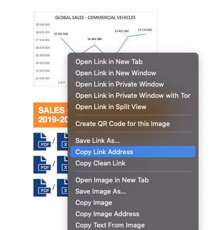
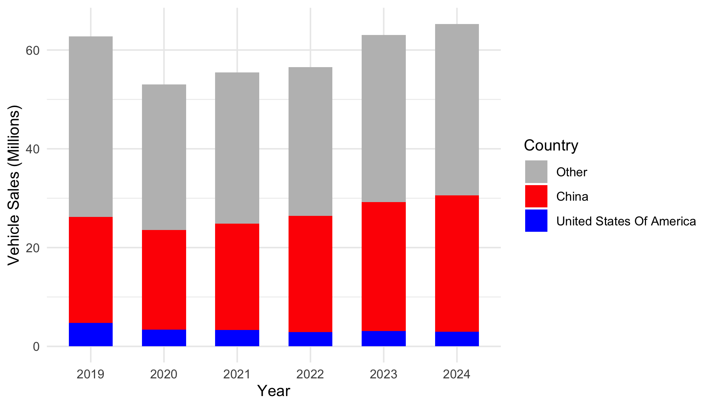

```{r}
#| label: setup
#| include: false

knitr::opts_chunk$set(
    warning = FALSE,
    message = FALSE,
    fig.path = "figs/",
    fig.width = 7.252,
    fig.height = 4,
    comment = "#>",
    fig.retina = 3
)

source(here::here("_common.R"))

# Read in rubric data
rubric <- read_csv(here::here('rubrics', 'mini1.csv'))
maxPoints <- rubric %>%
    filter(rating == "Excellent") %>%
    summarise(max = sum(maxPoints)) %>%
    pull(max)

df <- read_csv(here('mini', 'pc_sales_clean.csv'))
```

```{r child = here::here("fragments", "mini.qmd")}
```

Your mission, should you choose to accept it, is to clean up a relatively messy data file that contains sales of passenger cars by country between 2019 and 2024. The data are from the [International Organization of Motor Vehicle Manufacturers (OICA)](https://www.oica.net/). Your final product should be a tidy (long format) data frame with three columns: `country`, `year`, and `sales`. It should look like this:

```{r}
head(df)
tail(df)
```

With this in mind, your job is to develop and execute a strategy to go from the raw excel file to this cleaned version of the data.

## 1. Get organized

Download and **unzip** [this template](../templates/mini1.zip) for your project, then open the `report.Rproj` file.

Once RStudio opens, click on the `report.qmd` file. That is the primary file you will edit to conduct your analysis.

## 2. Document the data

Inside the `data` folder, there is a `README.md` file with some missing information. Click on that file and edit it to fill in the missing information. Here is some info that will help:

The main data file we'll be working with is the `pc_sales_2024.xlsx` file in the `data` folder. You can find this file online at [https://www.oica.net/category/sales-statistics/](https://www.oica.net/category/sales-statistics/). We're using the "Passengers Cars" data (the "pc" in `pc_sales_2024`). The link to the original data file can be found by right-clicking on the Excel icon on the right side of the page, like this:

<center>

</center>

## 3. Preview the data

With messy Excel files, it is often helpful to first open and view them so you can learn about what might be needed to clean them up in R, such as how many lines you may need to skip at the top when reading in the data. To make sure Excel doesn't corrupt your data, **make a copy** of the Excel file and open that copy with Microsoft Excel. You can keep that copy open throughout your data cleaning journey and can be confident that you haven't corrupted the original file!

## 4. Load the data

Use `read_excel()` from the `readxl` package to read in the `pc_sales_2024.xlsx` data file. Do you need to skip any rows while reading it in?

## 5. Develop Your Strategy

Before writing any cleaning code, you need a plan. 

**Examine your imported data** using functions like `head()` and `glimpse()` to understand the structure of the data in R.

**Write out your strategy**: Create a numbered list of the major steps you'll need to take to transform this messy data into the target format shown above. Consider:

- What needs to happen to the column names?
- Do you need to reshape the data (wide vs long format)?
- What cleaning is needed in each column?
- Are there rows that shouldn't be included?
- How will you get the data into the final column structure?

**Deliverable:** A written strategy with numbered steps describing your planned approach. Be specific about what each step will accomplish.

## 6. Implement Your Strategy

Now execute your plan! Work through each step of your strategy and write the code to implement it.

**Important:** Your code should transform the messy Excel data into the exact target format shown at the top of this assignment. The final dataset should contain:

- Only observations of countries (not regions or totals)
- Years as numbers (e.g., 2019, 2020, 2021, 2022, 2023, 2024)
- Sales values as numbers
- Country names in title case (e.g., "France" not "FRANCE")
- Rows arranged by year, then country

**Deliverable:** Clean, well-commented code that successfully produces the target dataset.

## 7. Validate and Document

**Save your cleaned data** as `my_clean_data.csv` in the `data` folder.

**Create a brief summary** addressing:

- What were the 2-3 biggest challenges in cleaning this data?
- How did you decide what counted as a "country" vs. a "region"?
- How confident are you that your cleaning preserved the data integrity?
- What would you do differently if you encountered similar data again?

**Deliverable:** Saved CSV file and written reflection (4-6 sentences).

## 8. Render and submit

Click the "Render" button to compile your `.qmd` file into a html web page. Then open the `report.html` file in a web browser and proofread your report.

Does all of the formatting look correct? **Make sure there are no errors in the rendered file before submitting it.**

Once you've proofread your report, create a zip file of all the files in your R project folder for this assignment and submit it on the corresponding assignment submission on Blackboard.

## BONUS: Make a summary visualization (+5%)

For a 5% bonus, add a code chunk at the bottom of your report to generate the plot below. If your cleaned data is not properly formatted, you can read in the `pc_sales_clean.csv` file and use it to make the plot.

Some hints to perfectly replicate the figure:

- Consider using `ifelse()` to make a new variable for the bar color based on the `country` variable.
- You can use `fct_relevel()` to re-order the country factors (the order of how they are stacked).
- The fill colors are `'grey'`, `'red'`, and `'blue'`.
- The theme is `theme_minimal()`.

<center>

</center>

## Grading Rubric

### `r maxPoints` Total Points

```{r, echo=FALSE}
rubric %>%
  mutate(description = paste0("<b>", points, '</b><br>', description)) %>%
  select(-points) %>%
  spread(key = rating, value = description) %>%
  select(-category) %>%
  rename(Category = label) %>%
  arrange(order) %>%
  select(-order) %>%
  select(-maxPoints) %>%
  kable(format = 'html', escape = FALSE) %>%
  kable_styling(bootstrap_options = "striped")
```
