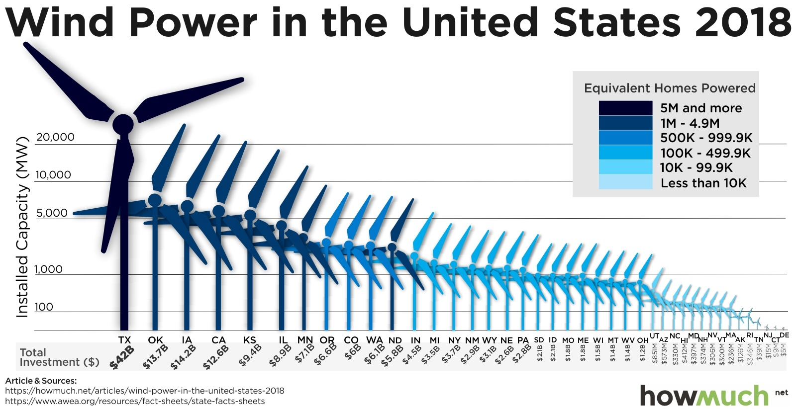

```{r}
#| label: setup
#| include: false

knitr::opts_chunk$set(
    warning = FALSE,
    message = FALSE,
    fig.path = "figs/",
    fig.width = 7.252,
    fig.height = 4,
    comment = "#>",
    fig.retina = 3
)

source(here::here("_common.R"))

# Read in rubric data
rubric <- read_csv(here::here('rubrics', 'mini3.csv'))
maxPoints <- rubric %>%
    filter(rating == "Excellent") %>%
    summarise(max = sum(maxPoints)) %>%
    pull(max)
```

```{r child = here::here("fragments", "mini.qmd")}
```

# Background

The American Wind Energy Association ([AWEA](https://www.awea.org/)) is a national trade association that advocates for the wind power industry. They also publish data on wind power statistics in the U.S. The authors of [this article](https://howmuch.net/articles/wind-power-in-the-united-states-2018) at howmuch.net got a hold of some of this data and published this unfortunate chart:

<center>
<br>

</center>
<br>

For this assignment, you will use the **ggplot2** library in R to redesign the above chart. In this redesign, we are interested in exploring this question:

> **Which states are leaders in wind energy?**

The answer depends on what you consider a "leader" to be. For example, the authors of the above chart clearly viewed the installed capacity as the most important metric to highlight. But this chart also contains lots of other data, such as the amount of money each state invested and the number of homes powered by wind in each state. Some states may be leading in other ways, such as the capacity built per dollar of investment.

With that in mind, here's what you need to do for this analysis:

# 1. Get organized

1. Download and unzip [this template](../templates/mini3.zip) for your project, then open Positron to the unzipped template folder.
2. Once Positron opens, click on the `report.qmd` file. That is the primary file you will edit to conduct your analysis.
3. Update the YAML with your name, a title, the date, etc.
4. Delete any of the existing text / code in the template before submitting - the template text is just there as a helpful guide.

> **Points will be taken off for failing to follow these basic organizing steps.**

# 2. Load the data

The `US_State_Wind_Energy_Facts_2018.xlsx` file is already in your `data` folder. Have Claude Code read it in. Here is some information on the data:

**Description**: Data on which US states produce the most wind energy.

**Source of downloaded file**: The formatted Excel spreadsheet was downloaded from data.world: https://data.world/makeovermonday/2019w8

**Original source**: The primary source is the American Wind Energy Association (https://www.awea.org/), but the source for this particular data was found on [this article](https://github.com/emse-eda-gwu/2023-Fall/blob/main/mini/This%20Chart%20Shows%20Which%20States%20Produce%20the%20Most%20Wind%20Energy%2008.24.30.pdf?raw=TRUE), which cites the AWEA.

**Data dictionary**:

<div style="width:600px">

Variable                        | Description
--------------------------------|----------------------------------
`Ranking`                       | Rank order of state by installed capacity
`State`                         | U.S. state
`Installed Capacity (MW)`       | Installed capacity in MW
`Equivalent Homes Powered`      | Number of homes powered by wind power
`Total Investment ($ Millions)` | Total Investment in $ millions
`Wind Projects Online`          | Number of projects currently online
`# of Wind Turbines`            | Number of wind turbines in state

</div>

# 3. Preview the data

Preview the data yourself (e.g. using `head()`, `glimpse()`, `View()`, and / or make some quick plots -- **Hint**: look at the top and bottom!). Take note of what variables are available, their types, what they measure, and if there are any missing values. (**Hint**: Read the data dictionary!) Are all the variables encoded the way you would expect (e.g. are numbers encoded as numbers)? Noticing this yourself matters -- it's what you'll tell the agent to fix in the next step.

# 4. Clean the data

Have Claude Code modify variable types and names to get the data frame cleaned up for analysis. As it does, column names with spaces in them (e.g. `Installed Capacity (MW)`) should get renamed to make later code easier to write (**Hint**: the `clean_names()` function from the `janitor` package is a life saver!). Write a few sentences describing what modifications were made and why.

# 5. Plan Your Approach

Before you prompt the agent to make any charts, decide what "leadership" means for each of the two visualizations you'll build.

1. Examine measures of centrality and variability in the variables relevant to leadership in wind energy. Installed capacity is an obvious choice, but also look at other values, such as the amount of money invested, and **at least two** other computed measures, such as capacity per dollar invested (**Note**: you'll need to create new variables to do this!).
2. For each of your two planned charts (see Step 6), write down: which metric it will highlight, why that metric represents a meaningful kind of "leadership," and what chart type you plan to use and why it fits that metric and message. Do this **before** prompting the agent to generate the chart -- it's much easier to tell if a chart the agent produced is a good match for your goal if you already know what you were going for.

**Deliverable:** Your summary measures with a short explanation of what you learned from them, plus your plan for both charts (metric + chart type + rationale) written *before* the charts themselves.

# 6. Direct the Agent to Visualize

Now prompt Claude Code to build your two charts, reviewing what it produces and iterating rather than accepting the first attempt automatically.

1. An appropriate visualization that highlights leadership in _installed capacity_. This chart should be a substantial improvement over the original visualization, and it should follow the design principles we have covered in class.
2. A second visualization that highlights "leadership" in another metric of your choice, following your plan from Step 5. **This chart should be a different style from your first chart** -- don't just copy-paste the same chart type over a new variable.

**Your charts should be polished**. Points will be taken off for poor design principles, illegibility, etc.

::: {.callout-note}

**Note**: Claude Code should directly edit your `report.qmd` file.

:::

# 7. Critique Your Redesign

Producing a chart that looks better than the original is not the same as verifying it actually is better. Before you write your summary, critically re-examine your own two charts -- this is the step most heavily graded in this assignment.

- **Check for new distortions.** Does either chart truncate an axis, use a misleading sort order, or use color in a way that exaggerates or obscures the pattern? Redesigns can introduce new problems even while fixing old ones.
- **Check under an alternative cut.** Pick one chart and recompute it with a different normalization or metric (e.g. per capita, per project, or a different time slice if applicable). Does the "leadership" story hold up, or does it depend heavily on which metric you picked?
- **Name a real limitation.** A genuine critique finds at least one honest weakness in your own redesign -- not just a list of what you improved.

**Deliverable:** A short critique section documenting what you checked and what you found, including anything you changed as a result.

# 8. Summarize Your Analysis

Write a summary of your analysis process. I'm specifically looking for a discussion of the following:

- What was wrong with the original chart? Discuss specific design principles we have covered in class.
- Discuss the improvements your first revised chart makes compared to the original chart.
- Discuss what message your second chart conveys and what design choices you made to highlight that message.
- Reference what you found in Step 7 -- what, if anything, would you still change or caveat about your redesign?

# 9. Render and submit

```{r child = here::here("fragments", "mini-submit.qmd")}
```

# Grading Rubric

### `r maxPoints` Total Points

```{r, echo=FALSE}
rubric %>%
  mutate(description = paste0("<b>", points, '</b><br>', description)) %>%
  select(-points) %>%
  spread(key = rating, value = description) %>%
  select(-category) %>%
  rename(Category = label) %>%
  arrange(order) %>%
  select(-order) %>%
  select(-maxPoints) %>%
  kable(format = 'html', escape = FALSE) %>%
  kable_styling(bootstrap_options = "striped") %>%
  column_spec(1, width = "16%") %>%
  column_spec(2:4, width = "28%")
```
